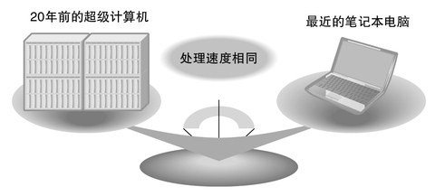
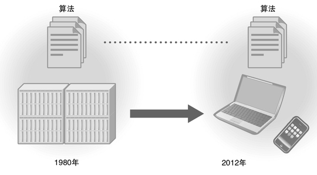
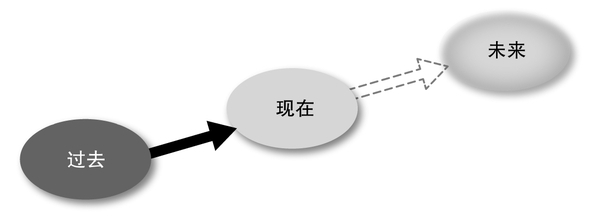
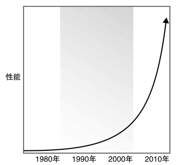

# 第一章：编程的时间和空间

## 1.1　编程的本质

在一部古老的电影《星际迷航4：抢救未来》中有这样一个镜头：从23世纪的未来穿越时空来到现代（1986年）的“进取号”乘务员，为了操作计算机（Classic Mac）而手持鼠标与“计算机”讲话。看来在星际迷航的世界中，用人类语言作为操作界面就可以指挥计算机工作了。

不过，现代的计算机还无法完全理解人类的语言。市面上也有一些可以用日语来操作的软件，但距离实用的程度还差得很远。计算机本来是为了运行由0和1组成的机器语言而设计的，但与此同时，对于人类来说，要理解这种二进制位所构成的序列到底代表什么意思，却是非常困难的。

因此，创造出一种人类和计算机都能够理解的语言（编程语言），并通过这样的语言将人类的意图传达给计算机，这样的行为就叫做编程。

话虽如此，但是将编程仅仅认为是“因为计算机无法理解人类语言才产生的替代品”，我觉得也是不合适的。人类的语言其实非常模糊，有时根本就不符合逻辑。

Time flies like an arrow.

这句话的意思是“光阴似箭”（时间像箭一样飞走了），不过flies也有“苍蝇”（复数形态）的意思，因此如果你非要解释成“时蝇喜箭”也未尝不可，只要你别去纠结“时蝇”到底是啥这种朴素的问题就好了。

另一方面，和自然语言（人类的语言）不同，编程语言在设计的时候就避免了模糊性，因此不会产生这样的歧义。使用编程语言，就可以将步骤更加严密地描述出来。

用编程语言将计算机需要执行的操作步骤详细描述出来，就成了软件。计算机的软件，无论是像文字处理工具和Web浏览器这样的大型软件，还是像操作系统这样的底层软件，全部都是用编程语言编写出来的。

### 编程的本质是思考

由于我几乎一整天都对着计算机，因此我的家人可能认为我的工作是和计算机打交道。然而，将编程这个行为理解成“向计算机传达要处理的内容”是片面的。这样的理解方式，和实际的状态并不完全一致。

的确，程序员都是对着计算机工作的，但作为其工作成果的软件（中的大部分）都是为了完成人类所要完成的工作而设计出来的（图1）。因此，“人们到底想要什么？想要这些东西的本质又是什么？要实现这个目的严格来说需要怎样的操作步骤？”思考并解决这些问题，才是软件开发中最重要的工作。换句话说，编程的本质在于“思考”。

C>

C>图1　编程不是和计算机打交道，而是和人打交道

尽管看上去是和计算机打交道的工作，但实际上编程的对象还是人类，因此这是个非常“有人味”的工作。个人认为，编程是需要人来完成的工作，因此我不相信在将来计算机可以自己来编程。

我是从初三的时候开始接触编程的。当时父亲买了一台夏普的袖珍计算机（PC-1210），可以使用BASIC来编程。虽然这台袖珍计算机只能输入400个步骤，但看到计算机可以按照我的命令来运行，仿佛自己什么都能做到，一种“万能感”便油然而生。

### 创造世界的乐趣

尽管已经过去了20多年，但我从编程活动中所感到的“心潮澎湃”却是有增无减。

这种心潮澎湃的感觉，是不是由创造新世界这一行为所产生的呢？我喜欢编程，多少年来从未厌倦，这其中最大的理由，就是因为我把编程看作是一项创造性的工作吧。

只要有了计算机这个工具，就可以从零开始创造出一个世界。在编程的世界中，基本上没有现实世界中重力和因果关系这样的制约，如此自由的创造活动，可以说是绝无仅有的。能够按照自己的意愿来创造世界，这正是编程的最大魅力所在（图2）。

C>

C>图2　编程的乐趣在于创造性

正如现实世界是由物理定律所支撑的一样，编程所创造的世界，是由程序员输入的代码所构筑的规则来支撑的。通过创造一个像Ruby这样的编程语言，我对此尤其感触颇深，不过，即便只是编写一个很小的程序，其本质也是相同的。

因此，正是因为具有创造性这样重要的特质，编程才吸引了包括我在内的无数程序员，投入其中而一发不可收拾。将来，如果真能够像在《星际迷航》的世界那样，只要通过跟计算机讲话就可以获取所有的信息，那么编程也许就变得没有那么必要了。

其实，在搜索引擎出现之后，类似的状况已经正在上演了。拿我的孩子们来说，他们也经常频繁地坐在电脑跟前，但却从来没有进行过编程。对他们来说，电脑只是一个获取信息的渠道，或者是一个和朋友交流的媒介而已。编程这种事，是“爸爸在做的一种很复杂的事”，他们觉得这件事跟自己没什么关系。

不过，通过编程来自由操作计算机，并创造自己的世界，这样的乐趣如果不让他们了解的话，我觉得也挺遗憾的。但这样的乐趣并不是通过强加的方式就能够感受到的，而且用强制的方式可能反而会在他们心里埋下厌恶的种子，对此我也感到进退两难。教育孩子还真是不容易呢。

编程所具有的创造性同时也有艺术的一面。在摄影出现之后，绘画已经基本上丧失了用于记录的功能，但即便如此，颇具艺术性的绘画作品还是层出不穷。将来，即便编程的必要性逐渐消失，可能我还是会为了艺术性和乐趣而继续编程的吧。其实，像《星际迷航》中的世界那样，“计算机，请给我打开一个Debian GNU/Linux 8.0模拟器，我要写个程序”，这样的世界也挺有意思的不是吗？

### 快速提高的性能改变了社会

我们来换一个视角。在计算机业界，有很多决定方向性问题的重要“定律”，其中最重要的莫过于“摩尔定律”了。摩尔定律是由美国英特尔公司创始人之一的高顿·摩尔于40多年前的1965年，在其发表的论文中提出的，这个定律的内容如下：

LSI中的晶体管数量每18个月增加一倍。

LSI的集成度每18个月就翻一倍，这意味着3年就可以达到原来的4倍，6年就可以达到16倍，呈指数增长。因此，30年后，我们来算算看，就可以达到原来的100万倍呢。LSI的集成度基本上与CPU性能和内存容量直接相关，可以说，在这40年中，计算机的性能就是以指数关系飞速增长的。此外，集成度也可以影响价格，因此性能所对应的价格则是反过来呈指数下降的。

想想看，现在你家附近电子商店中售价10万日元左右（约合人民币8000元）的笔记本电脑，性能恐怕已经超过20多年前的超级计算机了（图3）。况且，超级计算机光一个月的租金就要差不多1亿日元（约合人民币800万元），就连租都已经这么贵了，如果真要买下的话得花多少钱啊……

C>

C>图3　20年前的超级计算机和现在的笔记本电脑性能处于同一水平

我在大学毕业之后就职的第一家公司里，用过一台索尼生产的Unix工作站，配置大概是这样的：

* CPU：摩托罗拉68020 25MHz
* 操作系统：NEWS-OS 3.3a（基于4.3BSD）
* 内存：8MB
* 硬盘：240MB
* 价格：定价155万日元（约合人民币12万元）

现在我几乎不敢相信索尼曾经生产过UNIX工作站，以至于连“工作站”（Workstation）这个词本身都已经几乎被淘汰了。工作站曾经指的是那些工程上使用的、性能比一般个人电脑要高一些的计算机（大多数情况下安装的是UNIX系操作系统）。

这台工作站也曾经是我最初开始编写Ruby所使用的机器。现在我自己家里的计算机已经拥有Core2 duo 2.4GHz的CPU、4GB内存和320GB硬盘，单纯比较一下的话，CPU频率大约是那台工作站的100倍，内存容量大约是500倍，硬盘容量大约是1300倍。这两台计算机的发售时间大约差了18年，按照摩尔定律来计算，集成度的增加率应该为64倍，可见内存和硬盘容量的增加速度已经远远超过摩尔定律所规定的速率了。

在当时的网络上，电子邮件和网络新闻组是主流，网络通信还是在电话线路上通过调制解调器（Modem）来进行的。回头翻翻当时的杂志，看到像“9800bit/s超高速调制解调器售价198 000日元（约合人民币1.6万元）”这样的广告还是感到挺震惊的。最近我们已经很少见到模拟方式的调制解调器了，我最后见过的调制解调器速度为56Kbit/s，售价大约数千日元。

这正是摩尔定律的力量。在这个业界的各个领域中都经历着飞跃式的成长，近半个世纪以来，与计算机相关的所有部件，都随着时间变得性能更高、容量更大、价格更便宜。

在摩尔定律的影响下，我们的社会也发生了翻天覆地的变化。计算机现在已经变得随处可见，这应该说是摩尔定律为社会所带来的最大变化了吧。

我现在用的手机是iPhone，这个东西与其说是个手机，不如说是一个拥有通信功能的迷你计算机。作为玩具它实在是很有趣，但因为整天鼓捣它还是被家里人给了差评。这样一个东西花几万日元就能买到，不得不感叹文明的进步。差不多在同样的时间，我给我的一个女儿买了一部普通的手机，这部手机跟iPhone不一样，只是那种一般的多功能机，但仔细一看，这种手机也能上网，还装有Web浏览器、电子邮件、日程表等软件，也算得上一台不错的计算机了。

当初，让我感到最惊奇的是这个手机上居然安装了Java虚拟机，这样一来说不定能运行JRuby呢。不光是日本，全世界的人现在都能拥有这样的便携式计算机，并通过无线网络联系在一起，这样的情景在20年前简直是很难想象的。因此可以说，计算机的大规模普及，甚至改变了整个社会的形态。

### 以不变应万变

由摩尔定律所引发的计算机方面的变化可以用翻天覆地来形容，但也并不是所有的一切都在发生变化（图4）。

C>

C>图4　计算机在不断进化，而算法则保持不变

比如说，算法就能以不变应万变。被称为最古老算法的辗转相除法，是在公元前300年左右被提出的。此外，计算机科学中的大多数基本算法都是在20世纪60年代被提出的。

我们来想想看电子邮件的情形。15年前，几乎没什么人会使用电子邮件，但现在，电子邮件成了大家身边如影随形的工具，甚至有不少人一天到晚都在拿手机收发邮件。邮件影响了很多人的生活，甚至改变了我们的生活方式。

然而，邮件的基础技术却是出人意料地古老。世界上第一封电子邮件是在1971年发送的，而现在包括手机邮件在内所遵循的RFC822规范则是在1982年制定的，差不多是距今30多年前的东西了。此外，现在依然作为主流而被广泛使用的TCP/IP互联网通信协议也差不多是在那个时候制定的。

也就是说，这个技术本身是很早以前就存在的，只是一般人不知道而已。而更重要的一个原因是，人类自身的变化并没有那么快。读一读《圣经》之类的古典著作你就会惊奇地发现，人类从几千年前到现在所纠结的那些事情几乎没什么变化。从人类的本质来看，技术的进步只不过是些细枝末节的改变罢了。

摩尔定律所带来的变化，并不是改变了人类自身以及计算的本质，而是将以往非常昂贵的计算机，以及只有特殊部门才需要的东西，普及到“老百姓”的手上。从这个侧面来讲，它所带来的变化的确是十分巨大的。

### 摩尔定律的局限

无论如何，在这40年里，摩尔定律的确在一直改变着世界，但是这个定律真的是完美的吗？

呈指数增长的趋势在如此长的时期内能够一直成立，这本身就很不自然。实际上，这个看似无敌的摩尔定律，最近也仿佛开始显露出一些破绽。我们可以预料到，在不远的将来，一定会出现一些因素，对摩尔定律的继续生效构成障碍。

首先是物理定律的局限。LSI也是现实世界中物理存在的东西，自然受到物理定律的制约。在这40年里，LSI一直在不断变得更加精密，甚至快要到达量子力学所管辖的地盘了。当LSI的精密化达到这种程度，日常生活中一些从来不必在意的小事，都会变成十分严重的问题。

第一个重要的问题是光速。光速约为每秒30万千米，即1秒钟可以绕地球7圈半，这个数字十分有名，连小孩子都知道，不过正是因为光速实在太快，在日常生活中我们往往可以认为光速是无穷大的。

然而，CPU的时钟频率已经到达了GHz尺度，比如说，在3GHz的频率下，波形由开到关（即1个时钟周期）的时间内，光只能前进10cm的距离。

而且，最近的LSI中电路的宽度已经缩小到只有数十纳米（nm），而1nm等于100万分之一mm，是一个非常小的尺度，在1nm的长度上，只能排列几个原子，因此像这样在原子尺度上来制造电路是相当困难的。

LSI中的电路是采用一种印刷技术印上去的，在这样细微的尺度中，光的波长甚至都成了大问题，因为如果图像的尺寸比光的波长还小，就无法清晰地转印。可见光的波长范围约为400～800nm，因此最近45nm制程的LSI是无法用可见光来制造的。

在这种原子尺度的电路中，保持绝缘也是相当困难的。简单来说，就是电流通过了原本不该通过的地方，这被称为漏电流。漏电流不但会浪费电力，某些情况下还会降低LSI的性能。

漏电流还会引发其他的问题，比如发热。随着LSI越来越精密，其密度也越来越高，热密度也随之提高。像现在的CPU这样高密度的LSI，其热密度已经跟电熨斗或者烧烤盘差不多高了，因此必须用风扇等装置持续进行降温。照这个趋势发展下去，热密度早晚要媲美火箭的喷气口，如果没有充分的散热措施，连LSI本身都会被熔化。

由于漏电流和热密度等问题，最近几年，CPU的性能提高似乎遇到了瓶颈。大家可能也都注意到了，前几年在店里卖的电脑还都配备了3GHz、4GHz的CPU，而最近主流的电脑配置却是清一色的2GHz上下。造成这个现象的原因之一就是上面提到的那些问题，使得CPU一味追求频率的时代走到了尽头。此外，现在的CPU性能对于运行Web浏览器、收发邮件等日常应用已经足够了，这也是一个原因。

看了上面这些，大家可能会感到称霸了40多年的摩尔定律就快要不行了，不过英特尔公司的人依然主张“摩尔定律至少还能维持10年”。实际上，人们可以使用特殊材料来制造LSI，以及使用X光代替可见光来进行光刻的转印等，通过这些技术的手段，摩尔定律应该还能再维持一阵子。

此外，由于通过提高单一CPU的密度来实现性能的提升已经非常困难，因此在一个LSI中集成多个CPU的方法逐渐成为主流。像英特尔公司的Core2 i5、i7这样在一个LSI上集成2～8个CPU核心的“多核”（Multi-core）CPU，目前已经用在了普通的电脑中，这也反映了上面提到的这一趋势。

比起拥有复杂电路设计的CPU来说，内存等部件由于结构简单而平均，因此其工艺的精密化更加容易。今后一段时间内，CPU本身的性能提升已经十分有限，而多CPU化、内存容量的增大、由硬盘向半导体SSD转变等则会成为主流。

### 社会变化与编程

前面我们讨论了摩尔定律和它所带来的变化，以及对今后趋势的简单预测。多亏了摩尔定律，我们现在才可以买到大量高性能低价格的计算机产品。那么这种变化又会对编程产生怎样的影响呢？

我最早接触编程是在20世纪80年代初，在那个时候，使用电脑的目的就是编写BASIC程序。无论是性能还是容量，那个时候的计算机都非常差劲，根本无法与现在的计算机相提并论，此外，还必须使用BASIC这种十分差劲的编程语言，这种环境对于编程的制约是相当大的。当时，我编写了许多现在看起来很不起眼的游戏，还对差劲的BASIC和计算机性能感到十分不爽，一边立志总有一天“一定要用上正经的计算机”，一边搜集着书本杂志中的信息做着自己的“春秋大梦”。

而另一方面，现在计算机已经随处可见，拿着手机这样的个人计算设备的人也不在少数。我的孩子们所就读的学校里，设有与理科教室、音乐教室等并列的电脑教室，有时也会用计算机来进行授课。这样一个时代中的年轻人，他们对于编程这件事又怎么看呢？

由于职业的关系，我家里有很多台计算机，算上不怎么经常用的，可以说计算机的数量比家里人的数量还要多，当然，要是再算上手机之类的话，那就更多了。即便是生活在这样充满计算机的家庭中，孩子们对于编程貌似也没有什么兴趣。

那么，他们用计算机都做些什么事呢？比如用邮件和博客与朋友交流，用维基百科查阅学习上所需要的信息，还有在YouTube上看看动画片之类的。

上初中时学校曾经组织过用一种叫做“Dolittle”的编程语言来做实习，孩子们也好像也挺感兴趣，不过并没有再进一步发展为真正的编程。对于他们来说，上上网站、看看YouTube、发发邮件，有时候玩玩网购和在线竞拍，这些已经足够了。

我一个学生时代的朋友，现在正在大学任教，他对我说，现在信息技术类专业不但不如以前热门，而且招进来的学生中有编程经验的比例也下降了。这似乎意味着，计算机的普及率提高了，但是编程的普及率却一点都没有提高，真是令人嗟叹不已。

我猜想，大概是由于随着软件的发展，不用编程也可以用好计算机，因此学习编程的动力也就没有那么强了。此外，现在大家都认为软件开发是一份非常辛苦的工作，这可能也是导致信息技术类专业人气下滑的一个原因。

话虽如此，但并是说真的一点希望都没有了。这几年来，我在一个叫做“U20 Pro Con”的以20岁以下青少年为对象的编程大赛中担任评委，每年的参赛作品中，总能见到一些水平非常高的程序。

也许是因为我担任评委的缘故，每年当我看到有自制编程语言方面的参赛作品时，总会感到十分震惊和欣慰。在我自己还是高中生的时候，虽然也想过创造一种编程语言，但完全不知道该怎样去做，到头来毫无进展。从这个角度来看，这些参赛的年轻人能够完整设计并实现一种编程语言，比当年的我可优秀多了，因此我对他们将来的发展充满期待。

在这个世界上也有一些人，即便不去培养，他们也拥有想要编程的欲望，这样的人虽然只是小众，但他们会通过互联网获取丰富的知识，并不断攀登编程领域的高峰。编程的领地不会像计算机的普及那样飞速地扩展，但水平最高的人，水平却往往变得越来越高。这样的状况是我们希望看到的呢，还是不希望看到的呢？我也没办法做出判断。

现代社会已经离不开计算机和驱动计算机的软件了，从这个角度来说，我希望有更多的人能够积极地参与到编程工作中来。此外，我也希望大家不仅仅是将软件开发作为一份工作来做，而是希望更多的人能够感受到软件开发所带来的那种“创造的乐趣”和“心潮澎湃的感觉”。

## 1.2　未来预测

没有哪个人能够真的看到未来，也许正是因为如此，人们才想要预知未来，并对预言、占卜等方式充满兴趣。以血型、出生日期、天干地支、风水等为依据的占卜非常热门，事实上，杂志和早间电视节目中每次都有占卜的内容。

这些毫无科学依据的占卜方式是不靠谱的，虽说如此，占卜却还是大肆流行起来，其中有这样一些理由。

首先，最大的理由莫过于“巴纳姆效应”了。“巴纳姆效应”是一种心理学现象，指的是将一些原本是放之四海而皆准的、模棱两可的一般性描述往自己身上套，并认为这些描述对自己是准确的。比如，找一些受试者做一份心理测试问卷，无论受试者如何回答问卷上的问题，都向他们提供事先准备好的内容差不多的测试结果，大多数的受试者都会认为这个结果对自己的描述非常准确。你觉得“占卜好准啊”，其实多半都是巴纳姆效应所导致的。即使是随便说说的一些话，也会有人深信不疑，这说不定是人类的一种本能吧。人类的心理到底为什么会拥有这样的性质呢？

其次，有很多算命先生和自称预言家的人，实际上都是利用了被称为“冷读术”（Cold reading）和“热读术”（Hot reading）的技巧，来让人们相信他们真有不同寻常的“能力”。

冷读术，就是通过观察对方言行举止中的一些细微之处来进行揣测的技巧，就像夏洛克·福尔摩斯对他的委托人所运用的那种技巧差不多。例如通过说话的口音来判断出生地，通过衣服上粘着的泥土来判断对方之前去过什么地方等等。冷读术中的“冷”代表“没有事先准备”的意思。

相对地，热读术则是通过事先对对方进行详细的调查，来准确说出对方的情况（逢场作戏）。通过事先调查，掌握对方的家庭构成、目前所遇到的问题等等，当然能够一语中的，再加上表演得像是拥有超能力一样，总会有人深信不疑的。

结论，占卜之类的方法都不靠谱，它们都是不科学的。那么，有没有科学一点的方法能够预测未来呢？比如说，像艾萨克·阿西莫夫的基地系列中所描写的心理史学那样。

### 科学的未来预测

心理史学是阿西莫夫所创造的虚构学科。用气体分子运动论来类比，我们虽然无法确定每个气体分子的运动方式，但对于由无数气体分子所组成的气体，我们却可以计算出其整体的运动方式。同样地，对于由无数的人所组成的集团，其行为也可以通过数学的方法来进行预测。这样一类比的话，是不是感到很有说服力呢？

基地系列正是以基于心理史学的未来预测为轴，描写了以整个银河系为舞台，数兆人类的数千年历史。

然而，在现实中，特定个人的行动往往能够大幅左右历史的走向，即便是从整体来看，用数学公式来描述人类的行为还是太过复杂了，心理史学也许只能停留在幻想中而已。虽然心理史学只是一门完全虚构的学科，但这并不意味着不可能通过科学的方法来预测未来。虽然我们无法对未来作出完全准确的预测，但在限定条件下，还是可以在一定概率上对未来作出预测的，尤其是当我们要预测的不是未来人类的行动，而是纯粹预测技术发展的情况下。因此，IT领域可以说是比较容易通过上述方式进行未来预测的一个领域了吧。

### IT未来预测

之所以说IT领域的未来比较容易预测，最大的一个理由是：从计算机的出现到现在已经过了约半个世纪，但在这40多年的时间里，计算机的基本架构并没有发生变化。现在主流的CPU架构是英特尔的x86架构，它的基础却可以追溯到1974年问世的8080，而其他计算机的架构，其根本部分都是大同小异。这意味着计算机进步的方向不会有什么很大的变化，我们有理由预测，未来应该位于从过去到现在这个方向的延长线上（图1）。

C>

C>图1　从过去到未来的发展方向

如果像量子计算机这样和现在的计算机架构完全不同的东西成为主流的话，我们的预测也就不成立了，不过还好，在短时间内（比如5年之类的）这样的技术应该还无法实现。此外，在这个行业中，5年、10年以后的未来已经算是相当遥远了，即便预测了也没有什么意义。总之目前来看，这样的趋势还是问题不大的。

支配计算机世界“从过去到未来变化方向”的一个代表性理论，就是在1-1中已经讲解过的“摩尔定律”。

LSI中的晶体管数量每18个月增加一倍。

在摩尔定律的影响下，电路变得更加精密，LSI的成本不断降低，性能不断提高。其结果是，在过去的近40年中：

* 价格下降
* 性能提高
* 容量增大
* 带宽增加

这些都是呈指数关系发展的。呈指数关系，就像“一传十、十传百”一样，其增大的速度是十分惊人的（图2）。

C>

C>图2　性能呈指数关系增加

而这一呈指数关系发展的趋势，预计在今后也会保持差不多的速度，这就是IT未来预测的基础。

另外一个需要考虑的问题，就是不同领域各自的发展速度。IT相关的各种数值的确都在以指数关系增加，但大家的步调也并不是完全一致的。例如，相比CPU处理速度的提高来说，存储器容量的增加速度更快，而与上面两者相比，数据传输速度的增加又显得跟不上了。这种发展的不平衡也会左右我们的未来。

### 极限未来预测

下面我们来介绍一种预测未来的时候所用到的，名叫“极限思考法”的简单技巧。

曾提出过“极限编程”（eXtreme Programming，简称XP）手法的肯特·贝克，在其著作《解析极限编程》中这样写道：

当我第一次构建出XP时，我想到了控制板上的旋钮。每个旋钮都是一种（经验告诉我的）有效的实践，我将所有的旋钮都调到10，然后等着看会出现什么情况。

我们也可以用同样的方法来对未来作出预测。比如说，“如果计算机的价格越来越便宜，那当它便宜到极致的时候会怎么样呢？”“如果我们能够买到超高性能的计算机会怎么样呢？”“如果计算机的存储容量增大到超乎想象的程度会怎么样呢？”“如果网络带宽变得非常大的话会怎么样呢？”

大家怎么认为呢？

### 从价格看未来

首先，我们来看看价格。如果今后计算机的价格不断下降，这将意味着什么呢？我想这意味着两件事。第一，普通人所能拥有的计算机的性能将比现在大大提高；第二，现在还没有使用计算机的地方，以后都会安装上计算机。

***

这里有一个很有意思的现象，根据摩尔定律，关于计算机的很多指标都在发生剧烈的变化，但PC的价格似乎变化并没有那么大。1979年发售的NEC PC-8001的定价为16万8000日元（约合人民币1.3万元），而现在主力PC的价格也差不多是在10万日元（约合人民币8000元）上下，即便考虑物价变化的因素，也还是出人意料地稳定。这可能意味着人类对于PC的购买力也就差不多只有这个程度，在不断提高的性能和价格之间在寻求一种平衡，因此我估计普及型计算机的价格今后也不太可能会大幅下降。关于将来PC（PC型计算机）的样子，我们会在“性能”一节中进行讨论。

关于在目前尚未开发的领域中安装计算机这件事，其实现在已经在上演了。例如，以前纯粹由电子电路所构成的电视机，现在也安装了CPU、内存、硬盘等部件，从硬件上看和PC没什么两样，并且还安装了Linux这样的操作系统。此外，以前用单片机来实现的部分，现在也开始用上了带有操作系统的“计算机”，在这样的嵌入式系统中，软件所占的比例越来越大。今后，可以说外观长得不像计算机的计算机会越来越多，为这样的计算机进行软件开发的重要性也就越来越高。例如，现在由于内存容量和CPU性能的限制而无法实现的开发工具和语言，以后在“嵌入式软件”开发中也将逐渐成为可能。

### 从性能看未来

从近10年计算机性能变化的趋势来看，CPU自身的性能提高似乎已经快要到达极限了。近几年，很多人会感觉到PC的时钟频率似乎到了2GHz就再也上不去了。这种性能提高的停滞现象，是由耗电、漏电流、热密度等诸多原因所导致的，因此从单一CPU的角度来看，恐怕无法再继续过去那样呈指数增长的势头了。

那么这样下去结果会怎样呢？要推测未来计算机的性能，最好的办法是看看现在的超级计算机。因为在超级计算机中为了实现高性能而采用的那些技术，其中一部分会根据摩尔定律变得越来越便宜，在5到10年后的将来，这些技术就会被用在主流PC中。

那么，作为现在超级计算机的代表，我们来看看2012年目前世界最快的超级计算机“京”的性能数据（表1）。虽然它的性能看起来都是些天文数字，但再过20年，这种程度的性能很可能就只能算是“一般般”了。

C>表1　超级计算机“京”的指标

|性能           |10000TFLOPS                                   |
|价格           |1120亿日元（约合人民币90亿元）                   |
|CPU数量        |88128个                                       |
|核心数量       |705024个                                       |
|内存           |2.8PB（平均每个CPU拥有32GB）                    |

说不定在不久的将来，1024核的笔记本电脑就已经是一般配置了。如果是服务器环境的话，也许像现在的超级计算机这样数万CPU、数十万核心的配置也已经非常普遍了。难以置信吧？

在这样的环境下，编程又会变成什么样子呢？为了充分利用这么多的CPU，软件及其开发环境又会如何进化呢？

考虑到这样的环境，我认为“未来的编程语言”之间，应该在如何充分利用CPU资源这个方面进行争夺。即便是现在，也已经有很多语言提供了并行处理的功能，而今后并行处理则会变得愈发重要。如果能将多个核心的性能充分利用起来，说不定每个单独核心的性能就变得没有那么重要的。

### 从容量看未来

存储器的容量，即内存容量和外存（硬盘等）容量，是增长速度最快的指标。2012年春，一般的笔记本电脑也配备了4GB的内存和500GB左右的硬盘，再加上外置硬盘的话，购买2～3TB的存储容量也不会花上太多的钱。一个普通人所拥有的存储容量能达到TB级，这在10年前还是很难想象的事情，而仅仅过了没多少时间，我们就可以在电子商店里轻松买到TB级容量的硬盘了。

那么，存储器容量的增加，会对将来带来哪些变化呢？大家都会想到的一点是，到底从哪里才能搞到那么多的数据，来填满如此巨大的容量呢？

实际上，这一点根本用不着担心。我们来回想一下，无论存储容量变得多大，不知怎么回事好像没过多久就又满了。为了配合不断增加的存储容量，图片数据和视频数据都变得更加精细，尺寸也就变得更大。另外，软件也变得越来越臃肿，占用的内存也越来越多。以前的软件到底是怎样在那么小的内存下运行得如此流畅的呢？真是想不通啊。

因此，问题是我们要如何利用这些数据呢？也许面向个人的数据仓库之类的数据分析工具会开始受到关注。当然，这种工具到底应该在客户端运行，还是在服务器端运行，取决于性能和带宽之间的平衡。

在存储器容量方面，与未来预测相关并值得关注的一个动向，就是访问速度。虽然容量在以惊人的速度增长，但读取数据的速度却没有按照匹配的速度来提高。硬盘的寻址速度没什么长进，总线的传输速度也是半斤八两。不过，像闪存这样比硬盘更快的外部存储设备，现在也已经变得越来越便宜了，由闪存构成的固态硬盘（Solid State Drive，SSD）已经相当普遍，完全可以作为硬盘的替代品。按照这个趋势发展下去，在不久的将来，说不定由超高速低容量的核心内置缓存、高速但断电会丢失数据的主内存（RAM），以及低速但可永久保存数据的外部存储器（HDD）所构成的层次结构将会消失，取而代之的可能将会是由大规模的缓存，以及高速且能永久保存数据的内存所构成的新的层次结构。如果高速的主内存能够永久保存数据，依赖过去结构的数据库等系统都将产生大规模的结构改革。实际上，以高速SSD为前提的数据库系统，目前已经在进行研发了。

### 从带宽看未来

带宽，也就是网络中数据传输的速度，也在不断增大。一般家庭的上网速度，已经从模拟调制解调器时代的不到100Kbit/s，发展到ADSL时代的10Mbit/s，再到现在光纤时代的超过100Mbit/s，最近连理论上超过1Gbit/s的上网服务也开始面向一般家庭推出了。

网络带宽的增加，会对网络两端的平衡性产生影响。在网络速度很慢的时代，各种处理只能在本地来进行，然后将处理结果分批发给中央服务器，再由中央服务器进行统计，这样的手法十分常见。这就好像回到了计算机还没有普及，大家还用算盘和账本做着“本地处理”的时代。

然而后来，各种业务的处理中都开始使用计算机，每个人手上的数据都可以发送到中央计算机并进行实时处理。但由于那时的计算机还非常昂贵，因此只是在周围布置了一些被称为“终端”的机器，实际的处理还是由设在中央的大型计算机来完成的。那是一个中央集权的时代。

在那以后，随着计算机价格的下降，每个人都可以拥有自己的一台计算机了。由于计算机可以完成的工作也变多了，因此每个人手上的“客户端”计算机可以先完成一定程度的处理，然后仅仅将最终结果传送给位于中央的“服务器”，这样的系统结构开始普及起来，也就是所谓的“客户端/服务器系统”（Client-Server system），也有人将其简称为“CS系统”。

然而，如果网速提高的话，让服务器一侧完成更多的处理，在系统构成上会更加容易。典型的例子就是万维网（World Wide Web，WWW）。在网速缓慢的年代，为了查询数据而去直接访问一个可能位于地球背面的服务器，这种事是难以想象的，如此浪费贵重的带宽资源，是要被骂得狗血淋头的。话说，现在的网络带宽已经像白菜一样便宜了，这样一来，客户端一侧只需要准备像“浏览器”这样一个通用终端，就可以使用全世界的各种服务了，如此美好的世界已经成为了现实。由于大部分处理是在服务器一侧执行的，因此乍看之下仿佛是中央集权时代的复辟，不同的是，现在我们可以使用的服务多种多样，而且它们位于全世界的各个角落。

但是，计算机性能和带宽之间的平衡所引发的拔河比赛并没有到此结束。近年来，为了提供更丰富的服务，更倾向于让JavaScript在浏览器上运行，这实际上是“客户端/服务器系统”换个马甲又复活了。此外，服务器一侧也从一台计算机，变成了由许多台计算机紧密连接所构成的云计算系统。换个角度来看的话，以前由一台大型机所提供的服务，现在变成由一个客户端/服务器结构来提供了。

今后，在性能和带宽寻求平衡的过程中，网络彼此两端的系统构成也会像钟摆一样摇个不停。从以往的情况来看，随着每次钟摆的来回，系统的规模、扩展性和自由度都能够得到提高，今后的发展也一定会遵循这样一个趋势。

### 小结

在这里，我们瞄准从过去到现在发展方向的延长线，运用极限思考法，尝试着对未来进行了预测。书籍是可以存放很久的，5年、10年之后再次翻开这本书的时候，到底这里的预测能不能言中呢？言中的话自然感到开心，没言中的话我们就一笑了之吧，胜败乃兵家常事嘛。