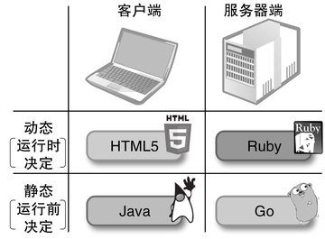
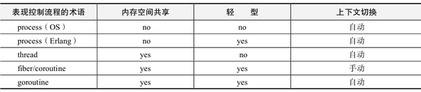

# 第三章：编程语言的新潮流

## 3.1　语言的设计

接下来，我们从语言设计的角度，来比较一下Java、JavaScript、Ruby和Go这4种语言。这几种语言看起来彼此完全不同，但如果选择一个合适的标准，就可以将它们非常清楚地进行分类，如图1所示。

C>

C>图1　4种语言的分类

C>Java在最早的时候是作为客户端语言而诞生的。

JavaScript是客户端语言的代表，Java其实也在其黎明期作为客户端语言活跃过一段时间，应该有很多人还记得Java Applet这个名词。之后，Java转型为服务器端语言的代表，地位也扶摇直上，但考虑到它的出身，这里还是将其分类为客户端语言。

另一个分类标准，就是静态和动态。所谓静态，就是不实际运行程序，仅通过程序代码的字面来确定结果的意思；而所谓动态，就是只有当运行时才确定结果的意思。静态、动态具体所指的内容有很多种，大体上来分的话就是运行模式和类型。这4种语言全都具备面向对象的性质，而面向对象本身就是一种包含动态概念的性质。不过，在这几种语言之中，Java和Go是比较偏重静态一侧的语言，而Ruby和JavaScript则是比较偏重动态一侧的语言。

### 客户端与服务器端

首先，我们先将这些语言按照客户端和服务器端来进行分类。如前面所说，这种分类是以该语言刚刚出现时所使用的方式为基准的。

现在Java更多地被用作服务器端语言，而我们却将它分类到客户端语言中，很多人可能感到有点莫名其妙。Java确实现在已经很少被用作客户端语言了，但是我们不能忘记，诞生于1995年的Java，正是伴随嵌入在浏览器中的Applet技术而出现的。

Java将虚拟机（VM）作为插件集成到浏览器中，将编译后的Java程序（Applet）在虚拟机上运行，这种技术当初是为了增强浏览器的功能。再往前追溯的话，Java原本名叫Oak，是作为面向嵌入式设备的编程语言而诞生的。因此，从出身来看的话，Java还是一种面向客户端的编程语言。

Java所具备的VM和平台无关性字节码等特性，本来就是以在客户端运行Applet为目的的。在各种不同的环境下都能够产生相同的行为，这样的特性对于服务器端来说虽然也不能说是毫无价值，但是服务器环境是可以由服务提供者来自由支配的，因此至少可以说，这样的特性无法带来关键性的好处吧。另一方面，在客户端环境中，操作系统和浏览器都是千差万别，因此对平台无关性的要求一直很高。

Java诞生于互联网的黎明时期，那个时候浏览器还不是电脑上必备的软件。当时主流的浏览器有Mosaic和Netscape Navigator等，除此之外还有一些其他类似的软件，而Internet Explorer也是刚刚才崭露头角。

在那个充满梦想的时代，如果能开发出一种功能上有亮点的浏览器就有可能称霸业界。原Sun Microsystems公司曾推出了一个用Java编写的浏览器HotJava，向世界展示了Applet的可能性。然而，随着浏览器市场格局的逐步固定，他们转变了策略，改为向主流浏览器提供插件来集成Java，从而对Applet的运行提供支持。

### 向服务器端华丽转身

然而，Java自诞生之后，并未在客户端方面取得多大的成功，于是便开始着手进入服务器端领域。造成这种局面有很多原因，我认为其中最主要的原因应该是在Applet这个平台上迟迟没有出现一款杀手级应用（killerapp）。

处于刚刚诞生之际的Java遭到了很多批判，如体积臃肿、运行缓慢等，不同浏览器上的Java插件之间也存在一些兼容性方面的问题，使得Applet应用并没有真正流行起来。在这个过程中，JavaScript作为客户端编程语言则更加实用，并获得了越来越多的关注。当然，在那个时候Java已经完全确立了自己作为服务器端编程语言的地位，因此丧失客户端这块领地也不至于感到特别肉痛。

Java从客户端向服务器端的转身可以说是相当成功的。与此同时，SunMicrosystems和IBM等公司着手对JVM（Java VM）进行改良，使得其性能得到了改善，在某些情况下性能甚至超越了C++。想想之前对Java性能恶评如潮的情形，现在Java能有这样的性能和人气简直就像做梦一样。

### 在服务器端获得成功的四大理由

由于我本人没有大规模实践过Java编程，因此对于Java在服务器端取得成功的来龙去脉，说真的并不是很了解。不过，如果让我想象一下的话，大概有下面几个主要的因素。

#### 1. 可移植性

虽然服务器环境比客户端环境更加可控，但服务器环境中所使用的系统平台种类也相当多，如Linux、Solaris、FreeBSD、Windows等，根据需要，可能还会在系统上线之后更换系统平台。在这样的情况下，Java所具备的“一次编写，到处运行”特性就显得魅力十足了。

#### 2. 功能强大

Java在服务器端崭露头角是在20世纪90年代末，那个时候的状况对Java比较有利。和Java在定位上比较相似的语言，即静态类型、编译型、面向对象的编程语言，属于主流的也就只有C++而已了。

在Java诞生的20世纪90年代中期，正好是我作为C++程序员开发CAD相关系统的时候。但当时C++也还处于发展过程中，在实际的开发中，模板、异常等功能还无法真正得到运用。

相比之下，Java从一开始就具备了垃圾回收（GC）机制，并在语言中内置了异常处理，其标准库也是完全运用了异常处理来设计的，这对程序员来说简直是天堂。毫无疑问，Java语言的这些优秀特性，是帮助其确立服务器端编程语言地位的功臣之一。

#### 3. 高性能

Java为了实现其“一次编写，到处运行”的宣传口号，并不是将程序直接转换为系统平台所对应的机器语言，而是转换为虚拟CPU的机器语言“字节码”（Bytecode），并通过搭载虚拟CPU的模拟器JVM来运行。JVM归根到底其实是在运行时用来解释字节码的解释器，理论上说运行速度应该无法与直接生成机器语言的原生编译器相媲美。

事实上，在Java诞生初期，确实没有达到编译型语言应有的运行速度，当时的用户经常抱怨Java太慢了，这样的恶评令人印象深刻。

然而，技术的革新是伟大的。随着各种技术的进步，现在Java的性能已经能够堪称顶级。

例如，有一种叫做JIT（Just In Time）编译的技术，可以在运行时将字节码转换成机器语言，经过转换之后就可以获得和原生编译一样快的运行速度。在运行时进行编译，就意味着编译时间也会包含在运行时间里面。因此，优秀的JIT编译器会通过侦测运行信息，仅将需要频繁运行的瓶颈部分进行编译，从而大大削减编译所需的时间。而且，利用运行时编译，可以不用考虑连接的问题而积极运用内联扩展，因此在某些情况下，运行速度甚至可以超过C++。

在Java中，其性能提高的另一个障碍就是GC。GC需要对对象进行扫描，将不用的对象进行回收，这个过程和程序本身要进行的操作是无关的，换句话说，就是做无用功，因此而消耗的时间拖累了Java程序的性能。作为对策，在最新的JVM中，采用了并行回收、分代回收等技术。

#### 4. 丰富的库

随着Java的人气直升，应用逐渐广泛，Java能够使用的库也越来越多。库的增加提高了开发效率，从而又反过来拉高了Java的人气，形成了一个良性循环。现在Java的人气已经无可撼动了。

### 客户端的JavaScript

Applet在客户端对扩展浏览器功能做出了尝试，然而它并不太成功。在浏览器画面中的一个矩形区域中运行应用程序的Applet，并没有作为应用程序的发布手段而流行起来。

几乎是在同一时期出现的JavaScript，也是一种集成在浏览器中的语言，但是它可以在一般的网页中嵌入程序逻辑，这一点是和Java Applet完全不同的方式，却最终获得了成功。

JavaScript是由原Netscape Communications公司开发的，通过JavaScript，用户点击网页上的链接和按钮时，不光可以进行页面的跳转，还可以改写页面的内容。这样的功能十分便利，因此Netscape Navigator之外的很多浏览器都集成了JavaScript。

随着浏览器的不断竞争和淘汰，当主流浏览器全部支持JavaScript时，情况便发生了变化。像Google地图这样的产品，整体的框架是由HTML组成的，但实际显示的部分却是通过JavaScript来从服务器获取数据并显示出来，这样的手法从此开始流行起来。

在JavaScript中与服务器进行异步通信的API叫做XMLHttpRequest，因此从它所衍生出的手法便被称为Ajax（Asynchronous JavaScript andXML，异步JavaScript与XML）。在美国有一种叫做Ajax的厨房清洁剂，说不定是从那个名字模仿而来的。

### 性能显著提升

目前，客户端编程语言中JavaScript已成为一个强有力的竞争者，伴随着JavaScript重要性的不断提高，对JavaScript引擎的投资也不断增加，使JavaScript的性能得到了显著改善。改善JavaScript性能的主要技术，除了和Java相同的JIT和GC之外，还有特殊化（Specialization）技术。

与Java不同，JavaScript是一种动态语言，不带有变量和表达式的类型信息，针对类型进行优化是非常困难的，因此性能和静态语言相比有着先天的劣势，而特殊化就是提高动态语言性能的技术之一。

我们设想图2所示的这样一个JavaScript函数。这个函数是用于阶乘计算的，大多数情况下，其参数n应该都是整数。由于JIT需要统计运行时信息，因此JavaScript解释器也知道参数n大多数情况下是整数。

{lang="javascript"}
    function fact(n) {
        if (n == 1) return 1;
        return n * fact(n-1);
    }

C>图2　JavaScript函数

于是，当解释器对fact函数进行JIT编译时，会生成两个版本的函数：一个是n为任意对象的通用版本，另一个是假设n为整数的高速版本。当参数n为整数时（即大多数情况下），就会运行那个高速版本的函数，便实现了与静态语言几乎相同的运行性能。

除此之外，最新的JavaScript引擎中还进行了其他大量的优化，说JavaScript是目前最快的动态语言应该并不为过。

JavaScript在客户端称霸之后，又开始准备向服务器端进军了。JavaScript的存在感在将来应该会越来越强吧。

### 服务器端的Ruby

客户端编程的最大问题，就是必须要求每一台客户端都安装相应的软件环境。在Java和JavaScript诞生的20世纪90年代后半，互联网用户还只局限于一部分先进的用户，然而现在互联网已经大大普及，用户的水平构成也跟着变得复杂起来，让每一台客户端都安装相应的软件环境，就会大大提高软件部署的门槛。

而相对的，在服务器端就没有这样的制约，可以选择最适合自己的编程语言。

在Ruby诞生的1993年，互联网还没有现在这样普及，因此Ruby也不是一开始就面向Web服务器端来设计的。然而，从WWW黎明期开始，为了实现动态页面而出现了通用网关接口（Common Gateway Interface，CGI）技术，而Ruby则逐渐在这种技术中得到了应用。

所谓CGI，是通过Web服务器的标准输入输出与程序进行交互，从而生成动态HTML页面的接口。只要可以对标准输入输出进行操作，那么无论任何语言都可以编写CGI程序，这不得不归功于WWW设计的灵活性，使得动态页面可以很容易地编写出来，也正是因为如此，使得WWW逐渐风靡全世界。

在WWW中，来自Web服务器的请求信息是以文本的方式传递的，反过来，返回给Web服务器的响应信息也是以文本（HTML）方式传递的，因此擅长文本处理的编程语言就具有得天独厚的优势。于是，脚本语言的时代到来了。以往只是用于文本处理的脚本语言，其应用范围便一下子扩大了。

早期应用CGI的Web页面大多是用Perl来编写的，而作为“BetterPerl”的Ruby也随之逐步得到越来越多的应用。

### Ruby on Rails带来的飞跃

2004年，随着Ruby on Rails的出现，使得Web应用程序的开发效率大幅提升，也引发了广泛的关注。当时，已经出现了很多Web应用程序框架，而Ruby on Rails可以说是后发制人的。Ruby on Rails的特性包括：

* 完全的MVC架构
* 不使用配置文件（尤其是XML） 
* 坚持简洁的表达
* 积极运用元编程
* 对Ruby核心的大胆扩展

基于这些特性，Ruby on Rails实现了很高的开发效率和灵活性，得到了广泛的应用。可以说，Ruby能拥有现在的人气，基本上都是Ruby on Rails所作出的贡献。

目前，作为服务器端编程语言，Ruby的人气可谓无可撼动。有一种说法称，以硅谷为中心的Web系创业公司中，超过一半都采用了Ruby。

但这也并不是说，只要是服务器端环境，Ruby就一定可以所向披靡。在规模较大的企业中，向网站运营部门管理的服务器群安装软件也并不容易。实际上，在某个大企业中，曾经用Ruby on Rails开发了一个面向技术人员的SNS，只用很短的时间就完成搭建了，但是等到要正式上线的时候，运营部门就会以“这种不知道哪个的家伙开发的，也没经过第三方安全认证的Ruby解释器之类的软件，不可以安装在我们数据中心的主机上面”这样的理由来拒绝安装，这真是相当头疼。

不过，开发部门的工程师们并没有气馁，而是用Java编写的Ruby解释器JRuby，将开发好的SNS转换为jar文件，从而使其可以在原Sun Mi-crosystems公司的应用程序服务器GlassFish上运行。当然，JVM和Glass-Fish都已经在服务器上安装好了，这样一来运营方面也就没有理由拒绝了。多亏了JRuby，结局皆大欢喜。

JRuby还真是在关键时刻大显身手呢。

### 服务器端的Go

Go是一种新兴的编程语言，但它出身名门，是由著名UNIX开发者罗勃·派克和肯·汤普逊开发的，因此受到了广泛的关注。

Go的诞生背景源于Google公司中关于编程语言的一些问题。在Google公司中，作为优化编程环境的一环，在公司产品开发中所使用的编程语言，仅限于C/C++、Java、Python和JavaScript。实际上也有人私底下在用Ruby，不过正式产品中所使用的语言仅限上述4种。

这4种语言在使用上遵循着一定的分工：客户端语言用JavaScript，服务器端语言用脚本系的Python，追求大规模或高性能时用Java，文件系统等面向平台的系统编程用C/C++。在这些语言中，Google公司最不满意的就是C/C++了。

和其他一些编程语言相比，C/C++的历史比较久，因此不具备像垃圾回收等最近的语言所提供的编程辅助功能。因此，由于开发效率一直无法得到提高，便产生了设计一种“更好的”系统编程语言的需求。而能够胜任这一位置的，正是全新设计的编程语言Go。

Go具有很多特性，（从我的观点来看）比较重要的有下列几点：

* 垃圾回收
* 支持并行处理的Goroutine
* Structural Subtyping（结构子类型）

关于最后一点Structural Subtyping，我们会在后面对类型系统的讲解中进行说明。

### 静态与动态

刚才我们已经将这4种语言，从客户端、服务器端的角度进行了分类。接下来我们再从动态、静态的角度来看一看这几种语言。

正如刚才所讲过的，所谓静态，就是无需实际运行，仅根据程序代码就能确定结果的意思；而所谓动态，则是只有到了运行时才能确定结果的意思。

不过，无论任何程序，或多或少都包含了动态的特性。如果一个程序完全是静态的话，那就意味着只需要对代码进行字面上的分析，就可以得到所有的结果，这样一来程序的运行就没有任何意义了。例如，编程计算6的阶乘，如果按照完全静态的方式来编写的话，应该是下面这样的：

{lang="text"}
    puts "720"

不过，除非是个玩具一样的演示程序，否则不会开发出这样的程序来。在实际中，由于有了输入的数据，或者和用户之间的交互，程序才能在每次运行时都能得到不同的要素。

因此，作为程序的实现者，编程语言也多多少少都具备动态的性质。所谓动态还是静态，指的是这种语言对于动态的功能进行了多少限制，或者反过来说，对动态功能进行了多少积极的强化，我们所探讨的其实是语言的这种设计方针。

例如，在这里所列举的4种编程语言都是面向对象的语言，而面向对象的语言都会具备被称为多态（Polymorphism）或者动态绑定的动态性质。即，根据存放在变量中的对象的实际性质，自动选择一种合适的处理方式（方法）。这样的功能可以说是面向对象编程的本质。

属于动态的编程语言，其动态的部分，主要是指运行模式和类型。这两者是相互独立的概念，但采用动态类型的语言，其运行模式也具有动态的倾向；反之也是一样，在静态语言中，运行模式在运行时的灵活性也会受到一定的限制。

### 动态运行模式

所谓动态运行模式，简单来说，就是运行中的程序能够识别自身，并对自身进行操作。对程序自身进行操作的编程，也被称为元编程（Metapro-gramming）。

在Ruby和JavaScript中，元编程是十分自然的，比如查询某个对象拥有哪些方法，或者在运行时对类和方法进行定义等等，这些都是理所当然的事。

另一方面，在Java中，类似元编程的手法，是通过“反射API”来实现的。虽然对类进行取出、操作等功能都是可以做到的，但并非像Ruby和JavaScript那样让人感到自由自在，而是“虽然能做到，但一般也不会去用”这样的感觉吧。

Go也是一样。在Go中，通过利用reflect包可以获取程序的运行时信息（主要是类型），但是（在我所理解的范围内）无法实现进一步的元编程功能。而之所以没有采用比Java更进一步的动态运行模式，恐怕是因为这（可能）在系统编程领域中必要性不大，或者是担心对运行速度产生负面影响之类的原因吧。

### 何谓类型

从一般性的层面来看，类型指的是对某个数据所具有的性质所进行的描述。例如，它的结构是怎样的，它可以进行哪些操作，等等。动态类型的立场是数据拥有类型，且只有数据才拥有类型；而静态类型的立场是数据拥有类型，而存放数据的变量、表达式也拥有类型，且类型是在编译时就固定的。

然而，即便是静态类型，由于面向对象语言中的多态特性，也必须具备动态的性质，因此需要再追加一条规则，即实际的数据（类型），是静态指定的类型的子类型。所谓子类型（Subtype），是指具有继承关系，或者拥有同一接口，即静态类型与数据的类型在系统上“拥有同一性质”。

### 静态类型的优点

动态类型比较简洁，且灵活性高，但静态类型也有它的优点。由于在编译时就已经确定了类型，因此比较容易发现bug。当然，程序中的bug大多数都是与逻辑有关的，而单纯是类型错误而导致的bug只是少数派。不过，逻辑上的错误通常也伴随着编译时可以检测到的类型不匹配，也就是说，通过类型错误可以让其他的bug显露出来。

除此之外，程序中对类型的描述，可以帮助对程序的阅读和理解，或者可以成为关于程序行为的参考文档，这可以说是一个很大的优点。

此外，通过静态类型，可以在编译时获得更多可以利用的调优信息，编译器便可以生成更优质的代码，从而提高程序的性能。然而，通过JIT等技术，动态语言也可以获得与原生编译的语言相近的性能，这也说明，在今后静态语言和动态语言之间的性能差距会继续缩小。

### 动态类型的优点

相对而言，动态类型的优点，就在于其简洁性和灵活性了。

说得极端一点的话，类型信息其实和程序运行的本质是无关的。就拿阶乘计算的程序来说，无论是用显式声明类型的Java来编写（图3），还是用非显式声明类型的Ruby来编写（图4），其算法都是毫无区别的。然而，由于多了关于类型的描述，因此在Java版中，与算法本质无关的代码的分量也就增加了。

{lang="java"}
	class Sample {
	    private static int fact(int n) {
	        if (n == 1) return 1;
	        return n * fact(n - 1);
	    }  
	    public static void main(String[] argv) {
	        System.out.println("6!="+fact(6));
	    }
	}

C>图3　Java编写的阶乘程序

{lang="ruby"}
	def fact(n)
	  if n == 1
	    1
	  else
	    n * fact(n - 1)
	  end
	end
	print "6!=", fact(6), "\n"
	---

C>图4　Ruby编写的阶乘程序

而且，类型也带来了更多的制约。图3、图4中所示的程序对6的阶乘进行了计算，但如果这个数字继续增大，Java版对超过13的数求阶乘的话，就无法正确运行了。图3的程序中，fact方法所接受的参数类型显式声明为int型，而Java的int为32位，即可以表示到接近20亿的整数。如果阶乘的计算结果超出这个范围，就会导致溢出。

当然，由于Java拥有丰富的库资源，用BigInteger类就可以实现无上限的大整数计算，但这就需要对上面的程序做较大幅度的改动。而由于计算机存在“int的幅度为32位”这一限制，就使得阶乘计算的灵活性大大降低了。

另一方面，Ruby版中则没有这样的制约，就算是计算13的阶乘，甚至是200的阶乘，都可以直接计算出来，而无需担心如int的大小、计算机的限制等问题。

其实这里还是有点小把戏的。同样是动态语言，用图1中的JavaScript来计算200的阶乘就会输出Infinity（无穷大）。其实，JavaScript的数值是浮点数，因此无法像Ruby那样支持大整数的计算。也就是说，要不受制约地进行计算，除了类型的性质之外，库的支持也是非常重要的。

### 有鸭子样的就是鸭子

在动态语言中，一种叫做鸭子类型（Duck Typing）的风格被广泛应用。鸭子类型这个称谓，据说是从下面这则英语童谣来的：

If it walks like a duck and quacks like a duck, it must be a duck.（如果像鸭子一样走路，像鸭子一样呱呱叫，则它一定是一只鸭子）

从这则童谣中，我们可以推导出一个规则，即如果某个对象的行为和鸭子一模一样，那无论它真正的实体是什么，我们都可以将它看做是一只鸭子。也就是说，不考虑某个对象到底是哪一个类的实例，而只关心其拥有怎样的行为（拥有哪些方法），这就是鸭子类型。因此，在程序中，必须排除由对象的类所产生的分支。

这是由“编程达人”大卫·托马斯（Dave Thomas）所提出的。

例如，假设存在log_puts(out, mesg)这样一个方法，用来将mesg这个字符串输出至out这个输出目标中。out需要指定一个类似Ruby中的IO对象，或者是Java中的ReadStream这样的对象。在这里，本来是向文件输出的日志，忽然想输出到内存的话，要怎么办呢？比如说我想将日志的输出结果合并成一个字符串，然后再将它取出。

在Java等静态语言中，out所指定的对象必须拥有共同的超类或者接口，而无法选择一个完全无关的对象作为输出目标。要实现这样的操作，要么一开始就事先准备这样一个接口，要么重写原来的类，要么准备一个可以切换输出目标的包装对象（wrapper object）。无论如何，如果没有事先预计到需要输出到内存的话，就需要对程序进行大幅的改动了。

如果是采用了鸭子类型风格的动态语言，就不容易产生这样的问题。只要准备一个和IO对象具有同样行为的对象，并将其指定为out的话，即便不对程序进行改动，log_puts方法能够成功执行的可能性也相当大。实际上，在Ruby中，确实存在和IO类毫无继承关系，但和IO具有同样行为的StringIO类，用来将输出结果合并成字符串。

动态类型在编译时所执行的检查较少，这是一个缺点，但与此同时，程序会变得更加简洁，对于将来的扩展也具有更大的灵活性，这便是它的优点。

### Structural Subtyping

在4种语言中最年轻的Go，虽然是一种静态语言，但却吸取了鸭子类型的优点。Go中没有所谓的继承关系，而某个类型可以具有和其他类型之间的可代换性，也就是说，某个类型的变量中是否可以赋予另一种类型的数据，是由两个类型是否拥有共同的方法所决定的。例如，对于“A型”的变量，只要数据拥有A型所提供的所有方法，那么这个数据就可以赋值给该变量。像这样，以类型的结构来确定可代换性的类型关系，被称为结构子类型（Structural Subtyping）；另一方面，像Java这样根据声明拥有继承关系的类型具有可代换性的类型关系，被称为名义子类型（Nominal Subtyping）。

在结构子类型中，类型的声明是必要的，但由于并不需要根据事先的声明来确定类型之间的关系，因此就可以实现鸭子类型风格的编程。和完全动态类型的语言相比，虽然增加了对类型的描述，但却可以同时获得鸭子类型带来的灵活性，以及静态编译所带来了类型检查这两个优点，可以说是一个相当划算的交换。

### 小结

在这里，我们对Ruby、JavaScript、Java、Go这4种语言，从服务器端、客户端，以及静态、动态这两个角度来进行了对比。这4种语言由于其不同的设计方针，而产生出了不同的设计风格，大家是否对此有了些许了解呢？

不仅仅是语言，其实很多设计都是权衡的结果。新需求、新环境，以及新范式，都催生出新的设计。而学习现有语言的设计及其权衡的过程，也可以为未来的新语言打下基础。

## 3.2　Go

2009年11月，Google发布了一种名为Go的新语言，在世界范围内引发了轰动。下面我从一个编程语言设计者的角度，来展望一下Go这个新兴的编程语言。

作为一种新的编程语言，Go宣扬了图1中的这些关键字。首先，我们先来看看这些关键字到底是什么意思吧。

{lang=text}
	（1）New（新的）
	（2）Experimental（实验性的）
	（3）Concurrent（并发的）
	（4）Garbage-collected（带垃圾回收的）
	（5）Systems（系统）
	（6）Language

C>图1　Go的关键字

### New（新的）

几乎每一个新的编程语言在发布的时候都会被问及这样一个问题：“为什么要创造一个新语言呢？”Ruby发布的当时也有很多人这样问过，我给出的是“只是因为想做做看而已啊”这么个不着调的回答。不过Go的开发者们说，这个新语言是由于对现有语言的不满才诞生出来的。

在这10年中，有很多新的编程语言相继诞生，并获得一定程度的应用，其中大多数都是以Ruby为代表的动态语言，但是，能触及C和C++领域的新的系统编程语言却迟迟没有出现。

另一方面，编程语言所面临的状况也在不断发生变化，如网络的普及、多核、大规模集群等，而重视性能的系统编程语言却没有对这样的变化做出应对。Go语言的开发者们主张，正是因为这样的局面，才使得创造一种开发效率更高的系统编程语言变得十分必要。

### Experimental（实验性的）

一种编程语言从出现到实用化所要经历的时间之长，超乎普通人的想象。以Ruby为例，从开始开发到发布用了3年左右的时间，而到了在程序员圈子中拥有一定知名度则又花了4年的时间，而再到通过Ruby on Rails而走红，则又花了5年的时间。

相比之下，从2007年末开始开发的Go，只经过了2年左右的开发，在发布之时就获得了全世界的关注，我表示实在是羡慕之极。但即便如此，Go所吸收的那些新概念是否能真正被世界所接受，现在还是个未知数。从这个意义上来看，应该说它还只是一种实验性的语言。

### Concurrent（并发的）

在21世纪的今天，并发编程变得愈发重要。需要同时处理大量并发访问的网络应用程序，本来就更加适合并发编程，而对于不断增大的处理信息量，分布式并发编程又是一个很好的解决方案，因而备受期待。

此外，要最大限度地利用多核，甚至是超多核（Many-core）环境的CPU性能，并发编程也显得尤为重要。

因此，为了实现更高开发效率的并发编程，编程语言本身也必须具备支持并发编程的功能，这已经成为一种主流的设计思路。近年来，像Erlang这样以并行计算为中心的编程语言受到了广泛的关注，也正是由于上述背景所引起的。

然而，当前主流的系统编程语言中，并没有哪种语言在语言规格层面上考虑到了并发编程。我想，正是这一点成为了Go开发的契机。

### Garbage-collected（带垃圾回收的）

将不需要的对象自动进行回收，从而实现对内存空间的循环利用，这种垃圾回收（GC）机制在40多年前出现的Lisp等编程语言中已经是常识了。在需要大量操作对象的程序中，对于某个对象是否还要继续使用，是很难完全由人来把握和判断的。然而，如果对象的管理出现问题，便会导致十分严重的bug。

如果忘记对不需要的对象进行释放，程序所占用的内存容量就会不断增大，从而导致内存泄漏（Memory leak）bug；反过来，如果释放了仍然在使用中的对象，就会导致内存空间损坏的悬空指针（Dangling pointer）bug。

这两种bug都有一个特点，就是出问题的地方，和实际引发问题的地方往往距离很远，因此很难被发现和修复。所以我认为，在具备一定面向对象功能的编程语言中，GC是不可或缺的一个机制。

使GC走进普通的编程领域，并得到广泛的认知，不得不说是Java所带来的巨大影响。在Java之前，大家对GC的主流观点，要么认为它在性能上有问题，要么认为它在系统编程中是不需要的。像C++这样的系统编程语言中，没有提供GC机制，应该也是出于这个原因吧。

然而，现在情况变了。作为21世纪的系统编程语言，Go具备了GC机制，从而减轻了对象管理的消耗，程序员的负荷也跟着减轻，从而使得开发效率得到了提高。

### Systems（系统）

刚刚我们不断提到系统编程语言这个说法，那么系统编程语言到底指的是怎样一类编程语言呢？

至于严格的定义，其实我也不是十分清楚，不过从印象来说，应该指的是可以用来编写操作系统的，对性能十分重视的语言吧。从定位上来说，应该说是C和C++所覆盖的那片领域。

的确，在这个领域最广泛使用的语言中，即便是最新的C++（1983年）也决不能算是“新”了。而无法编译出可直接运行的代码（原本在设计上就不会编译出这样的代码）的Java，又很难用作系统编程语言，而且Java发布于1995年，到现在也已经过了10多年了。

更进一步说，由于Java本身就是设计为在JVM中运行的，因此即便通过JIT等最新技术实现了高速化，我觉得也很难称其为是一种系统编程语言。

在Google中，由于对海量数据和大规模集群处理有较大的需求，因此便愈发需要一种高性能的编程语言。然而，为了避免使用过多种编程语言所造成的管理成本上升，Google公司对官方项目中能够使用的语言进行了严格的限制，只有C、C++、Java、JavaScript和Python这5种。

用于基础架构等系统编程的C和C++、兼具高开发效率和高性能的Java、用于客户端编程的JavaScript，再加上高开发效率的动态语言Python，我认为这是一组十分均衡的选择。

不过，仔细看看的话，用于系统编程的C和C++则显得有些古老，对于最近获得广泛认知的，从语言层面对开发效率的支持机制（如GC等）显得不足。Go的出现，则为这一领域带来了一股清新的风，也可以说，Go是Google表达对于系统编程语言不满的一个结果。

### Go的创造者们

领导Go项目的，主要有下面这些人：罗勃·派克（Rob Pike）、肯·汤普逊（Ken Thompson）、Robert Griesemer、Ian Lance Taylor、Russ Cox。其中，罗勃·派克和肯·汤普逊是超级名人。肯·汤普逊是曾经最早创造UNIX的人，也是参与过B语言和Plan 9操作系统开发的传说中的黑客。

对我来说，罗勃·派克和布莱恩·柯林汉合作的名著《UNIX编程环境》给我留下了很深的印象，除此之外，罗勃·派克在AT&T贝尔实验室也贡献了诸多成果，如在Plan 9的开发中扮演了重要的角色。要说他离我们最近的一项功绩，莫过于UTF-8的开发了，这也是和肯·汤普逊的共同成果。如果没有他们的话，估计现在世界已经被那个超烂的UTF-16占领了吧，想到这里，我不禁充满了感激之情。

虽然可能有私情的成分，但这样的开发者所创造出的Go，一定是颇受UNIX，特别是C语言影响的，甚至可以说它就是现代版的C语言。因此，下面我们就通过和C语言的对比，为大家介绍一下Go。

### Hello World

Hello World可以说是介绍编程语言的文章所必需的，如图2所示。这里面“世界”两个字并不是我故意给写成汉字的，而是罗勃·派克原始的HelloWorld程序就是这么写的。也许是为了证明罗勃·派克是开发者之一的缘故吧，这段程序表明，只要使用UTF-8字符串，就可以自由驾驭Unicode。不过，貌似标识符还是只能用英文和数字。

{lang="go"}
	package main /* 这段程序属于名为“main”的包 */
	import "fmt" /* 使用名为“fmt”的包 */
	
	func main () {
	    fmt.Printf("Hello, 世界\n"); /* 使用fmt包中的Printf函数 */
	}

C>图2　用Go编写的Hello World

C>由于只能引用公有函数，因此包名的圆点后面跟着的标识符总是大写字母开头。

在我的印象中，Go和C语言果然还是很相似的。当然也有一些不同之处，例如package和import等对包系统的定义，以及末尾的分号可以省略等等。

Printf中的P是大写字母，这一点挺引人注目的，其实它的背后代表了一条规则，即大写字母开头的名称表示可以从包外部访问的公有对象，而小写字母开头的名称表示只能从包内部访问的私有对象。由于有了这条规则，Go中几乎所有的方法名都是大写字母开头的。

### Go的控制结构

下面我们来更加深入地了解一下Go吧。

首先我们从控制结构开始看。Go主要的控制结构有if、switch和for三种，而并没有while，while用for代替了。我们先来讲一下if结构。

Go的if结构语法规则如图3所示。

{lang="text"}
	if 条件1 {程序体1}  
	  else if 条件2 {程序体2}
	else (程序体3)

C>图3　Go的控制结构

其中else if的部分可以有任意个。Go的if结构和C的if结构很相似，不过有几点区别。

首先，和C语言不同，Go中if等结构中的条件部分并不用括号括起来，而相应地，程序体的部分则是必须用花括号括起来的。

还有一点不是很明显，那就是“必须括起来”这条规则实际上非常重要。C语言的规则是这样的：当程序体包含多行代码时，需要用花括号括起来使其成为一体。但这样的规则下，if结构的语法便会产生歧义。

例如：

{lang="text"}
	if (条件) if (条件) 语句 else 语句

这样的C语言程序，到底是解释为：

{lang="text"}
	if (条件) {
	  if (条件) 语句
	  else 语句
	}

还是解释为：

{lang="text"}
	if (条件) {
	  if (条件) 语句
	}
	else 语句

貌似很难抉择。

这个问题被称为“悬挂else问题”。在C语言中，虽然存在“有歧义的else属于距离较近的if语句”这样一条规则，但还是避免不了混乱的发生。

然而，如果有了“程序体必须用花括号括起来”这条规则，就不会产生这样的歧义了。从这个角度来看，不允许省略花括号着实是一个好主意。在其他广泛应用的主流语言中，Perl的语法也不允许省略花括号。

说句题外话，Ruby在控制结构的划分中，没有使用花括号，而是使用end，理由也是一样的。像Ruby这样使用end的语言中，也可以避免因悬挂导致的歧义。

Go的if语句还有一点与C语言不同，那就是在条件部分可以允许使用初始化语句，具体示例如图4所示。

{lang="go"}
	if v = f(); v < 10 {
	    fmt.Printf("%d < 10\n", v);
	}
	else {
	    fmt.Printf("%d >= 10", v);
	}

C>图4　条件部分可以使用初始化语句

将初始化语句移动到if结构的前面，意思也不会发生变化，但将初始化语句放在条件部分中，可以更加强调是对f()的返回值进行判断这一意图。我们后面要讲到的“逗号OK”形式中，这种初始化方式也非常奏效。

switch也是从C语言来的，但也有些微妙的差异。和if结构一样，条件表达式不用括号括起来，而程序体必须用花括号括起来（图5）。

{lang="go"}
	switch a {
	    case 0: fmt.Printf("0");
	    default: fmt.Printf("非0");
	}

C>图5　Go的switch结构

当没有满足条件的case时则执行default部分，这一点和C语言是相同的。但是，和C语言相比，Go的switch结构还存在下面这些差异：

* 即便没有break，分支也会结束
* case中可以使用任意的值
* 分支条件表达式可以省略

switch中的break语法很诡异，堪称C语言中最大的谜，趁这个机会正好改一改。在上面的例子中，也不存在用于分隔的break呢。相应地，case则可以并列多个条件。

虽说Go从C语言中继承了很多东西，但也没有必要连这些也一起继承过来。然而，Go中却追加了一条新的语法，即case的程序体以fallthrough语句结束时，会进入下面一个分支。这样真的有必要吗？我觉得这只是一种对C语言单纯的怀念而已吧。

C语言的switch中，case可以接受的值只能是整数、字符、枚举等编译时已经确定的值，这应该是考虑了为用表实现的分支进行优化的结果，而break的存在也可以看成是由以前的汇编语言编程派生而来。

于是，在汇编语言已经十分罕见的现在，这种语法成为一个“谜”也是没有办法的事，但在Go中就没有这样的制约了。

最后，Go还有一种独有的，很有趣的语法，那就是switch语句中判断分支条件的表达式是可以省略的（图6）。这其实可以看成是用一种更易读的方式来实现一个if-else结构，实际上编译出来的结果貌似也是一样的。

{lang="go"}
	switch {
	    case a < b: return -1;
	    case a == b: return 0;
	    case a > b: return 1;
	}

C>图6　分支条件表达式可以省略

有趣的是，Ruby的case结构也可以写成同样的形式，用Ruby编写出来的程序如图7所示。那个，我并不是说Go是抄袭Ruby哦，没有证据证明这一点，而且我也觉得不大可能会抄Ruby，不过说实话，我还真小小地动过一点这个念头，万一是真的呢？（笑）

{lang="ruby"}
	case
	  when a < b: return -1
	  when a == b: return 0
	  when a > b: return 1
	end

C>图7　Ruby中也可以省略分支条件表达式

for结构也和C语言非常相似。和if结构一样，条件表达式不需要用括号括起来，但循环体则必须用花括号括起来，除此之外，还有一些地方和C语言有所不同。

首先，Go的for语句中，条件部分的表达式有两种形式：单表达式形式和三表达式形式。其中单表达式形式和C语言中的while语句功能是相同的。

{lang="text"}
	for 条件 {循环体}

三表达式形式则和C语言的for语句是相同的。

{lang="text"}
	for 初始化; 条件; 更新 {循环体}

因此，编写出来的循环代码和C语言几乎是一样的：

{lang="go"}
	for i=0; i<10; i++ {
        ...
	}

有趣的是，在Go中，++递增并不是表达式，而是作为语句来处理的。此外，由于没有类似C语言中逗号操作符的形式，因此for的条件部分无法并列多个表达式。如果要对多个变量进行初始化，可以使用多重赋值：

{lang="go"}
	for i,j=0,1; i<10; i++ {
	    ...
	}

在for语句中，空白表达式表示真，因此：

{lang="go"}
	for ;; {
	    ...
	}

就表示无限循环，在C语言中也是一样的。

循环可以通过break和continue来中断，这两个语句的意思和C语言是一样的，不过Go中可以通过标签来指定到底要跳出哪一个循环（图8）。

{lang="go"}
	Loop: for i = 0; i < 10; i++ {
	    switch f(i) {
	        case 0, 1, 2: break Loop
	    }
	    g(i)
	}

C>图8　用标签来指定要跳出的循环

这一点又有点像Java的风格了，看来Go的设计真是研究和参考了其他多种语言呢。

作为控制结构来说，还有一些像go语句这样与并发编程关系密切的方式，我们稍后再来详细介绍。

### 类型声明

正如我们刚才所举的这些例子，Go是一种深受C语言（不是C++）影响的语言。不过，Go也有和其他一些C派生语言不同的地方，其中最具有特色的就是其类型声明了。简单来说，Go的类型声明和C语言是“正好相反”的。

C语言中，类型声明的基本方式是：

类型　变量名;

不过，由于存在用户自定义类型，因此当遇到某个“名称”开头的一行代码时，很难一眼就判断出来这到底是类型声明，还是函数调用，或者是变量引用。

对人类来说存在歧义的表达方式，对编译器来说也就意味着需要更复杂的处理才能区分。因此，Go中规定：声明必须以保留字开头，且类型位于变量名之后。

根据这两条规则，Go的声明如图9所示。从深受C语言影响这个印象来说，这还真是令人震惊，不过习惯之后也就不觉得那么特殊了。这样的描述方式可以减少歧义，无论是对人还是编译器来说都更加友好。

{lang="go"}
	// 新类型的声明
	type T struct {
	    x, y int
	}
	
	// 常量的声明
	const N = 1024
	
	// 变量的声明
	var t1 T = new(T)
	
	// 变量声明的简略形
	t2 := new(T)
	
	// 还可以声明指针
	var t3 *T = &t2
	
	// 函数声明
	func f(i int) float {
	    ...
	}
	
	// 函数声明（多个返回值）
	func f2(i int) (float, int) {
	    ...
	}

C>图9　Go的声明

“:=”赋值也颇具魅力。“:=”赋值语句表示在赋值的同时将左侧的变量声明为右侧表达式的类型。

采用静态类型的语言中，由于需要大量对类型的描述，因此程序会通常会显得比较冗长，但在Go中由于可以省略类型声明，因此可以让程序变得更加简洁。虽说如此，但这种类型推导并非像某种函数型语言一样完美，因此Go也并非完全不需要类型声明。

Go中没有C++的模板（Template），也没有Java的泛型（Generic），但仅靠内置的数组（Array）、切片（Slice）、字典（Map）、通道（Chan-nel）等类型，就可以指定其他的类型。切片是Go特有的一种类型，粗略来说，也可以理解成是数组的指针；字典则类似Ruby中的Hash；通道用于并发编程，因此稍后再进行介绍。

{lang="go"}
	// 字符串数组
	var a [5]string
	
	// 字符串切片
	var s []string
	
	// int到字符串的字典
	var m map [int]string
	// int管道
	var c chan int

目前，由于Go没有支持泛型，因此无法定义类型安全的用户自定义集合。

要取出用户自定义集合的元素，需要使用Cast。

Cast的语法如下：

{lang="go"}
	f := stack.get.(float)

Cast在执行时会进行类型检查，这让人不禁想起支持泛型之前的早期Java呢。

在Go的FAQ中，并没有否定将增加泛型的可能性，只不过优先级比较低，此外，随着对泛型的支持，类型系统会变得非常复杂，从这些因素来考虑的话，暂时还没有支持泛型的计划。

不过，个人推测既然早晚要支持泛型，那么现在是不是应该让现有的复合类型（数组、切片、字典等）的声明更具有统一性呢？

### 无继承式面向对象

了解了Go语言之后，从个人观点来看，我感触最深的，莫过于其面向对象功能了。Go虽然是一种静态语言，但却拥有用起来感觉和动态语言相近的面向对象功能。

这其中最大的特征就是无继承，但它也不是基于原型（Prototype）那样的实现方式。Go的面向对象机制和其他语言大相径庭，所以一开始很容易搞得一头雾水。

首先，Go中几乎所有的值都是对象，而对象就可以定义方法。Go的方法是一种“指定了接收器（Receiver）的函数”，具体如图10所示。

{lang="go"}
	func (p *Point) Move(x, y float) {
        ...
    }

C>图10　Go的方法定义中指定了接收器

函数名（Move）前面用括号括起来的部分“p *Point”就是接收器。接收器的名称也必须逐一指定，这一点挺麻烦的，不由得让人想到Python。

有趣的是，方法的定义和类型的定义可以在完全不同的地方进行。这有点像C#中的扩展方法，即可以向现有类型中添加新的方法。

貌似像int这样的内置类型不能直接添加方法，不过我们可以给它起个别名叫init，然后再向这个类型添加方法。

方法的调用方式还是比较普通的：

{lang="go"}
	p.Move(100.0, 100.0)

和C语言不同，语言本身可以区分是否为指针，因此不需要自己判断是用“.”还是“->”。

由于Go没有继承，因此通常的变量没有多态性，方法调用的连接是静态的。换一种更加易懂的说法，也就是说，如果变量p是Point型的话，则p.Move必定表示调用Point型中的Move方法。

然而，如果只有静态连接的话，作为面向对象编程语言来说就缺少了一个重要的功能。因此在Go中，通过使用接口（Interface），就实现了动态连接。

Go的接口和Java的接口相似，是不具备实现的方法的集合，具体定义如下：

{lang="go"}
	type Writer interface {
	    Write（p []byte） int
	}

interface正文中出现的只可能是方法的类型声明，因此不需要保留字func和接收器类型。“不写不需要的东西”正是Go的风格。

作为未实现的类（类型），接口中只定义了方法的类型，而它本身也是一个类型，因此可以用于变量和参数的声明中。于是，只有通过接口来调用方法时，才会进行动态连接。

虽然语法有些差异，但大体上和Java的接口还是非常相似的。由于没有继承，因此只能通过接口来实现动态连接，这样便增加了静态链接的几率，提升了运行效率，这一点很有意思，不过也没有什么更大的好处了。

Go的接口中令人感到惊讶的一点，就是某个类型对于是否满足某个接口，不需要事先进行声明。

在Java中，如果某个类在定义时用implements子句对接口进行了声明，则表示该类一定满足这个接口。然而，在Go中，无论任何类型，只要是接口中定义的方法（群）所拥有的类型，就都能满足该接口。

以上述Writer接口为例，只要一个对象拥有接受byte切片的Write方法，就可以进行代入。通过这个变量来调用方法的话，就会根据对象选择合适的方法来进行调用。

这不就是动态语言所推崇的鸭子类型吗？明明是一种静态语言，却如此轻易地实现了鸭子类型，让人情何以堪。

例如，我们前面经常提到的fmt.Printf方法，它的参数应该具有String()方法。

反过来说，只要对String()方法进行重新定义，就可以控制fmt.Printf方法的输出。其实，在我上学的时候，曾经对静态类型的面向对象语言十分着迷，也曾经模模糊糊地设想过类似这样的一个机制，但当时的我还没有能力将它实现出来。

Go所提供的面向对象功能十分简洁，但却兼具了类型检查和鸭子类型（虽然当时还没有这么一个专有名词）两者的优点，这是何等优秀的设计啊！我非常感动。

那么，动态连接就通过接口这一形式实现了。然而，接口却无法实现继承所具备的另一项功能，即“实现的共享”。在Java中，即便使用接口也无法共享实现，因此大家普遍使用结合体（composite）这一技术。

对于这一点，Go也考虑到了。在Go中，如果将结构体的成员指定为一个匿名类型，则该类型就被嵌入到结构体中。在这里很重要的一点是，嵌入的类型中所拥有的成员和方法也被一并包含到结构体中，事实上这相当于是多重继承呢。这样一来，大家可能会想，成员和方法的名称会不会发生重复呢？Go是通过下列这些独特的规则来解决这一问题的：

* 当重复的名称位于不同层级时，外层优先
* 当位于相同层级时，名称重复并不会引发错误
* 只有当拥有重复名称的成员被访问时，才会出错
* 访问名称重复的成员时，需要显式指定嵌入的类型名称

最后一条规则好像不是很容易看懂，我们来看一个示例（图11）。

{lang="go"}
	type A struct {
	    x, y int
	}
	type B struct {
	    y, z int
	}
	type C struct {
	    A           // x, y
	    B           // y, z --y与A重复
	    z int       // z与B重复
	}

C>图11　重复时的优先级示例

在图11中，结构体C和嵌入在其中的结构体B都拥有z这一名称重复的成员。然而，由于z位于外层，因此是优先的。如果要访问在B中定义的z，则需要使用B.z这样的名称。

结构体A和结构体B都拥有y这一名称重复的成员。因此，包含A和B两个嵌入类型的结构体C中，两个重复的y成员位于同一层级。

于是，当引用结构体C的y成员时，就会出错。在这种情况下，就需要显式指定结构体的名称，如A.y、B.y，这样来访问成员才不会出错。这种设计真是相当巧妙。

### 多值与多重赋值

如前所述，Go的函数和方法是可以返回多个值（即多值）的。

返回一个值需要使用return语句，但如果在声明返回值时指定了变量名，则可以自动在遇到return语句时返回该指定变量的当前值，而不必在return语句中再指定返回值（图12）。

{lang="go"}
	// 函数定义（多个返回值）
	func f3(i int) (r float, i int) {
	    r = 10.0;
	    i = i;
	    return; // 返回10.0和i
	}

C>图12　return返回r和i

接受返回值采用的是多重赋值的方法：

{lang="go"}
	a, b := f3(4); // a=10.0; b=4

Ruby也可以通过返回数组的方式实现和多值返回类似的功能，但返回数组说到底依然只是返回了一个值而已，而Go是真正返回多个值，在这一点上做得更加彻底。

Go的错误处理也使用了多值机制。相比之下，C语言由于只能返回单值，且又不具备异常机制，因此当发生错误时，需要返回一个特殊值（如NULL或者负值等）来将错误信息传达给调用方。

UNIX的系统调用（system call）和库调用（library call）大体上也采用了类似的规则。然而，在这样的规则下，正常值也可能和错误值发生重复，因此总有碰钉子的时候。

例如，UNIX的mktime函数，在正常时返回从1970年1月1日00:00:00UTC开始到指定时间所经过的秒数，而出错时则返回-1。然而在最近的系统平台中，也开始支持负值的秒数了，即-1变成了一个正常值，代表1969年12月31日23:59:59。

Go也没有异常处理机制。但通过多值，就可以在原本返回值的基础上，同时返回错误信息值，这被称为“逗号OK”形式。

例如，在Go中打开文件的程序如图13所示。

{lang="go"}
	f,ok := os.Open(文件名,os.O_RDONLY,0);
	if ok != nil {
	    ... open失败时的处理...
	}

C>图13　文件的打开这样的程序中，错误值和正常值可能会发生混淆。

和泛型一样，异常处理也是一个被搁置的功能，理由是会让语言变得过于复杂。不过，有了“逗号OK”形式，在一定程度上就可以弥补缺少异常处理的不足。

然而，没有异常处理，也有不方便的地方。就是Java的finally，或者Ruby的ensure的部分，即无论是正常结束还是发生异常，都要保证执行的后处理程序。

在Go中，是通过defer语句来实现后处理的。defer语句所指定的方法，在该函数执行完毕时一定会被调用。

例如，为了保证打开的文件最终被关闭，可以像图14这样使用defer语句来实现。

{lang="go"}
	f,ok := os.Open(文件名,O_RDONLY,0);
	defer f.Close();

C>图14　使用defer关闭文件在Ruby中，open方法是完全不需要进行close的，而Go的抽象度虽然不如Ruby那样高，但也提供了可以避免文件忘记被关闭所需要的基本框架。

### 并发编程

如果要举出Go作为最新的系统编程语言最重要的一个特征，恐怕大多数人都会说——并发编程。

近年来，虽然像Erlang这些以并发编程为卖点的编程语言受到了广泛的关注，但在系统编程领域还没有出现这样的语言。要在系统编程领域实现并发编程，只能用C、C++和线程（thread）做艰苦卓绝的斗争。

然而，线程这东西，在并发编程上绝对算不上是好用的工具。

Go则在语言中内置了对并发编程的支持，这一功能参考了CSP（Com-municating Sequential Processes，通信顺序进程）模型。

具体的方法是使用go语句。go是Go特有的一个语句，也许这才是Go这个命名的来源吧。通过这个语句，可以创建新的控制流程。

{lang="go"}
    go f(42);

f函数在独立的控制流程中执行，和go语句后面的程序是并行运作的。

这里所说的独立的控制流程被成为goroutine，而控制流程还有其他一些表现方式，表1对它们的差异进行了比较。

C>表1　“控制流程”的实现方法一览

C>

其中，内存空间共享指的是某个控制流程是否可以访问其他控制流程的内存状态。

如果不共享的话，就可以避免如数据访问冲突等并发编程所特有的难题。但另一方面，为了共享信息，则需要对数据进行复制，但这样存在性能下降的风险。

“轻型”是指一个程序是否可以创建大量的控制流程。例如，操作系统提供了进程（process）和线程（thread），但由一个程序创建上千个进程或线程是不现实的。然而，如果是轻型控制流程的话，不要说上千个，某些情况下就是创建上百万个也毫无问题。

最后，“上下文切换”是指在程序中是否需要显式地对控制流程进行切换。例如fiber（也叫coroutine）就需要进行显式切换。

除此之外，可以在等待输入暂停运行时，或者以一定时间间隔的方式自动进行切换。此外，支持自动上下文切换的方式（在大多数情况下）都支持在多核CPU中的多个核心上同时运行。

Go的goroutine支持内存空间共享，是轻型的，且支持自动上下文切换，因此可以充分利用多核的性能。在实现上，是根据核心数量，自动生成操作系统的线程，并为goroutine的运行进行适当的分配。

此外，通过使用自动增长栈的segmented stack技术，可以避免栈空间的浪费，即便生成大量的goroutine也不会对操作系统带来过大的负荷。

在内存空间共享的并发编程中，如果同时对同样的数据进行改写就会发生冲突，最坏的情况下会导致数据损坏，甚至程序崩溃，因此必须要引起充分的注意。在Go中，为了降低发生问题的几率，采取了下面两种策略。

第一种策略是，作为goroutine启动的函数，不推荐使用带指针的传址参数，而是推荐使用传值参数。这样一来，可以避免因共享数据而产生的访问冲突。

第二种策略是，利用通道（channel）作为goroutine之间的通信手段。通过使用通道，就基本上不必考虑互斥锁等问题，且以通道为通信方式的并发编程，其有效性已经通过Erlang等语言得到了证实。

通道是一种类似队列的机制，只能从一侧写入，从另一侧读出。写入和读出操作使用<-操作符来完成（图15）。

{lang="go"}
	// 创建通道
	c := make(chan int);
	c <- 42     // 向通道添加值
	v := <- c   // 取出值并赋给变量

C>图15　<-操作符的使用示例

图16是一个用goroutine和通道编写的简单的示例程序。这个程序中，通过通道将多个goroutine连接起来，这些goroutine分别将值加1，并传递给下一个goroutine。

向最开始的通道写入0，则返回由goroutine链所生成的goroutine个数。这个程序中我们生成了10万个goroutine。

在我的配备Core2 Duo T7500 2.20GHz CPU的电脑上运行这个程序，只需要不到1秒的时间就完成了。生成10万个控制流只用了这么短的时间，还是相当不错的。

{lang="go"}
package main
import "fmt"

const ngoroutine = 100000

func f(left, right chan int) { left <- 1 + <-right }
func main() {
    leftmost := make(chan int);
    var left, right chan int = nil, leftmost;
    for i := 0; i < ngoroutine; i++ {
        left, right = right, make(chan int);
        go f(left, right);
    }
    right <- 0; // bang!
    x := <-leftmost; // wait for completion  
    fmt.Println(x);   // 100000
}

C>图16　Go编写的并行计算示例程序

### 小结

Go是一种比较简洁的语言，但我们在这里依然无法网罗其全部方面。因此，我在这里对Go的介绍，是从某种语言的设计者在看待另一种编程语言的时候，会被哪些点所吸引这个角度出发的。

我认为Go是一种考虑十分周全的语言。我做了很多年的C程序员（还有一段做C++程序员的历史）。作为一种系统编程语言，让我稍许产生“也许可以换它用用看”这样念头的，从上学时用上C语言以来到现在，这还是头一次。

当然，Go也不是一种十全十美的语言，它也有诸多不足。如数组、字典等特殊对待的部分，以及作为一种静态语言，总归还是需要对泛型做出一定的支持等。

此外，异常处理也是很有必要的。即便有可能会让语言变得复杂，我认为最好还是应该加上对方法重载和操作符重载的支持。而对于是否可以省略分号这样的规则，对我来说并没有什么直观的感受。

在实现方面，Go的目标是做到压倒性的高速编译，以及将运行所需时间控制在比同等C语言程序多10%到20%的范围内。但就目前来看，先不要说编译时间，貌似连运行时间也尚未达到当初的目标。

不过，回过头来想想，Go还只是一种非常年轻的语言。从2007年项目启动算起，也只是仅仅过了几年的时间而已。

一种编程语言从出现到被广泛关注和使用，大多都需要10年以上的时间，而Go只用了短短几年的时间就走到这一步，着实令人惊叹。

Go是下一代编程语言中我最看好的一个，今后也会继续关注它的发展。

说句题外话，其实在Go出现很久之前，就已经存在一种叫做“Go!”的语言了。由于Google奉行“不作恶”（Don't be evil）的信条，因此网上有很多人认为Go应该改名。

话说，语言名称撞车也不是什么新鲜事（用Ruby这个名字的编程语言也有好几个），不过网上有人推荐将Go语言改成Golang或者Issue-9。前者是来自Go官方网站的域名（golang.org），后者则是来自“已经有一个叫Go!的语言了，请改名”这个问题报告的编号。

就我个人来说，我会给“不改名，撞车就撞车”这个选项投上一票。如果非要改的话，我比较喜欢Golang吧。无论如何，我对Google今后会做出怎样的抉择十分关注。

## 3.3　Dart

2011年10月在丹麦奥胡斯市召开的GOTO大会2011上，Google公司发布了一种新的编程语言Dart。

GOTO大会每年都在奥胡斯市召开，这个活动曾经叫做JAOO（Java andObject Oriented，Java与面向对象），在欧洲算是首屈一指的技术大会。《代码重构》的作者马丁·福勒（Martin Fowler）、维基创始人沃德·坎宁安（Ward Cunningham）、“编程达人”大卫·托马斯（Dave Thomas）、C++创始人比雅尼·斯特劳斯特鲁普（Bjarne Stronstrup）等著名的技术先驱都曾经作为演讲者在该大会上发表过演讲。

我自己也有两次登台演讲的经历，其中一次是在2001年。那个时候Ruby on Rails还没有诞生，可以说主办方的眼光十分敏锐。所有的演讲者都称赞大会的讲师阵容豪华、料理好吃，堪称“最棒的大会”。

其实，David Heinemeier Hansson也曾作为学生工作人员参加了2001年那次大会。传说，他是借在会后的饭局上跟我聊天的机会，对Ruby产生了兴趣，从而从PHP转到了Ruby，之后在美国37signals公司开发出了Ruby on Rails。

关于JAOO的题外话好像有点太多了。虽说对我个人来说这个大会给我留下了很深的印象，不过这个话题还是到此为止吧。下面我们回到主题，来讲讲Dart。

### 为什么要推出Dart？

像“Dart语言入门”这样的题材，不如还是留给别的杂志、图书和网站来做吧，在本书中，我们的介绍重点关注的是隐藏在Dart背后的“为什么”。当然，Google公司并没有官方公布过推出Dart的意图，我也只是从声明以及语言设计规格中推测的。不过，即便是以这些有限的信息为出发点，却也得到了很多意外的收获。

那么，Google公司到底为什么要开发和发布一种新的编程语言呢？像Ruby这样由一个人开始开发的语言，仅仅拥有对技术的兴趣，以“想做做看而已”这样的理由就足够成立了。但是Google公司作为一家世界上具有代表性的企业，用自己公司的名义来发布一种新的编程语言，我觉得其中一定另有深意。

况且，很多人都知道，在Google公司中有这样一条规定，公司内部的软件开发项目，只能使用C/C++、Java、Python和JavaScript这几种语言。之所以有这条规定，是因为所使用的语言种类越多，就需要雇佣越多精通这些语言的技术人员，而限制开发语言的种类，主要是从降低管理成本上来考虑的。软件开发是Google公司的生命线，先不站在技术人员兴趣的角度上来考虑，就从维系这一生命线需要管理大量的代码这个角度来看，毋庸置疑这是在公司经营层面上一个非常合理的判断。因此，虽然编程语言的开发在技术上非常吸引人，但Google也决不会草率地在自己公司里开发一种编程语言并发布出来。Google不惜违背自己的规定而开发一种自己的编程语言，这背后到底有怎样的原因呢？

2009年Go发布的时候，官方对于动机的解释是为了克服C/C++的缺点。也就是说，Google公司要开发的软件数量实在是太庞大了，像C语言这样设计古老的语言（诞生于1972年）便遇到了瓶颈，而C++的设计由于考虑了和C语言之间的兼容性，因此也显得有些力不从心了。

因此，Google公司的开发人员希望能够提供一种：

* 更现代
* 更安全
* 十分高速

的替代语言。的确，Go在语言设计上保持了和C语言同等程度的高速性，同时还加入了简洁的面向对象功能、垃圾回收机制以及类型安全等特性。

进一步推测的话，像Google这样需要编写大量代码的公司，即便没有什么外部用户，光公司内部应该也可以保证足够多的使用者。虽然Go也曾在一段时间内并没有引起太大关注，但对Google公司来说应该也算不上是什么问题吧。

应该说，Dart背后应该也隐藏着类似的动机，当然在这里需要被替换的语言成了JavaScript。JavaScript是美国原Netscape Communications公司作为其浏览器产品的内部语言而开发的，开发周期非常短。

JavaScript的设计者布兰登·艾克（Brendan Eich）曾在一次采访中说，JavaScript“几天就设计出来了”。从这样的出身来看，出乎意料，它还真算是一种做得不错的语言。但由于开发周期短，确实也存在着诸多不足。例如，开发周期短导致了语言规格和实现过于追求简单化，而程序员实际开发出的JavaScript代码则容易变得十分繁杂。

在Dart发布前夕，曾经从Google公司内部泄露出了一份备忘录，内容如下：

* JavaScript包含一些语言本质上的缺陷，这些缺陷无法通过对语言的改进来解决。因此，我们将对JavaScript的未来执行两个方面的战略。
* Harmony（低风险、低回报）：与ECMAScript标准规范小组TC39合作，继续努力对JavaScript进行改进。
* Dash（高风险、高回报）：在保持JavaScript动态性质的同时，开发一种更容易提升性能的、更容易开发适合大规模项目所需工具的新语言——Dash。

关于执行这两方面战略的理由，这份备忘录给出了如下解释。首先，如果拘泥于JavaScript，那么Web的发展就会发生停滞，从而就可能在与苹果公司的iOS等对手的竞争中失利。但反过来说，如果放弃JavaScript而只专注于Dart，一旦Dart失败，则JavaScript的发展就会停滞，最坏的情况下甚至会危及Google公司在技术界的地位。因此，Google才做出了这种“两手抓、两手都要硬”的决定。

对于这份备忘录，JavaScript阵营，尤其是该语言的创始人布兰登·艾克回应说，性能和工具支持都不是什么大问题，即便是现在的JavaScript有一些缺陷，也是可以进行改善的。而且JavaScript的下一个版本Harmony中，已经对这些问题进行了一定程度的应对。

此外，JavaScript目前受到的主要批判，如：

* 无法应对复杂的互联网应用程序 
* 无法进行高速化
* 不支持多核/GPU
* 无法修正

但这里面存在着一些误解，因此他们主张，今后还是应该专注于JavaScript。而且，开发一种新的语言，可能会造成社区的分裂。

技术的正确与否，只能留给将来的历史去证明，我们在这里不去判断双方孰优孰劣，但至少我认为，他们双方的主张都具备各自的合理性。

下面，我们就来具体看一看Dart这个语言吧。

### Dart的设计目标

在Dart的主页dartlang.org中，关于Dart的设计目标是这样说明的：

* 创造一种结构化而又十分灵活的Web开发语言。
* 要让Dart对程序员更加自然和友好，作为结果，将Dart设计成一种容易学习的语言。
* 构成Dart的全部语言机制都不应该对高速运行和快速启动产生妨碍。
* 要将Dart设计成一种能够适应一切Web相关设备的语言，包括手机、平板电脑、笔记本电脑、服务器等。
* 要在主流的现代浏览器上提供可以高速运行Dart的工具。

需要实现上述目标的Web开发者，所遇到的问题有下面这些：

* 小型脚本通常在没有实现结构化的情况下就成为了一个大型的Web应用程序，这样的应用程序很难进行调试和维护。而且，这种一整块的应用程序，无法由多个团队分担开发工作。Web应用一旦变得巨大，就无法保证其开发效率。
* 能够快速编写代码的轻量化特性，是脚本语言受欢迎的原因。这样的语言中，一般来说，对应用程序模块间访问的约定（契约），并不是由语言本身来完成的，而是通过注释来表现的。结果，除了作者以外，要读懂代码并进行维护就变得非常困难。
* 现存的语言中，都要求开发者必须从静态类型和动态类型两者中选择一种。传统的静态类型语言都需要庞大的开发工具，编码风格上的制约也比较多，让人感觉缺少灵活性。
* 开发者无法在服务器和客户端上构建一个具备统一感的系统。node.js和Google Web Toolkit（GWT）是为数不多的例外。
* 多种语言和格式的混合，会导致繁杂的“上下文切换”问题，增加了开发的复杂性。

原来如此。作为动态语言的信奉者，我无法完全同意这些观点，不过我想就算我不说，大家也应该能理解的吧。那么，既然意识到这些问题的存在，为了实现所设定的目标，Google公司又将Dart设计成了怎样一种语言呢？

### 代码示例

首先，我们来看一段dartlang.org上面的示例程序（图1）。这个，嗯，怎么说呢，感觉和Java很像啊。

{lang="dart"}
	interface Shape {
	  num perimeter();
	}
	
	class Rectangle implements Shape {
	  final num height, width;
	  Rectangle(num this.height, num this.width);
	  num perimeter() => 2*height + 2*width;
	}
	
	class Square extends Rectangle {
	  Square(num size) : super(size, size);
	}

C>图1　Dart示例程序（1）

不过，仔细看看就会发现还是有很多不同的。例如数值类型叫做num，还有构造方法的编写十分简洁，方法定义有其他形式等。此外，super的用法和Java也有些区别，不指定方法名这样的形式又有点像Ruby。

我们再来看另外一段示例程序（图2）。这次好像风格变得有点不一样了。

{lang="dart"}
	main() {
	  var name = 'World';
	  print('Hello, ${name}!');
	}

C>图2　Dart示例程序（2）

怎么样？是不是感觉和Java有点相似，但又比Java要简洁？说起和Java语法相似的脚本语言，让我想起了Groovy。Dart作为JavaScript的后继者，试图对简洁的编程提供支持，大家是否从中感觉到了呢？用“$”将表达式嵌入到字符串中，这一点倒是很有脚本语言的风格。Ruby也差不多，只不过用的是“#”而不是“$”。哦对了，Groovy也是用“$”在字符串中嵌入表达式的。

Dart中无需显式指定类型，程序以main方法作为起点。Dart最大的特征就在于其类型声明是可以省略的。关于这种“非强制性静态类型”的机制，我们稍后会详细进行探讨。

下面我们来创建一个类（图3）。这次又很像Groovy的风格呢。这个程序很简单，就是创建一个类，并调用它的方法，好像没有什么讲解的必要呢。

{lang="dart"}
	class Greeter {
	  var prefix = 'Hello,';
	
	  greet(name) {
	    print('$prefix $name');
	  }
	}
	
	main() {
	  var greeter = new Greeter();
	  greeter.greet("Class!");
	}

C>图3　Dart示例程序（3）

Dart中可以创建多个构造方法。那么，我们来定义一个指定问候词的构造方法吧（图4）。深受Ruby毒害的人肯定会说，这种功能用类方法来实现不就好了嘛。

{lang="dart"}
	class Greeter {
	  var prefix = 'Hello,';
	
	  Greeter();
	  Greeter.withPrefix(this.prefix);
	  greet(name) {
	    print('$prefix $name');
	  }
	}
	
	main() {
	  var greeter = new Greeter
	    .withPrefix('Howdy,');
	  greeter.greet("Class!");
}

C>图4　Dart示例程序（4）

Dart的实例变量默认是公有（public）的，可以从外部进行访问。因此：

{lang="dart"}
	greet.prefix = "Goodbye"

就可以改写实例变量了。如果不希望公开实例变量的话，就需要将实例变量声明为私有（private）。此外，为了对属性访问进行抽象化，还可以定义setter和getter方法。如果将图3的程序修改一下，将prefix私有化并用setter和getter进行封装，就变成了图5的样子。

{lang="dart"}
	class Greeter {
	  String _prefix = 'Hello,';          // Hidden instance variable.
	  String get prefix() => _prefix;     // Getter for prefix.
	  void set prefix(String value) {     // Setter for prefix.
	    if (value == null) value = "";
	    if (value.length > 20) throw 'Prefix too long!';
	    _prefix = value;
	  }
	
	  greet(name) {
	    print('$prefix $name');
	  }
	}
	
	main() {
	  var greeter = new Greeter();
	  greeter.prefix = 'Howdy,';         // Set prefix.
	  greeter.greet('setter!');
	}

C>图5　Dart示例程序（5）

首先，名字以“_”开头的变量是私有的。私有的实例变量无法从外部进行访问。setter和getter是在方法名前面分别加上set和get。在Dart中，setter/getter和一般的方法是有明确区分的，因此无法定义和setter/getter重名的方法，此外，也无法在子类中重写这一类方法。

最后我们来简单说明一下泛型。拥有静态类型的语言，必然需要带参数的类型。因此，Dart也理所当然地具有泛型。

在静态类型语言中，通过是否拥有带参数的类型，就能看出在语言设计的时候对于类型进行了何种程度的考量。这让人想起，早期的Java和C++都没有泛型和模板类呢。话说回来，考虑到那些语言出现的时间，一定程度上说，这也许是没办法的事吧。

在这里我想为Java平反一下。Java其实在早期就探讨过引入带参数类型，但考虑到当时带参数类型还处于研究水平，恐怕很难在设计规格上达成一致。因此，在早期的规格中就放弃了这个功能。

那么，作为现代的静态类型语言，Dart也采用了泛型。我们在前面的示例中，尝试用了一下泛型，虽然有些牵强。在图6中，我们使用List<Greeter>来存放多个Greeter类。当然，由于在Dart中类型声明是非强制的，因此在这里用var程序也一样可以正常运行。

{lang="dart"}
	class Greeter {
	  var name;
	  Greeter(this.name);
	  greet() {
	    print('Hello ${name}.');
	  }
	}
	
	main() {
	  List<Greeter> greeters = ［new Greeter("you"), new Greeter("me")］;
	  for (var g in greeters) g.greet();
	}

C>图6　Dart的示例程序（6）

### Dart的特征

刚才我们对Dart进行了快速的了解。Dart（目前）并不是一种规格规模很大的语言，但以这点篇幅也不可能涵盖其全部特性，不过至少大家能对它的基本风格有所了解了吧。

因此，Dart的特征，尤其是和JavaScript进行比较的话，我认为比较重要的应该是：

* 基于类的对象系统
* 非强制性静态类型

当然，除此之外还有其他一些细微的差异，但如果说Dart和JavaScript之间决定性的差异的话，我想非上述两点莫属了。

### 基于类的对象系统

在JavaScript中，对象的实现基本上是用散列表（hash table）的方式。JavaScript中，除了数值和字符串，几乎所有的数据都是对象（散列表）或者函数（函数对象），也就是说，基本上是用这两种数据结构来“以不变应万变”。

散列表的数据取出访问数量级为O(1)，无论表的大小如何，都能以一定的速度来取出数据，是一种很优秀的数据结构。但遗憾的是，与直接访问数组和结构体相比，无论是数据的取出还是更新，所需的时间都要长得多。

在以Google Chrome内置的v8为代表的现代JavaScript引擎中，作为优化的一部分，在满足一定条件的情况下，会将对象以结构体的方式来实现。然而，Dart天生就具备基于类的对象系统，因此不需要进行这种不自然的优化行为。作为结果，以简单的引擎来实现高性能，这一点是非常值得期待的。

话说，JavaScript在下一个版本Harmony中也采用了基于类的对象系统。虽说这样一来，JavaScript方面会面临在和原有版本的兼容性问题，但可以想象，今后Dart的优势将逐渐被削弱。

### 非强制性静态类型

Dart最大的特征莫过于非强制性静态类型了。由于类型的描述和程序本身的逻辑没有直接关系，因此有很多人觉得类型是十分繁琐的，但类型也并非一无是处。首先，虽然类型信息与程序逻辑没有直接关系，但属于重要的附属信息。通过类型的矛盾，经常可以检查出程序的错误。虽说程序中的类型信息没有矛盾，这并不代表程序就没有错误，但至少有相当多的错误，是可以通过类型信息由机器检查出来的。

此外，通过在程序中附加类型信息，使得在编译时可以用来进行优化的信息增加，就更有可能生成出高品质和高性能的代码。进一步说，IDE等工具的自动完成等辅助功能，也可以帮助更好地利用类型信息。

静态类型有如此多的好处，但另一方面，小规模的程序中如果强制对类型信息进行描述的话，类型信息所占的比例就会相当大，从而使得程序逻辑的本质被埋没，也会消磨开发的欲望。

为了解决这个矛盾，某些语言采用了类型推导（type inference）机制，而Dart则是采用了“非强制性（可省略）静态类型”（optional typing）的方法。在Dart中，没有指定类型的变量和表达式会被当做Dynamic型，其类型检查在运行时完成。

采用非强制性系统的语言并非只有Dart，这些语言最大的问题在于，如果类型信息是非强制性（可省略）的，在运行过程中类型信息就会逐渐减少，导致可进行类型检查的范围不断缩小。结果，在编译时可以发现错误这一静态类型所具备的优势就没了一半。此外，随着类型信息的减少，能够用于优化的信息也同时减少，从这一点上来说也有点得不偿失。

基于这些问题，Dart进行了大胆的突破。也就是说，Dart是类似JavaScript这样，在语言本质层面不具备类型信息的动态语言，而静态类型信息仅仅是作为辅助地位而存在的。在Dart的语言规格中，明确记载了Dart具备完全不进行类型检查的工作模式。也就是说，在没有显式打开类型检查器的情况下，例如：

{lang="dart"}
    num n = "abc";

这样的程序是完全可以正常运行的。

大概很多人会问，这样到底有什么好处呢？说实话，我也有同样的疑问。

我就大胆推测一下，如果使用了带类型信息的库，IDE等的自动完成功能已经十分有效，而且程序中也会进行一定程度的类型检查，这是其一。另外，随着自己所开发的程序规模逐渐扩大，可以阶段性地增加静态类型信息，从而同时享受了动态类型和静态类型双方的优点。

这样一说的话好像也能说得通，但与此同时，我还是会对这种机制是否能够成功表示怀疑。

### Dart的未来

那么，在这样的背景下诞生的Dart，今后会不会普及呢？

个人认为，Dart的未来还真不能说有多么光明。理由有很多，首先一个就是期望与现实的差距。

一种编程语言并不是有了语言的引擎就算完成了，而是必须在这种语言得以立足的库、框架、应用程序等“生态圈”成熟起来之后，其价值才真正开始体现。而要走到这一步，需要花上很多年的时间。Dart诞生在Google公司这样的名门中，天生就被赋予了很大的期望，但要想实际建立起自己的生态圈，并成为一种可用的语言，所要花费的时间并不会和其他语言有什么不同。Dart是否能够忍受住期望和现实之间的差距，目前还是未知数。

此外，Dart当初的目标是为了打倒JavaScript，但它的对手拥有大量的用户、社区和应用程序，作为新手的Dart（尽管有Google公司作为后盾）却仿佛赤手空拳一般。基于类的对象系统也好，非强制性静态类型也好，虽然都是不错的概念，但这些是否具备足够的独创性和魅力，来弥补前面所说的压倒性劣势呢？我只能表示怀疑。还有，在Dart实用化之前，JavaScript也一定会完成进一步的进化，战斗的形势十分严峻。

话说回来，编程语言是一种“10年也就幼儿园小孩水平”的耐久型领域，未来的事谁都无法预测，我们只能继续关注Dart的发展了。

## 3.4　CoffeeScript

最近，JavaScript的发展十分惊人，有一种语言试图借JavaScript之威风争得一席之地，下面我们就来介绍一下这种语言——CoffeeScript。

### 最普及的语言

世界上的编程语言种类相当多，据说有成千上万种。要说其中最普及的，或者换个说法，其引擎被安装数量最多的语言，恐怕非JavaScript莫属了。

最近的计算机用户都不大会去编程了，但几乎所有人都会访问网站吧。访问网站，甚至已经成为“上网”的代名词。现在世上几乎所有的Web浏览器都内置了JavaScript引擎。PC上的Internet Explorer、Firefox、Safari、Chrome等自不必说，就连智能手机甚至是非智能手机的浏览器上都装上了JavaScript引擎。

随着移动设备的兴起，尤其是考虑到非智能手机的普及率，完全可以断言JavaScript就是最普及的语言。而正是因为有了如此之高的普及率，才进一步推动了其重要性的不断上升。

### 被误解最多的语言

另一方面，JavaScript也可以说是被误解最多的语言。

JavaScript是由原Netscape Communications公司的布兰登·艾克，于1995年开发的一种用于扩展浏览器功能的编程语言。最初它被命名为Live-Script，但当时正好是美国Sun Microsystems公司（现被Oracle公司收购）的Java方兴未艾之际，再加上Netscape和Sun之间有业务上的合作，因此为了在市场宣传上更有冲击力，就改名为JavaScript了。JavaScript中大量使用了花括号，看上去和Java有点像，但其语言核心意义的部分和Java是完全不同的，因此这个名字便成了招致重大误解的元凶。

在JavaScript还没成名的时候，就经常听到类似“JavaScript就是Java吧”这样的说法，还有很多人认为只要学会Java也就学会了JavaScript。

JavaScript本来的目的，是为了编写点击网页按钮时所需的一些简单的处理逻辑，由这一点又招致了第二个误解——JavaScript是只能完成简单工作的简易语言。然而实际上则出乎意料，JavaScript是一种设计良好的语言，它拥有基于原型的面向对象功能，可以将函数作为对象来使用，在此基础上还提供了正式的闭包功能。由于它可以进行函数型编程，因此从语言的语义上来看，有接近Scheme的一面。

利用JavaScript的良好设计，微软公司实现了动态网页Dy-namicHTML，像Google地图这样大量运用JavaScript的网站也开始不断出现，这让人们对于JavaScript的印象发生了转变。Google地图是Ajax（Asynchronous JavaScript and XML，异步JavaScript与XML）编程风格的先驱。如今，使用JavaScript制作视觉特效，以及用Ajax实现无页面迁移的网站，已经一点都不稀奇了。

当初，JavaScript作为Netscape Navigator浏览器内置的客户端语言问世，后来又逐渐内置到其他一些浏览器中。然而，由于各公司对JavaScript的实现是在参考Netscape的基础上独自开发的，因此浏览器之间的兼容性很低，这让程序员感到十分痛苦。早期的JavaScript程序员，需要运用各种各样的方法来判断浏览器类型，为了回避兼容性问题而做出很大的努力。在1997年，由ECMA规范作为“ECMAScript”实现标准化以来，这一问题得到了很大的改善。即便如此，依然还有一些人在使用着老版本的InternetExplorer，因此大家还没有完全从兼容性问题中解放出来。

最后的误解是关于性能。JavaScript的变量和表达式没有类型信息，具备动态性质，因此其性能和Java等静态类型语言相比具有劣势。实际上，早期的JavaScript引擎在实现上并没有过于追求性能，然而，随着JavaScript应用范围的扩大，这一点也得到了巨大的改善。

### 显著高速化的语言

作为编程语言来说，经常被关注的一点，就是同样的算法用各种不同的语言实现的时候，相互之间有多少性能上的差异。这一点上，一般认为采用能获得更多性能改善信息的静态类型，且以编译器作为引擎的语言性能比较高，例如C++和Java等。

然而从根本上讲，性能应该与引擎的性质有关，而和语言的种类是无关的。因此，像JavaScript是动态语言因此速度慢这种印象并非普遍事实，而是由该语言的引擎在实现上做出了多大的努力而决定的。

的确，早期的JavaScript引擎性能并不算高。然而随着JavaScript被广泛使用，其重要性也跟着提高，对JavaScript引擎的投资也得到了扩大，各种高速引擎相继问世。刚刚诞生之际的Java，由于需要通过字节码解释器来工作，和C++等原生语言相比速度慢了不少，甚至有人说：“这种东西完全不能用。”但仅仅过了不久，Java的性能就得到了大幅度的改善，现在在某些情况下，甚至能够实现超越C++等语言的性能，这和JavaScript现象十分类似。

最近的JavaScript引擎中，由于采用了JIT、特殊化、分代垃圾回收等技术，在动态语言中已经可以归入速度最快的级别了。

JIT是Just In Time Compiler的缩写，指的是在程序运行时将其编译为机器语言的技术。由于编译为机器语言的程序可以以CPU原本的速度来运行，因此能够克服解释器所带来的劣势。JIT在JVM（Java Virtual Machine，Java虚拟机）中也得到了运用。

所谓特殊化，指的是一种在将函数转换为内部表达时所运用的技术。通过假定参数为特定类型，事先准备一个特殊化的高速版本，在函数调用的开头先执行类型检查，当前提条件成立时直接运行高速版本。动态语言运行速度慢的理由之一，就是因为在运行时需要伴随大量的类型检查，而通过特殊化则可以回避这一不利因素。

分代垃圾回收，是一种对不再使用的对象进行回收的垃圾回收（Garbagecollection）算法。垃圾回收有一些比较普通的方法，如标记清除法。这种方法对由程序（变量等）引用的对象进行递归式扫描，标记出“存活对象”，并认为剩下的对象将来不再被访问，将其作为“死亡对象”进行回收。这种方法的缺点是，程序中生成的对象数量越多，为了找到存活对象所需的扫描次数就越多。如果运行时间的很大一部分都消耗在垃圾回收上的话，性能就会降低。JavaScript开发的程序，随着规模的扩大，对象数量也跟着增加，采用标记清除法所带来的性能下降问题也就愈发显著。

要改善这个问题，其中一个方法就是分代回收。在大部分程序中都存在这样一种趋势，即所生成的对象的一大半都只被使用很短的一段时间就不再被访问了，而存活下来的一部分对象，却拥有非常长的寿命。在分代回收中，将对象划分为新生代和老生代（根据情况还可能划分更多的代）两个组。其中对新生代频繁进行扫描，而对老生代只偶尔进行扫描，从而减少了整体的扫描次数。

由于上述这些技术的运用，JavaScript得以在为数不多的动态语言中跻身速度最快的行列。Ruby当然也被超越了，感到相当寂寞呢。

### 对JavaScript的不满

那么，虽然JavaScript人气如此之高，使用又如此广泛，但随着用户数量的增加，还是招致了越来越多的不满。

JavaScript从语法和语义上来看都非常简单，基本上是一种非常优秀的语言。然而，它的语法有些过于简单了，有很多人对程序容易变得冗长感到不满。多年以来，我一直主张过于简单的语言一定不会让程序员开心，因此这一不满也可以说是应验了我的观点吧。

为了让语言功能变得更加丰富，出现了一些如prototype.js、jQuery之类的库，其中增加了一些方法，让JavaScript的对象用起来有Ruby的感觉。当然，这些库所提供的功能并不仅限于此。

### CoffeeScript

于是，为了解决对JavaScript语法上的不满，CoffeeScript做出了尝试。CoffeeScript是由Jeremy Ashkenas开发的。Ashkenas拥有多种编程语言的经验，还开发过用于从Ruby访问视觉设计语言Processing的Ruby Pro-cessing。

也许是出于这样的背景，CoffeeScript在语法上貌似受Ruby和Python的影响很大。两者相比的话，应该还是受Python影响更大一些。

所谓CoffeeScript，一言以蔽之，就是用Javascript实现的用于编写JavaScript的方便语言。CoffeeScript是一种可以弥补JavaScript缺点和不满的、拥有独自语法的编程语言，和JavaScript之间完全没有兼容性。然而，CoffeeScript程序在运行前需要被编译为JavaScript，然后作为JavaScript程序来运行。也就是说，虽然程序看上去完全不同，但其语义的部分却是完全相同的。

进一步说，CoffeeScript的编译器是用JavaScript编写的。也就是说，只要有JavaScript，CoffeeScript编写的程序就可以在浏览器上直接运行。很多语言都因为无法在客户端使用，从而不得不转向服务器端环境，而这一性质可以说是CoffeeScript的一个巨大优势。

基于这些优势，以及我们后面要介绍的CoffeeScript所具有的其他优秀性质，Ruby on Rails从3.1版本开始，正式采纳了CoffeeScript。

### 安装方法

CoffeeScript的安装方法有好几种，在Ubuntu等Debian系Linux环境中，可以像平常一样作为软件包进行安装。

{lang="text"}
	$ sudo apt-get install coffeescript

或者，可以使用node.js（参见6.4节），通过它的软件包系统npm来进行安装。

{lang="text"}
	$ sudo npm install coffee-script 

除此之外的情况，则可以从http://coffeescript.org/下载tar.gz文件。

安装完毕之后就可以使用coffee命令了。输入coffee -h可以显示命令行选项一览。

基本的用法：

{lang="text"}
	$ coffee 程序.coffee

（CoffeeScript程序一般用.coffee作为扩展名）可以直接运行文件中保存的CoffeeScript程序。要将CoffeeScript程序编译为JavaScript，可以使用“-c”选项。

{lang="text"}
	$ coffee -c 程序.coffee 

结果就会输出一个扩展名替换为.js的文件，即编译后的JavaScript程序。

### 声明和作用域

我自己几乎没有用JavaScript编程的经验，不过听身为JavaScript程序员的好友说，对JavaScript的不满之一，就是它的变量声明和作用域。

在JavaScript中，局部变量需要用保留字“var”进行显式声明，如果不小心忘记声明，这个变量就会变成全局变量。由于全局变量在任何地方都可以访问和修改，于是就变成一个孕育bug的可怕温床。

在CoffeeScript中，对这一点进行了反省，对于变量引用的规则做出了一些修改。首先，变量的声明不需要用var，而是通过赋值来进行。在函数中第一个赋值语句被视为对局部变量的声明，这一点与Ruby和Python十分相似。例如：

{lang="javascript"}
	foo = 42

在CoffeeScript中只是一个单纯的赋值语句，但编译为JavaScript后，则变成了：

{lang="javascript"}
	var foo;
	foo = 42;

CoffeeScript减少了声明，看上去更加简洁。

由于CoffeeScript中通过赋值语句会将所有的变量都声明为局部变量，因此要创建全局变量是不可能的。和JavaScript不同，CoffeeScript中位于顶层的变量不是全局变量，而是局部变量（除非用“-b”选项进行显式指定）。

此外，由于不存在对局部变量的显式声明，因此当外侧作用域中存在同名变量时，则以外侧变量优先。如果无意中使用了同名变量，则有可能产生难以发现的bug。Ruby中也有同样的问题，但在Ruby 1.9之后版本中，可以通过对代码块作用域固有的局部变量进行显式声明来回避这一问题。

CoffeeScript中可以在变量名前面加上@来进行引用，这相当于：

{lang="text"}
	this.变量名

的缩写。对实例变量的引用使用“@”这一点和Ruby很像呢。

此外，变量名等末尾还可能出现“?”。这种写法乍一看好像也是从Ruby来的，但实际上意思完全不同。Ruby中如果在方法名末尾加上“?”，表示该方法是一个谓词方法（返回真假值的方法）。而在CoffeeScript中，变量名后面加上“?”则表示“该变量为null和undefined以外的值”。

因此，从这个概念进行类推：

{lang="javascript"}
	a ? b

表示当a为null或undefined时则为b，而：

{lang="javascript"}
	a?()

表示当a为null或undefined时则为undefined，否则将a作为函数进行调用，而：

{lang="javascript"}
	a?.b

则表示“当a为null或undefined时则为undefined，否则引用a中的b这一属性”。

例如，将“a?.b”编译为JavaScript后如图1所示。undefined的检查方法非常简单，很容易理解。由于有很多方法在出错或遇到异常时会返回null和undefined，如果使用这个功能的话，可以在出错时跳过后面的处理逻辑，从而让程序变得更加简洁。

{lang="javascript"}
	typeof a === "undefined" || a == undefined ? undefined : a.b;

C>图1　“a?.b”的编译结果

CoffeeScript也支持多重赋值，如：

{lang="javascript"}
	[a, b] = [1, 2]

则表示将a赋值为1，将b赋值为2。和Ruby不同的是，不仅是数组，连字典（map）也可以进行展开式的多重赋值，如：

{lang="javascript"}
	{a, b} = {a: 3, b: 4}

表示将a赋值为3，将b赋值为4。此外，还可以指定变量名，如：

{lang="javascript"}
	{a:foo, b:bar} = {a: 3, b: 4}

表示将foo赋值为3，将bar赋值为4。

多重赋值看似简单，其实编译为JavaScript之后会变得相当复杂（图2）。

{lang="javascript"}
	var _a, _b, a, b, bar, foo;
	// [a,b] = [1,2]
	_a = [1, 2];
	a = _a[0];
	b = _a[1];

	//{a:foo, b:bar} = {a: 3, b: 4}
	_b = {
	  a: 3,
	  b: 4
	};
	foo = _b.a;
	bar = _b.b;

C>图2　多重赋值的编译结果

### 分号和代码块

个人认为，CoffeeScript最重要的改善点，就是上面讲到的对声明的省略以及对全局变量问题的解决。然而，看了CoffeeScript所编写的程序之后，给我留下最深印象的却并非是上面这一点，而是对分号的省略，以及通过缩进来表现代码块。

在CoffeeScript中，像Python一样是通过缩进来表现代码块的。例如，匿名函数可以这样写：

{lang="javascript"}
	(a) ->
	console.log(a)
	a * a

在不必每次都写function的同时，还可以将多行的匿名函数用非常简洁的方式表达出来。由于JavaScript是将函数作为对象来对待的，因此可以使用高阶函数的编程风格，但匿名函数的表达十分繁琐，经常让人感到非常痛苦。而且，CoffeeScript中最后一个被求值的表达式会自动成为返回值，和必须写return的JavaScript相比，程序的表达更加简洁。

值得注意的是，在将包括代码块在内的值作为参数的情形。同样是用缩进来表现代码块的Python中，创建匿名函数的lambda表达式中，函数体只能采用单一的表达式，而要将多行函数作为对象来使用，则必须先作为局部作用域进行命名和定义，这个规则显得相当麻烦。

作为后起之秀，CoffeeScript自然考虑到了这个问题，只要用括号整个括起来，就可以当做表达式来使用了。例如，像下面这样：

{lang="javascript"}
	something(((a)->
	  console.log(1)
	  a * a), 2)

缩进表现的代码块不仅可以用于匿名函数，对if和while结构同样有效。例如：

{lang="javascript"}
	if cond()
	  1
	else
	  2

这样的块状结构，当程序体只有一行时就可以在一行中进行表达，如：

{lang="javascript"}
	sq = (a) -> a*a

或者是：
	a = if cond() then 1 else 2

正如上述例子中所示，CoffeeScript中的if语句实际上是一个表达式，可以返回值。因此，“~?~:~”这样的三项操作符就没有必要使用，作废了。

### 省略记法

正如缩进表现的代码块一样，CoffeeScript的设计方针是让表达尽量简洁。例如，JavaScript中为了分隔语句而必须使用分号，在CoffeeScript中则完全不需要使用分号。

函数调用中包围参数的括号，当只有一个参数时也可以省略。不过，当一个参数都没有的时候，就无法区分到底是调用函数呢，还是对函数对象进行引用。因此这种情况下，在调用函数时，还是要加上()（图3）。

{lang="coffeescript"}
	# 参数的括号可以省略
	console.log("hello")
	console.log "hello"
	a = -> 1
	a   # 返回1的函数对象
	a() #     调用函数，返回1

C>图3　函数调用的情况CoffeeScript中对象的括号也是可以省略的（图4）。

{lang="coffeescript"}
	# JavaScript的写法
	obj = {a:1, b:2}
	# 省略括号
	obj = a:1, b:2
	# 用换行和缩进来表现
	# 逗号也省略了
	obj =
	  a:1
	  b:2

C>图4　对象的括号可以省略

### 字符串

CoffeeScript的字符串也很有讲究。首先，Ruby中也具备的表达式嵌入功能。如下所示，在字符串中用“#||”包围起来的表达式，它的值会被嵌入到字符串中。

{lang="coffeescript"}
	name = "Matz"
	console.log "Hello #{name}"

此外，还可以像Python一样，用三重引号来表示跨行字符串（图5）。

{lang="coffeescript"}
	# 换行被忽略，值为ab
	console.log "a
	b"
	# 换行有效，值为
	#   a
	#   b
	console.log """a
	b"""

C>图5　三重引号表示的字符串

三重引号在需要将类似XML这样的长字符串写入程序中的情况下非常有用。有趣的是，在这里CoffeeScript是从Ruby和Python中平等地借鉴它们的功能呢。

话说，CoffeeScript的注释也和Ruby、Python一样是用“#”开头的（JavaScript是“//”），从三重引号进行类推，“###”就表示直到下一个“###”为止的多行内容全部为注释。

### 数组和循环

CoffeeScript中的数组也很有讲究。不过很遗憾，数组没办法像对象一样省略外侧的括号。

{lang="coffeescript"}
	ary = [
	  1
	  2
	]

数组也有省略记法，比如看上去很像Ruby的范围表达式：

{lang="coffeescript"}
	[1..4]

这种写法表示“从1到4”，编译成JavaScript结果如下：

{lang="coffeescript"}
	[1,2,3,4]

不过，如果范围两端的任一端使用变量的话，编译出来就会变成图6这样复杂的结果。

{lang="coffeescript"}
	# a=4; [1..a]
	var a, _i, _results;
	a = 4;
	(function() {
	  _results = [];
	  for (var _i = 1;
	    1 <= a ? _i <= a : _i >= a;
		1 <= a ? _i++ : _i--) {
	    _results.push(_i);
	  }
	  return _results;
	}).apply(this);

C>图6　数组范围表达式编译结果

大家对JavaScript数组的一个不满，就是针对其内容的循环比较难写（图7）。于是，在CoffeeScript中，for~in~循环为数组专用，而对于对象成员的访问，则使用另一种for~of~循环来实现。为了让大家理解它们的区别，我们将图8中的CoffeeScript程序编译成JavaScript的结果显示在图9中。

{lang="coffeescript"}
	// (a) 本来是想获取数组的内容
	var ary, i;
	ary = [7,8,9,0];
	for (i in ary) {
	  console.log(i);
	}
	// 结果显示的不是内容而是索引
	
	// (b) 要获取数组的内容应使用如下方法
	var _i;for (_i = 0, _len = a.length; _i < _len; _i++) {
	  i = a[_i];
	  console.log(i);
	}
	// 这样才能真正显示数组的内容
	// (c) for~in~原本是面向对象的
	var obj;
	obj = {foo: 1, bar: 2};
	for (i in obj) {
	  console.log(i);
	}
	// 可以取得对象的成员名称

C>图7　JavaScript的数组循环

{lang="coffeescript"}
	ary = [7,8,9,0];
	obj = {foo: 1, bar: 2};
	# 数组用循环（显示其元素）
	for i in ary
	  console.log i
	
	# 对象是无法循环的
	# 因为它不是数组
	for i in obj
	  console.log i
	
	# for~of相当于JavaScript的for~in~
	# 显示成员名称
	for i of obj
	  console.log i
	# 显示索引
	for i of ary
	  console.log i

C>图8　CoffeeScript的for循环

{lang="coffeescript"}
	var ary, i, obj, _i, _j, _len,_len2;
	ary = [7, 8, 9, 0];
	obj = {
	  foo: 1,
	  bar: 2
	};
	
	for (_i = 0, _len = ary.length;
	     _i < _len; _i++) {
	  i = ary[_i];
	  console.log(i);
	}
	for (_j = 0, _len2 = obj.length;
	     _j < _len2; _j++) {
	  i = obj[_j];
	  console.log(i);
	}
	for (i in obj) {
	  console.log(i);
	}
	for (i in ary) {
	  console.log(i);
	}

C>图9　图8程序的编译结果

### 类

JavaScript是基于原型的面向对象语言，因此并不像基于类的语言一样，具备直接支持类定义和方法定义等功能的语法。另一方面，JavaScript虽然提供了用于从原型生成新对象的new语句，但不知为何，作为原型的却是函数对象，总是让人感觉怪怪的。

虽然这也可以说是一种策略吧，不过作为长期以来习惯了基于类的面向对象语言的人来说，多少会觉得痛苦。因此，CoffeeScript中提供了class语句，可以做到看上去像是基于类的面向对象语言。实际上，新版本的JavaScript中也提供了class语句，但出于兼容性上的考虑，CoffeeScript并没有直接使用JavaScript的class语句。

CoffeeScript的class定义如图10所示。和CoffeeScript的简洁相比，编译为JavaScript之后的结果就显得十分复杂。当然，这是让JavaScript硬生生配合CoffeeScript“面子工程”的结果，也许并不能说是一种公平的比较吧。

{lang="coffeescript"}
	class Person
	  # 构造方法
	  # Ruby的initialize，Python的__init__
	  constructor: (name) ->
	    @name = name
	
	# 继承
	class SalaryMan extends Person
	  constructor: (name, @salary) ->
	    # 调用超类的方法
	    super(name)
	  earn: => console.log "you earn #{@salary} YEN a month."
	salaryman = new SalaryMan("Matz", 100)

C>图10　CoffeeScript的类定义

图10中还有一些很有意思的地方，比如在子类的方法中可以像Ruby一样使用super，以及在方法参数中加上“@”就可以不必通过显式赋值来对实例变量进行初始化。

此外，图10中还有一点值得注意。在SalaryMan类的earn方法定义中，用于函数对象的箭头不是“->”而是“=>”。在CoffeeScript中，“=>”被称为胖箭头（fat arrow）。

JavaScript中，目前是通过this来表达上下文的，说实话，this会在哪一个时间点绑定什么这一点有些难以理解。尤其是在事件回调等情况下，在被调用的函数中，this到底指向哪里，不实际试验一下的话是想象不出来的。用胖箭头定义的函数对象中，其上下文固定为局部上下文；而作为方法进行定义时，this永远指向其接收器。这样一来关于this的麻烦也就消除了。

还有一点，在图10的程序中没有体现，那就是类方法究竟应该如何定义。我们可以利用在class实体中this绑定为正在被定义的类这一点，使用“@”记法即可。即：

{lang="coffeescript"}
	class Foo
	  @number = 0
	  @inc: => @number++
	  constructor: ->
	    Foo.inc()
	    console.log Foo.number

在这里，@number是类对象Foo的实例变量，@inc是类方法。要调用类方法，需要像这样：

{lang="coffeescript"}
	Foo.inc()

显式用类名来进行调用。需要注意的是，类对象的实例变量在创建子类时会被复制，但并不共享。也就是说，即使：

{lang="coffeescript"}
	class Bar extends Foo
	Bar.inc()

Foo的实例变量也不会发生变化。

### 小结

在这里我们无法涵盖CoffeeScript的全部特性，除了上面提到的之外，还有很多十分方便的功能。CoffeeScript给人的印象是，在发挥JavaScript优势的同时，为了消除对JavaScript的不满，借鉴了Ruby和Python等多种语言的功能。虽然它比原本过于简单的JavaScript更加复杂一些，但我感觉它的语言设计中体现了一种绝妙的平衡感。抛开利害关系来说，我甚至觉得有些地方比Ruby更加优秀。

CoffeeScript的编译器是通过JavaScript编写的，编译结果也是JavaScript，因此只要有JavaScript引擎，无论在任何环境下都可以工作，更何况，现在JavaScript引擎可以说遍地都是。CoffeeScript利用这个优势，无论在服务器端还是客户端，今后其应用范围都会越来越广，可以说是将来值得期待的语言之一。

## 3.5　Lua

Lua是由巴西里约热内卢天主教大学的Roberto Ierusalimschy等人开发的一种编程语言。据我所知，诞生于南美洲，并在全世界范围内获得应用的编程语言，Lua应该是第一个。当然，我不知道除了Lua之外还有没有其他语言是来自巴西的。

说句题外话，编程语言及其作者的国籍多种多样（表1），大家可以看出，并不是所有的编程语言都是诞生于美国的，相反，貌似还是欧洲阵营更加强大一些。尤其是从人口比例来看的话，来自北欧的语言设计者比例相当高，而来自南美的只有Lua，来自亚洲的则只有Ruby，真是太寂寞了。

C>表1　编程语言及开发者的国籍

|语言              |开发者                       |国籍                   |
|Fortran          |John Bacus                   |美国                   |
|C                |Dennis Ritchie               |美国                   |
|Pascal           |Niklaus Wirth                |瑞士                   |
|Simula           |Kristen Nygaard              |挪威                   |
|C++              |Bjarne Stroustrup            |丹麦                   |
|ML               |Robin Milner                 |英国                   |
|Java             |James Gosling                |加拿大                 |
|Smalltalk        |Alan Kay                     |美国                   |
|Perl             |Larry Wall                   |美国                   |
|Python           |Guido van Rossum             |荷兰                   |
|PHP              |Rasmus Lerdof                |丹麦                   |
|Ruby             |松本行弘                      |日本                   |
|Eiffel           |Bertrand Meyer               |法国                   |
|Erlang           |Joe Armstrong                |瑞典                   |
|Lua              |Roberto Ierusalimschy        |巴西                   |

话说Lua这个词，在葡萄牙语中是“月亮”的意思。Lua的特征是一种便于嵌入应用程序中的通用脚本语言。和它设计思想相似的语言还有Tcl（Tool Command Language）。Tcl的语言规格被控制在极小的规模，数据类型也只有字符串型一种，而Lua却具备了所有作为通用脚本语言的功能。

从实现上来说，Lua的解释器是完全在ANSI C的范围内编写的，实现了极高的可移植性。另外，Lua的高速虚拟机实现非常有名，在很多虚拟机系性能评分中都取得了优异的成绩。

### 示例程序

首先，图1是一个简单的Lua示例程序，这个程序可以计算阶乘。

{lang="lua"}
	--在Lua中以“--”开始的行为单行注释
	--阶乘计算程序
	function fact(n)
	 if n == 1 then
	  return 1
	 else
	  return n * fact(n -1)
	 end
	end
	
	print(fact(6))

C>图1　计算阶乘的Lua程序

怎么样？end的用法等等是不是有点Ruby的感觉呢？说实话，我在写Lua程序的时候，经常会和Ruby搞混，从而在一些细节的差异上中招。例如，定义不是def而是function、then是不能省略的、调用函数时参数周围的括号是不能省略的，等等。

Lua的语法虽然看起来有点像Ruby，但其内涵更像JavaScript。例如对象和散列表是不区分的、对象系统是使用函数对象的等。观察一下Lua的行为，就会觉得处处都有JavaScript的影子。

### 数据类型

作为通用脚本语言，Lua可以操作下列数据类型：

* 数值型
* 字符串型
* 函数型
* 表型
* 用户自定义型

其中数值型和字符串型是在各种语言中都具备的普遍数据类型。值得注意的是，Lua中的数值型全部是浮点数型，并没有整数型。在其他语言中（如果不特别声明的话），都是采用了和Perl相同的设计。函数和表我们稍后会逐一讲解。

用户自定义类型，是指用C语言等对Lua进行扩展时所使用的数据类型。文件输入输出等功能也是以用户自定义类型的方式来提供的。

### 函数

在Lua中，函数是和字符串、数值、表并列的基本数据结构。Lua的函数属于第一类对象（first-class object），也就是说和数值等其他类型一样，可以赋值给变量、作为参数传递，以及作为返回值接收。

要获得作为值的函数，需要使用不指定名称的function语句。像图2中所示的指定名称的function语句，和用不指定名称的function语句所创建的函数进行赋值之后的结果是一样的。

{lang="lua"}
	-- 函数a的定义
	function a(n)
	 print(n)
	end
	
	-- 赋值给变量a
	a(5)           --> 5
	-- 通过type(a)获取a的数据类型
	print(type(a)) --> function
	
	-- 通过赋值语句定义函数
	b = function (n)
	 print(n)
	end
	
	-- 可以和a一样进行调用
	b(5)           --> 5
	
	-- 检查b的类型
	print(type(b)) --> function

C>图2　函数对象

在Lua中，通过最大限度利用其函数对象，就实现了面向对象编程等功能。关于用Lua实现面向对象编程的内容，我们稍后会进行讲解。

表

Lua中最具特色的数据类型是表（table）。表是一种可以实现在其他语言中数组、散列表、对象所有这些功能的万能数据类型。JavaScript中也是用散列表来实现对象的，但数组又是另外的实现方式，因此Lua这种将散列表和数组进行合并的做法显得更加彻底。像这样将数组和散列表合为一体的语言，除了Lua以外还有PHP。

关于数组和散列表的合并到底是不是一个良好的选择，应该说还有讨论的余地，但至少在减少语言构成要素这一点上是有贡献的。由于Lua是动态类型语言，因此无论是变量还是数组的元素都可以存放任意类型的数据。

Lua中各种表的使用方法如图3所示。需要注意的是，有一点和其他很多语言都不太一样，那就是作为数组的表索引是从1开始的。的确，以前的FORTRAN和Pascal中，数组的索引也是从1开始的，但从C语言之后，最近的语言中，索引基本上都是从0开始了，因此很容易搞错。特别是如果不小心添加了一个索引为0的元素时，这个元素就不是作为一个数组元素，而是作为一个键为0的散列表元素来建立的，这一点很容易中招。

{lang="lua"}
	--作为数组的表
	array = {1, 2, 3}
	
	--Lua的数组索引是从1开始的
	print(array[1])--> 1
	--#是用来求长度的操作符（很像Perl）
	print(#array) --> 3
	
	--作为散列表的表
	hash = {x = 1, y = 2, z = 3}
	--取出散列表元素
	print(hash['x']) --> 1
	--取出散列表元素（结构体风格）
	print(hash.y) --> 2
	
	--数组和散列表的共存
	--通过赋值添加成员
	array["x"] = 42
	--通过赋值添加成员（结构体风格）
	array.y= 55
	--无论哪种方式都可以访问
	print(array["x"]) --> 42
	print(array.x) --> 42
	--散列表元素长度不包含在“长度”中
	print(#array) --> 3

C>图3　表编程

此外，还有一点比较违背直觉，那就是在Lua中对表应用获取长度的操作符“#”时，其“长度”只包括以（正）整数为索引的数组元素，而表中的散列表元素则不包含长度中，这一点是需要注意的。

### 元表

Lua本来不是设计为一种面向对象的语言，因此其面向对象功能是通过元表（meta table）这样一种非常怪异的方式来实现的。Lua中并不直接支持面向对象语言中常见的类、对象和方法，其中对象和类是通过表来实现，而方法是通过函数来实现的。

首先我们来讲讲元表到底是什么。在Lua中，表和用户自定义数据类型中有元表这样一种设定，这个设定通过setmetatable()函数来执行。对于表和用户自定义数据类型来说，在需要执行某项操作时，就会产生与该操作相对应的事件。针对各个事件所进行的处理是根据事件类型而决定的，但对于设定了元表的表和用户自定义类型来说，Lua会参照元表来进行处理。

例如，在执行表元素引用的index事件中，处理逻辑如下。当执行ta-ble[key]表达式时，首先会确认table是实际的表，还是用户自定义数据等其他类型。

如果table为实际的表，则不通过元表直接取出与key相对应的元素（使用rawget函数）。如果表中存在该元素，则该元素即为该事件的执行结果。

如果key所对应的元素不存在，则取出table的元表，并从table的元表中取出__index这个元素。如果__index元素没有被创建，则返回nil结果，结束事件处理。

当table不是实际的表时，也会从table的元表中取出__index元素。如果__index元素没有被创建，则表示table不支持index事件，产生错误。

如果__index元素的值为一个函数，则将table和index作为参数调用该函数。否则，则忽略table，直接将该元素（这里假定它为h）作为表来使用，并从中检索key所对应的元素。

如果将上述逻辑用Lua编写出来，就是图4这样。基本上，对于任何事件，其处理都可以归结为下面的逻辑：

* 如果存在规定的操作则执行它。
* 否则，从元表中取出各事件所对应的“__”开头的元素，如果该元素为函数，则调用该函数。
* 如果该元素不为函数，则用该元素代替table来执行事件所对应的处理逻辑。

--table[key]对于table[key]的事件处理
function gettable_event(table, key)
 local h
 if type(table) == "table" then
  local v = rawget(table, key)
  if v ~= nil then return v end
  h = metatable(table).__index
  if h == nil then return nil end
 else
  h = metatable(table).__index
  if h == nil then
   error(...)
  end
 end

 if type(h) == "function" then
  return (h(table, key)) --call the handler
 else
  return h[key] --or repeat operation on it
 end
end

C>图4　index事件处理

Lua所处理的事件一览如表2所示。

C>表2　Lua的事件

|事件名|说明|备注|
|add|加法（+）|以从左到右的顺序搜索元表|
|sub|减法（-）|同上|
|mul|乘法（*）|同上|
|div|除法（/）|同上|
|mod|求余（%）|同上|
|pow|幂（^）|同上|
|unm|单项减法（-）|—|
|concat|连接（..）|以从左到右的顺序搜索元表|
|len|求长度（#）|—|
|eq|比较（==）|数值、字符串则直接比较|
|lt|小于（<）|大于（>）则两侧对调|
|le|小于等于（<=）|如果没有__le则搜索__lt|
|index|引用元素（[]）|x["key"]和x.key都会触发该事件|
|newindex|设定元素（[]=）|同上|
|call|函数调用|—|

### 方法调用的实现

说了这么多，元表到底该如何使用，到底能实现哪些面向对象编程，好像还是不明白呢。

面向对象编程的基本就是创建对象和调用方法。Lua中，原则上表是作为对象来使用的，因此创建对象没有任何问题。关于调用方法，如果表的元素为函数对象的话，则可以直接调用。

Lua中可以这样写：

{lang="lua"}
	obj.x(foo)

这表示从obj变量所存放的表中取出以x为键的值，并将该值视为函数进行调用。这样一来，看上去就和其他面向对象语言中的方法调用一模一样了。

不过，如果将这种方式作为方法调用来考虑的话，从面向对象来说还有几个问题。

首先，obj.x这种调用方式，说到底只是将表obj的属性x这个函数对象取出来而已。而在大多数面向对象语言中，方法的实体是位于类中，而不是位于每个单独的对象中。在JavaScript等基于原型的语言中，是以原型对象来代替类进行方法的搜索，因此每个单独的对象也并不拥有方法的实体。

因此，在Lua中，为了实现这样的方法搜索机制，需要使用元表的index事件。像图4中说明的一样，只要在元表中设定__index，当key不存在时就会利用__index来进行搜索。

于是，只要编写图5这样的程序，就可以将对象的方法搜索转发到其他的对象。

{lang="lua"}
	proto = {
	 x = function() print("x") end
	}
	obj= {}
	setmetatable(obj, {__index = proto})
	obj.x()

C>图5　使用元表实现方法搜索

w在这种情况下，proto就变成了原型对象，当obj中不存在的属性被引用时，就会去搜索proto。这样一来，类似JavaScript这样基于原型的面向对象编程的基础就完成了。

不过，这样还是有问题。通过方法搜索所得到的函数对象只是单纯的函数，而无法获得最初调用方法的表（接收器）相关的信息。于是，过程和数据就发生了分离，无法顺利实现面向对象的功能。

JavaScript中，这一关于接收器的信息可以通过this来访问。此外，在Python中通过方法调用的形式所获得的并非单纯的函数对象，而是一个“方法对象”，当调用这个方法对象时，接收器会在内部作为第一参数附加在函数的调用过程中。

那么，Lua中该怎么办呢？Lua准备了一种支持方法调用的语法糖（syntax sugar，指以易读和易写为目的而引入的语法形式）。在Lua中，对方法的调用，不推荐使用单纯的元素访问形式，如：

{lang="lua"}
	obj.x()

而是推荐使用这样的形式：

{lang="lua"}
	obj:x()

这就是Lua中添加的语法糖，它表示

{lang="lua"}
	obj.x(obj)

的意思。也就是说，通过冒号记法调用的函数，其接收器会被作为第一参数添加进来。不过，表达式obj的求值只会进行一次，因此即便对obj有副作用，也只会发生一次。冒号记法的函数调用中，如果还有其他参数的话，会相应顺次向后移动一个位置。

也就是说，在Python中通过使用方法对象来实现的、将接收器添加为第一参数的函数调用，在Lua中是通过采用一种特殊的调用形式来实现的。这样的设计不包含复杂的机制，能够让人感受到Lua的简单哲学。

这个语法糖对方法定义也有效，在图5的程序中添加下面几行：

{lang="lua"}
	function base:y(x)
	  print(self,x)
	end

语法糖会解释为下面的代码：

{lang="lua"}
	base.y = function(self,x)
	  print(self)
	end

从而在base中定义了一个方法。

Lua中进行方法调用特别需要注意的一点，就是用冒号记法定义的方法。在调用的时候也必须使用冒号记法来进行调用，否则，和self相当的参数就不会被添加进去，参数的顺序就会错乱，从而无意中成为产生错误的原因。尤其是在其他语言中，方法调用和属性获取大多都采用相同的圆点记法，因此很容易混淆。此外，在Lua中，传递给函数的参数个数有差异时并不会出错，因此即便看见错误信息也无法马上发现问题。我也因为在这个问题上中过招而感到很苦恼。

### 基于原型编程

通过刚才讲解的机制，我们了解了进行面向对象编程所必需的最低限度的功能。然而，说实话，仅有这些功能还不够好用，为了让它更加接近其他的语言，我们再来少许加工一下。

正如刚才讲过的，方法调用通过使用语法糖就可以毫无问题地完成了。而稍显不足的部分，则是对现有对象的扩展机制，也就是说，在像Ruby这样基于类的语言中，相当于类和继承的功能。

不过，考虑到Lua的对象机制，比起基于类来说，还是基于原型更加合适。于是，我给大家准备了支持基于原型的面向对象编程的一个简单的库（图6）。这是我自己编写的一个工具，即使不详细了解Lua原始的机制，也可以实现面向对象。

{lang="lua"}
	--Object为所有对象的上级
	Object = {}
	
	--创建现有对象副本的方法
	function Object:clone()
	 --成为新对象的表
	 local object = {}
	 --复制表元素
	 for k,vin pairs(self) do
	  object[k] = v
	 end
	 --设定元表
	 --虽然名字叫clone但并不是复制而是向自身转发
	 --为了将对类等的修改反映出来
	 setmetatable(object, {__index = self)
	
	 return object
	end
	
	--以某个对象为原型创建新的对象
	--新对象通过initialize方法进行初始化
	--允许类似基于类编程的用法
	function Object:new(...)
	 --成为新对象的表
	 local object = {}
	
	 --找不到的方法将搜索目标设定为self
	 setmetatable(object, {__index = self})
	
	 --和Ruby一样，初始化时调用initialize方法
	 --(...)表示将所有参数原样传递
	 object:initialize(...)
	
	 return object
	end
	
	--实例初始化函数
	function Object:initialize(...)
	 --默认不进行任何操作
	end
	
	--为了本来不需要进行的类似类的操作而准备原型
	Class = Object:new()

C>图6　Lua面向对象用工具

本来，在基于原型的面向对象编程中，在创建对象时，对于找不到的方法，其转发目标是指定为原型对象的。因此，例如编写一个对图表上的点进行操作的程序的话，只要创建一个具有代表性的点，然后根据需要，通过复制那个点来创建新的点就可以了。

然而，大多数人还是习惯基于类的面向对象编程，因此实际上并不会去创建“具有代表性的点”，而大多会创建一个原型专用的对象，并像类一样去使用它。这个库也考虑到了这一点，因此单独提供了两个方法，一个是从原型创建对象的new方法，另一个是创建对象副本的clone方法。

clone方法会返回对象的副本，元表则是参照被复制的对象来进行设定的。这里我们并没有单纯去复制元表，理由是原始对象如果被修改，则需要将修改的部分在副本对象中反映出来。例如，对相当于类的对象中添加了方法的话，我们希望子类中也拥有新添加的方法。

另一方面，new方法是从原型创建新的对象，并通过initialize方法进行初始化。这里调用initialize方法的方式，是参考了Ruby的设计。

这个工具的使用实例如图7所示，每一行程序实际的功能请参见注释。

{lang="lua"}
	-- 首先创建新的原型
	-- 创建表示“点”的原型Point
	Point = Class:new()
	
	-- Point实例初始化方法
	-- 设定坐标x和y
	function Point:initialize(x, y)
	  self.x = x
	  self.y = y
	end
	
	-- 定义Point类的方法magnitude
	-- 求与原点之间的距离
	function Point:magnitude()
	  return math.sqrt(self.x^2 + self.y^2)
	end
	
	-- 创建Point类的实例
	-- x = 3, y = 4
	p = Point:new(3,4)
	
	-- 确认是否设定了成员
	print("p.x = ", p.x)  --> p.x = 3
	print("p.y = ", p.y)  --> p.x = 4
	
	-- 计算magnitude()
	-- 由勾股定理可求得结果为5
	print(p:magnitude())  --> 5
	
	-- 继承了Point的Point3D类的定义
	-- 为了创建子类要对类进行clone操作
	Point3D = Point:clone()
	
	-- Point3D对象的初始化方法
	-- 由于变成三维空间因此增加了z轴上的值
	function Point3D:initialize(x, y, z)
	  -- 调用超类的initialize进行初始化
	  -- 必须要指定一个self有点不美观
	  Point.initialize(self, x, y)
	  -- Point3D类的扩展部分
	  self.z = z
	end

	-- Point3D用的magnitude()方法
	function Point3D:magnitude()
	  return math.sqrt(self.x^2 + self.y^2 + self.z^2)
	end
	
	-- 创建Point3D实例
	p3 = Point3D:new(1,2,3)
	
	-- 属性检查
	print("p3.x = ", p3.x) --> 1
	print("p3.y = ", p3.y) --> 2
	print("p3.z = ", p3.z) --> 3
	
	-- 调用magnitude方法
	print(p3:magnitude())  --> 3.7416573867739
	
	-- 创建一个p3的副本
	p4 = p3:clone()
	-- 属性检查
	print("p4.x = ", p4.x) --> 1
	print("p4.y = ", p4.y) --> 2
	print("p4.z = ", p4.z) --> 3
	
	-- 调用magnitude方法的结果相同
	print(p4:magnitude())  --> 3.7416573867739

C>图7　面向对象工具的使用示例

怎么样？这个库既保留了基于原型的风格，又让习惯了基于类的人也能容易使用，我这有点王婆卖瓜自卖自夸的感觉呢。

### 和Ruby的比较（语言篇）

以嵌入为方针进行设计的Lua，在默认状态下真是简洁得惊人。在标准状态下，除了基本的数据类型之外，其他一概没有。功能上也就是文件输入输出、字符串模板匹配、表操作、几个数学函数，再加上包加载这些而已。和一开始就提供了大量功能的Ruby相比，显得有些贫乏。

正如之前所讲过的，Lua中虽然能够进行面向对象编程，但用元表来进行编程，仿佛感觉是把对象剖开看到五脏六腑一样。这和Perl早期的面向对象编程感觉差不多。

话虽如此，我觉得，虽然感觉有些不适，但从实用角度来说，实现面向对象编程还是没有问题的，虽然提供的功能很少，但也并非一无是处。对语言的基本功能上也有一些不满，例如没有异常处理功能等。不过考虑到它是一种应用程序扩展语言，这一点也并非不能妥协。

只能说，功能和大小是需要权衡的吧。不过，Lua可以通过C语言方便地添加功能。默认的功能仅仅是用来表达逻辑，更多的功能只要根据嵌入的应用程序的需求进行添加就可以了。

同样是以嵌入为方针的Tcl，由于其附带的GUI库Tk的完成度相当好，而且出乎作者意料的是，更多地不是用于嵌入应用程序，而是直接作为GUI语言来使用。不过Lua目前还是遵照着最初的目的，以嵌入为主要的应用领域。

### 嵌入式语言Lua

Lua作为嵌入式语言，观察一下它的实现，会发现最具特点的部分是关于解释器的数据都包括在一个名为lua_State的结构体中。通过这样的方式，在一个进程中就可以容纳多个解释器，例如为游戏的角色各自分配一个独立的解释器（只要不在意内存用量的话）也是完全可以做到的。

此外，在多线程环境中，通过为每个线程分配解释器，可以最大限度发挥多核的性能。

再有，Lua的垃圾回收也很有讲究。在游戏之类对实时性要求很高的环境中，对不再使用的对象进行回收的垃圾回收机制一直是个难题。例如，在射击游戏中，如果由于垃圾回收使玩家有1秒钟无法操作自己的飞机，那游戏就变得没法玩了。在嵌入环境中，虽然处理性能非常重要，但响应速度更加重要。Lua通过使用增量垃圾回收的算法，使得程序的暂停时间得到大大缩短。

以轻量、高速、响应快为特色的Lua，被用于嵌入到各种应用程序中。例如，网络游戏《魔兽世界》（World of Warcraft）、《仙境传说》（RagnarokOnline），以及美国Adobe Systems公司开发的图像处理软件“Adobe Pho-toshop Lightroom”等。也许是出于这个原因，Adobe对Lua的开发提供了赞助。

比较罕见的是，Yamaha的路由器RTX1200中也嵌入了Lua。以前，美国Cisco Systems公司的路由器中曾经嵌入了Tcl，但Lua似乎成为最近的流行趋势了。

除了上述这些以外，嵌入了Lua的游戏、Web服务器、工具软件等应用程序，已然不计其数。

### 和Ruby的比较（实现篇）

如果从嵌入到应用程序这一角度来比较一下Ruby和Lua的话，则不能否认Ruby处在稍许不利的地位。

Ruby原本是作为独立通用语言，以追求功能和易用性为目标而设计的。将其嵌入到其他应用该程序中，虽说不是不可能，但并非十分擅长，尤其对于缺少用于表现解释器的结构体来说，是一个很大的缺陷。出于这个原因，在一个进程中只能容纳一个解释器。像Lua很容易做到的对多个解释器的协调和对线程的分配，在Ruby中就非常困难。

有一个叫做MVM（Multiple VM）的补丁可以解决这个问题，不过要将它引入到标准实现中还需要一些时间。

当然，嵌入了Ruby的应用程序也并非一个都没有。例如Enterbrain公司发售的软件《RPG制作大师》中就嵌入了一种叫做RGSS（RubyGameScripting System）的RPG编程工具，其实体就是Ruby 1.8。

此外，我还听到过一个比较古老的报告，就是英国的酒吧中放置的“World Cup Trivia”游戏机中，也嵌入了Ruby。

语言的优劣并不是非黑即白的。在语言本身的功能以及易用性方面Ruby更加优秀，我对此有足够的信心。但如果涉及到嵌入到应用程序中，Lua在实现方面的实力更强，这一点是不能否认的。

### 嵌入式Ruby

不过，伴随计算机性能的提升，在嵌入式领域中，CPU性能和内存容量等指标也比以前有了大幅度的改善。控制器等组件的性能已经相当于不久之前的PC，即便是游戏机，其性能也已经和PC不相上下了，而可以作为电脑来使用的手机，其性能、容量也在不断增加。

其结果，就是所谓嵌入式领域中的软件，其复杂性也和以前不可同日而语。如今，软件的开发效率在嵌入式领域中也成为了一个不可回避的问题。因此，为了提高软件开发效率，其中一个有力的工具，就是采用高级的编程语言。

为了这个目的，预计能够在嵌入式领域中大展身手的新Ruby引擎开发项目，已经被采纳为日本经济产业省2010年度“地域创新研究开发事业”。这个项目的开发由具备丰富嵌入式经验的各界人士共同进行，核心部分的开发工作由我来完成。这个轻型Ruby基于MIT授权协议进行开源化，通过“mruby”这个名称便可以获得源代码，请大家访问https://github.com/mruby/mruby。

这个轻型Ruby并非用来替代现有的Ruby，而是以嵌入式领域为中心，对现在的Ruby（CRuby）所做的补充。就像JRuby是面向JVM平台对Ruby语言可能性所做的扩展一样，新的轻型Ruby将是面向嵌入式领域，对Ruby可能性所做的又一次扩展。

伴随着嵌入式计算机性能的提升，软件的复杂化也逐步推进，像Lua这样以小规模的引擎面向应用程序嵌入的语言，今后的舞台应该会越来越广阔。

**“编程语言的新潮流”后记**

在本章中，我们着重介绍了一些（在原稿写成的时候）比较新颖的语言。世界上到底有多少种编程语言，具体的数字没人知道。算上个人兴趣制作的，或者以学者撰写论文的一部分而开发的语言的话，恐怕真的是不计其数了吧。实际上，光我上学时所属的研究室，在几年的时间里就开发了三四种新语言。我记得自己的毕业论文也是和编程语言（不是Ruby）的设计、实现相关的。

以这样的背景所诞生的语言，大部分会随着作者的毕业、工作，或者随着兴趣的减弱等各种理由，开发逐渐停滞，然后慢慢消亡。在这样“无数的尸体”中，才出现了凤毛麟角般的异类，它们变得广为人知，并得以长期存在下去。

这样诞生的语言，在应用的过程中，也在不断进化。这几年最具有开创性的，莫过于v8和LuaJIT的出现。

v8是Google Chrome浏览器中搭载的JavaScript引擎，LuaJIT是本章中介绍过的面向嵌入环境的脚本语言Lua的高速实现。这两者都是作为动态语言以拥有惊人的速度为特点，其速度甚至超越了静态类型语言所擅长的编译式引擎的性能。动态编程语言的实现者（包括我在内）一直以来都以“由于没有编译时能利用的类型信息，加上语言的性质是动态的，因此高速实现是很困难（约等于不可能）的”作为借口。而现实中超高速引擎已经出现了，也就再也谈不上什么“不可能”了。今后，以此为基础，大家又要开始新一轮的进步。实际上，各种浏览器的JavaScript性能在这几年间获得了飞跃性的提高，已然进入了一个大竞争的时代。

今后的语言，需要追求兼具动态语言的灵活性和编译式语言的高速性。本章中介绍的Dart，其诞生的背景就在于此。是像Dart这样采用非强制性类型信息，还是像某种静态类型语言一样采用类型推导，这正是语言进化方向中有意思的地方。

我在这几年中也酝酿了关于语言的一些构思。例如像Ruby一样为动态语言，但局部变量无法再次赋值（单一赋值），提供的数据结构基本上不可改变（immutable）等。这些都是函数型语言（尤其是Erlang）的特征，如果和Ruby这样的面向对象功能结合起来的话，我想是不是能形成一种容易调试、又容易发挥多核性能的语言呢？由于我自己忙于开发Ruby，没有精力再着手开发新的语言，各位读者之中有没有人想要挑战一下呢？
