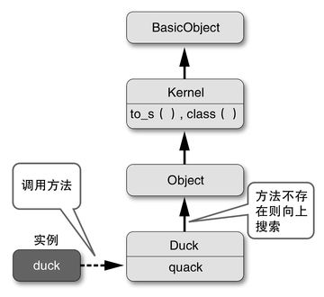
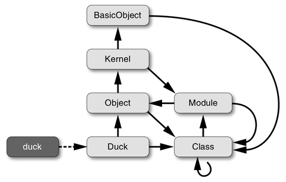
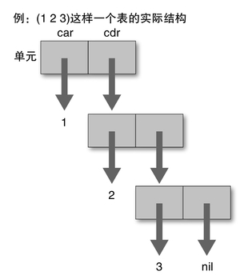
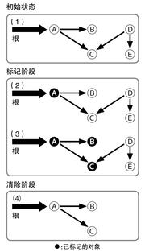
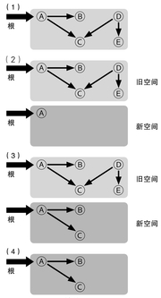
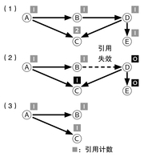
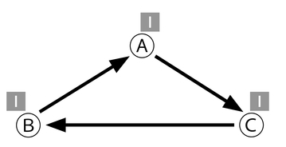
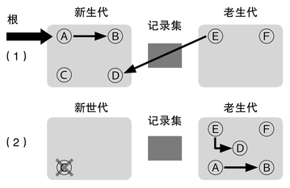
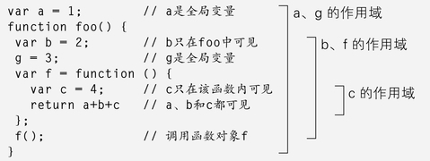

# 第二章：编程语言的过去、现在和未来

## 2.1　编程语言的世界

大家知道世界上最早的编程语言是什么吗？一般认为是1954年开始开发的FORTRAN语言。

C>

C>图1　杰卡德织机的示意图

然而，仔细想想看，到底什么才叫编程语言？如果将对机器的控制也看成是编写“程序”的话，那么编程的起源便可以追溯到杰卡德织机上面所使用的打孔纸带（图1）。

1801年，正值工业革命期间，杰卡德织机的发明使得提花编织的图案可以通过“程序”来自动完成。从前在各个家庭中也出现了自动纺织机，用于家庭作坊式的自动纺织生产，而杰卡德织机则相当于是这些家庭纺织机的放大版。我想那些自动纺织机应该也可以通过类似打孔纸带的东西来输入图案，当然，最近的年轻人恐怕都没有亲眼见过纺织机吧。

这种用打孔纸带来控制机器的想法，对各个领域都产生了影响。例如在英国从事通用计算机研发的查尔斯·巴贝奇，就在自制的“分析机”上用打孔纸带来输入控制程序。遗憾的是，由于资金和其他一些问题，巴贝奇在生前未能将他的分析机制造出来。

不过，分析机的设计已经完成，用于分析机的程序也作为文档保留了下来。协助开发这些程序的，是英国诗人拜伦之女爱达·洛夫莱斯，据说她和巴贝奇是师兄妹关系。如果不算分析机的设计者巴贝奇，那么世界上第一位程序员实际上是一位女性。为了纪念她，还有一种编程语言以她的名字Ada命名。

说点题外话，在现在的编程界中，女性人数很少这一点是有目共睹的，尤其是在开源相关的活动上，男女比例达到100比1也不稀奇。其实，在计算机早期时代，有记录表明人们大都认为程序员应该是女性从事的工作，也许是人们将程序员和当时电话交换机的接线员（从业者中也是女性居多）看成是同一类型的工作吧。

在被称为世界上第一台计算机的ENIAC（1946年）中，程序不是用打孔纸带，而是通过接电线的方式来输入的，我总觉得这是一种倒退。

不过，无论是接电线，还是打孔纸带，都不大可能实现复杂的程序，真正的程序恐怕还要等到存储程序式计算机出现之后。一般认为，世界上第一台存储程序式电子计算机，是1949年出现的EDSAC。

到了这个时候，所谓的“机器语言”就算正式问世了。当时的计算机程序都是用机器语言来编写的。那个时候不要说是编译器，连汇编器都还没发明出来呢，因此使用机器语言也是理所当然的事。

说到底，机器语言就是一串数字，将计算的步骤从指令表中查出对应的机器语言编码，再人工写成数列，这个工作可不容易。或者说，以前的人虽然没有意识到，但从我们现代人的角度来看，这种辛苦简直是难以置信。比如说，把引导程序的机器语言数列整个背下来，每次启动的时候手工输入进去；将机器语言指令表全部背下来，不用在纸上打草稿就能直接输入机器语言指令并正确运行——“古代”的程序员们留下了无数的光辉事迹（或者是传说），那时候的人们真是太伟大了。

然而有一天，有一个人忽然想到，查表这种工作本来应该是计算机最擅长的，那么让计算机自己来做不就好了吗？于是，人们用更加容易记忆的指令（助记符）来代替数值，并开发了一种能够自动生成机器语言的程序，这就是汇编器。

汇编器是用来解释“汇编语言”的程序，汇编语言中所使用的助记符，和计算机指令是一一对应的关系。早期的计算机主要还是用于数值计算，因此数学才是主宰。在数学的世界中，数百年来传承下来的“语言”就是算式，因此用接近算式的形式来编写计算机指令就显得相当方便。随后，FORTRAN于1954年问世了。FORTRAN这个名字的意思是：

FORmula TRANslator
算式　　　翻译器

也就是说，编程语言是由编程者根据自己的需要发明出来的。早期的计算机，由于性能不足、运算成本高，因此编写和维护程序都被看成是非人的工作，而编程语言正是其开始摆脱非人性的象征。

其实，由助记符自动生成机器语言的汇编器，以及由人类较易懂的算式型语句生成机器语言的编译器，当时都被认为是革新性的技术，被称为“自动编程”。此外，编译器开发技术的研究甚至被视为人工智能研究的一部分。

### 被历史埋没的先驱

一般大家都认为ENIAC是世界上第一台计算机，而FORTRAN是世界上第一个编程语言，然而，事实果真如此吗？我觉得有必要刨根问底一番。

实际上，如果仔细查阅一下计算机的历史，还是会发现一些不同观点的。

首先，世界上第一台计算机，其实应该是“阿塔纳索夫-贝瑞计算机”（Atanasoff-Berry Computer，简称ABC），这台计算机的测试机完成于1939年，远比ENIAC要早。而且，ABC在数值的表现方法上采用了现在广泛使用的二进制计算（ENIAC为十进制计算），这也是ABC的其中一个先进之处。

ENIAC甚至都不能算作是世界上第二台计算机。当时在第二次世界大战中与美国敌对的德国，开发出了一台用于土木工程计算的计算机Z3。这台计算机完成于1941年，和ABC一样，在数值表现上也采用了二进制。和由电子管组成的ABC和ENIAC不同，Z3是继电器式计算机。遗憾的是，Z3在1944年柏林轰炸中被毁。

那么，编程语言方面又如何呢？通过查阅资料发现，开发Z3的德国工程师康拉德·楚泽，于1942年至1945年间开发了一种名为Plankalkül的编程语言，比FORTRAN早了将近10年。然而，Plankalkül只是被设计出来，而没有被正式发表，而且用于该编程语言的编译器也没有被开发出来。

Plankalkül的设计直到1972年才被正式发表，而到第一个用于该语言的编译器正式实现，已经是1998年的事了。因此，如果论完整开发并能工作的编程语言，FORTRAN作为最古老编程语言的地位还是无人能够撼动。

Plankalkül由于种种原因被淹没在历史的长河中，因此它对后世的编程语言几乎没有产生影响，但是，它却考虑了如赋值语句、子程序、条件判断、循环、浮点小数计算、数组、拥有层次结构的结构体、断言、异常处理、目标搜寻等功能，其中一些甚至连10年后出现的FORTRAN都不具备，可见其先进性着实令人惊叹。

图2给出了一段Plankalkül程序，其中定义了用于对两个参数进行比较的子程序max，以及利用这个子程序进而对三个参数进行比较的子程序max3。其中所有的运算过程都被表示为“计算=>结果保存位置”这样的形式，相当有意思。

{lang="text"}
    P1 max3 (V0[:8.0],V1[:8.0],V2[:8.0]) => R0[:8.0]
    max(V0[:8.0],V1[:8.0]) => Z1[:8.0]
    max(Z1[:8.0],V2[:8.0]) => R0[:8.0]
    END
    P2 max (V0[:8.0],V1[:8.0]) => R0[:8.0]
    V0[:8.0] => Z1[:8.0]
    (Z1[:8.0] < V1[:8.0]) -> V1[:8.0] => Z1[:8.0]
    Z1[:8.0] => R0[:8.0]
    END
    
C>图2　用Plankalkül编写的程序

### 编程语言的历史

在FORTRAN之后，20世纪50年代末至80年代初，各种各样的编程语言如雨后春笋般相继出现，从而成就了一个编程语言研究飞速发展的鼎盛时期。

在这里，我们暂且抛开那些现在还健在的主流编程语言，而是将目光放在一些最近不怎么听说了，但却值得品味的编程语言上，并借此简单介绍一下编程语言的历史。

#### 1. FORTRAN

话说回来，一开始我们还是先来讲讲FORTRAN这个主流语言吧。

FORTRAN作为实质上的世界第一种编程语言，在数值计算领域建立了霸主地位。需要数值计算功能的物理学家等研究人员并不关心编程，对他们来说，计算速度有多快，是否能充分利用过去的成果，这两点才是最重要的。

从结果来看，FORTRAN非常重视和过去的程序之间的兼容性，为此，它保留了一些现在已经几乎不再使用的编码风格，其中最典型的一个例子，就是FORTRAN的语法中所包含的下面这个难以置信的规则。

在程序中空格没有意义

这个规则的意思是，空格只是为了易读才加上去的，而编译器在编译程序时会把空格全部去掉。这样的语法，以现代编程语言的习惯来看简直是匪夷所思。为什么这样说呢？例如：

{lang="fortran"}
    DO 100 I = 1,10
    
这样一行程序，它的语法和DO语句的语法是一致的，程序的意思是在循环中将从1到10的值依次赋值给变量I，当循环结束之后跳转到行号为100的语句，到这里看起来也没有什么问题。

不过，如果我将DO语句中“1,10”中的逗号错打成句点的话，会发生什么事呢？也就是说：

{lang="fortran"}
    DO 100 I = 1.10
    
我们之前已经说过，FORTRAN会忽略所有的空格，那么这个语句就会被转换为：

{lang="fortran"}
    DO100I=1.10
    
这样一来，由于这个语句不符合DO语句的语法，因此编译器会将这个语句理解为“将浮点小数1.10赋值给变量DO100I”，编号为100的那一行则被彻底忽略掉了。也就是说，本来程序的意图是要执行一个循环，现在却变成了一个赋值语句，循环也就无效了。这可以说是在语法分析相关研究相对落后的年代设计出来的编程语言所特有的悲剧。

另一方面，追求计算速度的人们依然在使用着FORTRAN，并且积累了一些十分大胆的优化技术。例如，为了最大限度利用超级计算机中装备的向量处理器，而自己改写DO循环以实现向量化等。

最近的超级计算机也几乎不再使用向量型结构，因此也很少会遇到必须使用FORTRAN的情况，使用超级计算机的研究人员更多地开始使用Java和C++之类的语言。不过，即便如此，FORTRAN也并没有要消亡的迹象。此外，FORTRAN本身也在不断进化，在最新版本中还实现了如编程抽象化、数据结构分配等功能，和其他先进编程语言相比毫不逊色。

#### 2. COBOL

COBOL这个名称是COmmon Business Orientd Language（面向商业的通用语言）的缩写，相对于面向科学计算的FORTRAN，COBOL是作为面向商务计算而出现的编程语言，于1959年被开发出来。

基于下面的推理：

* 由于是面向商业计算，因此不需要太多的算式
* 对于从事商业活动的“一般大众”来说，采用更接近日常表达方式（英语）的语法，比采用数学算式更容易理解

COBOL采用了类似英语的语法，但对于我这个日本人来说，把：

AB = A * B

写成：

MULTIPLY A BY B GIVING AB.

真的更容易理解吗？恐怕要打一个大大的问号。

不过，由于积累了大量过去的数据，COBOL直到21世纪的今天依然健在。虽然在计算机类杂志中已经看不到关于COBOL的文章，但也有说法称，COBOL依然是现在使用最广泛的一种编程语言。

实际上，在我供职的网络应用通信研究所中，有一半的技术人员是用Ruby来进行软件开发，剩下一半则是使用COBOL。不过我们用的硬件只是普通的PC服务器，操作系统用的是Linux，其他事务监视器等工具用的也都是开源软件，这倒是还挺少见的。

那么，COBOL到底好不好用呢？从像我这样没用过COBOL的人的角度来看，一定会觉得“这啥啊，跟别的程序差别太大了吧”，不过COBOL的技术人员会主张说“如果要实现把账簿里的数字从右边移到左边，即便在现在COBOL也是效率最高的”。即使排除他们已经用惯了COBOL这个因素，这个评价还是相当值得回味的。

COBOL也在不断进化，据说在最新版本中还增加了面向对象的功能。

#### 3. Lisp

Lisp和FORTRAN、COBOL一起并称为“古代编程语言三巨头”（我命名的），它的名字意思是：

LISt   Processor

表     处理器

Lisp是一种特殊的编程语言，因为它原本并不是作为编程语言，而是作为一种数学计算模型来设计的。Lisp的设计者约翰·麦卡锡设计了一种以Lambda演算为基础的“图灵完全”的计算模型，而Lisp（的起源）则是为了描述这一模型而设计出来的。

不过，麦卡锡并没有想到将其作为一种计算机语言来使用，直到他实验室的一位研究生史帝芬·罗素用IBM 704机器语言实现了描述计算模型的万能函数eval（求值函数），Lisp才作为一种编程语言正式诞生。

此外，Lisp是早期能够对数值以外的值进行处理的语言。相对于FOR-TRAN和COBOL这样只能进行数值计算的语言来说，Lisp擅长于表结构这样的非数值型处理，因此，Lisp被广泛用于人工智能这样的领域中。

在20世纪60年代，一般人还不会为了计算以外的目的使用计算机，因此Lisp主要在大学和研究所等地方传播开来。

现在的计算机对字符串处理和通信等非数值处理已经成为主流，而Lisp则是这样一个时代的先驱者。此外，因Java而广为人知的垃圾回收和异常处理等机制，实际上最初是由Lisp发明的。因此，Lisp对现在的计算机科学基础的构筑做出了极大的贡献，尽管使用者寥寥，但现在它依然是用于实用系统开发的现役编程语言。

#### 4. SNOBOL

早期的Lisp所能够处理的数据只有表和符号，并不擅长处理字符串。而一种专门用于字符串处理的语言，在历史上扮演了重要的角色，它就是SNOBOL（发音近似Snow Ball）。SNOBOL的名字意思是：

StriNg Oriented symBOlic Language 

字符串    面向    符号化   语言

其中N和BO取的位置好像很奇怪，不过别太在意就是了。SNOBOL的革新性在于它是以模板（Pattern）为中心来进行字符串处理的，可以说是现在的AWK、Perl和Ruby等语言的祖先。不过SNOBOL的字符串模板并不是正则表达式，而是采用了类似BNF（巴科斯-诺尔范式）的写法。

由这样的编程语言所积累的经验，可以说是加快了计算机向数值计算以外的方向发展的步伐。

图3展示了一段用SNOBOL的模板匹配来解N皇后问题的程序。当模板匹配时跳转到一个明确标明的标签，这样的风格现在已经不怎么见得到了。

{lang="text"}
    * N queens problem, a string oriented version to
    *   demonstrate the power of pattern matching.
    * A numerically oriented version will run faster than this.
            N = 5
            NM1 = N - 1; NP1 = N + 1; NSZ = N * NP1; &STLIMIT = 10 ** 9; &ANCHOR = 1
            DEFINE('SOLVE(B)I')
    * This pattern tests if the first queen attacks any of the others:
            TEST = BREAK('Q') 'Q' (ARBNO(LEN(N) '-') LEN(N) 'Q'
    +             | ARBNO(LEN(NP1) '-') LEN(NP1) 'Q'
    +             | ARBNO(LEN(NM1) '-') LEN(NM1) 'Q')
            P = LEN(NM1) . X LEN(1); L = 'Q' DUPL('-',NM1) ' '
            SOLVE()        :(END)
    SOLVE   EQ(SIZE(B),NSZ)             :S(PRINT)
    * Add another row with a queen:
            B = L B
    LOOP    I = LT(I,N) I + 1 :F(RETURN)
            B TEST :S(NEXT)
            SOLVE(B)
    * Try queen in next square:
    NEXT    B P = '-' X :(LOOP)
    PRINT   SOLUTION = SOLUTION + 1
            OUTPUT = 'Solution number ' SOLUTION ' is:'
    PRTLOOP B LEN(NP1) . OUTPUT = :S(PRTLOOP)F(RETURN)
    
C>图3　用SNOBOL来解N皇后问题的程序

#### 5. 数学性语言

刚才已经讲过，Lisp是由数学而诞生的编程语言，不过这样的语言可不止Lisp一个。

例如，Prolog就是一个以一阶谓词逻辑为基础的编程语言。20世纪80年代，日本政府主导的第五代计算机计划中就采用了Prolog（准确地说应该是以Prolog为基础的逻辑型编程语言），使得其名声大噪，但当第五代计算机计划逐渐淡出人们的视线之后，Prolog也随之销声匿迹了。不过，逻辑型编程语言所具备的“联合”（Unification）匹配模式，也在最近备受关注的函数型编程语言中被继承了下来。

以数学为基础的编程语言中，还有另外一个派系被称为函数型编程语言，例如ML、Haskell等就属于这一类。这一类数学性语言，比起机器的处理方式，更倾向于直接表达要表达的概念，也就是说相对于How（如何实现），更倾向于通过What（想要什么）来表达问题。这样可以不被机器的处理方式所左右，将问题抽象地表达出来，这是一种非常先进的特性。关于这一点，在后面“未来的编程语言”一节中还会进行详细介绍。

#### 6. 主流语言

众人皆知的那些编程语言就没必要特地在这里介绍了吧。作为系统描述语言的C和C++、作为面向商务的语言而如日中天的Java，以及在Web领域中十分热门的Ruby、Perl、Python、PHP等脚本语言，都属于主流语言。

这些语言在成长过程中都吸收了过去一些语言的优点，如Java的设计借鉴了C++、Smalltalk和Lisp的优点，而Ruby则是在吸收过去语言优点的基础上加以独自发展而形成的语言。

### 编程语言的进化方向

从过去编程语言的历史中，我们可以看出编程语言是在不断试错的过程中发展起来的。有很多编程语言已经消亡，仅仅在历史中留下了它们的名字，但其中所包含的思想，却被后来的语言以不同的形式吸取和借鉴。

例如，SNOBOL的字符串处理功能，可以说是现代脚本语言基本功能的祖先。此外，20世纪70年代由美国麻省理工学院（MIT）开发的一种名为CLU的语言中迭代器（Iterator）的概念，也被Ruby以代码块（Block）的形式继承了下来。

从编程语言的进化过程来看，一个显著的关键词就是“抽象化”。抽象化就是提供一个抽象的概念，使用者即便不具备关于其内部详细情况的知识，也能够对其进行运用。由于不必了解其内部的情况，因此也被称为“黑箱化”。

一些古老的编程语言，例如BASIC就没有实现充分的抽象化。虽然它提供了用于过程共享的子程序这个概念，但是子程序只能通过编号来调用，而且不能传递参数。由于“赋予名称”是抽象化的重要部分，所以说它的抽象化是不充分的。近代的编程语言中，都可以为一系列过程（程序）赋予相应的名称。

然而，仅仅将过程进行抽象化还远远不够。几乎所有的过程都需要进行一定的输入输出操作，而并不是与数据无关的。因此，在下一个阶段中，对数据进行黑箱化就显得非常重要。刚才我们提到的CLU，就是数据抽象化出现早期的一种语言。

在数据抽象化的延长线上，就自然而然产生了面向对象编程的概念。所谓对象，就是抽象化的数据本身，因此面向对象和数据抽象化之间仅仅隔了薄薄的一张纸。在现在的21世纪编程语言中，面向对象已经是常识了，最近几乎所有的语言都或多或少地提供了面向对象的能力。当然，其中也有一些语言故意不提供对面向对象的支持。

随着抽象化的不断深入，程序员即便不去关心内部的详细情况，也可以编写出程序。人类一次所能掌握的概念数量是有限的，有说法称，大部分人一次只能驾驭7±2个左右的概念。这样一来，如果能够让问题的处理方式更加抽象，也就可以解决更复杂的问题。

受摩尔定律的影响，社会对于软件也提出了越来越高的要求。人类社会越来越依赖计算机，因此就需要开发出更多更可靠、更便宜的软件。

在讲述软件开发的一本名著《人月神话》中，作者弗雷德里克·布鲁克斯写道：

无论使用什么编程语言，生产一条基本语句所需要的工数几乎是一定的。

也就是说，如果要描述同样的算法，A语言需要1000行，B语言只需要10行的话，只要采用B语言生产效率就可以提高100倍。

可能有人会觉得“这太扯了吧”。打个比方，用Java和Ruby描述同样的算法，语句行数相差2倍多也不稀奇，如果是汇编语言和Ruby相比的话，也许能产生100倍甚至1000倍的差距。

能产生这样的生产效率差异，正是抽象化的力量。抽象度高的编程语言不必描述详细过程，从而可以用简短的代码达到目的。和抽象化程度的差异相比，变量名称、有没有指定数据类型之类的都只能算是误差级别的差异而已。

### 未来的编程语言

从编程语言的进化这个视角来看，其实最近并没有什么大的动作。现在使用最广泛的编程语言几乎都是10多年前出现的，即便是比较新的Java和Ruby也是诞生于20世纪90年代后半，距离现在也已经是15年之前的事了。也许可以说，现在正是编程语言进化的好时机吧。

最近，受到CPU多核化等因素的影响，Erlang这种并行处理语言受到了不少关注。不过Erlang早在1987年就诞生了，也并不是什么新东西，有点失望呀。

那么，未来的编程语言究竟会变成什么样呢？美国风险投资家、Lisp启蒙家、作家保罗·格雷厄姆在其《一百年后的编程语言》一文中想象了100年后可能会出现的编程语言，并提议将他的观点应用到现在的编程语言中。

他主张，100年后的编程语言进化的主线，应该以少量公理为基础的“拥有最小最简洁核心的语言”。在现有编程语言中，最具有这一特征的莫过于他最喜欢的Lisp了。所以说，他的主张实际上就是说，Lisp才是100年后编程语言的进化方向。

唔，像我这样的小人物要跟他叫板好像也挺不自量力的，不过我还是认为，对于未来，应该基于从过去到现在的变化方向，并在其延长线上做出预测。当然，将来也许会发生一些无法预料的状况，从而大幅扭转之前的前进方向，不过这样的事情从定义来说本来就是无法预测的，你非要预测它，本质上也是毫无意义的。

作为一个编程语言御宅族，通过反观过去半个世纪以来编程语言的进化方向，我认为编程语言绝对不会按照保罗·格雷厄姆所说，向着“小而干净”的方向来进化。现在的编程语言，无论是功能上还是语法上都已经不是那样单纯了，虽然也曾经有人努力尝试将这些语言变得更小更简单，但包括保罗·格雷厄姆自己所设计的Arc在内，都决不能算是成功的尝试。

在我看来，编程语言的进化动机，不是工具和语言本身的简化，而是将通过这些工具和语言所得到的结果（解决方案）更简洁地表达出来。近半个世纪以来，编程语言不断提供愈发高度的抽象化特性，也正是为了达到这个目的。因此我们可以很自然地认为，这种趋势在将来也应该会继续保持。

基于上述观点，如果要我来预测100年后编程语言的样子，我认为应该会是下面三种情况的其中之一：

（1）变化不大。编程语言的写法从20世纪80年代开始就几乎没有什么进化，今后即便出现新的写法，也只是现有写法的变形而已。（从发展上来看，是比较悲观的未来）

（2）使用编程语言来编程这个行为本身不存在了。人类可以通过和计算机对话（大概是用自然语言）来查询和处理信息。（类似《星际迷航》中的世界，对于编程语言家来说是比较失落的未来）

（3）发明了采用更高抽象度写法的编程语言。这种语言在现在很难想象，不过应该是比现在更加强调What，而对于如何解决问题的How部分的细节，则不再需要人类去过问。（难以预测的未来）

当然，上面的预测也只不过仅仅是预测而已，有可能与未来的实际情况大相径庭，或者说，与实际大相径庭的可能性比较大吧。不过话说回来，100年后我也已经不在这个世上了，这不是白操心嘛。

### 20年后的编程语言通

过对100年后的预测，我们明白了“预测100年后的事情是非常困难的”。想想看，100年前连飞机还没有民用化呢，100年后我已经可以坐在飞机上舒舒服服地写这本书的稿子了，这足以说明，要想象社会的变化是相当困难的。

那么，更近一点的未来又怎么样呢？比如说20年后。20年前，日本刚刚改年号为平成，现在和那个时候相比，印象中社会应该没有发生非常极端的变化。计算机的性能等方面确实有了长足的进步，不过发展趋势还是连续的，并非无法预测。对于20年后的未来，我想应该可以根据现在的发展趋势来做出判断。

个人认为，这么短的时间内，编程语言本身应该不会发生多大的变化。实际上，现在使用的很多语言，在20年前就已经存在的。因此我预计，20年后的语言，应该是在分布处理（多台计算机协作处理）和并行处理（多个CPU协作处理）功能上进行强化，使得开发者不需要特别花心思就能够使用这些功能。

之所以要关注分布处理和并行处理，是因为今后个人也可以通过云计算的形式使用到比现在更多的计算机，而随着每台计算机的CPU多核化，就相当于安装了更多的CPU，这些情形都是很容易想象的。

不过，我认为现在的线程、RPC（Remote Procedure Call，远程过程调用）等显式地使用分布处理和并行处理的形式，早晚会遇到瓶颈。当核心数量超过数千个的时候，显式指定就变得毫无意义了，调试起来也会变得非常痛苦。我期待在20年后，能够出现突破这种局限的技术，即无需显式操作就可以实现分布处理和并行处理。

### 学生们的想象

几年前，我曾经在母校筑波大学开展过一次关于编程语言的集中讲座。在讲座中我给学生们出了“想象一下20年后的编程语言”这样一个题目，并在讲座最后一天提交报告。很有意思的是，大多数学生并没有做出我上面所说的关于分布处理和并行处理之类的技术性预测，而是提出了诸如“让编程变得更简单的语言”、“希望用自然语言来控制计算机”之类的想象。通过这些答案，似乎可以看出他们平常为了完成编程作业而被折磨得何等痛苦。

不过，这样的答案中，也许也蕴含着真理。近年来，编程语言似乎越来越难以脱离IDE（Integrated Development Environment，集成开发环境）而单独拿出来说了。对于Ruby也总有人问“没有IDE吗？”之类的问题，当然，好消息是最近Eclipse和NetBeans已经支持Ruby了。

有点跑题了。总之，未来的编程语言可能不会像过去的编程语言那样，让语言本身单独存在，而是和编辑器、调试器、性能分析器等开发工具相互配合，以达到提高整体生产效率的目的。话说，那不就是Smalltalk吗？

唔，历史是否会重演呢？

## 2.2　DSL（特定领域语言）

下面，我们来介绍一些值得关注的编程语言功能。首先我们从DSL（Domain Specific Language，特定领域语言）开始说起。

所谓DSL，是指利用为特定领域（Domain）所专门设计的词汇和语法，简化程序设计过程，提高生产效率的技术，同时也让非编程领域专家的人直接描述逻辑成为可能。DSL的优点是，可以直接使用其对象领域中的概念，集中描述“想要做到什么”（What）的部分，而不必对“如何做到”（How）进行描述。

例如，有一个名为rake的编译工具，它是用Ruby编写的。这个工具的功能跟make差不多，它会分析文件的依赖关系，并自动执行程序的编译、连接等操作。其中描述依赖关系的Rakefile就是使用了Ruby语法的一种DSL。图1就是Rakefile的一个简单的例子。

{lang="text"}
    task :default => [:test]
    task :test do
        ruby "test/unittest.rb"
    end

C>图1　Rakefile示例这个例子表达了下面两个意思：

这个例子表达了下面两个意思：

（1）默认任务为test

（2）test的内容是执行test/unittest.rb

启动rake命令的格式是：

rake 任务

如果这里的任务省略的话，则执行default任务。

在Rakefile对于依赖关系的描述中只是指定了task，而对于内部数据结构是怎样的，以及维持依赖关系要如何实现等等具体问题都无需涉及，因为具体的实现方式，与描述依赖关系这个对象领域（Domain）是无关的。

DSL这个对特定目的小规模语言的称呼，是最近才出现的比较新的叫法，但这种方法本身却并不是什么稀罕的东西，尤其是UNIX社区中就诞生了许多用来解释像这样的“专用语言”的工具。

其中，以行为单位进行文本处理的脚本语言awk算是比较有名的，除此之外，UNIX中还开发了很多“迷你语言”，比如用来描述依赖关系的Makefile和用来读取它的make命令、以行为单位进行数据流编辑的sed命令、用来描述文档中嵌入图像的pic命令，用来生成表格的tbl命令等等。此外，为了对这些迷你语言的编写提供支持，UNIX中还提供了语法分析器生成工具yacc，以及词法分析器生成工具lex，而yacc和lex本身也拥有自己的迷你语言。

这些迷你语言，几乎都是专用于特定用途的，大多数情况下无法完成复杂的工作，但它们都能够比简单的配置文件描述更多的内容，并为命令的处理带来了更大的灵活性，因此和DSL在本质上是相同的。

### 外部DSL

像以这些迷你语言为代表的，由专用的语言引擎来实现的DSL，称为外部DSL。UNIX的迷你语言文化是先于DSL出现的，但并非只有UNIX才提供外部DSL。

在Java编写的应用程序中，大量使用了由可扩展标记语言（XML）编写的配置文件。这种XML配置文件也是外部DSL的一种形式。此外，数据库访问所使用的SQL（Structured Query Language，结构化查询语言）也是一种典型的外部DSL。

外部DSL的优点，在于它是独立于程序开发语言的。对于某个领域进行操作的程序，不一定是用同一种语言来编写的。例如，用来对数据库进行操作的程序，有时可以用Ruby来开发，有时也可以用PHP或者Java来开发。由于外部DSL是独立于程序开发语言的，因此可以实现跨语言共享。只要学会了SQL，就可以在不同的语言中，用相同的SQL来进行数据库操作。

正则表达式的使用方法也差不多。正则表达式是用来描述字符串模板的一种外部DSL，在Ruby、Perl、PHP、Python等很多语言中都可以使用，其语法在不同的语言中基本上都是通用的。这样的好处是，在不同的语言中都可以使用字符串模板匹配这一通用功能。

此外，外部DSL实际上是全新设计的语言和语言引擎，因此可以根据它的目的进行自由的设计，不必被特定的执行模块和现有语言的语法所左右。由于自由度很高，在特定领域中能够大幅度提高生产效率。

也许大家认为设计和实现一种语言是非常辛苦的工作，但如果规模不是很大的话，实际上也没有那么难。以名著《UNIX编程环境》为首的许多书籍中，都以迷你语言的制作作为例题，其核心部分只要几页的代码就可以完成。

然而，高度自由的设计也是一把双刃剑，这意味着程序员为了使用DSL必须学习一门全新的语言。像SQL这样作为数据库访问的通用方式已经实现普及和标准化的语言还好，如果为了每一种目的都要从零开始学习一门完全不同的语言，这样的辛苦可不是闹着玩的。

### 内部DSL

和外部DSL相对的自然就是内部DSL了。外部DSL是从UNIX中脱胎发展而来的，而内部DSL则是发源于Lisp和Smalltalk的文化之中。

内部DSL并不是创造一种新的语言，而是在现有语言中实现DSL，而作为DSL基础的这种现有语言，称为宿主语言。从原理上说，宿主语言可以是任何编程语言，不过还是有适合不适合之分。Lisp、Smalltalk、Ruby这些语言适合作为DSL的宿主语言，因此在这些语言的社区中经常使用内部DSL。

内部DSL的优点和缺点和外部DSL正好相反。也就是说，内部DSL是“借宿”在宿主语言中的，它借用了宿主语言的语法，因此程序员无需学习一种新的语言。在理解内部DSL含义时，宿主语言的常识依然有效，而学习新语言时，宿主语言的知识也会成为不错的航标。

之前我们举过rake命令的Rakefile这个例子，这就是一种内部DSL。图1中显示的Rakefile代码，是用来为rake命令描述编译规则的DSL代码，但同时它也是一段Ruby程序。

内部DSL还有其他一些优点。当用DSL编写复杂的逻辑时，可以使用过程定义、条件分支、循环等作为通用语言的宿主语言所具备的全部功能。从某种意义上说，它就是万能的。

此外，“寄生”在宿主语言上面，就意味着DSL的实现会相对容易。一种迷你语言的实现再怎么简单，和在宿主语言基础上增加一些功能就能够实现的内部DSL相比，都只能甘拜下风了。

说到内部DSL的缺点，由于DSL的语法被限定在宿主语言能够描述的范围内，因此自由度比较低。不过，自由度低换来了较好的易读性，何况像Lisp这样具备高性能宏功能的语言中，即便是内部DSL（以一定的易读性为代价）也可以实现相当高的自由度。

我的个人观点是，从易读性和实现的容易性来看，内部DSL具备更多的优势。

### DSL的优势

那么DSL有哪些优势呢？为什么DSL近年来如此备受关注呢？

这是因为DSL在几个方面上可以说掌握了提高生产效率的关键。DSL拥有为特定领域所设计的词汇，可以在高级层面上编写程序。由于不需要编写多余的部分，因此就节约了程序开发的时间。

此外，使用DSL可以让程序在整体上以更简洁的形式进行表达，这意味着无论是写程序还是读程序的成本都降低了，同时也意味着对于非编程专家的一般人来说，编程的大门正向他们敞开。

很多人觉得编程很难，但如果自己的专业领域中有适用的DSL的话，情况就不同了。如果可以将想让计算机完成的任务直接描述出来，也许就可以减少与程序员交流的成本，从而实现生产效率的提高。这才是DSL备受关注的一个最大的理由。

仔细想想就会发现，不涉及对象领域的内部详细，而是在高级层面上进行描述，这就是近半个世纪以来编程语言进化的方向——抽象化。也就是说，DSL，尤其是内部DSL，也许就是由抽象化的不断推进所引领的编程语言未来发展的方向之一吧。

### DSL的定义

谈到DSL，大家总是热衷于讨论到底怎样算是DSL。关于什么是DSL，什么不是DSL，并没有明确的定义和标准。

有一种观点认为，像“是否具备仅用于特定用途的功能”、“（设计者）自己是否将其命名为一种DSL”等可以作为判断的标准，但实际上这些标准也是非常模棱两可的。

尽管如此，考虑到DSL实际上是编程语言抽象化的延伸，那么问题就不应该是什么是DSL、什么不是DSL，DSL应该是将面向特定领域的API设计成优秀的DSL这样一个设计的过程。

据说，在诞生了UNIX的AT&T贝尔实验室中有一句名言：库设计就是语言设计（Library design is language design）。我们在思考编程语言的时候，大多仅强调语法，但如果脱离了相当于词汇的库、类和方法，语言也就无从思考。

也就是说，*API*（*Application Programming Interface*，应用程序编程接口）也是构成编程语言的一个重要要素。向一种语言添加库，也就相当于在设计一种“新增了一些词汇的规模更大一点儿的语言”。我们可以通过“编程达人”大卫·托马斯的这句话理解这一过程：

*Programming is a process of designing DSL for your own application.*

（编程就是为自己的应用程序设计DSL的过程）

应用程序开发，可以理解为是将库等组件设计成针对该应用程序对象领域的DSL，最后再进行整合的过程。这样编写出来的应用程序，其代码的抽象度高，应对未来修改的能力强，一定是一个不错的应用程序。

因此，DSL并不仅仅是一种技术，而是应用程序开发的重要设计原理和原则之一，可以说适用于任何软件的开发。在设计API时，如果能像“设计一种新的DSL”一样进行设计的话，感触应该会变得不同吧。

### 适合内部DSL的语言

正如刚才所说的，在UNIX文化中，由若干单一目的的小工具所组成的“工具箱系统”是主流，Linux也继承了这一点。UNIX中的各种迷你语言，作为组成工具箱的零部件，同时也作为为特定目的专用的外部DSL，不断发展壮大起来。

不过，在现代UNIX文化也受到了很多来自外部的影响。例如，现在典型的UNIX文本编辑器Emacs，其起源与其说是来自UNIX，不如说是来自美国麻省理工学院（MIT）的Lisp文化。它的开发者理查德·斯托曼本来就是一位MIT出身的Lisp黑客，因此这也是理所当然的吧。此外，从Perl到Ruby的这些脚本语言中，并不是采用小工具组合起来的方式，而是提供多功能可编程的工具，从这一点上看，也是受到了Lisp文化的影响。近年来内部DSL的备受关注，和这个倾向也不能说没有关联。

那么，什么样的语言适合用作内部DSL的宿主语言呢？虽然任何语言都可以成为宿主语言，但像Lisp、Smalltalk、Ruby这样被认为适合DSL的语言，都拥有一些共同的特征。

首先是简洁。由于DSL本来就是为了将针对特定目的处理用高级的、简洁的方式进行描述，因此简洁的描述方式才是最本质的。从这个意义上来讲，语言简洁是作为DSL宿主语言不可或缺的要素。Lisp和Ruby等语言中，无需在程序中声明数据类型，编译器的“规矩”也比较少，因此能够让程序变得简洁。

作为宿主语言的另一个重要特征就是灵活性。在DSL中，开发者会通过高度抽象化的代码来集中描述What，而不是How，因此作为对抽象化的支持，元编程等功能也最好比较充实。

此外，Lisp具备宏（Macro）功能，只要遵循“用括号进行表达”的S表达式语法，就可以实现相当自由的表达。因此可以说Lisp语言本身就是一种可被编程的语言。

另一方面，Ruby中的代码块（Block）功能可以实现控制结构。代码块虽然不像Lisp的宏那样万能，但用来实现内部DSL还是足够了。

让我们再回头看看图1中Rakefile的示例。在Rakefile中定义了一个名为task的方法，任务的名称则作为参数通过符号（Symbol）来指定。当这里定义的test任务被执行时，代码块就会被求值。像这样，在Ruby中通过使用代码块，就可以表达一种控制结构。

Rakefile的代码之所以看上去很简洁，是因为Ruby的语法就是以这样的宗旨进行设计的。相比语法的单纯性来说，Ruby更加重视程序的可读性，其语法也是以此为先决条件而确定的。

例如，调用方法时参数周围的括号是可以省略的，还可以通过代码块将整个一块代码作为参数传递给一个方法。如果说Ruby的语法追求的是没有任何冗余性的“简单”的话，那么图1的Rakefile代码就会变成图2这个样子。这样的语法虽说非常简单，但绝对算不上是易读和易写的。

{lang="ruby"}
    task(:default => [:test])
    task(:test, &lambda(){
        ruby("test/unittest.rb")}
    )

C>图2　Rakefile示例

那么，如果是一种不具备Lisp和Ruby这样简洁性和灵活性的语言，例如Java，是不是就不可能用作内部DSL呢？的确，像Java这样的语言，由于必须要指定数据类型，代码容易变得非常繁杂，而且语法的自由度也不高，要实现像Lisp和Ruby一样的内部DSL是非常困难的。然而，以代码重构而闻名的马丁·福勒则提出，通过“流畅接口”（Fluent interface）的方式，像Java这样的语言是不是也能够实现内部DSL一样的功能呢？图3就是他所展示的流畅接口的示例。

{lang="java"}
    private void makeOrder(Customer custome {
        customer.newOrder()
            .with(6, "TAL")
            .with(5, "HPK").skippable()
            .with(3, "LGV")
            .priorityRush();
    }

C>图3　用Java编写的流畅接口（fluent interface）

图3中的代码定义了一张顾客（Customer）的订单。在订单中，包含了商品及其数量的订购明细。某些情况下，为了避免整张订单延迟发货，可以从订单中去掉某些货品，先将剩下有货的货品发出来，因此在这里的明细中，有些货品被定义为“赶不上货期的话可以跳过”。整张订单的状态被设定为“加急”。图3整个代码的含义是定义了如下这样一张订单：

* TAL，6个
* HPK，5个（可跳过）
* LGV，3个
* 加急

流畅接口中运用了方法链（Method chain），作为Java来说这种表达方式是前所未有的简洁。如果用以前“更像Java的风格”来表达的话，就会变成图4这样。

{lang="java"}
    private void makeOrder(Customer customer) {
        Order o1 = new Order();
        customer.addOrder(o1);
        OrderLine line1 = new OrderLine(6, Product.find("TAL"));
        o1.addLine(line1);
        OrderLine line2 = new OrderLine(5, Product.find("HPK"));
        o1.addLine(line2);
        OrderLine line3 = new OrderLine(3, Product.find("LGV"));
        o1.addLine(line3);
        line2.setSkippable(true); 
        o1.setRush(true);
    }

C>图4　Java标准风格的接口

简洁性和易读性的区别一目了然。虽然流畅接口在Java社区还没有普及，不过这种设计思路在今后是非常值得期待的。

### 外部DSL实例

内部DSL代表了编程语言进化的一种形态，作为编程爱好者，我自然对其兴趣颇深，但在这里，我还想再谈谈外部DSL。

刚才已经讲过，外部DSL就是拥有专用引擎的一种独立的特定领域语言，不过外部DSL也有各自不同的实现水平。

最简单的一种莫过于配置文件和数据文件了吧。例如YAML、JSON等语言，就是为了“将对象（用对人类易读的形式）描述出来”这一特定目的而设计的外部DSL（图5）。

{lang="json"}
    [
       {
           "name": "松本行弘",
           "company": "NaCl",
           "zipcode": "690-0826",
           "address": "松江市学园南2-12-5",
           "tel": "0852-28-XXXX"
       }
    ]
    ---

C>图5　外部DSL JSON中对数据的表达方式

而更复杂的一些DSL，虽然也是为特定目的而设计，但却可以编写出描述任意算法的程序。例如用于文本处理的awk等，就属于这种水平。awk程序的基本结构是从文件中以行为单位读取字符串，同时它具备每读取一行之后将字符串分割成字段等等这样的文本处理专用功能。这些功能明显是属于DSL，但另一方面，它也并不是不能编写出文本处理范围以外的程序。再举一个例子，用于向打印机描述页面的DSL PostScript，也是一种基于逆波兰记法的图灵完全（拥有完整计算能力的）语言。

另外还有一种比较特殊的，虽然它本身是一种通用语言，叫做DSL并不十分合适，但这种语言却与特定计算模型之间拥有很强的关联性，也就具备了很强的类似DSL的性质。例如Prolog，它是一种以一阶谓词逻辑为基础的语言。Prolog可以被认为是面向谓词逻辑这一特定领域的DSL，但将谓词逻辑这个适用范围称作“特定领域”似乎未免太宽泛了，因此一般情况下人们也不会将Prolog称作DSL。同样地，与用于并行计算的Actor模型密切相关的Erlang等语言，虽然是一种通用语言，但它同时也具备“面向并发编程领域的DSL”这一性质。

让我觉得比较有意思的是Java中所使用的XML。由于Java中默认内置了用于解析XML的库，因此如果用XML来编写DSL的话，就可以很容易地被程序读取。这样一来，基本上就可以省却为DSL开发语言引擎的步骤了。

通过这样的方式，我们可以用XML这一通用的、不被特定目的限制的语法，很容易地创造出新的外部DSL，我认为这是一种非常高效的方式。只不过，XML文件的内容是通过标签来描述的，看起来十分冗长，无论是阅读还是编写，对用户来说都不是很友好，这一点算是一个遗憾吧。

### DSL设计的构成要素

曾经在诸多Ruby相关活动中发表过演讲的著名Rubyist——GlennVanderburg认为，构成一种优秀的（内部）DSL的要素包括下列5种：

* 上下文（Context）
* 语句（Sentence）
* 单位（Unit）
* 词汇（Vocabulary）
* 层次结构（Hierarchy）

其中的上下文，用来针对DSL中每个单独的语句，规定其所拥有的含义。也许有人认为：“用参数的方式进行显式指定不就好了吗？”不过大家别忘了，DSL的宗旨是进行简洁的描述，如果每次都通过参数来反复指定上下文的话，程序必定会变得冗长。

请看图6中的程序。这是用描述测试用的库shoulda来编写的测试程序，它也是一种以Ruby为基础的内部DSL。

{lang="ruby}
    class UserTest < Test::Unit::TestCase
      context "a User instance" do
        setup do
          @user = User.find(:first)
        end

        should "return its full name" do
          assert_equal 'John Doe', @user.full_name
        end
      end
    end

C>图6　shoulda编写的测试程序

在图6的例子中，context方法和should方法就定义了上下文。顾名思义，context方法的作用就是定义上下文，它表示这个测试项目的一个大的框架，而上下文的范围是通过指派给context方法的代码块来定义的。因此：

*context "a User instance" do*

就表示“对a User instance这个上下文的测试进行定义”的意思。

should方法则定义了“需要满足某个条件”这样一个测试。当指派给should方法的代码块所描述的测试成功时，则视为满足该测试的条件。should方法所定义的测试，和外部的上下文结合起来，就定义了“a User in-terface should return its full name”（用户界面应当返回其全名）这一软件的行为。

这样的方式与其说是测试，不如说是定义了软件所应该具有的行为（Be-havior），因此更多的情况下人们不会将其称为测试，而是称为规格（Spec）。此外，在软件开发之前就设计好规格的开发手法，通常不是叫做测试驱动开发，而是叫做行为驱动开发（Behavior Driven Development，BDD）。

说完了上下文，下一个DSL的构成要素是“语句”。语句也就是上下文中每条独立的代码，在内部DSL中实现函数和方法的调用。

貌似英语圈的人总是把让语句尽可能看起来接近英语这一点看得很重要。DSL的优点之一，就是让并非专家的普通人也能够使用，因此，为不太懂编程的人降低点门槛，这样所带来的好处也是可以理解的。不过，作为我来说（也是因为我英语不是很好的缘故吧），我觉得看上去像英语并不是DSL的本质，不过还是有很多人执着于这一点。

在几年前的一次Ruby大会中有一个以DSL为主题的段落，讲的内容基本上都是围绕着“在Ruby语法的范围内到底能设计出多接近英语的DSL”这个话题，从各种角度来说都让我觉得很有意思。例如，如果你问我，一个用来描述面包做法的DSL写成像图7这样好不好，说实话我还真没有什么自信。

{lang="ruby"}
    recipe "Spicy Bread" do 
      add 200.grams.of Flour  # 加入200克小麦粉  
      add 1.lsp.of Nutmeg     # 加入一大勺肉豆蔻  
      #继续……
    end

C>图7　描述面包做法的DSL

是接近自然语言，作为外行人就越容易纠结在一些微妙的差异上，例如到底要在哪里加上符号，顺序能不能调换等等。我觉得这正是COBOL曾经经历过的坎坷，但英语圈的人们却似乎有着不同的感触和理解。

接下来的一个要素是单位，也就是在图7的例子中出现的克（grams）、大勺（lsp）等等。

由于在Ruby中可以在已有的类中自由添加新的方法，利用这一点，在上面的例子中实际上是在整数类中定义了grams方法和lsp方法。

我第一次见到这样的扩展功能，是在Ruby on Rails所包含的Ac-tiveSupport库中。当时我看到“现在时间的20小时之前”居然能够写成“20.hours.ago”的时候感到非常震惊。实际上，是整数类中的hours方法对20.hours这一调用返回了72000（3600秒×20）这个值，而ago方法又返回了表示该秒数之前这一时刻的一个Time对象而已。

这样看来，Rails不仅是一种Web应用程序框架，同时也可以说是以Web应用程序开发为对象领域的，以Ruby为基础的内部DSL。

Glenn Vanderburg所说的另外两个要素就是词汇和层次结构。前者的意思是，为目的领域定义了多少适用的方法，对必要方法的自动生成功能也包含在内。

例如，在Rails中，如果数据库的users表中包含name这一属性的话，那么就可以进行这样的调用：

{lang="ruby"}
    User.find_by_name("松本")

其中find_by_name方法就是自动生成的。

层次结构可以理解为嵌套的上下文。

Vanderburg举了图8这样的一个例子。这是使用XmlMarkup库的一个例子，将Ruby作为一种DSL来生成XML，看起来可能比XML的代码要易读易写得多。由图8的代码，用XmlMarkup所生成的XML文件的内容如图9所示。

{lang="ruby"}
    xml = Builder::XMLMarkup.new
    xml.html {  
      xml.head{    
        xml.title("History")
      }
      xml.body {
        xml.h1("Header")
        xml.p("paragraph")
      }
    }

C>图8　用XmlMarkup这一DSL来生成XML

{lang="html"}
    <html>
      <head>
        <title>History</title>
      </head>
      <body> 
        <h1>Header</h1>   
        
paragraph
 
      </body>
    </html>

C>图9　XmlMarkup所生成的XML

### Sinatra

我觉得Rails具备DSL的性质并不是有意为之，而是“为提高生产效率而追求抽象化而水到渠成的结果”，但比Rails更新的Web应用程序框架中，出现了一些明显对DSL有所意识的项目，其中的代表就是Sinatra。

Sinatra是定位于较小规模Web应用程序的框架，用Sinatra编写的用来显示“Hello, world!”字符串的应用程序如图10所示。对于Web浏览器传送过来的“get /”请求应当如何响应，正是用DSL的形式来表达的。这种十分简洁的表达方式，以及应用了上下文和语句的代码风格，和Rakefile、shoulda这些以Ruby为基础的内部DSL可以说是有异曲同工之妙。

{lang="ruby"}
    # hello_world.rb
    require 'sinatra'

    get '/' do  
      "Hello world, it's #{Time.now} at the server!"
    end

C>图10　用Sinatra编写的Web版Hello World

### 小结

DSL是在Ruby界备受关注的一种方式，或者可能有点红过了头。DSL这个称呼虽然只是最近才出现的，但实际上它已经是从数十年前开始就已经在使用的技术了。

不过，正如通过给一种设计模式起个名字能够提高其认知度，从而让更多的人来使用它一样，DSL也可能因为被赋予了这个名字而获得了广泛的认知，从而对编程生产效率的提高做出贡献。今后，DSL也可能作为判断设计优秀与否的重要指标，对软件开发产生巨大的影响。

## 2.3　元编程

在Ruby界中，元编程再度成为一个热点话题。Ruby on Rails等框架中，其生产性就是通过元编程来实现的，这一点其实已经是老生常谈了。不过，《Ruby元编程》一书于2010年由ASCII Media Works出版了日文版，因此貌似有很多人是通过这本书才重新认识元编程的。

在2010年的RubyKaigi上，有幸请到了《Ruby元编程》一书的作者Paolo Perrotta来日本演讲，我跟他也简单聊了聊，他好像并没有Lisp的经验，这令我感到非常意外。那么我们就一边参考作为原点的Lisp，一边来重新审视一下元编程吧。

### Meta, Reflection

“元”这个词，是来自希腊语中表示“在……之间、在……之后、超过……”的前缀词meta，具有超越、高阶等意思。从这个意思引申出来，在单词前面加上meta，表示对自身的描述。例如，描述数据所具有的结构的数据，也就是关于数据本身的数据，被称为元数据（Metadata）。再举个比较特别的例子，小说中的角色如果知道自己所身处的故事是虚构的，这样的小说就被称为元小说（Metafiction）。

综上所述，我们可以推论，所谓元编程，就是“用程序来编写程序”的意思。那么，用程序来编写程序这件事有什么意义吗？

像C这样的编程语言中，语言本身所提供的数据，基本上都是通过指针（地址）和数值来表现的。在语言层面上虽然有数组和结构体的概念，但经过编译之后，这些信息就丢失了。

不过，“现代派”的语言在运行的时候，还会保留这样一些信息。例如在C++中，一个对象是知道自己的数据类型的，通过这个信息，可以在调用虚拟成员函数时，选择与自己的类型（类）相匹配的函数。在Java中也是一样。

像这样获取和变更程序本身信息的功能，被称为反射（Reflection）。将程序获取自身信息的行为，用“看着（镜子中）反射出的身影来反省自己”这样的语境来表达，听起来还挺文艺的呢。

和Java、C++等语言相比，在Ruby中大部分信息都可以很容易地进行访问和操作。作为例子，我们从定义一个类并创建相应的对象开始看。

{lang="ruby"}
    class Duck
      def quack
        "quack"  
      end
    end
    duck = Duck.new

我们用class语句定义了一个名为Duck的类。在Ruby中，类也是一个普通的对象，也就是说：

{lang="ruby"}
    duck = Duck.new

表示调用Duck类这个对象中的new方法，而new方法被调用的结果，就是生成并返回了一个新的Duch类的实例。

在生成出来的实例中，包含有作为其“母版”的类的信息，这些信息可以通过调用class方法来查询。

{lang="text"}
    duck.class # => Duck

当调用实例（即对象）的方法时，实例会去寻找自己的类。

{lang="text"}
    duck.quack # => "quack"

换句话说，当调用duck的quack方法时，首先要找到duck的类（Duck），然后再找到这个类中所定义的quack方法。于是，由于Duck类中定义了quack方法，因此我们便能够调用它了。

Duck类中定义的方法只有quack一个，我们来确认一下。调用类的instance_methods方法可以得到该类中定义的方法一览。

{lang="text"}
    Duck.instance_methods(false)
    # => [:quack]

参数false表示仅显示该类中定义的方法。如果不指定这个参数，Duck类会将从它的父类（超类）中继承过来的方法也一起显示出来。

在调用方法时，如果这个方法没有在类中定义，则会到超类中去寻找相应的方法。举个例子，请看下面的代码。

{lang="text"}
    duck.to_s # => "#<Duck:0xb756ed2c>"

由于Duck类中并没有定义to_s方法，因此要到Duck类的超类中去寻找。可是，Duck类的超类又是什么呢？在定义Duck类的时候我们并没有指定超类。

这样的信息，问问Ruby就能获得最准确的答案。用ancestors方法就可以得到相当于该类“祖先”的超类一览。

{lang="text"}
    Duck.ancestors# =>
    [Duck,Object,Kernel,BasicObject]

从这里我们可以看出，Duck类的超类是Object类。在class语句中如果不指定超类的话，则表示将Object类作为超类。

那么，to_s是否在Object类中进行了定义呢？

{lang="text"}
    Object.instance_methods(false)
    # => []

咦，Object类中一个方法都没有定义。其实，像to_s这样所有对象都共享的方法，是在其上层的Kernel模块中进行定义的。

到此为止，对象的结构如图1所示。因此，在Ruby中，即便是像类这样的元对象，也可以像一般的对象一样进行操作。不对，“像……一样”这个说法还不准确，在Ruby中，类和其他的对象是完全相同的，没有任何区别。

C>

C>图1　对象结构图（Ver.1）

### 类对象

可是，如果说类和其他的对象完全没有任何区别的话，那么类的类又是什么呢？我们还是来问问Ruby吧。

{lang="text"}
    Duck.class # => Class

也就是说，在Ruby中有一个名叫Class的类，所有的类都可以看做是这个Class类的实例。有点像绕口令呢。

再刨根问底一下，如果所有的类都是Class类的实例，那么Class类的类又是什么呢？

{lang="text"}
    Class.class # => Class

Class类的类居然是Class，也就是它自己本身，这真是出乎意料呢。我们再来看看Class的超类又是什么吧。要查看类的直接上一级父类，可以使用superclass方法。

{lang="text"}
    Class.superclass # => Module

原来Class的超类是Module呢，而Module的超类则是Object。

{lang="text"}
    Module.superclass # => Object

将上面所有的信息综合起来，更新之后的对象结构图如图2所示。像这样，就可以直观地看到Ruby中对象和类所具有的层次结构了。

C>

C>图2　对象结构图（Ver.2）

### 类的操作

不过，即便说类也是一种对象，但类的定义和方法的定义都有专用的“语法”，很难消除这种Ruby独有的特殊印象。我们来看看上面讲过的Duck类的定义。

{lang="ruby"}
    class Duck  
      def quack
        "quack" 
      end
    end

其实，和Ruby的其他部分一样，通过方法的调用也可以实现同样的操作。

{lang="ruby"}
    Duck = Class.new do
      define_method :quack do
        "quack"
      end
    end

怎么样？“先创建一个Class类的新实例，然后赋值给Duck常量”，“对quack方法进行定义”，通过这样的步骤，是不是有更直接的感触呢？不过，这种写法可实在算不上是易读，我也不会推荐大家这样写，这种写法只是能够帮助你更直观地理解“Ruby的Class也完全是一个普通的Ruby对象”这一概念而已。好，我们来仔细看看define_method的部分。上面代码中的第2行到第4行内容，和下面的def语句是等同的。

{lang="ruby"}
    def quack
      "quack"
    end

不愧是有专用语法的def，代码就是简洁。这里的define_method方法所执行的具体操作如下。

* 以参数的方式接收表示方法名的符号（:quack）
* 以代码块的形式接收方法的定义部分

运行这个方法的实体又是什么呢？先透露一下答案吧，运行这个方法的主体就是Duck类。在方法定义的部分（class的代码中、Class.new的代码块中）中，self所表示的是现在正在被定义的类。在这样的定义中，类就可以通过调用define_method方法来向自身添加新的方法。

不过，肯定有人会说，用这种比def更加冗长的方法到底有什么意义呢？因为通过调用方法来定义方法，可以为我们打开新的可能性。

例如，假设在某种情况下需要定义foo0～foo99这样100个方法，在程序中写100个def语句实在是太辛苦了。如果是Java的话，通过代码生成器，也许可以用不着真的看到那100个方法的定义。而在拥有define_method的Ruby中，我们用下面这样简单的程序就可以定义100个方法。

{lang="ruby"}
    100.times do|i|
      define_method("foo#{i}") do
        ...
      end
    end

用一个循环来代替100个定义，这才是define_method真正的用武之地。

这个方法中self表示现在正在定义的类，利用这一性质，在Ruby中可以实现各种各样的操作。例如：

* 指定要定义的方法在怎样的范围内可见（public, protected, private）
* 定义对实例变量的访问器（attr_accessor, attr_reader, attr_writer）

像这样，本来属于“声明”的内容，通过调用方法就可以实现，这一点是Ruby的长处。

### Lisp

拥有这方面长处的语言并不只有Ruby，Lisp可以说是这种语言的老祖宗。Lisp的历史相当悠久，其诞生可以追溯到1958年。说起1958年，在那个时候其他的编程语言几乎都还没有出现呢。在那个时代已经存在，并且现在还依然健在的编程语言，也就只有FORTRAN（1954年）和COBOL（1959年）而已了吧。Lisp作为编程语言的特殊之处，在于它原本并不是作为一种编程语言，而是作为一种数学计算模型设计出来的。Lisp的设计者约翰·麦卡锡，当时并没有设想过要将其用作一种计算机语言。麦卡锡实验室的一名研究生——史蒂芬·罗素，用IBM 704的机器语言实现了原本只是作为计算模型而编写的万能函数eval，到这里，Lisp才真正成为了一种编程语言。

Lisp在编程语言中可以说是类似OOPArts一样的东西。编程语言的历史是由机器语言、汇编语言开始，逐步发展到FORTRAN、COBOL这样的“高级语言”的。而在这样的历史中，作为最古老语言之一的Lisp，居然一下子具备了超越当时时代的很多功能。

1995年Java诞生的时候，虚拟机、异常处理、垃圾回收这些概念让很多人感到耳目一新。从将这些技术普及到“一般人”这个角度来说，Java的功绩是相当伟大的。但实际上，所有这些技术，早在Java诞生的几十年前（真的是几十年前），就是已经在Lisp中得到了实现。很多人是通过Java才知道垃圾回收的，而Lisp早期的解释器中就已经具备了垃圾回收机制。由于在Lisp中数据是作为对象来处理的，内存分配也不是显式指定的，因此垃圾回收机制是不可或缺的。于是这又是一项40多年前的技术呢。

像虚拟机（Virtual machine）、字节码解释器（Bytecode interpreter）这些词汇，也是通过Java才普及开来的，但它们其实是Smalltalk所使用的技术。Smalltalk的实现可以追溯到20世纪70年代末到80年代初，因此这一技术也受到了Lisp的影响，只要看看就会发现，Smalltalk的解释器和Lisp的解释器简直是一个模子刻出来的。

### 数据和程序

凡是看过Lisp程序的人，恐怕都会感慨“这个语言里面怎么这么多括号啊”。图3显示的就是一个用于阶乘计算的Lisp程序，图4则是用Ruby写的功能相同的程序，大家可以比较一下，括号的确很多呢，尤其是表达式结束的部分那一大串括号，相当醒目。这种Lisp的表达式写法，被称为S表达式。不过，除此之外的部分基本上是可以一一对应的。值得注意的有下面几点：

* Lisp是通过括号来体现语句和表达式的
* Lisp中没有通常的运算符，而是全部采用由括号括起来的函数调用形式
* “1-”是用来将参数减1的函数

{lang="lisp"}
    ;;; 通过归纳法定义的阶乘计算
    (defun fact(n)
      (if (= 1 n)
        1
       (* n (fact (1- n)))))

    (fact 6)  ;; => 结果为720

C>图3　Lisp编写的阶乘程序

\# 这里体现了Lisp和Ruby的相似性

{lang="ruby"}
    def fact(n)
      if n == 1
        1  
      else
        n * fact(n - 1)
      end
    end

    fact(6)  # => 结果为720

C>图4　Ruby编写的阶乘程序

在Lisp中，最重要的数据类型是表（List），甚至Lisp这个名字本身也是从List Processor而来的。一个表是由被称为单元（Cell）的数据连接起来所构成的（图5）。一个单元包含两个值，一个叫做car，另一个叫做cdr。它们的值可以是对其他单元的引用，或者是被称为原子（Atom）的非单元值。例如，数值、字符串、符号等，都属于原子。

C>

C>图5　Lisp的表

S表达式是用来描述这种表的记法，它遵循下述规则（语法）。首先，单元是用点对（Dotted pair）来描述的。例如，car和cdr都为数值1的单元，要写成下面这样。

{lang="lisp"}
    (1 . 1)

其次，cdr部分如果是一个表，则省略点和括号，也就是说：

{lang="lisp"}
    (1 . (2 . 3))

应该写成：

{lang="lisp"}
    (1 2 . 3)

然后，如果cdr部分为nil，则省略cdr部分。于是：

{lang="lisp"}
    (1 2 3 . nil)

应该写成：

{lang="lisp"}
    (1 2 3)

S表达式的基本规则就只有上面这些。只要理解了上述规则，就可以通过“括号的罗列”来想象出实际的表结构。掌握了规则之后再看图5，应该就能够理解得更加清楚了吧。

那么这里重要的一点是，Lisp程序是通过S表达式来进行表达的。换句话说，Lisp程序正是通过Lisp本身最频繁操作的表的方式来表达的。这意味着程序和数据是完全等同的，在这一点上非常符合元编程的概念，实际上，元编程已经深深融入Lisp之中，成为其本质的一部分。

### Lisp程序

Lisp程序是由形式（Form）排列起来构成的。形式就是S表达式，它通过下面的规则来进行求值。

* 符号（Symbol）会被解释为变量，求出该变量所绑定的值。
* 除符号以外的原子，则求出其自身的值。即：整数的话就是该整数本身，字符串的话就是该字符串本身。
* 如果形式为表，则头一个符号为“函数名”，表中剩余的元素为参数。

在形式中，表示函数名的部分，实际上还分为函数、特殊形式和宏三种类型，它们各自的行为都有所区别。函数相当于C语言中的函数，或者Ruby中的方法，在将参数求值后，函数就会被调用。特殊形式则相当于其他语言中的控制结构，这些结构是无法通过函数来表达的。例如，Lisp中用于赋值的setq特殊形式，写法如下：

{lang="lisp"}
    (setq a 128)

假设setq是一个函数，那么a作为其参数会被求值，而不会对变量a进行赋值。setq并不会对a进行求值，而是将其作为变量名来对待，这是Lisp语言中直接设定好的规则，像这样拥有特殊待遇的形式就被称为特殊形式。除了setq以外，特殊形式还有用于条件分支的if和用于定义局部变量的let。

### 宏

对Lisp的介绍篇幅比预想的要长。其实，我真正想要介绍的就是这个“宏”（Macro）。Lisp中的宏，可以在对表达式求值时，通过对构成程序的表进行操作，从而改写程序本身。首先，我们来将它和函数做个比较。

首先，我们来看看对参数进行平方计算的函数square（图6上），以及将参数进行平方计算的宏square2（图6下）的定义。看出区别了吗？

{lang="lisp"}
    (defun square (x)
      (* x x))

    (defmacro square2 (x)
      (list '* x x))

C>图6　函数定义和宏定义

在函数定义中使用了defun（def function的缩写），而在宏定义中则用的是defmacro，这是一点区别。另外，宏所返回的不是求值的结果，而是以表的形式返回要在宏被调用的地方嵌入的表达式。例如，如果要对：

{lang="lisp"}
    (square2 2)

进行求值的话，Lisp会找到square2，发现这是一个宏，首先，它会用2作为参数，对square2本身进行求值。list是将作为参数传递的值以表的形式返回的函数。

{lang="lisp"}
    (list '* x x) ;; => (* 2 2)

然后，将这个结果嵌入到调用square2的地方，再进行实际的求值。

虽说就square和square2来说（如果参数没有副作用的话），两种方法基本上没什么区别，但通过使用获取参数、加工、然后再嵌入的技术，只要是遵循S表达式的语法，其可能性就几乎是无限的。无论是创建新的控制结构，还是在Lips中创建其他的语言（内部DSL）都十分得心应手。

由宏所实现的这种“只要在S表达式范围内便无所不能”的性质，是Lisp的重要特性之一。实际上，包括CommonLisp中用于函数定义的defun在内，其语言设计规格中有相当一部分就是通过宏来实现的。

那么，我们来想想看有没有只有通过宏才能实现的例子呢？图7的程序是将指定变量内容加1的宏inc。

{lang="lisp"}
    (defmacro inc (var)
      (list 'setq var (list' 1+ var)))

C>图7　inc宏

“将变量的内容加1”这样的操作，由于包含赋值操作，用一般的函数是无法实现的。但是，使用宏就可以很容易地实现这样的扩展操作。inc宏实际使用的例子如图8的（a）部分所示。

{lang="lisp"}
    ;;; (a) inc宏的调用
    (setq a 41)  ;; 变量a初始化
    (inc a)      ;; a的值变为42

    ;;; (b) 查看inc宏的实体
    ;;; 用macroexpand函数可以查看宏的展开结果

    (macroexpand '(inc a))
    ;;; => (setq a (1+ a))

C>图8　inc宏的使用

宏的展开结果可以用macroexpand函数来查看。图8的（b）部分中，我们就用macroexpand函数来查看了宏的展开结果，它的展开结果是一个setq赋值语句。我们的这个宏非常简单，但如果是复杂的宏，便很难想象出其展开结果会是什么样子，因此macroexpand函数对于宏的调试是非常有效的。

### 宏的功与过

正如刚才讲过的，Lisp的宏是非常强大的。要展现宏的强大，还有一个例子，就是CLOS（Common Lisp Object System）。

在CommonLisp第一版中，并没有提供面向对象的功能。在第二版中则在其规格中默认包含了这个名为CLOS的面向对象功能，这个功能的实现，是通过宏等手段，仅由CommonLisp自身完成的。CommonLisp（及其宏）实在是太强大了，在语言本身没有进行增强的情况下，就可以定义出面向对象功能。而之所以默认包含在语言规格中，只是为了消除因为实现方法不同而产生的不安定因素，将这一实现方法用严密的格式写成了文档而已。

而且，CLOS并不是只是一个做出来玩玩的玩具，而是一个真正意义上的，拥有大量丰富功能的复杂的面向对象系统，实现了同时代的其他语言到现在为止都未能实现的功能。

例如，Ruby虽然是一种非常灵活的动态语言，但它的面向对象功能也是用内嵌的方式来实现的，靠语言本身的能力来实现面向对象的功能是做不到的。而这样的功能，Lisp却仅仅通过语言本身的能力定义了出来，不得不说Lisp和它的宏简直强大到令人发指。

既然宏如此强大，那为什么Ruby等其他语言中没有采用Lisp风格的宏呢？

其中一个原因是语法的问题。Lisp宏的强大力量，源于程序和数据采用相同结构这一点。然而与此同时，Lisp程序中充满了括号，并不是“一般的程序员”所熟悉和习惯的语法。

作为一个语言设计者，自己的语言是否要采用S表达式，是一个重大的决策。为了强大的宏而牺牲语法的易读和易懂性，做出这样的判断是十分困难的。

在没有采用S表达式的语言中，也有一些提供了宏功能。例如C（和C++）中的宏是用预处理器（Preprocessor）来实现的，不过，这种方式只能做简单的字符串替换，无法编写复杂的宏。以前，美国苹果公司开发过一种叫做Dylan的语言，采用了和Algol类似的（比较一般的）语法，但也对宏的实现做出了尝试，不过由于诸多原因，它还没有普及就夭折了。

另一个难点在于，如果采用了宏，程序的解读就会变得困难。

宏的优点在于，包括控制结构的定义在内，只要在S表达式语法的范围内就可以实现任何功能，但这些功能也仅限于增强语言的描述能力和提供内部DSL（特定领域语言）而已，此外并没有什么更高级的用法了。不过，反过来说，这也意味着如果不具备宏所提供的新语法的相关知识，就很难把握程序的含义。如果你让Lisp高手谈谈关于宏的话题，他们大概会异口同声地说：“宏千万不能多用，只能在关键时刻用一下。”说起来，元编程本身也差不多是这样一个趋势吧。

不过，作为Ruby语言的设计者，依我看，宏的使用目的中很大的一部分，主观判断大约有六七成的情况，其实都可以通过Ruby的代码块来实现。我的看法是，从这个角度来说，在Ruby中提供宏功能，实际上是弊大于利的。然而，追求更强大的功能是程序员的天性，我也经常听到希望Ruby增加宏功能的意见，据说甚至有人通过修改Ruby的解释器，已经把宏功能给搞出来了。唔……

### 元编程的可能性与危险性

在Ruby和Lisp这样的语言中，由于程序本身的信息是可以被访问的，因此在程序运行过程中也可以对程序本身进行操作，这就是元编程。使用元编程技术，可以实现通常情况下无法实现的操作。例如，Ruby on Rails的数据库适配器ActiveRecord可以读取数据库结构，通过元编程技术在运行时添加用于访问数据库记录的方法。这样一来，即便数据库结构发生变化，在软件一侧也没有必要做出任何修改。

再举一个例子，我们来看看Builder这个库。Builder是用于生成标记语言（Mark-up language）代码的库，应用示例如图9所示。

{lang="ruby"}
    require 'builder'

    builder = Builder::XmlMarkup.new
    xml = builder.person {|b|
      b.name("Jim")
      b.phone("555-1234")
    }
    #=> <person><name>Jim</name><phone>555-1234</phone></person>

C>图9　Builder库的应用

在图9的示例中，person和name、phone等标签是作为方法来调用的，但这些方法并不是由Builder库所定义的。由于XML（Extensible MarkupLanguage，可扩展标记语言）中并没有事先规定要使用哪些标签，因此在库中对标签进行预先定义是不可能的。于是，在Builder库中，是通过元编程技术，用钩子（Hook）截获要调用的方法，来生成所需的标签的。

无论是ActiveRecord的示例，还是Builder的示例，都通过元编程技术对无法预先确定的操作进行了应对，这样一来，未来的可能性就不会被禁锢，体现了语言的灵活性。我认为，这种灵活性正是元编程最大的力量。

另一方面，元编程技术如果用得太多，编写出来的程序就很难一下子看明白。例如，在Builder库的源代码中，怎么看也找不到定义person方法的部分，如果没有元编程知识的话，要理解源代码就很困难。和宏一样，元编程的使用也需要掌握充分的知识，并遵守用量和用法。

### 小结

读过《Ruby元编程》一书之后，印象最深的是下面这段。

根本没有什么元编程，只有编程而已。（中略）这句话让弟子茅塞顿开。

的确如此。程序是由数据结构和算法构成的，然而，如果环境允许程序本身作为数据结构来操作的话，那么元编程也就和面向一般数据结构的一般操作没什么两样了。作为像Lisp和Ruby这样允许对程序结构进行访问的语言来说，所谓元编程，实际上并不是什么特殊的东西，而只不过是日常编程的一部分罢了。

## 2.4　内存管理

在现实世界中总有这样那样的局限和制约，但计算机将人类从那些局限中解放出来——至少是在试图努力实现这个目标。然而，计算机也是现实世界存在的一部分，当然其本身也会受到制约。因此，计算机只是提供了一种幻觉，让我们人类以为自己已经从这些制约中解放出来了。

### 看似无限的内存

我们来具体讲讲吧。比如说，内存。大家的电脑上面装了多大的内存呢？最近的电脑内存大多都有几个GB吧，我手上的笔记本电脑内存有8GB。我上高中的时候，电脑只有32KB的RAM，8GB的容量相当于其25万倍了。也就是说，在这30年中，一般人可以获得的内存容量是30年前的25万倍。25万倍……

不过，无论内存容量有多大，总归不是无限的。实际上，伴随着内存容量的增加，软件的内存开销也在以同样的速率增加着。因此，最近的计算机系统会通过“双重”幻觉，让我们以为内存容量是无限的。

第一重幻觉是垃圾回收（GC）机制。关于这一点我们稍后会详细讲解。

第二重幻觉是操作系统提供的虚拟内存。由于硬盘的容量要远远大于内存（RAM），虚拟内存正是利用这一点，在内存容量不足时将不经常被访问的内存空间中的数据写入硬盘，以增加“账面上”可用内存容量的手段。现在，虽说内存容量已经增加了很多，但也不过是区区几个GB而已。相对的，即便是笔记本电脑上的硬盘，也已经有几百GB的容量，超过1TB（1000GB）的也开始出现了。虚拟内存也就是利用了这样的容量差异。

书桌上的文件摊满了，也就没地方放新的文件了。所谓虚拟内存，就好比是将书桌上比较老的文件先暂时收到抽屉里，用空出来的地方来摊开新的文件。

不过，如果在书桌和抽屉之间频繁进行文件的交换，工作效率肯定会下降。如果每次要看一份文件都要先收拾书桌再到抽屉里面拿的话，那工作根本就无法进行了。虚拟内存也有同样的缺点。硬盘的容量比内存大，但相对的，速度却非常缓慢，如果和硬盘之间的数据交换过于频繁，处理速度就会下降，表面上看起来就像卡住了一样，这种现象被称为抖动（Thrushing）。应该有很多人有过计算机停止响应的经历，而造成死机的主要原因之一就是抖动。

### GC的三种基本方式

好了，下面我们来讲讲GC（Garbage Collection）。在Java和Ruby这样的语言中，程序在运行时会创建很多对象。从编程语言的角度来看，它们是对象；但从计算机的角度来看，它们也就是一些装有数据的内存空间而已。

在C和C++这样的语言中，这些内存空间是由人手动进行管理的。当需要内存空间时，要请求操作系统进行分配，不需要的时候要返还给操作系统。然而，正是“不再需要”这一点，带来了各种各样的麻烦。

因为“不再需要”而返还给操作系统的内存空间，会被操作系统重新利用，如果不小心访问了这些空间的话，里面的数据会被改写，这会造成程序的异常行为，甚至是崩溃。反过来说，如果认为某些内存空间“可能还要用到”而不还给操作系统，或者是用完了却忘记返还，这些无法访问的空间就会一直保留下来，造成内存的白白浪费，最终引发性能下降和产生抖动。从结果来看，让人来管理大量分配的内存空间，是非常困难的。

将内存管理，尤其是内存空间的释放实现自动化，这就是GC。GC其实是个古老的技术，从20世纪60年代就开始研究，还发表了不少论文。这项技术在大学实验室级别的地方已经应用了很长时间，但是可以说，从20世纪90年代Java出现之后，一般的程序员才有缘接触到它。在此之前，这项技术还只是少数人的专利。

### 术语定义

在讲解GC技术之前，我们先来定义两个即将用到的术语。

#### 1. 垃圾

所谓垃圾（Garbage），就是需要回收的对象。作为编写程序的人，是可以做出“这个对象已经不再需要了”这样的判断，但计算机是做不到的。因此，如果程序（通过某个变量等等）可能会直接或间接地引用一个对象，那么这个对象就被视为“存活”；与之相反，已经引用不到的对象被视为“死亡”。将这些“死亡”对象找出来，然后作为垃圾进行回收，这就是GC的本质。

#### 2. 根

所谓根（Root），就是判断对象是否可被引用的起始点。至于哪里才是根，不同的语言和编译器都有不同的规定，但基本上是将变量和运行栈空间作为根。

好了，用上面这两个术语，我们来讲一讲主要的GC算法。

### 标记清除方式

标记清除（Mark and Sweep）是最早开发出的GC算法（1960年）。它的原理非常简单，首先从根开始将可能被引用的对象用递归的方式进行标记，然后将没有标记到的对象作为垃圾进行回收。

C>

C>图1　标记清除算法图1显示了标记清除算法的大致原理。

图1中的（1）部分显示了随着程序的运行而分配出一些对象的状态，一个对象可以对其他的对象进行引用。

图中（2）部分中，GC开始执行，从根开始对可能被引用的对象打上“标记”。大多数情况下，这种标记是通过对象内部的标志（Flag）来实现的。于是，被标记的对象我们把它们涂黑。

图中（3）部分中，被标记的对象所能够引用的对象也被打上标记。重复这一步骤的话，就可以将从根开始可能被间接引用到的对象全部打上标记。到此为止的操作，称为标记阶段（Mark phase）。标记阶段完成时，被标记的对象就被视为“存活”对象。

图1中的（4）部分中，将全部对象按顺序扫描一遍，将没有被标记的对象进行回收。这一操作被称为清除阶段（Sweep phase）。在扫描的同时，还需要将存活对象的标记清除掉，以便为下一次GC操作做好准备。

标记清除算法的处理时间，是和存活对象数与对象总数的总和相关的。

作为标记清除的变形，还有一种叫做标记压缩（Mark and Compact）的算法，它不是将被标记的对象清除，而是将它们不断压缩。

### 复制收集方式

标记清除算法有一个缺点，就是在分配了大量对象，并且其中只有一小部分存活的情况下，所消耗的时间会大大超过必要的值，这是因为在清除阶段还需要对大量死亡对象进行扫描。

复制收集（Copy and Collection）则试图克服这一缺点。在这种算法中，会将从根开始被引用的对象复制到另外的空间中，然后，再将复制的对象所能够引用的对象用递归的方式不断复制下去。

C>

C>图2　复制收集算法

图2的（1）部分是GC开始前的内存状态，这和图1的（1）部分是一样的。图2的（2）部分中，在旧对象所在的“旧空间”以外，再准备出一块“新空间”，并将可能从根被引用的对象复制到新空间中。图中（3）部分中，从已经复制的对象开始，再将可以被引用的对象像一串糖葫芦一样复制到新空间中。复制完成之后，“死亡”对象就被留在了旧空间中。图中（4）部分中，将旧空间废弃掉，就可以将死亡对象所占用的空间一口气全部释放出来，而没有必要再次扫描每个对象。下次GC的时候，现在的新空间也就变成了将来的旧空间。

通过图2我们可以发现，复制收集方式中，只存在相当于标记清除方式中的标记阶段。由于清除阶段中需要对现存的所有对象进行扫描，在存在大量对象，且其中大部分都即将死亡的情况下，全部扫描一遍的开销实在是不小。

而在复制收集方式中，就不存在这样的开销。但是，和标记相比，将对象复制一份所需要的开销则比较大，因此在“存活”对象比例较高的情况下，反而会比较不利。

这种算法的另一个好处是它具有局部性（Locality）。在复制收集过程中，会按照对象被引用的顺序将对象复制到新空间中。于是，关系较近的对象被放在距离较近的内存空间中的可能性会提高，这被称为局部性。局部性高的情况下，内存缓存会更容易有效运作，程序的运行性能也能够得到提高。

### 引用计数方式

引用计数（Reference Count）方式是GC算法中最简单也最容易实现的一种，它和标记清除方式差不多是在同一时间发明出来的。

它的基本原理是，在每个对象中保存该对象的引用计数，当引用发生增减时对计数进行更新。

引用计数的增减，一般发生在变量赋值、对象内容更新、函数结束（局部变量不再被引用）等时间点。当一个对象的引用计数变为0时，则说明它将来不会再被引用，因此可以释放相应的内存空间。

C>

C>图3　引用计数算法

图3的（1）部分中，所有对象中都保存着自己被多少个其他对象进行引用的数量（引用计数），图中每个对象右上角的数字就是引用计数。

图中（2）部分中，当对象引用发生变化时，引用计数也跟着变化。在这里，由对象B到对象D的引用失效了，于是对象D的引用计数变为0。由于对象D的引用计数为0，因此由对象D到对象C和E的引用数也分别相应减少。结果，对象E的引用计数也变为0，于是对象E也被释放掉了。

图3的（3）部分中，引用计数变为0的对象被释放，“存活”对象则保留了下来。大家应该注意到，在整个GC处理过程中，并不需要对所有对象进行扫描。

实现容易是引用计数算法最大的优点。标记清除和复制收集这些GC机制在实现上都有一定难度；而引用计数方式的话，凡是有些年头的C++程序员（包括我在内），应该都曾经实现过类似的机制，可以说这种算法是相当具有普遍性的。

除此之外，当对象不再被引用的瞬间就会被释放，这也是一个优点。其他的GC机制中，要预测一个对象何时会被释放是很困难的，而在引用计数方式中则是立即被释放的。而且，由于释放操作是针对每个对象个别执行的，因此和其他算法相比，由GC而产生的中断时间（Pause time）就比较短，这也是一个优点。

### 引用计数方式的缺点

另一方面，这种方式也有缺点。引用计数最大的缺点，就是无法释放循环引用的对象。图4中，A、B、C三个对象没有被其他对象引用，而是互相之间循环引用，因此它们的引用计数永远不会为0，结果这些对象就永远不会被释放。

C>

C>图4　无法回收，循环引用

引用计数的第二个缺点，就是必须在引用发生增减时对引用计数做出正确的增减，而如果漏掉了某个增减的话，就会引发很难找到原因的内存错误。引用数忘了增加的话，会对不恰当的对象进行释放；而引用数忘了减少的话，对象会一直残留在内存中，从而导致内存泄漏。如果语言编译器本身对引用计数进行管理的话还好，否则，如果是手动管理引用计数的话，那将成为孕育bug的温床。

最后一个缺点就是，引用计数管理并不适合并行处理。如果多个线程同时对引用计数进行增减的话，引用计数的值就可能会产生不一致的问题（结果则会导致内存错误）。为了避免这种情况的发生，对引用计数的操作必须采用独占的方式来进行。如果引用操作频繁发生，每次都要使用加锁等并发控制机制的话，其开销也是不可小觑的。

综上所述，引用计数方式的原理和实现虽然简单，但缺点也很多，因此最近基本上不再使用了。现在，依然采用引用计数方式的语言主要有Perl和Python，但它们为了避免循环引用的问题，都配合使用了其他的GC机制。这些语言中，GC基本上是通过引用计数方式来进行的，但偶尔也会用其他的算法来执行GC，这样就可以将引用计数方式无法回收的那些对象处理掉。

### 进一步改良的应用方式

C的基本算法，大体上都逃不出上述三种方式以及它们的衍生品。现在，通过对这三种方式进行融合，出现了一些更加高级的方式。这里，我们介绍一下其中最有代表性的三种，即分代回收、增量回收和并行回收。有些情况下，也可以对这些方法中的几种进行组合使用。

### 分代回收

首先，我们来讲讲高级GC技术中最重要的一种，即分代回收（Genera-tional GC）。

由于GC和程序处理的本质是无关的，因此它所消耗的时间越短越好。分代回收的目的，正是为了在程序运行期间，将GC所消耗的时间尽量缩短。

分代回收的基本思路，是利用了一般性程序所具备的性质，即大部分对象都会在短时间内成为垃圾，而经过一定时间依然存活的对象往往拥有较长的寿命。如果寿命长的对象更容易存活下来，寿命短的对象则会被很快废弃，那么到底怎样做才能让GC变得更加高效呢？如果对分配不久，诞生时间较短的“年轻”对象进行重点扫描，应该就可以更有效地回收大部分垃圾。

在分代回收中，对象按照生成时间进行分代，刚刚生成不久的年轻对象划为新生代（Young generation），而存活了较长时间的对象划为老生代（Oldgeneration）。根据具体实现方式的不同，可能还会划分更多的代，在这里为了讲解方便，我们就先限定为两代。如果上述关于对象寿命的假说成立的话，那么只要仅仅扫描新生代对象，就可以回收掉废弃对象中的很大一部分。

像这种只扫描新生代对象的回收操作，被称为小回收（Minor GC）。小回收的具体回收步骤如下。

首先从根开始一次常规扫描，找到“存活”对象。这个步骤采用标记清除或者是复制收集算法都可以，不过大多数分代回收的实现都采用了复制收集算法。需要注意的是，在扫描的过程中，如果遇到属于老生代的对象，则不对该对象继续进行递归扫描。这样一来，需要扫描的对象数量就会大幅减少。

然后，将第一次扫描后残留下来的对象划分到老生代。具体来说，如果是用复制收集算法的话，只要将复制目标空间设置为老生代就可以了；而用标记清除算法的话，则大多采用在对象上设置某种标志的方式。

### 对来自老生代的引用进行记录

这个时候，问题出现了，从老生代对象对新生代对象的引用怎么办呢？如果只扫描新生代区域的话，那么从老生代对新生代的引用就不会被检测到。这样一来，如果一个年轻的对象只有来自老生代对象的引用，就会被误认为已经“死亡”了。因此，在分代回收中，会对对象的更新进行监视，将从老生代对新生代的引用，记录在一个叫做记录集（remembered set）的表中（图5）。在执行小回收的过程中，这个记录集也作为一个根来对待。

C>

C>图5　分代回收方式中的小回收从任何地方都没有进行引用的老生代中的F对象，会通过大回收操作进行回收。

要让分代回收正确工作，必须使记录集的内容保持更新。为此，在老生代到新生代的引用产生的瞬间，就必须对该引用进行记录，而负责执行这个操作的子程序，需要被嵌入到所有涉及对象更新操作的地方。

这个负责记录引用的子程序是这样工作的。设有两个对象：A和B，当对A的内容进行改写，并加入对B的引用时，如果①A属于老生代对象，②B属于新生代对象，则将该引用添加到记录集中。

这种检查程序需要对所有涉及修改对象内容的地方进行保护，因此被称为写屏障（Write barrier）。写屏障不仅用于分代回收，同时也用在很多其他的GC算法中。

虽说老生代区域中的对象一般来说寿命都比较长，但也决不是“不老不死”的。随着程序的运行，老生代区域中的“死亡”对象也在不断增加。为了避免这些死亡的老生代对象白白占用内存空间，偶尔需要对包括老生代区域在内的全部区域进行一次扫描回收。像这样以全部区域为对象的GC操作被称为完全回收（Full GC）或者大回收（Major GC）。

分代回收通过减少GC中扫描的对象数量，达到缩短GC带来的平均中断时间的效果。不过由于还是需要进行大回收，因此最大中断时间并没有得到什么改善。从吞吐量来看，在对象寿命假说能够成立的程序中，由于扫描对象数量的减少，可以达到非常不错的成绩。但是，其性能会被程序行为、分代数量、大回收触发条件等因素大幅度左右。

### 增量回收

在对实时性要求很高的程序中，比起缩短GC的平均中断时间，往往更重视缩短GC的最大中断时间。例如，在机器人的姿势控制程序中，如果因为GC而让控制程序中断了0.1秒，机器人可能就摔倒了。或者，如果车辆制动控制程序因为GC而延迟响应的话，后果也是不堪设想的。

在这些对实时性要求很高的程序中，必须能够对GC所产生的中断时间做出预测。例如，可以将“最多只能中断10毫秒”作为附加条件。

在一般的GC算法中，作出这样的保证是不可能的，因为GC产生的中断时间与对象的数量和状态有关。因此，为了维持程序的实时性，不等到GC全部完成，而是将GC操作细分成多个部分逐一执行。这种方式被称为增量回收（Incremental GC）。

在增量回收中，由于GC过程是渐进的，在回收过程中程序本身会继续运行，对象之间的引用关系也可能会发生变化。如果已经完成扫描和标记的对象被修改，对新的对象产生了引用，这个新对象就不会被标记，明明是“存活”对象却被回收掉了。

在增量回收中为了避免这样的问题，和分代回收一样也采用了写屏障。当已经被标记的对象的引用关系发生变化时，通过写屏障会将新被引用的对象作为扫描的起始点记录下来。

由于增量回收的过程是分步渐进式的，可以将中断时间控制在一定长度之内。另一方面，由于中断操作需要消耗一定的时间，GC所消耗的总时间就会相应增加，正所谓有得必有失。

### 并行回收

最近的计算机中，一块芯片上搭载多个CPU核心的多核处理器已经逐渐普及。不仅是服务器，就连个人桌面电脑中，多核CPU也已经成了家常便饭。例如美国英特尔公司的Core i7就拥有6核12个线程。

在这样的环境中，就需要通过利用多线程来充分发挥多CPU的性能。并行回收正是通过最大限度利用多CPU的处理能力来进行GC操作的一种方式。

并行回收的基本原理是，是在原有的程序运行的同时进行GC操作，这一点和增量回收是相似的。不过，相对于在一个CPU上进行GC任务分割的增量回收来说，并行回收可以利用多CPU的性能，尽可能让这些GC任务并行（同时）进行。由于软件运行和GC操作是同时进行的，因此就会遇到和增量回收相同的问题。为了解决这个问题，并行回收也需要用写屏障来对当前的状态信息保持更新。不过，让GC操作完全并行，而一点都不影响原有程序的运行，是做不到的。因此在GC操作的某些特定阶段，还是需要暂停原有程序的运行。

在多核化快速发展的现在，并行回收也成了一个非常重要的话题，它的算法也在不断进行改善。在硬件系统的支持下，无需中断原有程序的完全并行回收器也已经呼之欲出。今后，这个领域相当值得期待。

### GC大统一理论

像标记清除和复制收集这样，从根开始进行扫描以判断对象生死的算法，被称为跟踪回收（Tracing GC）。相对的，引用计数算法则是当对象之间的引用关系发生变化时，通过对引用计数进行更新来判定对象生死的。

美国IBM公司沃森研究中心的David F. Bacon等人，于2004年发表了一篇题为“垃圾回收的统一理论”（A Unified Theory of Garbage Collection）的论文，文中阐述了一种理论，即：任何一种GC算法，都是跟踪回收和引用计数回收两种思路的组合。两者的关系正如“物质”和“反物质”一样，是相互对立的。对其中一方进行改善的技术之中，必然存在对另一方进行改善的技术，而其结果只是两者的组合而已。

例如，用于改善分代回收和增量回收等跟踪回收算法的写屏障机制，从对引用状态变化进行记录这个角度来看，就是吸收了引用计数回收的思路。相对的，引用计数算法也吸收了分代回收算法的思路而进行了一些改进，如来自局部变量的引用变化不改变引用计数等。

Unified Theory来源于物理学中的大统一理论（Grand Unified Theory，简称GUT）一词。正如试图统一解释自然界中四种基本作用力的大统一理论一样，这个试图统一解释跟踪回收和引用计数回收的理论，也就被命名为GC大统一理论了。

## 2.5　异常处理

不知道大家有没有听说过“正常化偏见”（normalcy bias）这个词。所谓正常化偏见指的是人们的一种心理倾向，对于一些偶然发生的情况，一旦发生了便会不自觉地忽略其危害。

在之前发生的大地震中，虽然发布了海啸预警，但据说还是有很多人，由于觉得“这次也没什么大不了的”、“海啸不会袭击这里的”而不幸遇难。我认为，这并不是说那些人很愚蠢，而是说明人类是很容易受到“正常化偏见”这种心理倾向的影响的。如果遇到同样的状况，换做你和我的话，很可能也会做出同样错误的判断。

### “一定没问题的”

程序员也是人，同样无法逃脱正常化偏见的影响。对于程序运行中所发生的异常情况，总是会觉得“这种情况一般不会出现的”、“所以不解决也没关系”。例如，大家可能会这样想：“配置文件肯定会被安装进去的，因此不必考虑配置文件不存在的情况”，“网络通信中丢包之类的问题TCP层会帮忙搞定的，因此应该不用考虑通信失败的情况”。总是把情况往好的方面设想，这样的心理在程序员中很常见。

然而，正如墨菲定律所说的，即便是极少会发生的情况，只要有发生的可能性，早晚是会发生的。说不定就有人不小心把配置文件手动删除了，也说不定就在网络通信过程中路由器断电了，计划永远赶不上变化。一旦发生异常情况，就该怪自己平时没做好应对了。“哎呀，早知道当初就该好好应对的”，现在才意识到这一点，也只能是马后炮了。

软件开发的历史，就是和bug斗争的历史。最早的bug是由于一只臭虫（bug）卡在组成计算机的继电器中所引发的。在开发软件的过程中，几乎不会有人想到会有虫子卡在电路里面吧，这真是一个意外。不过，在软件开发中，还是必须对各种事态都做出预计才行。

### 用特殊返回值表示错误

那么，作为例题，我们来举一个非常简单的打开文件操作的例子。在C语言中，将文件以读方式打开的程序如图1所示。

{lang="c"}
    #include <stdio.h>

    int main()
    {
        FILE *f = fopen("/path/to/file", "r");

        if (f == NULL) {
            puts("file open failed");
        }
        else {
            puts("file open succeeded");
        }
    }

C>图1　C语言中的文件打开操作

C语言的打开文件函数fopen，会将位于指定路径的文件以指定的模式（读/写/追加）打开。打开成功时，返回指向FILE结构体的指针；打开失败时，则返回NULL。

让fopen返回NULL的原因有很多，全部列举出来实在太难了。下面举几个有代表性的例子：

* 文件不存在
* 没有权限访问该文件
* 该进程中已打开的文件数量太多
* 指定的路径不是一个文件而是一个目录
* 内核内存不足
* 磁盘已满
* 指定了非法的路径地址

上面这些只不过是失败原因的一部分而已，感觉很头大吧。

在C语言中，表示错误的主要方式是通过“特殊返回值”。大多数情况下，和fopen一样，通过返回NULL来表示错误。

### 容易忽略错误处理

使用特殊返回值这个方法不需要编程语言的支持，是一种非常简便的方法，但它有两个重大的缺点。

第一，由于对错误的检测不是强制进行的，可能会出现没有注意到发生了错误而继续运行程序的情况。如果没有注意到文件打开失败，依然去访问FILE结构体的话，整个程序就会出错崩溃。仅仅因为要打开的文件不存在就崩溃的程序，实在是太差劲了。

对于文件不存在这种比较常见的状况，一般来说大概不会疏于应对。不过，发生概率比较低的意外情况却很容易被忽略。例如，分配内存的函数malloc，在内存不足时会返回NULL以表示错误，这一点在文档上写得清清楚楚，却还是有很多程序没有做出应对。如果写一个总是返回NULL的mal-loc函数连接上去的话，就会惊奇地发现居然有那么多程序根本就不检查malloc的返回值。

第二，原本的程序容易被错误处理埋没。错误处理是对意外性的异常事态所做的应对，并不是我们本来想做的事。然而，正如之前讲过的，我们又不能忽略错误的存在，于是本来只是配角的错误处理部分就会在程序中喧宾夺主。

我想执行的是一系列简单的操作：打开文件，从文件中逐行读取内容，加工之后输出到标准输出设备（stdout）。而实际的代码却变成了十分繁琐的内容：打开文件……打开了吗？没打开的话显示错误信息然后程序结束；读取1行内容……读取成功了吗？没成功的话，如果到了文件末尾则程序结束，如果没到文件末尾，则忽略该行；将读取的内容进行加工，然后输出结果；加工过程中如果发生错误，别忘了对错误进行处理……

你有没有觉得太麻烦了？这种感觉太正常了。不过，受过良好训练的C语言程序员则不会有任何怨言，因为他们多年以来一直都在重复着这样的辛苦工作。

### Ruby中的异常处理

那么，对于这样的“错误地狱”，编程语言方面又提供了怎样的支持呢？

正如上面所总结的，其实问题点有两个：没有检查错误就继续运行，错误处理将原本的程序埋没。

于是，在比较新的语言中，采用了称为异常（exception）的机制，以减轻错误处理的负担。一旦发生意外情况，程序中就会产生异常，并同时中断程序运行，回溯到当前过程的调用者。经过逐级回溯，到达程序顶层之后，输出错误信息，并停止程序的运行。不过，如果明确声明了“在这里捕获异常”的话，异常就会被捕获，并进行错误处理。

图2是将图1程序所执行的操作，用Ruby来编写的程序。当调用用来打开文件的open方法时，会返回一个File对象。如果发生错误，open的执行就会中断。在这里我们没有对捕获异常进行声明，因此产生的异常就不会被捕获，程序会显示错误信息，并终止运行。异常事态发生时的运行终止和错误信息的输出都是自动完成的，这样一来程序便可以集中完成它的本职工作。

{lang="c"}
    f = open("/path/to/file", "r")
    puts("file open succeeded")

C>图2　Ruby中的文件打开操作

在Ruby中，对异常的捕捉使用begin语句来完成。bigin所包围的代码中如果产生了异常，则会执行rescue部分的代码（图3）。

{lang="ruby"}
    begin
      f = open("/path/to/file", "r") 
      puts("file open succeeded")
    rescue 
      puts("file open failed")
    end

C>图3　Ruby中的异常处理

由于有了这样的异常处理机制，在C语言流派中的显式错误检查所具有的那两个问题得到了一定的缓解。也就是说，当意外状况发生时，通过自动中断程序运行的方式，避免了每进行一步操作都要显式地检查错误，从而也就避免了程序中充满错误检查代码的问题。

不过，当产生异常时也不能总是让程序结束运行，当显式声明需要进行错误处理时，可以恢复产生的错误，并让程序继续运行。

### 产生异常

下面我们来看看如何人为产生异常。产生异常，可以使用raise方法。在Ruby中，raise并不是一个保留字，而是一个方法。raise方法被调用时，会创建一个用来表示异常的对象，并中断程序运行。在这个过程中，如果存在与异常对象匹配的rescue代码，则跳转到该处进行异常处理。

raise方法的调用有好几种方式，可以根据状况选择合适的调用方式。首先，最基本的方式是仅指定一条错误信息。

{lang="ruby"}
    raise "something bad happens"

这条语句会产生一个RuntimeError异常。如果不在意异常的类型，只要表达出有错误信息就可以的话，用这种方式是没有问题的。

下面这种方式同时指定了异常类和错误信息。

{lang="ruby"}
    raise TypeError, "wrong type given"

这里指定了Exception类的一个子类作为异常类。raise会在内部创建一个指定类的实例，并中断当前程序的运行。第2种方式中，还有一个可选的第3参数，这个参数可以传递一个数组，用于保存回溯（backtrace，即从哪个函数的第几行进行的调用）信息。

如果要在rescue部分中重新产生异常，可以在raise方法中指定一个异常对象。

{lang="ruby"}
    raise exc

在这种方式中，包含回溯在内的异常信息都被保存在对象中，从而可以将异常抛给位于其上层的代码进行处理。

还有最后一种方式，即可以省略所有的参数，直接调用raise方法。如果在rescue中用这种方式进行调用的话，会重新产生最近产生过的一个异常。如果在rescue外面的话，则会产生一个错误信息为空的RuntimeError。

### 更高级的异常处理

用于异常处理的rescue，会捕获到begin所包围的区域中产生的异常，但在这个范围内可能产生的异常往往不止一种。通过在rescue后面指定异常的种类（类），就可以针对不同种类的异常分别做出不同的应对（图4）。更详细的异常信息可以通过在“=>”后面指定变量名来获取。

{lang="ruby"}
    begin
      f = open("/path/to/file", "r")
      puts("file open succeeded")
    rescue Errno::ENOENT => e
      puts("file open failed by ENOENT")
    rescue ArgumentError => e
      puts("file open failed by ArgumentError")
    end

C>图4　对多个异常的处理

产生异常时的应对方法，原则上分为两种。一种是中断运行。由于异常产生时会跳转到rescue，因此可以说中断运行是异常处理的默认方式。

当然，有些情况下，我们并不希望整个程序都停止运行。例如，编辑器要读取一个文件，即便指定文件名不存在，也不能光弹出一条错误信息就退出了吧？这种情况下，应该通过异常处理程序弹出一个警告对话框，然后返回并重新接受用户输入才对。这其实也是中断运行的一个变种。

另一种应对方法，是消除产生异常的原因并重试。为此，Ruby中有一个retry语句，在rescue中调用retry的话，会跳转回相应的begin处重新运行。

图5中的程序就是应用retry的一个例子。这次我们用open方法以写模式打开一个名为/tmp/foo/file的文件。然而，/tmp/foo这个目录不存在的话，就会产生异常。于是在rescue中，我们用mkdir创建该目录，然后再执行retry。这样一来，程序会返回begin的部分重新运行，这次open就可以成功打开文件了。

{lang="ruby"}
    begin
      f = open("/tmp/foo/file", "w")
      puts("file open succeeded")
    rescue Errno::ENOENT => e 
      puts("file open failed by ENOENT")
      Dir.mkdir("/tmp/foo") 
      retry
    rescue ArgumentError 
      puts("file open failed by ArgumentError")
    end

C>图5　调用retry进行重试

通过retry可以在异常处理中实现重试的操作，非常方便。不过它也有一个缺点，那就是如果在retry之前没有仔细检查是否对产生异常的条件进行了充分应对的话，就很有可能陷入死循环。

在异常处理完成之后，有时还需要转移到上层的异常处理程序做进一步处理。刚才已经讲过，在rescue中直接调用raise就可以重新产生异常（图6）。例如，如果要直接显示顶层错误信息的话，就可以使用这种方式。

{lang="ruby"}
    begin 
      # 可能会产生异常的处理
    rescue 
      # 异常处理程序。输出消息 
      puts "exception happened" 
      # 重新产生异常 
      raise
    end

C>图6　重新产生异常

### Ruby中的后处理保证

rescue是用来在产生异常的时候进行错误处理的，除此之外，还有一种方式，可以执行一些无论是否产生异常都需要进行的一些清理工作。

以打开文件的操作为例，当处理完成后，无论是正常结束，还是产生了异常，都必须将文件关闭。

在Ruby中，使用open方法可以保证将打开的文件进行关闭操作（图7）。如果在调用open方法时附加一个代码块，当代码块执行完毕后，就会自动关闭文件。

{lang="ruby"}
    open("/path/to/file", "r") do |f| 
      \# 对f的处理
    end

C>图7　带代码块的open

那么，这样的机制如果要自己来实现的话，该如何做呢？

在Ruby中，可以使用ensure。在begin部分中如果指定了ensure，则begin部分执行完毕后必定会执行ensure部分。这里所说的“执行完毕”，包括执行到代码末端而正常结束的情况，也包括产生异常，或者通过break、return等中途跳出的情况。只要使用ensure，就可以实现和带代码块的open调用同样的功能（图8）。

{lang="ruby"}
    def open_close(path, mode, &block) 
      f = open(path, mode) 
      begin
        block.call(f)
      ensure
        f.close 
      end
    end

C>图8　ensure必定会被执行

ensure的起源是来自Lisp的unwind-protect函数。这个函数名的意思是，当访问磁带设备出错时，防止（protect）出现磁带没有回卷（unwind）的情况。

### 其他语言中的异常处理

刚才我们将了Ruby中的异常处理，当然，其他语言中也具备异常处理的功能。例如在Java中，对应关系是这样的：

begin → try

rescue → catch

ensure → finally

在C++中try和catch是和上面相同的，不过没有finally。在C++中，可以通过栈对象的析构函数（函数结束时必定会被调用）来实现相当于ensure的功能。

### Java的检查型异常

Java的异常处理具有其他语言所不具备的特性，即每个方法都需要显式地声明自己可能会产生什么样类型的异常。图9是Java中的方法定义（节选）。在数据类型、方法名和参数之后，有一段形如throws异常的代码，用于声明可能会产生的异常。

{lang="java"}
    void open_file() throws 
    FileNotFoundException {   
        return new FileReader("/path/to/file");
    }

C>图9　Java的方法定义（带异常）

并且，在Java中调用某个方法时，对于在该方法定义中所声明的异常，如果没有用异常处理来进行捕获，且没有用throws继续抛给上层的话，就会产生一个编译错误，因为异常已经成为方法的数据类型的一部分了。像这样的异常被称为检查型异常（checked exception）。在广泛使用的编程语言中，Java应该是第一个采用检查型异常的语言。

检查型异常可以由编译器对遗漏捕获的异常进行检查，从这个角度来说，这个功能相当有用，也是符合Java的一贯策略的，正如在Java中采用静态数据类型来主动规避类型不匹配的思路是一样的。

不过，检查型异常也遭到了一些批判。异常之所以被称为异常，本来就因为它很难事先预料到。明知如此，还非要在代码中强制性地事先对异常做好声明，以避免产生编译错误，这实在是太痛苦了。

在有些情况下，Java的方法会抛出如SQLException和IOException这样的异常，尽管实际上这些错误跟数据库和文件没什么关系。很显然，这是由于在实现这些功能时所调用的方法抛出了这些异常，但将这些实现的详细信息展现给用户是完全没有必要的。

尽管如此，如果每次都一定要按照方法的含义去更换异常的类型，或者为了避免编译器出错而硬着头皮写代码去捕获异常，这就显得本末倒置了。数据类型的问题也是一样，碰到编译错误，也就是把编译器给“惹毛了”。如果说因为真正的程序错误惹毛了编译器也就算了，要是仅仅因为异常的类型稍稍不合就大发雷霆的话，那这个编译器也太神经过敏了。而且，如果只是为了迁就编译器就非要编写一大堆异常处理代码的话，那异常本身的便利性就全都白费了。

话说，大家千万别误会，检查型异常也是有优点的。只不过，从我个人来看，比起一个十分严格的，像对错误零容忍的老师一样的编译器来说，我还是更喜欢Ruby这样相对比较宽容的语言吧。

### Icon的异常和真假值

异常也有比较特别的用法，为此我们来介绍一种叫做Icon的语言。Icon是由美国亚利桑那大学开发的，用于字符串模板匹配等处理的编程语言。它诞生于1977年，是一种非常古老的语言。

在Icon中，异常（在Icon中称为失败）是通过“假”来表示的。也就是说，当对表达式求值时，如果没有产生异常，则结果为真，反之则结果为假。因此，像：

if 表达式

这样的条件判断，并不是Ruby等一般语言中“表达式结果为真时”的判断方式，而是“表达式求值成功时（没有产生异常）”的意思。也就是说，像：

a < b

这样一个简单的表达式，在一般语言中它的判断方式为：将a和b进行比较，当b较大时为真，两者相等或b较小时为假。而在Icon中它的判断方式为：将a和b进行比较，两者相等或b较小时产生异常，否则返回b的值。因此，在Icon中：

a < b < c

这样的表达式是比较正当的。对这个表达式进行求值时，由于a < b的比较结果为真时，表达式的求值结果为b，则接下来会对b < c进行求值。如果最开始的比较结果为假，则整个表达式的求值就失败了，后面的比较操作实际上并没有被执行。这种方式真的非常独特。

在Ruby等以真假来求值的语言中，要得到相同的结果，必须要写成这样：

a < b && b < c

说句题外话，在Python中其实也是可以写成：

a < b < c

这样的，不过这并不是说Python具备像Icon这样的运行模块，而只是其语法分析器可以识别连续的比较运算符，最终还是要将表达式转换成：

a < b && b < c

这样的形式。

在以异常为基础的Icon中，从逐行读取文件内容并输出的程序是写成下面这样的：

{lang="ruby"}
    while write(read())

好像语序有点奇怪吗？Icon中就是这样写的。

首先，read函数从标准输入读取1行数据，当读取成功时则返回读取到的字符串。write函数将通过参数得到的字符串写到标准输出。通过这样的方式，就完成了“读取一行内容并输出”的操作。

读懂这段程序的关键，在于将这个读取一行的操作作为while循环的条件判断来使用。Icon的while语句的逻辑是“执行循环直到条件判断表达式失败”，因此，write(read())这个操作将被循环执行，直到失败为止，而在读取到文件末尾时，read函数会失败，这个失败会被while语句的条件判断捕获，从而结束循环。习惯了一般语言的人，可能会感觉很异样，因为这个while循环并没有循环体，却可以执行所需的操作，不过当你明白了其中的逻辑，也就觉得顺理成章了。

此外，在Icon中，还有一种叫做every的控制结构，它可以对所有的组合进行尝试，直到失败为止。Icon的这种求值方式，由于包含了“继续求值到达到某种目标为止”的含义，因此被称为目标导向求值（Goal-directedevaluation）。例如：

{lang="ruby"}
    every write((1 to 3) + (2 to 3))

表示将1到3的数，和2到3的数，用不同的排列组合来输出它们的合，即1+2、1+3、2+2、2+3、3+2、3+3，运行结果为：

{lang="text"}
	3
	4
	4
	5
	5
	6

在一般语言中，这样的运算需要通过两层循环来完成。运用异常和目标导向求值，可以在无显式循环的情况下，对排列组合运算进行描述，这一点实在是很有意思。

***

综上所述，在Icon中，异常和真假值的组合非常强大，应用范围也很广，颇具魅力。在最初设计Ruby的时候，我也曾经认真思考过，到底要不要采用Icon这样的真假求值机制，结果却还是采用了用nil和false表示“假”，其余都表示“真”这样的正统方式。当时，如果做出另一种不同的判断的话，也许Ruby这个语言的性质就会发生很大的改变呢。

### Eiffel的Design by Contract

从异常这个角度来看，还有一种很有意思的语言，叫做Eiffel。Eiffiel中强调了一种称为Design by Contract（契约式设计，简称DbC）的概念。即所有的方法（在Eiffel中称为子程序）都必须规定执行前需要满足的条件和执行后需要满足的条件，当条件不能满足时，就会产生异常。

这样的思路，就是将对子程序的调用，看作是一种“只要兑现满足先验条件的约定，后验条件就必定得到满足”的契约。

Eiffel的子程序定义代码如图10所示。Eiffel中异常没有类型的区别，这也是强调DbC设计方针的结果，和其他的语言有所不同。

{lang="eiffel"}
    -- Eiffel中“--”开头的是注释
    -- 方法定义
    command is 
      require   
        -- 先验条件 
      local
        -- 局部变量声明
      do
        -- 子程序正文 
      ensure
        -- 后验条件 
      rescue
        -- 异常处理   
        -- 通过retry返回do重新执行
      end

C>图10　Eiffel的方法定义

大家应该可以看出，Eiffel的异常处理中所使用的保留字（ensure、res-cue、retry），在Ruby中得到了继承。具体的含义可能有所不同，但Ruby开发早期确实参考了Eiffel中的保留字。

### 异常与错误值

像C语言这样完全不支持错误处理的语言中，异常状况只能通过错误值来表示。那么，在具备异常功能的语言中，是不是所有的错误都可以通过异常来表示呢？

以我的一己之见，大部分情况下都应该使用异常，不过也有一些情况下用错误值更好。例如，在Ruby中也有一些情况是需要用错误值的。

对Hash的访问算是一个例子。在Ruby中，访问Hash时如果key不存在的话，并不会产生异常，而是会返回nil（在Python中则会产生异常）。

hash[key] # => 不存在时返回nil

也就是说，这要看对访问Hash时key不存在这一情况到底能做出何种程度的预计。如果key不存在的情况完全是超出预计的，错误就应该作为异常来处理；反之，如果key不存在的情况在某种程度上是预计范围内的，那么就应该返回错误值。

不过，在某些情况下，我们希望将key不存在的情况作为错误来产生异常，并且保证要将其捕获。在这种情况下，可以使用Hash类中的fetch方法，用这个方法的话，当key不存在时就会产生异常。

### 小结

对于程序员来说，错误处理虽然不希望发生，但也不能忽视，是个很麻烦的事情。异常处理功能就是为了将程序员进行错误处理的负担尽量减轻而产生的一种机制。21世纪的编程语言中，绝大部分都具备了异常处理功能，我想这也是编程语言实现了进化的一个证据吧。

## 2.6　闭包

有一次，我参加了一个叫做“Ruby集训”的活动，那是一个由想学习Ruby的年轻人参加的，历时5天4夜的Ruby编程学习活动，对参加者来说是一次非常宝贵的经验。第1天是入门培训，第2天将Ruby系统学习一遍，然后第3天到第4天分组各自制作一个相当规模游戏，并在最后一天进行展示，可以说是一次十分军事化的集训活动。我只到现场去了大概两天，不过那些勇于向高难度课题发起挑战的年轻人还是给我留下了深刻的印象。

在那次集训活动中，有一位参加者问：“闭包是什么？”担任讲师的是我的学生，不过他也没有做出准确的理解，因此借这个机会，我想仔细给大家讲一讲关于闭包的话题。

### 函数对象

有一些编程语言中提供了函数对象这一概念，我知道有些人把这个叫做闭包（Closure），但其实这种理解是不准确的，因为函数对象不一定是闭包。不过话说回来，要理解闭包，首先要理解函数对象，那么我们先从函数对象开始讲起吧。

所谓函数对象，顾名思义，就是作为对象来使用的函数。不过，这里的对象不一定是面向对象中所指的那个对象，而更像是编程语言所操作的数据这个意思。

例如，C语言中，我们可以获取一个函数的指针，并通过指针间接调用该函数。这就是C语言概念中的对象（图1）。

{lang="c"}
	#include <stdio.h>

	int two(int x) {return x*2;}
	int three(int x) {return x*3;} 

	int main(int argc, char **argv)
	{
	    int (*times)(int);
	    int n = 2;

	    if (argc == 1) times = two;
	    else times = three;
	    printf("times(%d) = %d\n", n, times(n));
	}

C>图1　C语言的函数对象

一般的C语言程序员应该不大会用到函数指针，因此我们还是讲解一下吧。

第7行，main函数的开头有个不太常见的写法：

{lang="c"}
    int (*times)(int);

这是对指针型变量times的声明，它的意思是：变量times，是指向一个拥有一个int型参数，并返回int值的函数的指针。

第10行开始的if语句，意思是当传递给程序的命令行参数为零个时。当参数为零个时，将函数two（的指针）赋值给变量times；当存在一个以上的参数时，则将函数three的指针赋值给times。

综上所述，当程序没有命令行参数时，则输出：times(2) = 4有命令行参数时，则输出：

{lang="text"}
    times(2) = 4

有命令行参数时，则输出：

{lang="text"}
    times(2) = 6

到这里，大家应该对C语言中的函数指针有所了解了吧？

### 高阶函数

重要的是，这种函数对象对我们的编程有什么用。如果什么用都没有的话，那就只能是语言设计上的一种玩具罢了。

函数对象，也就是将函数作为值来利用的方法，其最大的用途就是高阶函数。所谓高阶函数，就是用函数作为参数的函数。光这样说大家可能不太明白，我们来通过例子看一看。

我们来设想一个对数组进行排序的函数。这个函数是用C语言编写的，在API设计上，应该写成下面这样：

{lang="c"}
    void sort(int *a, size_t size);

函数接受一个大小为size的整数数组a，并对其内容进行排序。

不过，这个sort函数有两个缺点。第一，它只能对整数数组进行排序；第二，排序条件无法从外部进行指定。例如，我们希望对整数数组进行逆序排序，或者是希望对一个字符串数组按abc顺序、辞典顺序进行排序等等，用这个函数就无法做到。也就是说，这个sort函数是缺乏通用性的。

### 用函数参数提高通用性

另一方面，在C语言标准库中，却提供了一个具有通用性的排序函数，它的名字叫qsort，API定义如图2所示。

{lang="c"}
    void qsort(void *base, size_t nmemb, size_t size,
               int (*compar)(const void *, const void *));

C>图2　qsort函数

那么，这个通用排序函数qsort是如何克服上述两个缺点的呢？秘密就隐藏在qsort函数的参数中。

首先，我们来看看第1个参数base，它的类型是void*。sort的第1个参数是限定为整数数组的，相比之下，qsort的参数则表示可以接受任何类型的数组。这样就避免了对数组类型的限制。

接下来，第2、第3个参数表示数组的大小。在sort中只传递了数组的大小（元素的数量），而qsort中的第2个参数nmemb表示元素数量，第3个参数size则表示每个元素的大小。这样一来，相对于只能对整数数组进行排序的sort函数来说，qsort则可以对任何数据类型的数组进行排序。

不过，还有一个重要的问题，那就是如何对任意类型数组中的元素进行比较呢？要解决这个问题，就要靠qsort函数的第4个参数compar了。

compar是指向一个带两个参数的函数的指针。这个函数接受数组中两个元素的指针，并以整数的形式返回比较结果。当两个元素相等时，返回0，当a比b大时返回正整数，当a比b小时返回负整数。

qsort的实际应用例如图3所示。在这里我们定义了一个名为icmp的函数，它可以对整数进行逆序比较。结果，qsort函数就会将数组中的元素按降序（从大到小）排序。

{lang="c"}
	#include <stdio.h>
	#include <stdlib.h>
	
	int icmp(const void *a, const void *b)
	{
	    int x = *(int*)a;
	    int y = *(int*)b;
	
	    if (x == y) return 0;
	    if (x > y)  return -1;
	    return 1;
	}
	
	int main(int argc, char **argv)
	{
	    int ary[] = {4,7,1,2};
	    const size_t alen = sizeof(ary)/sizeof(int);
	    size_t i;
	
	    for (i=0; i<alen; i++) {
	        printf("ary[%d] = %d\n", i, ary[i]);
	    }
	    qsort(ary, alen, sizeof(int), icmp);
	
	    for (i=0; i<alen; i++) {    
	        printf("ary[%d] = %d\n", i, ary[i]);
	    }
	}

C>图3　qsort函数的应用实例

大家现在应该已经明白了，qsort函数是通过将另一个函数作为参数使用，来实现通用排序功能的。高阶函数这样的方式，通过将一部分处理以函数对象的形式转移到外部，从而实现了算法的通用化。

### 函数指针的局限

好，关于（C语言的）函数指针以及将其用作参数的高阶函数的强大之处，我们已经讲过了，下面我们来讲讲它的局限吧。

作为例题，我们来设想一下，对结构体构成的链表（Linked list）及对遍历处理，用高阶函数来进行抽象化。

图4是用一般的循环和高阶函数两种方式对链表进行遍历的程序。图4的程序由于C语言性质的缘故显得很长，其本质的部分是从main函数第38行开始的。

从第39行开始的while语句没有使用高阶函数，而是直接用循环来实现的。受过良好训练的C语言程序员可能觉得没什么，不过要看懂41行的

{lang="c"}
    l = l->next

等写法，需要具备关于链表内部原理的知识，其实这些涉及底层的部分，最好能够隐藏起来。

另一方面，第43行开始用到foreach函数的部分，则是非常清晰简洁的。只不过，受到C语言语法的制约，这个函数必须在远离循环体的地方单独进行定义，这是C语言函数指针的第一个缺点。大多数语言中，函数都可以在需要调用的地方当场定义，因此这个缺点是C语言所固有的。

不过和另一个重要的缺点相比，这第一个缺点简直算不上是缺点。如果运行这个程序的话，结果会是下面这样的。

{lang="text"}
	node(0) = 3
	node(1) = 2
	node(2) = 1
	node(3) = 0
	node(?) = 3
	node(?) = 2
	node(?) = 1
	node(?) = 0

前面4行是while语句的输出结果，后面4行是foreach的输出结果。while语句的输出结果中，可以显示出索引，而foreach的部分则只能显示“?”。这是因为和while语句不同，foreach的循环实际上是在另一函数中执行的，因此无法从函数中访问位于外部的局部变量i。当然，如果变量i是一个全局变量就不存在这个问题了，不过为了这个目的而使用副作用很大的全局变量也并不是一个好主意。因此，“对外部（局部）变量的访问”是C语言函数指针的最大弱点。

{lang="c"}
	#include <stdio.h>
	#include <stdlib.h>
	
	struct node {                   /* 结构体定义 */
		struct node *next;
	    int val;
	};
	
	typedef void (*func_t)(int);    /* 函数指针类型 */
	
	void                            /* 循环用函数 */
	foreach(struct node *list, func_t func)
	{
		while (list) {
			func(list->val);
			list = list->next;
		}
	}
	
	void                            /* 循环主体函数 */
	f(int n)
	{
		printf("node(?) = %d\n", n);
	}
	
	main()                          /* main函数 */
	{
		struct node *list = 0, *l;
		int i;
		                                  /* 准备开始 */
		for (i=0; i<4; i++) {         /* 创建链表 */
			l = malloc(sizeof(struct node));
			l->val = i;
			l->next = list;
			list = l;
	    }
	
		i = 0; l = list;              /* 例题主体 */
		while (l) {                   /* while循环 */
			printf("node(%d) = %d\n", i++, l->val);
			l = l->next;
		}
		foreach(list, f);             /* foreach循环 */
	}

C>图4　高阶函数循环

### 作用域：变量可见范围

现在我们已经了解了C语言提供的函数指针的缺点，于是，为了克服这些缺点而出现的功能，就是本次的主题——闭包。

我想现在大家已经理解了函数对象，下面我们来讲解一下闭包。话说，要讲解闭包，必须使用一种支持闭包的语言才行，因此在这里我们用JavaScript来讲解。肯定有人会问，为什么不用Ruby呢？关于这一点，我们稍后再讲。

首先，为了帮助大家理解闭包，我们先来介绍两个术语：作用域（Scope）和生存周期（Extent）。

作用域指的是变量的有效范围，也就是某个变量可以被访问的范围。在JavaScript中，保留字var所表示的变量声明所在的最内侧代码块就是作用域的单位（图5），而没有进行显式声明的变量就是全局变量。作用域是嵌套的，因此位于内侧的代码块可以访问以其自身为作用域的变量，以及以外侧代码块为作用域的变量。

另外，大家别忘了创建匿名函数对象的语法。在JavaScript中是通过下面的语法来创建函数对象的：

{lang="javascript"}
    function () {...}

图5中我们将匿名函数赋值给了一个变量，如果不赋值而直接作为参数传递也是可以的。当然，这个函数对象也有自己的作用域。

C>

C>图5　JavaScript中的作用域

由于JavaScript中可以直接定义函数对象，因此像图4那样应用foreach的程序，用JavaScript就可以更加直接地编写出来。将图4的本质部分用JavaScript来改写的程序如图6所示。

{lang="javascript"}
	function foreach(list, func) {  // 循环高阶函数
	    while (list) {
	        func(list.val);
	        list = list.next;
	    }
	}
	
	var list = null;                // 变量声明
	for (var i=0; i<4; i++) {       // list初始化
	    list = {val: i, next: list};
	}
	
	var i = 0;                      // i初始化
	// 从函数对象中访问外部变量
	foreach(list, function(n){console.log("node("+i+") = "+n);i++;});

C>图6　高阶函数循环

这里值得注意的是，作为foreach参数的函数对象，是可以访问在外部声明的变量i的。结果，C语言版的foreach函数无法实现的索引显示功能，在这里就可以实现了。因此，从函数对象中能够对外部变量进行访问（引用、更新），是闭包的构成要件之一。

按照作用域的思路，可能大家觉得上述闭包的性质也是理所当然的。不过，如果我们加上另外一个概念——生存周期，结果可能就会出乎意料了。

### 生存周期：变量的存在范围

所谓生存周期，就是变量的寿命。相对于表示程序中变量可见范围的作用域来说，生存周期这个概念指的是一个变量可以在多长的周期范围内存在并被能够被访问。要搞清楚这个概念，我们还是得看看实例。

图7的例子是一个返回函数对象的函数，即extent这个函数的返回值是一个函数对象。函数对象会对extent中的一个局部变量n进行累加，并显示它的值。

{lang="javascript"}
	function extent() {
  	    var n = 0;                    // 局部变量
        return function() {
            n++;                        // 对n的访问
            console.log("n="+n);
        }
    }
    f = extent();                   // 返回函数对象
    f();                            //  n=1
    f();                            //  n=2

C>图7　变量的生存周期

那么，这个程序实际运行的情况会如何呢？

extent()执行后会返回函数对象，我们将其赋值给一个变量。这个函数变量在每次被执行时，局部变量就会被更新，从而输出逐次累加的结果。

咦？这里不觉得有点怪吗？

局部变量n是在extent函数中声明的，而extent函数已经执行完毕了啊。变量脱离了作用域之后不是应该就消失了吗？不过，就这个运行结果来看，即便在函数执行完毕之后，局部变量n貌似还在某个地方继续存活着。

这就是生命周期。也就是说，这个从属于外部作用域中的局部变量，被函数对象给“封闭”在里面了。闭包（Closure）这个词原本就是封闭的意思。被封闭起来的变量的寿命，与封闭它的函数对象寿命相等。也就是说，当封闭这个变量的函数对象不再被访问，被垃圾回收器回收掉时，这个变量的寿命也就同时终结了。

现在大家明白闭包的定义了吧。在函数对象中，将局部变量这一环境封闭起来的结构被称为闭包。因此，C语言的函数指针并不是闭包，JavaScript的函数对象才是闭包。

### 闭包与面向对象

在图7的程序中，当函数每次被执行时，作为隐藏上下文的局部变量n就会被引用和更新。也就是说，这意味着函数（过程）与数据结合起来了。

“过程与数据的结合”是形容面向对象中的“对象”时经常使用的表达。对象是在数据中以方法的形式内含了过程，而闭包则是在过程中以环境的形式内含了数据。即，对象和闭包是同一事物的正反两面。所谓同一事物的正反两面，就是说使用其中的一种方式，就可以实现另一种方式能够实现的功能。例如图7的程序，如果用JavaScript的面向对象功能来实现的话，就成了图8中的样子。

{lang="javascript"}
    function extent() {
        return {val: 0,
                call: function() {
                    this.val++;
                    console.log("val="+this.val);
                }};
    }
    f = extent();                   // 返回对象
    f.call();                       // val=1
    f.call();                       // val=2

C>图8　通过面向对象来实现

### Ruby的函数对象

到此为止，我们在例子中使用的语言都是JavaScript，那为什么不用我最擅长的Ruby语言呢？下面我来说说理由吧。

最大的一个理由是，Ruby语言中是没有函数这个概念的。作为纯粹面向对象的语言，Ruby中的一切过程都是从属于对象的方法，而并不存在独立于对象之外的函数。但是，Ruby有具备和函数对象相同功能的Proc（过程）对象，在实际应用上和函数对象的用法是差不多的。不过，这样一来讲解就会变得很麻烦，因此我们便采用了具备简单函数对象功能的JavaScript。

为了向大家演示一下Ruby也能实现和JavaScript相同的功能，我们将图7的程序用Ruby改写了一下，如图9所示。

{lang="ruby}
	def extent
	  n = 0                         # 局部变量
	  lambda {                      # 过程对象表达式
	    n+=1                        # 对n的访问
	    printf "n=%d\n", n
	  }
	end
	f = extent();                   # 返回函数对象
	f.call();                       # n = 1
	f.call();                       # n = 2

C>图9　Ruby的变量生存周期

将图7和图9对比一下，值得注意的是，在Ruby中创建过程对象需要使用lambda{…}表达式，且调用过程对象不能只加上一对括号，而是必须通过call方法进行显式调用。

在Ruby 1.9中，为了对函数型编程提供支持，lambda可以用->表达式来替代，此外call方法的调用也可以省略成f.()的形式，只不过f后面的那个圆点还必须要写，这一点挺遗憾的。

### Ruby与JavaScript的区别

从函数这个角度来看，Ruby和JavaScript的区别还是很大的，关于这一点我们来详细说说吧。

正如之前所讲过的，Ruby中只有方法而没有函数，而过程对象是可以用类似函数的方式来使用的。由于过程对象并不是函数，因此需要调用call方法，但除此之外，像闭包等其他语言的函数对象所具备的性质，过程对象也都具备。另一方面，JavaScript中有函数，自然可以作为对象来引用（图7）。但是，JavaScript中方法与函数的区别很模糊，同样一个函数，在作为通常函数调用时，和作为对象的方法调用时，this的值会发生变化（图10）。

{lang="javascript"}
	f = function() {
	    console.log(this);
	}
	# 直接调用f
	f();                    # this为global上下文
	obj = {foo: f};         # 将f变为方法
	# 将f作为方法来调用
	obj.foo();              # this为obj

C>图10　JavaScript的this

### Lisp-1与Lisp-2

Ruby和JavaScript的区别还有一点，那就是访问方法成员的行为方式。例如，假设Ruby和JavaScript的程序中都有一个名为obj的对象，两者都拥有一个名为m的方法。这时，同样是访问：

{lang="text"}
	obj.m

Ruby和JavaScript的行为是有很大差异的。在Ruby中，这行代码表示对m方法进行无参数调用，而在JavaScript中则表示返回实现m方法的函数对象，而如果要进行无参数调用的话，括号是不能省略的，如：

{lang="text}
	obj.m()

也就是说，JavaScript中由圆点所引导的访问代表对属性的引用，将函数作为属性值返回的就是方法，而加上括号就可以对其进行调用。

另一方面，Ruby中圆点所引导的访问只不过是对方法的调用而已，加不加括号，是不影响方法调用这一行为的。在Ruby中，如果要获取实现该方法的过程对象，则需要使用method方法（表1）。

obj.mobj.m()方法调用（有参数）obj.m(1)obj.m(1)方法获取obj.method(:m)obj.m

|                  |Ruby                    |JavaScript           |
|方法调用（无参数）  |obj.m                   |obj.m()              |
|方法调用（有参数）  |obj.m(1)                |obj.m(1)             |
|方法获取           |obj.method(:m)          |obj.m                |

C>表1　Ruby和JavaScript的方法访问

光从这张表来看，会给人一种JavaScript整体上比较简洁的印象，而实际上，JavaScript对获取方法实现这一不会频繁执行的操作，反而赋予了一种较简短的记法，却无法像Ruby一样省略方法调用时的括号，因此很难说JavaScript的这种模式就一定比较好（当然，这里面也有本作者的私心）。

从整体来看，作为纯粹面向对象的语言，Ruby将对方法的调用放在中心位置；相对而言，JavaScript的面向对象功能，是由函数对象这一概念发展而来的。

Python也采用了和JavaScript相同的手法。如果对一种原本并非为面向对象设计的语言添加面向对象功能的话，这是一种十分有效的手法。

类似这样的设计思想的差异，在Lisp中早就存在，这两种做法分别叫做Lisp-1（JavaScript风格）和Lisp-2（Ruby风格）。

在Lisp的方言中，Scheme等是属于Lisp-1的，函数和变量的命名空间是相同的。Lisp-1这个名称，貌似就是从命名空间唯一这一概念而来的。在Scheme中，函数就是一个存放对函数对象的引用的变量而已。

因此，可以像这样：

{lang="text"}
	(display "hello world")
	(define d display)
	(d "hello world")

仅通过赋值操作就可以为函数定义别名。

此外，Lisp的另一个方言EmacsLisp中，变量和函数分别拥有各自的命名空间。如果执行这样的赋值操作：

{lang="text"}
	(echo "hello world")
	(setq e echo)

就会产生一个错误：

{lang="text"}
    undefined variable echo

这是由于虽然存在名为echo的函数，却不存在名为echo的变量。如果要在EmacsLisp上实现和上述Scheme的例子相同的操作，就需要这样写：

{lang="text"}
    (fset 'e (symbol-function 'echo))
    (e "foo")

symbol-function用来通过名称获取函数实体，而fset将名称与函数实体进行关联。虽然Scheme的风格看上去比较简单，但获取函数实体这种操作，一般人是不会去做的，因此没有必要将这种操作定义得这么简单。当然，用Lisp的本来就不是一般人了吧，这一点我们就当没看见吧。

现在大家应该明白了，通过闭包，可以实现更加高度的抽象化。刚才我们介绍了C、JavaScript、Ruby、Lisp等各种语言中函数对象的实现手法，希望大家能够通过上面的介绍，对这些语言的设计者在设计语言时的思路有一个大致的理解。

**编程语言的过去、现在和未来”后记**

在正文中，我对未来的编程语言进行了预测，认为对云计算和多核的支持是编程语言未来发展的趋势，作为计算的进化方向，让多个计算机（核心）协同工作这一点我认为是毫无疑问的。本书中也对多核环境下的编程（第6章“多核时代的编程”），以及在服务器端对多台计算机的编程（第4章“云计算时代的编程”）等话题进行了阐述。

然而，谈到编程语言的进化方向，老实说我也是有点雾里看花的感觉。今后到底是出现一种对多核和云计算在设计上就进行积极支持的语言，然后这种语言逐步流行起来呢，还是在现存语言的基础上，以库的形式不断添加对上述环境的支持呢？虽然自诩为编程语言方面的专家，但对我来说这依然是一个很难预测的话题。

例如，Erlang是一种对并行、分散编程提供积极支持的语言，是由瑞典爱立信公司于20世纪80年代后半开始开发的。这种语言的风格，如：

* 受Prolog的影响
* 动态，函数型语言
* 单一赋值，无循环
* 基于Actor的消息传递
* 高容错性

与以往的语言都有很大差别，但却趁着近来的发展趋势迅速走红。此外，无需显式指定就能够在内部实现并行计算可能性的Haskell等语言也值得关注。

但是，尽管Erlang和Haskell获得了广泛的关注，和当前多核、云计算的发展速度相比，它们的走红也只是一时的。这其中的原因，可能是因为在现有语言上增加一些功能就足够了，不需要全新的语言，也可能是因为Erlang和Haskell所提供的与以往不同的范式和编程模型，一般的程序员还无法适应。总之，现在这个时点是很难做出判断的。

因此，这个领域在今后还是非常值得关注的。