# 第五章：支撑大数据的数据存储技术

## 5.1　键-值存储

键-值存储（Key-value store）是数据库的一种。在云计算愈发流行的今天，键-值存储正在受到越来越多的关注。以关系型数据库管理系统（RDBMS）为代表的现有数据库系统正接近其极限，而键-值存储则拥有超越这种极限的可能性。

键-值存储是通过由键对象到值对象的映像来保存数据的，具体原理我们稍后会详细讲解。

例如，旅游预订网站“乐天旅游”中可以显示“最近浏览过的酒店”，其数据中，键为“用户ID”，值为“酒店ID（多个）”，即通过和用户ID相关联，来保存用户浏览过的酒店ID。

对于熟悉Ruby的读者，可以将这种方式理解为和Ruby内建的Hash类具有相同的功能。但不同的是，Hash只能存在于内存中，而键-值存储是数据库，因此它具备将数据永久保存下来的能力。

使用键-值存储方式的数据库，大多数都在数据查找技术上使用了散列表这种数据结构。散列表是通过调用散列函数来生成由键到散列值（一个和原始数据一一对应的固定位数的数值）的映射，通过散列值来确定数据的存放位置。散列表中的数据量无论如何增大，其查找数据所需的时间几乎是固定不变的，因此是一种非常适合大规模数据的技术。

要讲解键-值存储，我们先从它的基本工作方式Hash开始讲起吧。

### Hash类

一般意义上说，Hash（散列表）指的是通过创建键和值的配对，由键快速找到值的一种数据结构。

作为例子，我们来看一看Ruby的Hash类。该类拥有147种方法，不过其本质可以通过下列3个方法来描述。

{lang="ruby"}
	hash[key]
	hash[key] = value
	hash.each {|k,v| ...}

hash[key]方法用于从Hash中取出并返回与key对象相对应的value对象。当找不到与key相对应的对象时，则返回nil。hash[key] = value方法用于将与key对象相对应的value对象存放到Hash中。当已经存在与key相对应的对象时，则用value覆盖它。最后是hash.each方法，用于按顺序遍历Hash中的键-值对。

也就是说，Hash对象是用于保存key对象到value对象之间对应关系的数据结构。这种数据结构在其他编程语言中有时也被称为Map（映像）或者Dictionary（字典）。我觉得用字典这个概念来描述Hash的性质挺合适的，因为字典就是从一个词条查询其对应释义的工具。

### DBM类

Hash类中的数据只能存在于内存中，在程序运行结束之后就会消失。为了超越进程的范围保存数据，可以使用Ruby的“DBM”类这样的键-值存储方式。

DBM类的用法和Hash几乎一模一样，但也有以下这些区别：

* key和value只能使用字符串。
* 创建新DBM对象时，需要指定用于存放数据的文件路径名称。
* 数据会被保存在文件中。

像这样，可以超越进程的范围来保存数据的特性，在编程的世界中被称为“永久性”（persistence）。

### 数据库的ACID特性

下面我们来分析一下“为什么在云计算时代键-值存储模型会受到关注”。

问题的关键在于RDBMS数据库所具备的ACID这一性质，我们就从这里开始讲起。ACID是4个单词首字母的缩写，它们分别是：Atomicity（原子性）、Consistency（一致性）、Isola-tion（隔离性）和Durability（持久性）。

所谓Atomicity，是指对于数据的操作只允许“全部完成”或“完全未做改变”这两种状态中的一种，而不允许任何中间状态。因为操作无法进一步进行分割，所以用了“原子”这个词来表现。例如，银行在进行汇款操作的时候，要从A账户向B账户汇款1万元，假设当中由于某些原因发生中断，这时A账户已经扣掉1万元，而B账户中还没有存入这1万元，这就是一个中间状态。

“从A账户余额中扣掉1万元”和“向B账户余额中增加1万元”这两个操作，如果只完成了其中一个的话，两个账户的余额就会发生矛盾。

所谓Consistency，是指数据库的状态必须永远满足给定的条件这一性质。例如，当给定“存款账户余额永远为正数”这一条件时，“取出大于账户余额的款项”这一操作就无法被执行。

所谓Isolation，是指保持原子性的一系列操作的中间状态，不能由其他事务进行干涉这一性质，由此可以保持隔离性而避免对其他事务产生影响。

所谓Durability，是指当保持原子性的一系列操作完成时，其结果会被保存并且不会丢失这一性质。

整体来看，ACID非常重视数据的完整性，而RDBMS正是保持着这样的ACID特性而不断进化至今的。

但近年来，要满足这样的ACID特性却变得越来越困难。这正是RDBMS的极限，也就是我们希望通过键-值存储来克服的问题。

### CAP原理

近年来，人类可以获得的信息量持续增加，如此大量的数据无法存放在单独一块硬盘上，也无法由单独一台计算机进行处理，因此通过多台计算机的集合进行处理成为了必然的趋势。这样一来，在实际运营时就会发生延迟、故障等问题。多台计算机之间的通信需要通过网络，而网络一旦饱和就会产生延迟。计算机的台数越多，机器发生故障的概率也随之升高。在万台数量级的数据中心中，据说每天都会有几台计算机发生故障。当由于延迟、故障等原因导致“计算机的集合”之间的连接被切断，原本的集合就会分裂成若干个小的集合。

当组成计算环境的计算机数量达到几百台以上（有些情况下甚至会达到万台规模）时，ACID特性就很难满足，换句话说，ACID是不可扩展的。

对此，有人提出了CAP原理，即在大规模环境中： 

* Consistency（一致性）
* Availability（可用性）
* Partition Tolerance（分裂容忍性）

这三个性质中，只能同时满足其中的两个。

在大规模数据库中如何保持CAP，很难从一般系统的情况进行类推。因为在大规模系统中，延迟、故障、分裂都是家常便饭。

在我们平常所接触的数台规模的网络环境中，计算机的故障是很少发生的，但对于数万、数十万台规模的集群来说，这样的“常识”是无效的。在这样的数量级上，就会像墨菲定律所说的一样，“只要存在故障的可能性就一定会发生故障（而且是在最坏的时间点上）”。

据说CAP原理已经通过数学方法得到了证明。CAP中的C是满足ACID的最重要因素，如果CAP原理真的成立的话，我们就可以推断，像RDBMS这样传统型数据库，在大规模环境中无法达到期望值（或者说无法充分发挥其性能）。这可真是个难题。

### CAP解决方案——BASE

根据CAP原理，C（一致性）、A（可用性）和P（分裂容忍性）这三者之中，必须要舍弃一个。

如果舍弃分裂容忍性的话，那么只有两个选择：要么根本不会发生分裂，要么在发生分裂时能够令其中一方失效。

根本不会发生分裂，也就意味着需要一台能够处理大规模数据的高性能计算机。而且，如果这台计算机发生故障，则意味着整个系统将停止运行。现代的数据规模靠一台计算机来处理是不可能完成的，因此从可扩展性的角度来看，这并不是一个有效的方案。

此外，当发生分裂时，例如大的计算机集群被分割为两个小的集群，要区分哪一个才是“真身”也并非易事。如果准备一台主控机，以主控机所在的集群为“真身”，这的确可以做到。但如果主控机发生故障的话，就等于整个系统发生了故障，风险也就大大增加了。

在分布式系统中，像这样“局部故障会导致整体故障”的要害，被称为Single point of failure（单一故障点），在分布式系统中是需要极力避免的。

### 不能舍弃可用性

那么，舍弃A（可用性）这个选择又如何呢？这里的关键字是“等待”。也就是说，当发生分裂时，服务需要停止并等待分裂的恢复。另外，为了保持一致性，也必须等待所有数据都确实完成了记录。

然而，用户到底能够等待多长时间呢？仅仅作为一个用户的我，是相当没有耐心的，等上几秒钟就开始感到烦躁了，如果几分钟都没有响应，我想我就再也不会使用这个服务了。假设分裂和延迟的原因是由于机器故障，即便是准备了完善的备份机制，想要在几秒钟之内恢复也几乎是不可能的。所以结论就是，除非是不怎么用得上的服务，否则是不能舍弃可用性的。

那么现在就只剩下C（一致性）了，舍弃一致性是否现实呢？仔细想想的话，在现实世界中严密的一致性几乎是不存在的。例如，A要送个包裹给B，在现实世界中是不可能瞬间送到的。A需要将包裹交给物流公司，然后通过卡车等途径再送到B的手上，这个过程需要消耗一定的时间（无Atomicity）。而且，配送中的状态是可以追踪的（无Isolation），运输过程中如果发生事故包裹也可能会损坏（无Consistency）。再有，即便对损坏和遗失上了保险，此次运输交易行为本身也不可能“一笔勾销”。

即便现实世界如此残酷，我们却还是进行着各种交易（事务）。这样看来，即便是在某种程度上无法满足一致性的环境中，数据处理也是能够完成的。例如，网上商城的商品信息页面上明明写着“有货”，到实际提交订单的时候却变成了“缺货”，这种事已经是家常便饭了，倒也不会产生什么大问题。和银行汇款不同，其实大多数处理都不需要严格遵循ACID特性。

在这样的环境中，BASE这样的思路也许会更加合适。BASE是下列英文的缩写：

* Basically Available
* Soft-state
* Eventually consistent

ACID无论在任何情况下都要保持严格的一致性，是一种比较悲观的模式。而实际上数据不一致并不会经常发生，因此BASE比较重视可用性（Basically Available），但不追求状态的严密性（Soft-state），且不管过程中的情况如何，只要最终能够达成一致即可（Eventually consistent）。这种比较乐观的模式，也许更适合大规模系统。说句题外话，一开始我觉得BASE这个缩写似乎有点牵强，但其实BASE（碱）是和ACID（酸）相对的，这里面包含了一个文字游戏。

### 大规模环境下的键-值存储

好，下面该进入正题——键-值存储了。键-值存储的一个优点，是可以通过“给定键返回对应的值”这一简单的模式，来支撑相当大规模的数据。键-值存储之所以适合大规模数据，除了使用散列值这一点外，还因为它结构简单，容易将数据分布存储在多台计算机上。

不过，在实际的大规模键-值存储系统中，还是存在一些必须要注意的问题。下面我们通过一个大体的框架，来探讨一下可扩展的键-值存储架构。

分布键-值存储的基本架构并不复杂。多台计算机（节点）组成一个虚拟的圆环，其中每个节点负责某个范围的散列值所对应的数据。

当应用程序（客户端程序）对数据进行访问时，首先通过作为键的数据（字符串）计算出散列值，然后找到负责该散列值的节点，直接向该节点请求取出或者存放数据即可（图1）。怎么样，很简单吧？然而，要实现一个具备实用性和可扩展性的键-值存储系统，需要注意的问题还有很多。下面我们来看看这个系统的具体实现。

C>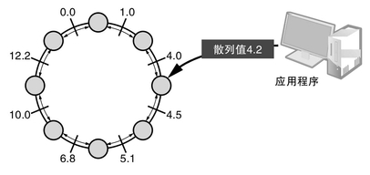

C>图1　键-值存储架构示例

C>通过散列值判断存放数据的节点并直接进行访问。为了提高可用性，两端相邻的节点都拥有数据的副本。

先声明一下，这里要讲解的可扩展键-值存储架构，基本上是以乐天开发的ROMA为基础的。可扩展键-值存储系统的实现有很多种，这里所介绍的架构并不是唯一一种。另外，为了讲解上方便，这里介绍的内容和实际的ROMA实现是有一些偏差的。

### 访问键-值存储

我们先来看一个简单的应用程序实现。应用程序一侧要执行的处理并不多，大体上可以分成“初始化”和“访问（获取、保存等）”两个步骤。

首先是初始化。应用程序在初始化时，需要指定几个构成键-值存储系统的节点。指定的节点并不需要是特殊节点，只要是参加键-值存储系统组成的节点都可以。之所以要指定多个，是考虑到在这其中至少应该有一个是存活的。

应用程序按顺序访问指定的节点，并向第一个应答的节点传达要访问键-值存储的请求。接着，建立连接的节点向客户端发送“哪个节点负责哪个范围的散列值”的信息（即路由表）。收到路由表之后，剩下的访问操作就比较简单了。根据要获取的键数据计算出散列值，然后通过路由表查询出负责该散列值的节点，并向该节点发送请求。请求的内容分为获取、保存等很多种类，在ROMA中所支持的请求如表1所示。比Hash要稍微复杂一些呢。

C>表1　ROMA的访问请求

|访问请求|内　容|
|get|获取键所对应的值|
|set|设置键所对应的值|
|add|当键不存在时设置值|
|replace|当键存在时设置值|
|append|在当前值的末尾附加|
|prepend|在当前值的开头附加|
|delete|删除键所对应的值|
|inc|将键所对应的值加1|
|del|删除键所对应的值|

每次进行数据访问时，应用程序都需要与负责各个键（的散列值）的节点建立连接并进行通信。这个通信过程都是通过套接字来完成的。通过套接字与远程主机建立连接，实际上需要很大的开销。ROMA早期的原型中，每次都需要建立这样的连接，于是这个部分就成了瓶颈，导致系统无法发挥出期望的性能。

所幸，一般情况下，对键-值存储的访问都具有局部性，也就是说对同一个键的访问可能会连续发生。在这样的情况下，池（pooling）技术就会比较有效。所谓池，就是指对使用过的资源进行反复利用的技术。这个案例中，也就是指对一定数量的套接字连接进行反复利用。特别是在访问具有局部性的情况下，连接池的效果是非常好的。

在键-值存储的运用中，难免会遇到由于延迟、故障、分裂等导致某些节点无法访问的状况。在ROMA中，各应用程序都持有一张记载组成键-值存储系统所有节点信息的表（路由表），并直接对节点进行访问。在这种类型的系统中，保持路由表处于最新状态是非常重要的。

ROMA会定期对路由表进行更新。每隔一段时间，客户端会向路由表中的任意节点发出获取最新路由信息的请求。

此外，对各个节点的请求也设置了超时时间，如果某个节点未在规定时间内响应请求，则会被从路由表中删除。

### 键-值存储的节点处理

与应用程序相比，组成系统的节点的行为十分复杂，特别是像ROMA这样不存在承担特殊工作的主节点，且各节点之间相互平等的P2P型系统。

节点的工作大体包括以下内容：

* 应对访问请求
* 信息保存
* 维护节点构成信息
* 更新节点构成信息
* 加入处理
* 终止处理

正如图1所示，系统中的节点构成了一个圆环，其中每个节点的结构如图2所示。

C>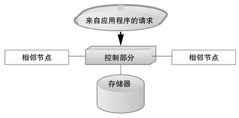

C>图2　节点的结构

### 存储器

存储器（storage）就是实际负责保存信息的部分。在ROMA中，存储器是作为插件存在的，通过启动时的设置可以对存储器进行切换。目前实现的存储器包括下列这些：

* RH存储器：将信息保存在Ruby的Hash对象中的存储器。这种方式无法将信息保存到文件中，因此ROMA整体运行停止后信息就消失了。
* DBM存储器：将信息保存在DBM（实际上是GDBM）中的存储器。
* File存储器：将信息保存在文件中的存储器。每个键都会产生一个独立的文件，因此磁盘目录可以用作索引。
* SQLite3存储器：将信息保存在SQLite3中的存储器。SQLite3是一种很有名的公有领域RDBMS。
* TC存储器：将信息保存在Mixi开发的TokyoCabinet中的存储器。是在ROMA实际运用中最为常用的一种。

各个存储器都定义为“Roma::Storage::BasicStorage”的子类，其定义采用模板方法的形式。在运用中，ROMA可以根据数据库所需特性来选择合适的存储器。从实际来看，大多数案例都可以用TC存储器来解决。

### 写入和读取

当应用程序发起写入请求时，在确认键的散列值属于本节点负责范围后，该节点会通过存储器对数据进行保存。

这个时候，如果数据只保存在一个节点上的话，万一这个节点发生故障，数据就会丢失。为了提高可用性和分裂容忍性，写入必须由多个节点共同完成。如果重视响应速度的话，可以在本节点完成写入操作之后，马上对请求进行响应，剩下的写入操作则可以在后台完成。

在ROMA中由于对响应速度并不是非常重视，而是需要追求可靠性，因此所有的写入操作是同步执行的。不过，如果由于某些原因导致数据复制写入失败，则会在后台重新尝试执行写入操作。

如果由于应用程序所持有的路由表信息过期等原因，导致请求写入的键不属于本节点负责的范围，该节点会将请求转发出去。

读取的处理和写入差不多，但由于不需要出于冗余的目的对其他节点发出请求，因此处理方式更加简单。

### 节点追加

分布式键-值存储系统的优点就是运用的灵活性。当数据过多、访问速度下降时，只要追加新的节点就可以进行应对。

追加新节点时，需要指定一个现有的节点作为入口，然后启动新的节点。新启动的节点和指定的现有节点进行通信，申请加入环状结构，然后向全体节点发送对节点间数据分配进行调整的请求。刚刚启动的新节点并不包含任何数据（在启动时显式指定了已永久保存的数据库的情况除外），随着节点调整的进行，数据会逐步分配给新的节点。

### 故障应对

作为可扩展的键-值存储系统来说，最重要的恐怕就是对故障的容忍性了。正如之前讲过的，随着组成系统的计算机台数的增加，发生故障的概率也会大幅度上升。在大规模系统中，即便组成系统的一部分计算机发生故障，系统也必须能够继续运行。

发生频率最高的，应该是单台计算机的故障。由于故障导致一台计算机从系统中消失，这样的例子十分常见。

当由于故障导致一个节点失去响应时，应用程序会尝试访问其他节点。在ROMA中，由于数据总是存放在多个节点中，因此通过路由表就可以找到其他的替代节点。

另一方面，出现无响应的节点，就意味着数据的冗余度下降了。为了避免这种情况，其他节点需要将消失的节点排除，然后重新组织节点的结构，根据需要向相邻节点复制数据，最终维持数据的平衡。新的节点结构信息，会通过定期更新发送给应用程序，而作为整个键-值存储来说，会像什么都没有发生一般继续运行。

比较麻烦的情况是，暂时“消失”的节点又复活了。这种情况的发生可能是由于网线被拔出（这是在运营工作中经常会出现的意外），或者由于网络故障导致大规模网络延迟，这些应该还是比较常见的。

在以简洁为信条的ROMA中，遇到这样的情况，会将已经分离的节点完全舍弃。如果出现“复活”的情况，该节点需要作为一个新节点重新加入ROMA系统。ROMA会将新加入的节点更新到路由表中，并重新对数据进行分配。

另一种故障也可能发生，那就是多个节点同时消失。在ROMA中，和一个节点消失的情况一样，会将这些节点舍弃。在多个节点同时消失的情况下，可能会发生冗余备份的数据同时丢失的问题。要找回丢失的数据是不可能的，因此系统就会报错。在这种情况下，就无法区分该数据是一开始就不存在，还是由于大量节点消失而导致的数据丢失。这当然会引发一些问题，但失去的东西总归无法复得，也就没必要进行任何特殊的处理了。

话虽如此，但丢失数据这种事，作为数据库来说确实是个不小的问题。为了拯救数据，ROMA中提供了一个命令，可以将切断前已经由存储器写入文件的数据重新上传回ROMA。这个操作只是将存储器数据读取出来并添加到ROMA中，基本的部分是非常简单的。不过，如果上传的数据中有一些键已经在ROMA中存在，且它们所对应的值不相同的情况下，必须决定选用其中某一个值来解决冲突。到底是分离之后ROMA一侧的数据被更新了，还是对节点的数据写入由于某些原因没有反映到ROMA一侧？仅凭键和值的数据是无法判断的。

实际上，在ROMA中对每份数据都附加了一个叫做“逻辑时钟”（logical clock）的信息，它是一种在每次数据被更新时进行累进的计数器。当上传的数据和ROMA中已经存在的数据发生冲突时，通过逻辑时钟就可以判断应该以哪一方的数据为准。

在各种故障中，还可能发生分裂的情况，也就是在完全隔绝的网络中，还在继续独立工作的意思。在ROMA中，要应对这种故障，只能将分裂开的ROMA系统中的其中一个手动停止。虽然这种手段非常原始，但分裂这样的故障并不会经常发生，这样的应对应该已经足够了。从分裂故障中进行恢复，和上述情况一样，也是通过使用从存储器上传数据的功能来完成的。

### 终止处理

出人意料的是，在P2P型结构中，最麻烦的操作居然是终止。要进行终止操作，首先要向任意节点发送终止请求，然后，该节点就自动成为负责终止的主节点，由它对全体节点发送“即将终止”的声明。收到声明之后，各节点停止接受新的请求，并在当前时间点正在处理的请求全部完成之后，对存储器执行文件的写入（内存存储的情况除外），完成后向终止主节点发送回复。回复完毕后，结束该节点的进程。

负责终止的主节点在收到全部节点（故障、无应答的节点除外）的回复后，结束自身进程。至此，ROMA系统的运行就全部停止了。

### 其他机制

除了上述讲到的内容之外，ROMA中还有以下这些机制：

#### 1. 有效期

ROMA中的数据都设置了有效期，因此如果要实现“这个数据仅在今天有效，明天就需要删掉”这样的规则是很容易的。

#### 2. 虚拟节点

为了让节点之间因分配调整而进行的数据传输更加高效，系统中采用了将若干个键组织起来形成“虚拟节点”的机制。

#### 3. 散列树

如图1所示，ROMA使用了环状节点分布和浮点小数散列值，实际上的算法使用的是SHA-1散列和Merkle散列树，这种方式的效率更高。

### 性能与应用实例

在乐天旅游的“最近浏览过的酒店”和乐天市场的“浏览历史”等功能中，都采用了ROMA，每个用户的访问历史记录都是保存在ROMA中的。ROMA基本上都是用Ruby编写的，但是它所提供的性能却足够支持日本最大级网站的应用。

### 小结

除了ROMA之外，还有很多键-值存储系统的实现方式，它们也都具备各自的特点。由于这些项目大多数都是开源的，因此通过阅读源代码来研究一下或许也是一件很有意思的事。

## 5.2　NoSQL

说起NoSQL，这里并不是指某种数据库软件叫这个名字。所谓NoSQL，是一个与象征关系型数据库的SQL语言相对立而出现的名词，它是包括键-值存储在内的所有非关系型数据库的统称。不过，关系型数据库在很多情况下还是非常有效的，因此有人批判NoSQL这个词中所体现出的“不再需要SQL”这个印象过于强烈，主张应该将其解释为“Not Only SQL”（不仅是SQL）（图1）。

C>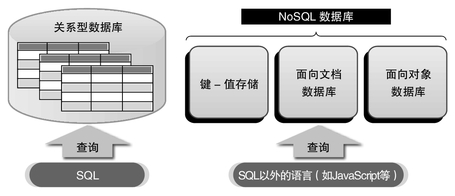

C>图1　NoSQL数据库

属于NoSQL类的数据库，主要有ROMA（Rakuten On-Memory Architecture）这样的键-值存储型数据库，以及接下来要介绍的MongoDB这样的面向文档数据库等。

### RDB的极限

在大规模环境中，尤其是作为大流量网站的后台，一般认为关系型数据库在性能上存在极限，因为关系型数据库必须遵守ACID特性。

ACID是Atomicity（原子性）、Consistency（一致性）、Isolation（隔离性）和Durability（持久性）这四个单词首字母的缩写。

所谓Atomicity，是指对于数据的操作只允许“全部完成”或“完全未做改变”这两种状态中的一种，而不允许任何中间状态。因为操作无法进一步进行分割，所以用了“原子”这个词来表现。

所谓Consistency，是指数据库的状态必须永远满足给定的条件这一性质。当某个事务无法满足给定条件时，其执行就会被取消。

所谓Isolation，是指保持原子性的一系列操作的中间状态，不能由其他事务进行干涉这一性质，由此可以保持隔离性而避免对其他事务产生影响。

所谓Durability，是指当保持原子性的一系列操作完成时，其结果会被保存并且不会丢失这一性质。

当数据量和访问频率增加时，ACID特性就成了导致性能下降的原因，因为随着数据量和访问频率的增加，维持ACID特性所带来的开销就会越来越明显。

例如，为了保持数据的一致性，就需要对访问进行并发控制，这样则必然会导致能接受的并发访问数量下降。如果将数据库分布到多台服务器上，则为了保持一致性所带来的通信开销也会导致性能下降。

当然，如果以适当的方式将数据库分割开来，从而在控制访问频率和数据量方面进行优化的话，在一定程度上可以应对这个问题。在大规模环境下使用关系型数据库，一般有水平分割和垂直分割两种分割方式。

所谓水平分割，就是将一张表中的各行数据直接分割到多个表中。例如，对于像mixi这样的社交化媒体（SNS）网站，如果将用户编号为奇数的用户信息和编号为偶数的用户信息分别放在两张表中，应该会比较有效。

相对地，所谓垂直分割就是将一张表中的某些字段（列）分离到其他的表中。用SNS网站举例的话，相当于按照“日记”、“社区”等功能来对数据库进行分割。

通过这样的分割，可以对单独一个关系型数据库的访问量和数据量进行控制。但是这样做，维护的难度也随之增加。

### NoSQL数据库的解决方案

NoSQL之所以受到关注，就是因为它可以成为解决关系型数据库极限问题的一种方案。和关系型数据库相比，NoSQL数据库具有以下优势（图2）：

C>

C>图2　NoSQL的优点

* 限定访问数据的方式

在大多数NoSQL数据库中，对数据访问的方式都被限定为通过键（查询条件）来查询相对应的值（查询对象数据）这一种。由于存在这样的限定，就可以实现高速查询。而且，大多数NoSQL数据库都可以以键为单位来进行自动水平分割。

此外，也有像memcached这样不永久保存数据，只是作为缓存来使用的数据库。这也算是一种对数据访问方式的限定吧。

* 放宽一致性原则

要保持大规模数据库，尤其是分布式数据库的一致性，所需要的开销十分显著。因此大多数NoSQL数据库都遵循“BASE”这一原则。

所谓BASE，是Basically Available、Soft-state和Eventuallyconsistent的缩写，ACID无论在任何情况下都要保持严格的一致性，而实际上数据不一致并不会经常发生，因此BASE比较重视可用性（Basically Available），但不追求状态的严密性（Soft-state），且不管过程中的情况如何，只要最终能够达成一致即可（Eventually consistent）。

如果遵循BASE原则，那么用于保持一致性的开销就可以得到控制，而标榜ACID的关系型数据库则很难做出这样的决断。

### 形形色色的NoSQL数据库

NoSQL数据库只是一个统称，其中包含各种各样的数据库系统。大体上，可以分为以下三种：

* 键-值存储数据库
* 面向文档数据库
* 面向对象数据库

键-值存储是一种让键和值进行关联的简单数据库，查询方式基本上限定为通过键来进行，可以理解为在关系型数据库中只能提供对“拥有特定值的记录”进行查询的功能，而且还是有限制的。在UNIX中从很早就提供的DBM这种简单数据库，从分类上来看也可以算作键-值存储，但是在NoSQL这个语境中，所谓键-值存储一般都指的是分布式键-值存储系统。符合这样条件的键-值存储数据库包括“memcached”、“ROMA”、“Redis”、“TokyoTyrant”等。

所谓面向文档数据库，是指对于键-值存储中“值”的部分，存储的不是单纯的字符串或数字，而是拥有结构的文档。和单纯的键-值存储不同，由于它可以保存文档结构，因此可以基于文档内容进行查询。

举个例子，一张会员清单包括姓名、地址和电话号码，现在要从中查找一个名字叫“松本”的会员。也许乍看之下这和关系型数据库的应用方式是一样的，但是不同之处在于，在面向文档数据库中，对于存放会员信息的文档来说，每个会员的文档结构可以是不同的。因此要查找名字叫“松本”的会员，实际上相当于对“具备名字这个属性，且该属性的值为松本的文档”进行查询。这种情况下的文档，通常采用的是XML（eXtended MarkupLanguage）和JSON（JavaScript Object Notation）格式。面向文档数据库包括CouchDB、MongoDB以及各种XML数据库等。

所谓面向对象数据库，是将面向对象语言中的对象直接进行永久保存，也就是当计算机断电关机之后对象也不会消失的意思。键-值存储和面向文档数据库给人的感觉还像是个数据库，但大多数面向对象数据库看起来只是一个将对象进行永久保存的系统而已。当然，面向对象数据库也提供对对象的查询功能。面向对象数据库的例子有Db4o、ZopeDB、ObjectStore等。

在我跳槽到现在的公司之前，经常使用ObjectStore。那时候的工作内容是用C++和ObjectStore编写一个CAD软件，真是怀念啊。说起来，那个时候ObjectStore还不支持分布式环境，对于跨越多数据库创建对象的功能，以及对不再使用的对象进行回收的分布式垃圾回收功能等，都是靠自己的力量实现的，不知道现在是不是有了正式的支持呢。

从“非关系型数据库”的角度来看，在这里我们暂且将面向对象数据库也算作是NoSQL的一种，至少从我（有些过时）的经验来说，面向对象数据库的主要目的，是提升一些数据结构比较复杂的小规模数据库的访问速度，而和其他NoSQL数据库相比，在可扩展性方面并不是很擅长。

### 面向文档数据库

下面我们来介绍一下面向文档数据库。所谓面向文档数据库，可以理解为是将JSON、XML这样的文档直接进行数据库化的形式，其特点包括：不需要schema（数据库结构定义），支持由多台计算机进行并行处理的“水平扩展”等。

#### 1. CouchDB

CouchDB可以说是面向文档数据库的先驱。CouchDB的特点是RESTful接口以及采用Erlang进行实现。

CouchDB提供了遵循REST（Representational State Trans-fer，表征状态转移）模型的接口，因此，即便没有特殊的客户端和库，使用HTTP也可以对数据进行插入、查询、更新和删除操作。和关系型数据库不同，其中每条数据不必拥有相同的结构，可以各自拥有一些自由的元素。在CouchDB中，是通过JSON来对记录进行描述的。

此外，在CouchDB中，一部分逻辑可以用JavaScript编写并插入到数据库中，从整体上看，数据库和应用程序之间的区别并不是那么明确。大多数人都习惯于“数据库负责数据，应用程序负责逻辑”，但此时也许需要让自己从这种模式中跳出来。

出人意料的是，像数据表的连结（Join）之类，在传统数据库中通过SQL可以轻松完成的查询，在CouchDB中是做不到的。因此用惯了传统关系型数据库的人可能会觉得四处碰壁。但是，如果能够完全运用CouchDB的功能，应用程序的设计可以变得十分简洁。

这种数据库是用Erlang来实现的，这一点也很值得关注。Erlang是一种为并行计算特别优化过的函数型语言，分布式计算和并行计算方面的程序设计一直是它的强项，因此在CouchDB这样需要通过多台机器的分布和协调应对大量访问的场景中，应该说能够充分发挥Erlang的性能。

#### 2. MongoDB

和CouchDB相比，MongoDB大概更接近传统的数据库。MongoDB的宣传口号是Combining the best features of docu-ment databases, key-value stores, and RDBMSes，即要结合（像CouchDB这样的）文档数据库、键-值存储数据库和关系型数据库的优点，这真是个颇具挑战的目标。

MongoDB除了不具备事务功能之外，确实提供了和关系型数据库非常接近的易用性。此外，它还为C++、C#、JavaScript、Java、各种JVM语言、Perl、PHP、Python、Ruby等语言提供了访问驱动程序，这一点也非常重要。有了这样的支持，在语言的选择上也就没有什么顾虑了。

### MongoDB的安装

如果你所使用的操作系统发行版本中提供了MongoDB的软件包，那么安装就非常容易了。在Debian中该软件包的名字叫做mongodb。

即便没有提供软件包，安装它也并非难事。只要访问Mon-goDB官方网站的下载页面：http://www.mongodb.org/downloads，找到对应的二进制包并下载就可以了。提供官方预编译版本的系统平台如表1所示。

C>表1　MongoDB提供预编译版本的系统平台

|Mac OS X 32位|
|Mac OS X 64位|
|Linux 32位|
|Linux 64位|
|Windows 32位|
|Windows 64位|
|Solaris x86|
|Solaris 64位|

我选用的是Linux 32位版本。将下载好的tar.gz文件解压缩后，其目录结构如下：

{lang="text"}
	GNU-AGPL-3.0（许可协议）
	README（说明文件）
	THIRD-PARTY-NOTICES（第三方依赖关系信息）
	bin/（二进制文件）
	include/（头文件）
	lib/（库文件）

MongoDB的许可协议是GNU-AGPL-3.0。AGPL这种协议可能大家没怎么听说过，它是AFFERO GENERAL PUBLIC LI-CENSE的缩写，简单讲，基本条款和GPL是差不多的，区别只有一点，就是在该软件是通过网络进行使用的情况下，也需要提供源代码。在用于商业用途的情况下，如果不想公开源代码，貌似也可以购买商用许可。

bin目录中包含了MongoDB的数据库服务器、客户端、工具等可执行文件。只要将这些文件复制到/usr/bin等Path能搜索到的目录中就可以完成安装了。如果需要自行编译客户端和驱动程序的话，还需要安装include目录中的头文件和lib目录中的库文件。

如果没有和你所使用的操作系统或CPU相对应的预编译版本，则需要下载源代码自行编译。不过，MongoDB所依赖的库有很多，准备起来也有点麻烦。如果要在Ubuntu下用源代码进行编译，可以参考这里的资料（英文）：http://www.mongodb.org/display/DOCS/Building+for+Linux。

接下来我们需要用Ruby来访问MongoDB，因此还需要安装Ruby的驱动程序。用RubyGems就可以轻松完成安装。RubyGems是为Ruby的各种库和应用程序设计的软件包管理系统，使用起来非常方便。如果你还没有安装RubyGems的话，趁这个机会赶紧安装吧。在Debian或Ubuntu中，输入下列命令进行安装：

{lang="shell"}
    $ sudo apt-get install ruby rubygems

表示换行用RubyGems来安装MongoDB的Ruby驱动程序，可以输入下列命令：

{lang="shell"}
	$ sudo gem install mongo 

### 启动数据库服务器

启动数据库服务器的命令是mongod，作为参数需要指定数据库存放路径以及mongod监听连接的端口号，默认的端口号为27017。指定数据库路径的选项为“--dbpath”，指定端口号的选项为“--port”。例如，如果创建一个“/var/db/mongo”目录并希望将数据库存放在此处，可以用下面的命令来启动数据库服务器（假设mongod所在的路径能够被Path找到，如果不能的话则需要指定绝对路径）：

{lang="shell"}
	$ sudo mongod --dbpath /var/db/mongo

服务正常启动后会显示“waiting for connections on port 27017”这样一条消息（屏幕截图1）。

C>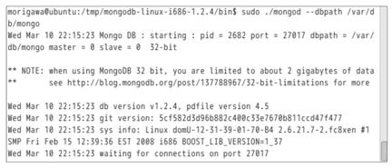

屏幕截图1　MongoDB启动时的样子对MongoDB进行操作需要使用mongo命令。如果为数据库服务器指定了非默认的端口号，则mongo命令也需要指定--port参数。打开一个新的终端控制台，用下列命令来启动mongo：

{lang="shell"}
	$ mongo
	MongoDB shell version: 1.3.1
	url: test
	connecting to: test
	type "exit" to exit
	type "help" for help
	>

这样就连接成功了。这个命令可以通过交互的方式对数据库进行操作，对于学习MongoDB很有帮助。此外，对于数据库的小规模调整和修改也十分方便。

不过mongo命令没有提供行编辑功能，如果配合使用支持行编辑功能的rlwrap命令则会更加方便。

{lang="shell"}
	$ rlwrap mongo 

用上述格式启动，就可以为mongo命令增加行编辑功能。这样不仅能对输入行进行编辑，还可以查询输入历史，非常方便。

在Debian和Ubuntu中，可以用下列命令来安装rlwrap：

{lang="shell"}
	$ sudo apt-get install rlwrap  

### MongoDB的数据库结构

MongoDB的结构分为数据库（database）、集合（collec-tion）、文档（document）三层。在mongo命令中输入“showdbs”可以显示当前连接的数据库服务器所管理的数据库清单。

{lang="shell"}
	> show dbs
	admin 
	local

我们可以看到，这台服务器所管理的数据库有admin和lo-cal这两个。对数据库的操作是针对当前数据库进行的。在连接时显示的消息中，“connecting to:”所表示的就是当前数据库。查看当前数据库可以使用“db”命令：

{lang="shell"}
	> db  
	test

在这里，数据库包含若干个集合，而集合则相当于关系型数据库中“表”的概念。关系型数据库中的表，都拥有各自的结构定义（schema），结构定义决定了表中各行（记录）包含怎样的数据，以及这些数据排列的顺序。因此每条记录都遵循schema的定义而具备完全相同的结构。

但对于无结构的MongoDB数据库来说，虽然集合中包含了相当于记录的文档，但每一个文档并不必具备相同的结构，而是能够存放可以用JSON进行描述的任意数据。一般来说，在同一个集合中倾向于保存结构相同的文档，但MongoDB对此并非强制。

这就意味着，随着应用程序开发的进行，对于数据库中数据的结构变化，可以灵活地做出应对。在Ruby on Rails的开发中，一旦数据库结构发生变化，就必须花很大精力来编写数据迁移脚本，而这样的苦差事在MongoDB中是完全可以避免的。

### 数据的插入和查询

在关系型数据库中，要创建新的表，需要对表结构进行明确的定义并执行显式的创建操作，而在更加灵活的MongoDB中则不需要这么麻烦。在mongo命令中用use命令可以切换当前数据库，如果use命令指定了一个不存在的数据库，则会自动创建一个新数据库。

{lang="shell"}
	 > use linux_mag  
	 switched to db linux_mag

而且，如果向不存在的集合中保存文档的话，就会自动创建一个新的集合。

{lang="shell"}
	 > db.articles.save({
	 ... title: "技术的剖析",
	 ... author: "matz"
	 ... })

其中“…”是mongo命令中表示折行的提示符。通过这样的命令，我们就向linux_mag数据库的articles集合中插入了一个新文档。

{lang="shell"}
	> show collections
	articles
	system.indexes

下面我们来查询一下这个文档。查询文档需要使用集合的find方法。

{lang="shell"}
	> db.articles.find()
	{ "_id" : ObjectId("4b960889e4ffd91673c93250"), 
	"title" : "技术的剖析",
	"author" : "matz" }

保存的数据会被自动分配一个名为“_id”的唯一ID。find方法还可以指定查询条件，如：

{lang="shell"}
	> db.articles.find({author: "matz"})
	{ "_id" : ObjectId("4b960889e4ffd91673c93250"),
	"title" : "技术的剖析",
	"author" : "matz" }

如果指定一个JavaScript对象作为find方法的参数，则会返回与其属性相匹配的文档。在这里我们的数据库中只有一个文档，如果有多个匹配的文档的话，自然会返回多个结果。

如果希望只返回一个符合条件的文档，则可以用findOne方法来代替find方法。

### 用JavaScript进行查询

mongo命令最重要的一点，是可以自由地运行JavaScript。mongo所接受的命令，除了help、exit等一部分命令之外，其余的都是JavaScript语句。甚至可以说，mongo命令本身就是一个交互式的JavaScript解释器。刚才的例子中出现的：

{lang="shell"}
	db.articles.find()

等写法，正是JavaScript的方法调用形式。由于支持JavaScript，因此我们可以自由地进行一些简单的计算，将结果赋值给变量，甚至用for语句进行循环。

{lang="shell"}
	> 1 + 1
	2
	> print("hello")
	hello

下面我们就用JavaScript来为数据库填充一定规模的数据。

{lang="shell"}
	> for (var i = 0; i < 1000000; i++)
	{ ... db.bench.save( { x:4, j:i } ); ... }

在花了相当长一段时间之后，我们就创建了一个包含100万个文档的bench集合。接下来，我们来试试看查询。

{lang="shell"}
	> db.bench.findOne({j:999999}) 
	{ "_id" : ObjectId("4b965ef5ffa07ec509bd338e"), "x" : 4, "j" : 999999 }

在我的电脑上查询到这个结果用了差不多1秒的时间。因为要将100万个文档全部查询一遍，所以这个速度不是很快，于是我们来创建一个索引。

{lang="shell"}
	> db.bench.ensureIndex({j:1}, {unique: true})

这样我们就对j这个成员创建了一个索引，再查询一次试试看。

{lang="shell"}
	> db.bench.findOne({j:999999})
	{ "_id" : ObjectId("4b965ef5ffa07ec509bd338e"), "x" : 4, "j" : 999999 }

在创建索引之前，按下回车键到返回结果总觉得会卡一会儿，现在则是瞬间就可以得到结果，索引的效果是非常明显的。

在mongo命令中，可以使用JavaScript这样一种完全编程语言来对数据库进行操作，感觉真是不错。也许是因为我没有在工作中使用过SQL的原因吧，总觉得需要用SQL这样一种不完全语言来编写算法和进行操作的关系型数据库让我觉得不太习惯，相比之下还是MongoDB感觉更加亲近一些。从我个人的喜好来说，自然希望在mongo命令中也可以用Ruby来对数据库进行操作。话说，2012年4月，AvocadoDB宣布要集成mruby，这很值得期待。

### 高级查询

在MongoDB中，使用find或者findOne方法并指定对象作为条件时，会返回成员名称和值相匹配的文档。严格来说，find方法返回的是与符合条件的结果集相对应的游标，而findOne则是仅返回第一个找到的符合条件的文档。

不过，说到查询，可并不都是这么简单的用法。下面我们通过将SQL查询转换为MongoDB查询的方式，来学习一下Mon-goDB的查询编写方法。刚才出现过的查询符合条件记录的例子，用SQL来编写的话应该是下面这样：

{lang="sql"}
	SELECT * FROM bench WHERE x == 4

这条查询写成MongoDB查询则是这样：

{lang="shell"}
	> db.bench.find({x: 4}) 

如果希望只选出特定的成员（字段），用SQL要写成：

{lang="sql"}
	SELECT j FROM bench WHERE x == 4

MongoDB的话则是：

{lang="shell"}
	> db.bench.find({x: 4}, {j: true}) 

刚才我们的查询条件都是“等于”，如果要比较大小当然也是可以的。例如，“x大于等于4”这样的条件，用SQL查询可以写成：

{lang="sql"}
	SELECT j FROM bench WHERE x >= 4

而MongoDB的话则是：

{lang="shell"}
	> db.bench.find({x: 4}, {j: {$gte: 4}})

当比较条件不是等于时，要像上面这样使用以“$”开头的比较操作符来表达。MongoDB中可以使用的比较操作符如表2所示。

C>表2　比较操作符

C>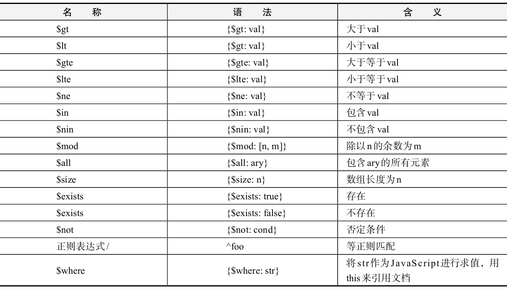

我们刚才已经讲过，在find方法中，返回的并不是文档本身，而是游标（cursor）。当执行的查询得到多个匹配结果时，某些情况下返回的结果数量可能会超乎想象。这时，我们可以使用count、limit、skip、sort等方法。

count方法可以返回游标所关联的结果集的大小。

{lang="shell"}
	> db.bench.find().count()
	1000000

limit方法可以将结果集的大小限制为从游标开始位置起指定数量的文档（图3）。

{lang="shell"}
	> db.bench.find().limit(10)
	{ "_id" : ..., "x" : 4, "j" : 0 } 
	{ "_id" : ..., "x" : 4, "j" : 1 } 
	{ "_id" : ..., "x" : 4, "j" : 2 } 
	{ "_id" : ..., "x" : 4, "j" : 3 } 
	{ "_id" : ..., "x" : 4, "j" : 4 } 
	{ "_id" : ..., "x" : 4, "j" : 5 } 
	{ "_id" : ..., "x" : 4, "j" : 6 } 
	{ "_id" : ..., "x" : 4, "j" : 7 } 
	{ "_id" : ..., "x" : 4, "j" : 8 } 
	{ "_id" : ..., "x" : 4, "j" : 9 }

C>图3　limit方法的执行结果

skip方法可以使游标跳过指定数量的记录（图4）。配合使用limit和skip，就可以像Google搜索页面一样，轻松实现以n个结果为单位将结果进行分页的操作。

{lang="shell"}
	> db.bench.find().skip(10).limit(10) 
	{ "_id" : ..., "x" : 4, "j" : 10 } 
	{ "_id" : ..., "x" : 4, "j" : 11 } 
	{ "_id" : ..., "x" : 4, "j" : 12 } 
	{ "_id" : ..., "x" : 4, "j" : 13 } 
	{ "_id" : ..., "x" : 4, "j" : 14 } 
	{ "_id" : ..., "x" : 4, "j" : 15 } 
	{ "_id" : ..., "x" : 4, "j" : 16 } 
	{ "_id" : ..., "x" : 4, "j" : 17 } 
	{ "_id" : ..., "x" : 4, "j" : 18 } 
	{ "_id" : ..., "x" : 4, "j" : 19 }

C>图4　skip方法的执行结果

sort方法可以按指定成员对查询结果进行排序（图5）。

	> var c = db.bench.find()
	> c.skip(10).limit(10).sort({j: -1})
	{ "_id" : ..., "x" : 4, "j" : 999989 }
	{ "_id" : ..., "x" : 4, "j" : 999988 }
	{ "_id" : ..., "x" : 4, "j" : 999987 }
	{ "_id" : ..., "x" : 4, "j" : 999986 }
	{ "_id" : ..., "x" : 4, "j" : 999985 }
	{ "_id" : ..., "x" : 4, "j" : 999984 }
	{ "_id" : ..., "x" : 4, "j" : 999983 }
	{ "_id" : ..., "x" : 4, "j" : 999982 }
	{ "_id" : ..., "x" : 4, "j" : 999981 }
	{ "_id" : ..., "x" : 4, "j" : 999980 }

C>图5　sort方法的执行结果

这样我们就完成了按成员j降序排列的操作。和前面的skip(10).limit(10)的结果相比，j的值是不同的。由于sort方法是对整个查询结果进行排序，因此对于查询结果来说，这些方法的执行顺序和实际的调用顺序无关，总是按照①sort②skip③limit的顺序来执行。

### 数据的更新和删除

只有文档的插入和查询并不能构成数据库的完整功能，我们还需要进行更新和删除。文档的插入我们使用了save方法，保存好的文档会被赋予一个_id成员，因此，当要保存的文档的_id已存在时，就会覆盖相应_id的文档。

也就是说，用find或findOne方法取出文档后，对取出的文档（JavaScript对象）进行修改并再次调用save（只有_id成员是不能修改的）的话，就会覆盖原来的文档。

在MongoDB中不存在事务的概念，因此总是以最后写入的数据为准。MySQL在最开始不支持事务的时候还是非常有用的，由此可见，Web应用中的数据库系统，即便不支持事务，貌似也不是很大的问题。MongoDB中虽然不支持事务，但可以支持原子操作（atomic operation）和乐观并发控制（optimistic con-currency control）。要实现原子操作和乐观并发控制，可以使用update方法。

update所支持的原子操作如表3所示，原子操作的名称都是以“$”开头的。例如，要将j为0的文档的x值增加1，可以写成下面这样：

{lang="shell"}
	> db.bench.update({j:0},{$inc:{x:1}})

C>表3　update的原子操作

|名称|语法|功能|
|$inc|{$inc: {mem: n}}|对mem的值加n|
|$set|{$set: {mem: val}}|将mem的值设置为val|
|$unset|{$unset: {mem: 1}}|删除mem|
|$push|{$push: {mem: val}}|在数组mem中添加val|
|$pushAll|{$pushAll: {mem: ary}}|在数组mem中添加ary的元素|
|$addToSet|{$addToSet: {mem: val}}|当数组mem中不包含val时则添加val|
|$pop|{$pop: {mem: 1}}|删除数组mem中最后一个元素|
|$pop|{$pop: {mem: -1}}|删除数组mem中第一个元素|
|$pull|{$pull: {mem: val}}|从数组mem中删除所有的val|
|$pullAll|{$pullAll: {mem: ary}}|从数组mem中删除所有ary中的元素|

### 乐观并发控制

然而，当需要进行并发操作时，仅凭原子操作还不够。在关系型数据库中，一般是通过事务的方式来处理的，但MongoDB中没有这样的机制。MongoDB中进行并发操作的步骤如下。

{lang="text"}
	（1）通过查询获取文档。
	（2）保存原始值。
	（3）更新文档。
	（4）将原始值（包含_id）作为第一参数，将更新后的文档作为第二参数，调用update方法。如果文档已经被其他并发操作修改时，则update失败。
	（5）如果update失败则返回第（1）步重新执行。

这样的方式，也就是利用了update方法可以进行原子更新这一点，通过同时指定事务开始时和更新后的值，来手动实现相当于关系型数据库中事务处理的功能。这种方法的前提，是基于“同一个文档基本上不会被同时修改”这一预测，也就是一种乐观的（近似的）事务机制。

需要显式创建数据的副本这一点有些麻烦，但忽略这一点的话，实际上还是很实用的。作为一个简单的例子，我们将刚才讲过的$inc那个例题，用乐观并发处理进行实现，如图6所示。

{lang="text"}
	> for (;;) {
	... var d = db.bench.findOne({j:0})
	... var n = d.x
	... d.x++
	... db.bench.update({_id:d._id, x:n}, d)
	... if (db.$cmd.findOne({getlasterror:1}).updatedExisting) break
	... } 

C>图6　乐观并发处理

## 5.3　用Ruby来操作MongoDB

关系型数据库为了保持其基本的ACID原则（原子性、一致性、隔离性、持久性），需要以付出种种开销作为代价。而相对地，MongoDB这样的面向文档数据库由于可以突破这一局限，因此工作起来显得比较轻快。

MongoDB具有下列这些主要特点： 

* 以JSON（JavaScript Object Notation）格式保存数据
* 不需要结构定义
* 支持分布式环境
* 乐观的事务机制
* 通过JavaScript进行操作
* 支持从多种语言进行访问

MongoDB最重要的特点就是不需要结构定义。很少有应用程序在开发之前就能确定数据库中需要保存的数据项目。由于开发过程中的疏漏，或者是需求的变化等，经常导致数据库结构在开发中发生改变。在关系型数据库（RDB）中，遇到这种情况每次都需要重做数据库。Ruby on Rails中可以通过migration方法对RDB结构迁移提供支持，但即便如此，这个过程依然相当麻烦。

而MongoDB本来就没有结构定义，即便数据库中保存的项目发生变化，只要程序做出应对就可以了。当然，已经存在的数据中不包含新增的项目，但要做出应对也很容易。

### 使用Ruby驱动

MongoDB的另一个特点，就是可以由多种语言进行访问。为各种语言访问MongoDB所提供的库被称为驱动（driver）。MongoDB分别为JavaScript、C++、C#、Java、JVM语言、Perl、PHP、Python和Ruby提供了相应的驱动。

MongoDB的服务器中集成了JavaScript解释器，因此回调等服务器端的处理只能用JavaScript来编写。不过，因为有了支持各种语言的驱动，客户端（除了发送给服务器的程序以外）则可以用自己喜欢的语言来编写。

在5.2中我们使用mongo命令访问数据库，并使用JavaScript对数据库进行操作，不过如果可以用我们所习惯的Ruby来操作数据库就好了。RubyGems中提供了相应的Ruby驱动，使用gem命令就可以轻松完成安装（以下命令均以Debian为例）：

{lang="shell"}
	% sudo gem install mongo 

此外，最好也一并安装用于加速访问的C语言库，通过这个库可以提升与MongoDB服务器通信需要用到的“二进制JSON”（BSON）的处理速度。

{lang="shell"}
	% sudo gem install mongo_ext 

要使用MongoDB的Ruby驱动，需要在程序中对mongo库进行require。此外，在Ruby中还需要在mongo库之前对rubygems库进行require。

{lang="ruby"}
	require 'rubygems'
	require 'mongo'

好了，我们来尝试访问以下5.2中创建的数据库服务器吧。首先我们需要创建一个表示服务器连接的Mongo::Connection对象。

{lang="ruby"}
	m = Mongo::Connection.new
	=> #<Mongo::Connection>

在后面的程序示例中，“=>”后面的部分表示表达式的求值结果。返回值的表示是以irb为基准的，但由于版面所限进行了大量的省略。此外，相当于ID的数值（包括数字位数在内）也会和实际情况有所不同。Mongo::Connection.new可以带两个可选参数：第一个是主机名，第二个是端口号。这相当于mongo命令中的“--host”和“--port”参数。

通过这个连接，我们来尝试获取服务器所管理的数据库清单。

{lang="ruby"}
	m.database_names
	=> ["local", "admin", "test"]

要删除一个数据库，可以对数据库连接对象调用drop_database方法。

{lang="ruby"}
	m.drop_database('test')
	=> {"dropped"=>"test.$cmd",
        "ok"=>1.0}

### 对数据库进行操作

对数据库连接调用db方法可以获得一个数据库对象，但在创建数据库对象的时间点上，实际上还并没有真正创建数据库。

{lang="ruby"}
	db = m.db("nikkei_linux")
	=> #<Mongo::DB>
	m.database_names
	=> ["local", "admin", "test"]

通过调用数据库对象的collection方法，可以获取相应的集合（相当于关系型数据库中的表）。如果要获取的集合不存在，则会创建一个新的集合。但是，和数据库一样，实际的集合也是要等到真正插入数据的时候才会被创建。

{lang="ruby"}
	coll = db.collection("articles")
	=> #<Mongo::Collection>
	db.collection_names
	=> []

### 数据的插入

使用insert方法或者save方法可以向集合中插入数据。

{lang="ruby"}
	coll.insert({
	  :title => "技术的剖析",
	  :author => "matz"})
	=> ObjectID('4bbf93')

当插入数据时，数据库和集合才会真正被创建出来。

{lang="ruby"}
	m.database_names
	=> ["local", "admin", "nikkei_linux"]
	db.collection_names
	=> ["articles", "system.indexes"]

这样，我们就创建了nikkei_linux数据库和articles集合。system.indexes集合是MongoDB用于查询索引的集合。

### 数据的查询

当然，数据不光要能够插入，还要能够取出。当需要仅取出一个文档时，可以使用find_one方法。

{lang="ruby"}
	coll.find_one()
	=> {"_id"=>ObjectID('4bbf93'),
	    "title"=>"技术的剖析",
	     "author"=>"matz"}

这里我们没有指定查询条件，因为这个集合里面本来就只有一个文档，所以用这条语句便取出了这个唯一的文档。

我们再来尝试一下从更多的数据中进行查询吧。首先，我们用insert对数据库填充一定量的数据。

{lang="ruby"}
	coll = db.collection("bench")
	1000000.times {|i|
	   coll.insert({:x => 4, :j => i})
	}
	=> 1000000

这样我们就在bench集合中插入了100万个文档。下面我们来查询一下看看。

{lang="ruby"}
	coll.find_one({:j => 999999})
	 => {"_id"=>ObjectID('4bbf93'),
	     "x"=>4, "j"=>999999}

在我的电脑上查询到这个结果用了差不多1秒的时间。因为要将100万个文档全部查询一遍，所以这个速度不是很快，于是我们来创建一个索引。

{lang="ruby"}
	coll.create_index("j")
	=> "j_1"

这样我们就对j这个成员创建了一个索引。再查询一次试试看，瞬间就可以得到结果，索引的效果是非常明显的。

如果用find方法代替find_one方法的话，就可以得到一个指向所有符合条件的文档的“游标”（cursor）对象。

{lang="ruby"}
	coll.find({:j => 999999})
	=> #<Mongo::Cursor>

### 高级查询

刚才我们所进行的查询，都是像“集合中所有文档”或者“字段满足一定条件的文档”等简单的情况，但实际的查询并非都如此简单。在关系型数据库中，可以使用SQL来指定条件进行查询，MongoDB当然也可以。例如，SQL查询：

{lang="sql"}
	SELECT * FROM bench WHERE x == 4

这样的查询条件，用Ruby可以写成：

{lang="ruby"}
	coll.find({:x => 4})
	=> #<Mongo::Cursor>

也可以进行大小比较，如SQL查询：

{lang="ruby"}
	SELECT j FROM bench WHERE x >= 4

用Ruby可以写成：

{lang="ruby"}
	coll.find({:x => {"$gte" => 4}})
	 => #<Mongo::Cursor>

除了等于的比较以外，其他的比较都是用以“$”开头的操作符来表达的。MongoDB中可以使用的比较操作符如表1所示。

C>表1　比较操作符

C>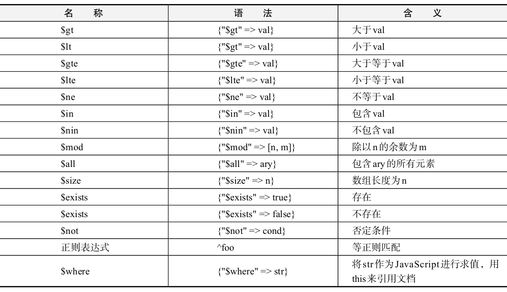

当然，通过多个条件的组合，也可以编写出像“大于2，小于8”这样的条件。

{lang="ruby"}
	coll.find(:j=>{"$gt"=>2,"$lt"=>8})
	=> #<Mongo::Cursor>

### find方法的选项

find方法可以通过第二个参数来指定一些查询选项。

{lang="ruby"}
	coll.find({:x=>4},{:limit=>10})

这表示在查询结果中只取出10个结果的意思。在Ruby中，末尾的参数为Hash时可以省略花括号，因此上述find调用也可以写成下面的形式：

{lang="ruby"}
	coll.find({:x=>4},:limit=>10)

而且，在Ruby 1.9中，当Hash以符号（symbol）为键时，也可以写成省略形式：

{lang="ruby"}
	coll.find({:x=>4},limit:10)

find方法的选项及其含义如表2所示。

C>表2　find方法的选项

C>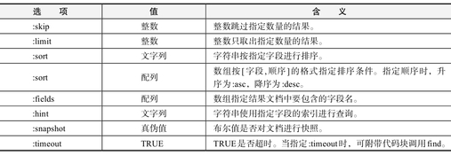

在find方法的选项中，skip、limit、sort也可以作为find所返回的游标对象的方法来进行调用。因此，像：

{lang="ruby"}
	coll.find({:x=>4},limit:10)

也可以写成：coll.find(:x=>4).limit(10)

sort在调用时可以不在数组中指定顺序，而是在参数中指定。因此，像：

{lang="ruby"}
	coll.find({:x=>4},sort:[:j,:desc])

用游标方法的形式，也可以写成：

{lang="ruby"}
	coll.find(:x=>4).sort(:j,:desc)

这两种写法，在内部处理上是完全相同的，因此选一种自己喜欢的写法就可以了。

### 原子操作

只有文档的插入和查询并不能构成数据库的完整功能，我们还需要进行更新和删除。文档的插入我们使用了save方法，保存好的文档会被赋予一个_id成员，因此，当要保存的文档的_id已存在时，就会覆盖相应_id的文档。也就是说，用find或find_one方法取出文档之后，将文档内容进行改写，然后再重新save的话（唯独不能改变_id成员的值），就可以替换原来的文档了。

MongoDB中不支持事务机制，对于其他连接对同一文档进行更新的行为，是无法做出保护的。MySQL在最开始不支持事务的时候还是非常有用的，由此可见，Web应用中的数据库系统，即便不支持事务，貌似也不是很大的问题。

MongoDB中虽然不支持事务，但可以通过update方法，在更新文档时排除来自其他连接的干扰。update方法与文档的更新操作是互斥的，其操作结果只有“更新成功”和由于某些原因“出错失败”这两种状态。也就是说，当多个连接同时对同一个文档进行update操作时，更新操作也不会发生“混淆”，而是保证其中只有某一个操作能够成功。失败的操作可以进行重试，从结果来看，和按顺序执行更新操作是一样的。

像这样，更新操作不会半路中断，也不会留下不完整状态的操作，被称为“原子操作”。

update方法最多可以接受三个参数。第一个是原始文档，第二个是新文档，最后一个是选项。其中选项是可以省略的。原始文档指的是更新之前的文档，但这里并不需要给出完整的文档，而是写成和find方法查询相同的格式即可。新文档指的是更新后的文档，这里也不需要给出完整的文档，只要给出包含更新后字段的Hash即可。当给出的字段已存在时就会更新其中的值，否则，就会添加一个新的字段。

update方法的选项和find方法一样，是通过Hash来指定的。update方法的选项如表3所示。我们用update方法，来进行对一个文档中的成员的值累加1这样的原子操作（图1）。在图1中，如果在调用update的地方用save方法来代替，在取出文档到累加并保存的这段时间内，如果该文档被其他连接改写，累加操作就会失效。以图2为例，两个连接几乎同时进行累加操作，但由于取出和保存文档的顺序是混杂的，因此虽然进行了两次累加1的操作，但实际上x的值只增加了1。

C>表3　update方法的选项

C>

{lang="ruby"}
	loop
	  doc = coll.find_one(:j=>0) /* 取出一个文档 */
	  orig = doc.dup /* 将更新前的文档保存下来 */
	  d["x"] += 1 /* 更新字段x */
	  r = coll.update(orig, doc, :safe=>true) 
	  /* 调用update。不可以用coll.save(doc)，为了确认更新结果设置了:safe选项 */
	  if r[0][0]["n"] == 1 /* 更新成功则跳出循环 */
	    break
	  end /* 循环：返回开头。从取出文档的步骤开始重试 */
	end

C>图1　乐观并发控制

C>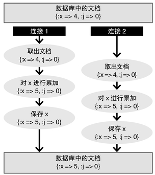

C>图2　失败的并发控制

相对地，像图1这样使用update方法的话，在进行更新操作时，就会像图3一样发现文档被改写这一情况，并通过重试最终得到正确的结果。

C>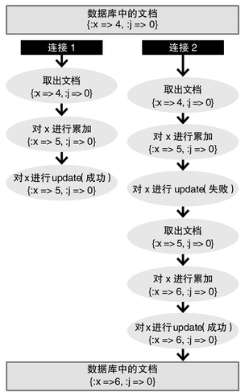

C>图3　成功的并发控制

不过，像累加这样的典型操作，要是能编写得更简单一些就好了。其实，只要在update中对更新文档的指定上稍微优化一下，就可以用一个update语句实现某些典型的原子操作了。

例如，图1中的累加操作，也可以写成下面这样：

{lang="ruby"}
	coll.update({:j=>0}, 
	    {"$inc"=>{:j=>1}})

这行代码的意思是：“找到字段j为0的文档，然后将j的值加1”。

update方法中可以使用的原子操作如图4所示。原子操作的名称都是以“$”开头的。表3中的“f”表示字段名，字段名可以通过字符串或者符号的形式进行指定。

C>表4　update的原子操作

|名称|功能|语法|
|$inc|对f的值加n|{"$inc" => {f => n}}|
|$set|将f的值设为val|{"$set" => {f => val}}|
|$unset|删除f|{"$unset" => {f => 1}}|
|$push|在f所指的数组中插入val|{"$push" => {f => val}}|
|$pushAll|在f所指的数组中插入ary的元素|{"$pushAll" => {f => ary}}|
|$addToSet|当f所指的数组中不存在val时则插入|{"$addToSet" => {f => val}}|
|$pop|删除f所指的数组的最后一个元素|{"$pop" => {f => 1}}|
|$pop|删除f所指的数组的第一个元素|{"$pop" => {f => -1}}|
|$pull|从f所指的数组中删除所有val|{"$pull" => {f => val}}|
|$pullAll|从f所指的数组中删除ary的元素|{"$pullAll" => {f => ary}}|

### ActiveRecord

在Ruby的世界中，作为面向对象的数据库访问手段，最有名的莫过于ActiveRecord了。在Ruby on Rails中，对关系型数据库的操作并不是直接进行的，而是通过ActiveRecord库将表中的各条记录作为对象来进行操作的。像这种将对象与记录进行对应的库，被称为OR Mapper。其中O代表对象（Object），R代表关系（Relation），因此它就是将关系与对象进行映射的意思。

有了ActiveRecord的帮助，在Rails程序设计中，可以不必关心底层的关系型数据库，完全以面向对象的方式来进行编程。ActiveRecord是一种十分易用的OR Mapper，但也并非完美无缺。其中一个令人不满意的地方，就是数据库结构信息和模型定义是分离的。由于Rails的组件遵循DRY（Don't Repeat Your-self）原则，因此ActiveRecord中不会对数据库结构定义进行重复描述。数据库结构信息只存在于它原本存在的地方，也就是数据库中。

信息的重复往往是造成bug的元凶，从这一点上来看，DRY原则是非常优秀的。但另一方面，对数据的操作以及对象之间的关系，则是在模型中进行定义的。从这个意义上来说，对象结构的信息和对其进行操作的信息是分开的。如果要查看字段信息，就必须要查看运行中的数据库。因此，想要将相关信息都整合在一起，是再自然不过的需求了。

另一个不满意的地方，则是ActiveRecord所提供的“一条记录=一个对象”这样的抽象化模型，并非总是最优的。在简单的水平上，“一条记录=一个对象”这样的抽象化模型实现起来很容易，只要将SQL调用所得到的记录封装成对象就可以了。但是，当对象的调用变得越来越频繁和复杂时，就会产生性能上的问题。结果，关系型数据库中的记录，并没有成为真正意义上的对象，在特殊情况下，会暴露出抽象化中的纰漏。这样的问题，被称为抽象泄漏（leaky abstraction）。

如果为了改善性能而使用缓存等手段的话，模型的逻辑会变得越来越复杂。另一方面，为了得到更优化的SQL，会对find方法等指定非常详细的选项，结果则是无法用Ruby来编写，最后变成直接写SQL了。这也许已经是ActiveRecord的极限了吧。

### OD Mapper

这个时候，就轮到MongoDB发挥威力了。由于MongoDB是不需要数据库结构的，因此结构定义和模型定义分离的问题也就不存在了。此外，MongoDB中也没有SQL，原本也无法进行复杂的查询，因此也不必担心会写出“SQL式的Ruby”。当然，也许大家会觉得这样是治标不治本，不过这个问题本来就应该分开来看。也就是说，如果使用MongoDB的话（如果应用程序能够使用MongoDB来实现的话），对ActiveRecord的那些不满也就可以得到缓解了。

要在Rails中使用MongoDB，有一些是可以与ActiveRe-cord互换的库。

* MongoMapper
* Mongoid
* activerecord-alt-mongo-adapter

由于MongoDB不是关系型数据库，因此这些库也不能称之为OR Mapper，而是应该称之为Object Document Mapper（ODMapper）了吧。

#### 1. MongoMapper

MongoMapper是MongoDB用ActiveRecord驱动中资历最老的一个，作者是John Nunemaker。话说，MongoDB本身是2009年才诞生的，因此所谓资历最老其实也老不到哪里去呢。它与ActiveRecord之间的兼容性很高，在Rails应用程序中，即便将MongoMapper当成ActiveRecord的替代品来使用，各种Rails插件也都能正常工作。

MongoMapper中的模型定义如图4所示。MongoDB中对模型进行定义时，本来就不需要数据库结构定义，实际上，在MongoMapper中结构定义也不是必需的，但也可以通过key方法对字段及其类型进行显式的声明。通过这样的显式声明，可以利用类型检查，使得一些问题更容易被发现，同时也使得数据库结构能够文档化。刚才我们讲过对ActiveRecord的不满意的地方，而在这里，我们可以将数据库的结构和操作在同一个地方进行定义，感觉非常好。

{lang="ruby"}
	require 'rubygems'
	require 'mongo_mapper'
	
	class Employee
	  include MongoMapper::Document
	  key :first_name
	  key :last_name
	  many :addresses
	end
	
	class Address
	  include MongoMapper::EmbeddedDocument
	  key :street
	  key :city
	  key :state
	  key :post_code
	end

C>图4　用MongoMapper进行模型定义

在MongoDB中，可以在一个文档中嵌入另一个文档（JSON），这在一般的关系型数据库中是很难做到的。当然，原本就是基于关系型数据库的ActiveRecord自然也不支持嵌入文档，而在MongoMapper中，对于嵌入的文档只要将include的类由MongoMapper::Document改成MongoMapper::Em-beddedDocument，就表示该对象不是保存在独立的集合中，而是一个嵌入文档。

#### 2. Mongoid

Mongoid是一个比MongoMapper更新一些的库，作者是Durran Jordan。Mongoid的功能很丰富，通过和ActiveRecord类似的API可以充分发挥MongoDB的全部功能。用Mongoid定义一个和图4相同的模型，代码如图5所示。在一些细节上有所差别，但大意是一样的。不过，Mongoid中是没有对于嵌入文档的定义的，但Mongoid中其实有一条规则：凡是指定了“in-verse_of”的对象关系都会自动被视为嵌入。这一点还是相当智能的。

{lang="ruby"}
	require 'rubygems'
	require 'mongoid'
	
	class Employee
	  include Mongoid::Document
	  field :first_name
	  field :last_name
	  has_many :addresses
	end
	
	class Address
	  include Mongoid::Document
	  field :street
	  field :city
	  field :state
	  field :post_code
	  belongs_to :employee, :inverse_of => :addresses
	end

C>图5　用Mongoid进行模型定义

此外，对于MongoDB所提供的如支持文档的类继承、验证、版本控制、回调，以及基于JavaScript的MapReduce等功能，Mongoid都通过和ActiveRecord（以及ActiveModel）相类似的API进行了实现，这也是Mongoid的设计思想之一。

#### 3. activerecord-alt-mongo-adapter

activerecord-alt-mongo-adapter是最新的一个库，作者是SUGAWARA Genki。MongoMapper和Mongoid都是替代Ac-tiveRecord来使用的库，相比之下，activerecord-alt-mongo-adapter则是一个用于ActiveRecord的DB适配器（图6）。换句话说，它并不是一个独立的替代库，而是一个通过ActiveRecord的数据库切换功能来使用的MongoDB访问适配器。因此，ActiveRecord本身的功能都可以直接使用。仔细想想的话，ActiveRecord虽然通过提供相应的适配器的方式实现了对各种数据库的支持，而且只要修改配置文件就可以对数据库系统进行切换，但其工作方式总归还是基于SQL的。

{lang="ruby"}
	class Employee < ActiveRecord::Base
	  include ActiveMongo::Collection
	  has_many :addresses
	end
	
	class Address < ActiveRecord::Base
	  include ActiveMongo::Collection
	end

C>图6　用activerecord-alt-mongo-adapter进行模型定义

然而，MongoDB属于NoSQL，当然是无法用SQL来进行解释的。为了搞清楚这个适配器是如何实现对MongoDB的支持的，我看了一下它的源代码。它为了能够解释从ActiveRecord传来的SQL，居然用Ruby编写了一个SQL语法解析器，而对于MongoDB的访问是通过这个SQL语法解析器来完成的。唔，好厉害啊。

不过，以ActiveRecord适配器的形式工作也并非尽善尽美，在我查到的范围内，像对嵌入文档的支持、模型内部字段声明、在模型定义中创建索引等功能都是不支持的。这些功能在关系型数据库中本来就不存在，而ActiveRecord也原本就没有考虑到在非关系型数据库上进行应用，因此在这一点上也不能指望Ac-tiveRecord。即便如此，通过利用ActiveRecord，它只用了相当于MongoMapper和Mongoid十分之一的代码量，就实现了对MongoDB的访问，可以说是很了不起的。

说到底，activerecord-alt-mongo-adapter只是一个Ac-tiveRecord适配器。因此，作为ActiveRecord的特点之一，它可以通过database.yml在开发环境DB和正式环境DB之间进行自动切换，这可以说是一个比较大的优点。

但与此同时，仅通过这个适配器很难用到MongoDB的全部功能，而且由于需要经过一个额外的SQL解析层，性能方面也很让人担心。

## 5.4　SQL数据库的反击

有一种说法称：云计算不再是SQL的时代，而是NoSQL的时代。因此，不依赖SQL且结构简单的NoSQL数据库受到了广泛的关注。那么，SQL数据库真的已经不再那么重要了吗？SQL数据库真的不支持云计算吗？

### “云”的定义

“云”这个词有很多种用法，不过它的定义却非常模糊，导致我们的讨论容易过度发散。为了让论点更加明确，我们在这里将“云”定义为“大规模分布式环境”这个概念。

当然，“云”并非总是代表“大规模分布式环境”，但在数据库系统的语境中，用“云”这个词一般是代表现有数据库系统很难应对的情况。也就是说，数据量和访问量这两者的其中一个，甚至是全部两个，其规模已经超过单独一台数据库服务器所能够应对的程度，必须要依靠由多台服务器协同工作所构成的分布式环境来进行应对。

在这样的环境中，不使用SQL的NoSQL数据库很受欢迎。像SQL这样复杂的查询访问是受限的，取而代之的则是多个NoSQL数据库自动分布到多台服务器上的架构。这种方式对大规模分布式环境拥有更强的亲和力。

### SQL数据库的极限

那么，SQL数据库真的不适合大规模分布式环境吗？在云计算环境中，它真的就不如NoSQL数据库吗？事实上并不一定。在云计算环境下最大限度利用现有SQL数据库的技术，目前已经在实用化方面取得了一定的进展。

其中一个基本的思路是对数据库进行分割。在专业领域，这种数据库分割被称为Sharding或者Partitioning。这种手法的目的，是通过将数据库中大量的记录分别存放到多台服务器中，从而避免数据库服务器的瓶颈。以mixi这样的社交网站（SNS）为例，可以理解为将用户编号为偶数的用户和编号为奇数的用户分别存放到不同的数据库中。这样就避免了对单独一台数据库服务器的集中访问，从而提高了处理速度。第一步的分割可以在应用程序级别上完成，在上述例子中，对编号为偶数和奇数的记录分别访问不同的数据库，而这样的逻辑可以编写在应用程序中。

不过，仔细想想就会发现，其实数据库的分割和应用程序逻辑的本质毫无关系，是需要在数据库层面上解决的问题。将这样的逻辑混入应用程序中的话，说实话是很“拙劣”的。数据库的问题，就应该在数据库中解决，不是吗？像这样能够实现自动分割的方法有很多种，这里我们介绍一下为MySQL提供分割功能的Spider。

### 存储引擎Spider

Spider是由ST Global公司的斯波健德（Kentoku Shiba）先生开发的一种存储引擎。在MySQL中，用于查询处理的数据库引擎和实际负责存储数据的存储引擎是相互独立的，对于每张数据表都可以采用不同的存储引擎。可能大家都听说过InnoDB、MyISAM之类的名字，这些都是MySQL的存储引擎。

Spider和它们一样，也是在MySQL上工作的存储引擎的一种。不过，Spider自身并不执行实际的数据存储操作，而是将这些操作交给其他的MySQL服务器来完成。也就是说，在使用Spider的时候，表面上看起来是一个数据库，实际上却可以将数据自动分割保存在多台数据库中（sharding），而且只要对一台数据库保存数据，也会同时在其他服务器的数据库中保存（repli-cation）。比起在应用程序端实现分割来说，用Spider来实现有下列这些优点：

* **逻辑和数据库相分离**：使用Spider，就意味着从应用程序端看起来，对数据库的访问和通常的MySQL访问是完全一样的。因此，在应用程序端不需要进行任何特殊的应对。
* **可维护性高**：和分割相关的信息都只维护在表定义中，而且，数据库分割策略也可以在表定义中进行设置。关于数据库的设置都集中在一个地方，这一点从可维护性的角度来说，是非常重要的。

刚才我们介绍了利用MySQL的存储引擎Spider进行自动分割的手法。其实实现自动分割的软件不仅只有这一种，单在MySQL数据库中，除了Spider之外，还有像MySQL Cluster、SpockProxy等其他方案。

### SQL数据库之父的反驳

尽管通过Sharding技术将数据库进行分割，就能够在分布式环境中运用SQL数据库，但却无法做到像一部分NoSQL数据库那样，能够根据需要自动增加节点来实现性能的扩充。此外，如果用SQL数据库来实现NoSQL中这种简单的查询处理，大多数情况下在性能上（如每秒查询数）都不及NoSQL。

虽说SQL和NoSQL各自所擅长的领域不同，但很多人曾经认为在大规模分布式环境中使用NoSQL是板上钉钉的事。在这个时候，迈克尔·斯通布雷克（Michael Stonebraker，1943—）站了出来。斯通布雷克是最早的RDB系统Ingres的开发者，在Ingres商用化之后，他开发了Ingres的后续版本Postgres，后者演变为现在的PostgreSQL。斯通布雷克应该被称为PostgreSQL之父，但他的贡献并非仅仅如此。由于Sybase以及MicrosoftSQL Server中都继承了他所开发的Ingres的代码，因此毫无疑问，他是一个对于SQL数据库整体都产生了巨大影响的人物。现在，斯通布雷克担任MIT（麻省理工学院）客座教授，同时还在几家数据库相关的企业中担任董事。

斯通布雷克在计算机协会ACM的学术期刊《Communi-cations of the ACM》（ACM通信）2010年4月号中刊登了一篇题为“SQL Databases vs NoSQL Databases”的专栏。在该专栏中，斯通布雷克以“所有的技术都有其擅长的领域，没有一种数据库是万能的”为前提，提出了以下观点：

* NoSQL的优势在于性能和灵活性。
* NoSQL的性能优于SQL这一说法，并非在所有情况下都成立。
* 通常认为NoSQL是通过牺牲SQL和ACID特性来实现其性能的，然而性能问题与SQL和ACID是无关的。

说实话，看了这些内容，我的第一反应就是：“唉？真的吗？”。作为像我这样写了很多文章，给别人灌输了“云计算时代非NoSQL莫属”观点的人来说，实在是百思不得其解。

那么我们就来看个究竟吧。根据这篇文章，决定SQL数据库性能的，是客户端与服务器之间的通信开销，以及服务器上的事务处理开销。而通信开销可以通过将大部分处理放在服务器上的存储过程（Stored Procedure）在一定程度上得以解决。

而对于服务器上的处理，大致进行分类的话，主要有4个瓶颈，而对于这些瓶颈的应对就是决定性能的关键。这4个瓶颈具体如下。

**日志（Logging）**：为了防止磁盘崩溃等故障的发生，大多数关系型数据库都会执行两次写入。即向数据库执行一次写入，再向日志执行一次写入。而且，为了防止日志信息丢失（为了实现ACID中的D），必须保证这些数据确实写入了磁盘中。这样，即便由于一些问题导致数据库崩溃，也可以根据日志的内容恢复到故障前的状态。然而，考虑到向磁盘写入的速度是非常慢的，因此向日志执行确定的写入操作是非常“昂贵”的。

**事务锁（Locking）**：在对记录进行操作之前，为了防止其他线程对记录进行修改，需要对事务加锁。这也形成了一项巨大的开销。

**内存锁（Latching）**：Latch是门闩的意思，这里是指对锁和B树等共享数据结构进行访问时所需要的一种排他处理方式，斯通布雷克管这种方式叫做Latching。这也是造成开销的原因之一。

**缓存管理（Buffer Management）**：一般来说，数据库的数据是写入到固定长度的磁盘页面中的。对于哪个数据写入哪个页面，或者是哪个页面的数据缓存在内存中，都需要由数据库进行管理。这也是一项开销很大的处理。

斯通布雷克认为，要实现高速的数据库系统，必须要消除上述所有4个瓶颈，而且上述瓶颈并非SQL数据库所固有的。听他这么一说，好像还真是这么回事。

NoSQL之所以被认为速度很快，是因为它在设计之初就考虑了分布式环境，通过多个节点将处理分摊了。然而，SQL数据库也是可以将处理分摊到多个节点上的。此外，即便是NoSQL数据库，只要涉及到磁盘写入操作，以及多线程架构下的缓存管理，也难以回避上述瓶颈中的一个或几个。

通过上面的分析，斯通布雷克的结论是，无论是SQL还是ACID特性，都不是影响云计算环境下数据库性能的本质性障碍。唔，原来如此。

随后，斯通布雷克还写了一篇博客，对于与CAP原理相对应的NoSQL数据库策略BASE（Basically Available, Soft-state, Eventually consistent）阐述了反对意见。这还真是让人大开眼界。

### SQL数据库VoltDB

之前讲的这些，还只是停留在“SQL数据库在理论上还存在着可能性”这个阶段，但作为技术大牛的斯通布雷克可不会仅仅满足于这样的结论，他已经在数据库业界的最前线活跃了40多年，绝对不是一个简单的人物。斯通布雷克在美国一家叫做VoltDB的创业型公司任CTO，该公司将他的上述观点进行了体现，开发出了VoltDB数据库系统，并以开源形式发布。这是何等惊人的行动力。

VoltDB有两个版本，一个是以GPL协议发布的开源社区版本（Community Edition），另一个是以订阅形式提供的收费版本。开源版本可以直接从VoltDB公司的官方网站获取。

VoltDB并不是一个像PostgreSQL或MySQL那样的通用数据库，而是一个面向特定领域（OLTP）进行了大幅度调优的数据库系统。在VoltDB的主页上是这样介绍它的：“VoltDB是面向大规模事务处理应用程序的SQL数据库系统。”其特征包括以下几点：

* 比传统RDBMS高出几十倍的性能
* 线性可扩展性
* 以SQL作为DBMS接口
* ACID特性
* 可365天24小时全天候工作的高可用性

看起来很有吸引力对吧？

不过，到底是用了怎样的手段才实现了这样的特性呢？尤其是斯通布雷克在博客中指出的那四个瓶颈，到底是用什么办法来解决的呢？

首先，VoltDB最大的特征在于，它是一个内存数据库系统。也就是说，数据基本上是储存在内存中的。由于数据存储在内存中，缓存管理的问题就得以解决，而且由于不存在磁盘崩溃的情况，也就不需要日志了。这样一来，四个瓶颈中一下子就解决了两个。

等等，先别高兴太早。电源一关，内存中的数据就消失了，这样的数据库岂不是无法提供ACID中的持久性这一特性吗？其实，在VoltDB中，持久性是通过复制（replication）的方式来维持的。VoltDB数据库是在由多台服务器组成的集群上工作的，在集群中的多台服务器上都保存有重复的数据副本，因此即便失去一台服务器，也不必担心数据会丢失。此外，VoltDB也提供了定期将数据写入文件的快照功能。

那么，剩下的两个瓶颈，即事务锁和内存锁又是如何解决的呢？在VoltDB中，数据库是分割成多个分区（partition）来管理的，对于每个分区都分配了一个独立的管理线程。也就是说，对分区的操作是单线程的，因此也就从根本上不需要用于实现排他处理的事务锁和内存锁机制了。

VoltDB通过这样的构造回避了瓶颈，其每秒事务数（TPS）可以跑出比传统RDBMS高50倍的成绩（根据VoltDB公司的测试数据）。怎么说呢，这是拿一般的磁盘写入型数据库和内存型数据库来比较，有这种程度的差距也许并不意外。此外，由于上述比较是在一台服务器上进行的，而VoltDB可以通过增加节点来使性能呈线性提升，也就是说，如果将服务器数量翻倍，则性能也几乎可以翻倍，因此还是非常值得期待的。

### VoltDB的架构

VoltDB采用以内存型集群运用为前提的架构，光这一点就和传统的RDBMS架构大相径庭，但它们之间的差异还远远不仅限于此。没有人知道，依靠打破RDBMS常识的想象力，向超高速的实现发起挑战的斯通布雷克，在这条路上到底能走多远。

C>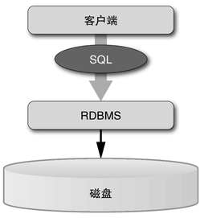

C>图1　传统的RDBMS架构

大家应该还记得，在上述“4个瓶颈”之前，曾经讲过“通信开销过大的问题，通过存储过程可以在一定程度上得到解决”。在传统的数据库中，有专门负责数据存储的数据库服务器，而应用程序是通过SQL来进行查询的（图1）。而对于需要重复进行的操作，可以通过某种手段，调用服务器上事先写好的存储过程来实现，从而在一定程度上减少通信量。存储过程的实现方式在各种RDBMS上都有所不同，有的是用C等语言来编写并载入到服务器上，也有的是将SQL进行扩展来编写存储过程。

不过，“走极端”的VoltDB可不是光有存储过程就满足了的。“既然存储过程可以改善性能，那么把所有的事务都用存储过程来实现不就好了吗？”于是，在VoltDB中，对服务器的调用只能运行事先编写好的过程。也就是说，VoltDB虽然是一个SQL数据库，但却无法从客户端来执行SQL查询（实际上貌似是可以的，只是不推荐而已）。这是何等的大刀阔斧。从结果来看，对VoltDB的访问不能使用现在主流的ODBC和JDBC方式，因为这些方式都是通过SQL来调用RDBMS功能的。要对VoltDB进行访问，需要用Java来编写程序。

也就是说，在MySQL等现有RDBMS的结构中包括通用的数据库服务器，客户端用SQL对该服务器进行访问，而在VoltDB中，访问数据库的过程本身是作为存储过程保存在数据库服务器中的，而客户端采用一种类似远程调用的方式对该存储过程进行调用（图2）。换句话说，数据库服务器与客户端的界限，在位置上有所不同。

C>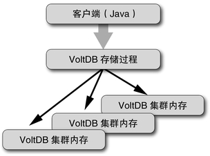

C>图2　VoltDB架构

### VoltDB中的编程

接下来，我们来看看在这一极端设计原则下，VoltDB的编程到底是如何进行的。

VoltDB的应用程序，基本上是采用图3这样的结构。要构筑一个应用程序，需要准备下列部件。

（1）数据库结构定义：用于定义数据库的SQL文件，内容基本上是SQL的CREATE TABLE语句。此外，CREATE INDEX和CREATE VIEW也是可以使用的。

（2）存储过程：用Java编写的存储过程。关于存储过程的内容我们稍后会详细讲解，基本上是负责构造SQL语句并执行它。当然，由于存储过程采用Java来编写，自然可以在服务器端执行更加复杂的逻辑。

（3）工程定义：一个名为project.xml的XML文件。在这个文件中定义了数据库定义文件名、存储过程名、数据库分割基准字段等信息。

（4）客户端代码：客户端的源代码，用Java编写。对VoltDB的访问可以使用org.voltdb包所提供的功能。

将上述（1）至（3）的信息提交给一个叫做VoltCompiler的程序，就可以生成叫做“目录”（catalog）的服务器端程序（jar文件）。此外，VoltCompiler中还需要指定下列内容：

{lang="text"}
	（a）构成集群的节点数量
	（b）每个节点的分区数量
	（c）集群“首领”的主机名

C>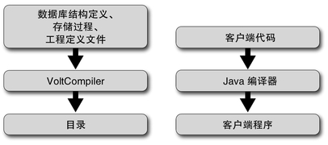

C>图3　VoltDB应用程序结构

上述信息需要在编译时指定，这意味着在NoSQL中十分常见的在运行时根据需要添加节点的动态可扩展性，这在VoltDB中是无法实现的。

在文档中，关于改变集群节点数量的步骤是这样写的：

{lang="text"}
	①将数据库输出至文件
	②修改节点数并重新生成目录
	③重新启动数据库
	④从文件向数据库载入数据

如果要对数据库结构定义进行修改，也需要按照上面的步骤来进行操作。

如果你习惯了MongoDB等NoSQL数据库的灵活性，就会觉得仅仅是为了修改结构定义和集群节点数就要这样操作实在是太麻烦了。不过与此同时，文档中也写道：“VoltDB在2到12个节点的环境下能够发挥最大效率，用10个节点就可以实现100万个QPS（每秒查询数量），大多数情况下这样的性能已经可以满足需要”。也就是说，用少量的节点数量就能实现压倒性的性能，因此灵活性也就显得不那么重要了。从某种意义上说，这样的思路和NoSQL正好是相互对立的两个极端。

### Hello VoltDB!

下面我们来看看实际的VoltDB程序。图4到图8就是VoltDB的Hello World程序。具体来说，就是用Insert存储过程将语言名称和该语言对应的HelloWorld写入数据库，然后用Se-lect存储过程读出语言名称对应的HelloWorld。

图4的数据库结构定义是一个简单的SQL中的CREATETABLE（创建表）语句，没有什么难点吧。图5和图6是用Java编写的存储过程定义。

{lang="sql"}
	CREATE TABLE HELLOWORLD (
	   HELLO CHAR(15),
	   WORLD CHAR(15),
	   DIALECT CHAR(15) NOT NULL,
	   PRIMARY KEY (DIALECT)
	);

C>图4　数据库结构定义（helloworld.ddl）

{lang="java"}
	import org.voltdb.*;
	
	@ProcInfo(
	    partitionInfo = "HELLOWORLD.DIALECT: 0",
	    singlePartition = true
	)
	
	public class Insert extends VoltProcedure {
	  public final SQLStmt sql = new SQLStmt(
	      "INSERT INTO HELLOWORLD VALUES (?, ?, ?);"
	  );
	
	  public VoltTable[] run(String hello,
	                       String world,
	                       String language)
	      throws VoltAbortException {
	          voltQueueSQL(sql, hello, world, language);
	          voltExecuteSQL();
	          return null;
	      }
	}

C>图5　Insert存储过程（Insert.java）

{lang="java"}
	import org.voltdb.*;
	
	@ProcInfo(
	    partitionInfo = "HELLOWORLD.DIALECT: 0",
	    singlePartition = true
	)
	
	public class Select extends VoltProcedure {
	
	  public final SQLStmt sql = new SQLStmt(
	      "SELECT HELLO, WORLD FROM HELLOWORLD " +
	      " WHERE DIALECT = ?;"
	  );
	
	  public VoltTable[] run(String language)
	      throws VoltAbortException {
	          voltQueueSQL(sql, language);
	          return voltExecuteSQL();
	      }
	}

C>图6　Select存储过程（Select.java）

VoltDB的存储过程定义包括下列要素：

* 对org.voltdb包的import
* 用@Procinfo指定分区
* 定义一个继承VoltProcedure的类
* 定义存储过程本体的run方法

其中，有必要对@ProcInfo部分做一些说明。VoltDB是将数据库分割成分区，并分布式地配置在集群中的节点上的。当存储过程所进行的操作仅限于对单一分区进行访问时，VoltDB可以发挥最佳性能。因此，如果要在编译时指定某个存储过程是否仅访问单一分区，以及该分区的分割基准是哪张表的哪个字段，就需要使用@ProcInfo记法。

project.xml中记载了关于数据库结构、存储过程、分区等信息。

{lang="xml"}
	<?xml version="1.0"?>
	<project>
	    <database name='database'>
	       <schemas>
	           <schema path='helloworld.sql' />
	       </schemas>
	       <procedures>
	           <procedure class='Insert' />
	           <procedure class='Select' />
	       </procedures>
	       <partitions>
	           <partition table='HELLOWORLD' column='DIALECT' />
	       </partitions>
	    </database>
	</project>

C>图7　工程定义（project.xml）

客户端代码则比较简单。基本上，对数据库的访问，只是使用callProcedure()方法，对project.xml中定义的存储过程进行调用而已。关于获取结果等操作，看一下图8中的示例代码，应该就能有个大致的理解了。

{lang="java"}
	import org.voltdb.*;
	import org.voltdb.client.*;
	
	public class Client {
	
	    public static void main(String[] args) throws Exception {
	        /*
	         * Instantiate a client and connect to the database.
	         */
	        org.voltdb.client.Client myApp;
	        myApp = ClientFactory.createClient();
	        myApp.createConnection("localhost", "program", "password");
	
	        /*
	         * Load the database.
	         */
	        myApp.callProcedure("Insert", "Hello", "World", "English");
	        myApp.callProcedure("Insert", "Bonjour", "Monde", "French");
	        myApp.callProcedure("Insert", "Hola", "Mundo", "Spanish");
	        myApp.callProcedure("Insert", "Ciao", "Mondo", "Italian");
	        myApp.callProcedure("Insert", "こんにちわ", "世界", "Japanese");
	
	        /*
	         * Retrieve the message.
	         */
	        final ClientResponse response = myApp.callProcedure("Select",                                                         "Spanish");
	        if (response.getStatus() != ClientResponse.SUCCESS){
	            System.err.println(response.getStatusString());
	            System.exit(-1);
	        }
	        final VoltTable results[] = response.getResults();
	        if (results.length != 1) {
	            System.out.printf("I can't say Hello in that language.");
	            System.exit(-1);
	        }
	
	        VoltTable resultTable = results[0];
	        VoltTableRow row = resultTable.fetchRow(0);
	        System.out.printf("%s, %s!¥n", row.getString("hello"),                                       row.getString("world"));
	    }
	}

C>图8　客户端代码（Client.java）

### 性能测试

在VoltDB的官方网站（https://voltdb.com/blog/key-value-benchmarking）中，刊登了与NoSQL的代表Cassandra进行对比的性能测试结果。不过，需要注意的是，VoltDB和Cassandra在擅长处理的对象方面是有所不同的。

例如，VoltDB是内存型数据库，Cassandra则不是。Cas-sandra无需定义数据库结构，比较灵活，VoltDB则不是。在对比中需要注意上述这几点。

VoltDB和Cassandra在以下三种性能测试中进行了对比。

**单纯键-值**：VoltDB具备用于实现键-值存储所需的充足性能，因此对用VoltDB实现的键-值存储与Cassandra进行了对比。测试内容为用50B的键和12KB的值进行50万对的访问和更新。在单节点、3节点（无复制）和3节点（有复制）这三种条件下对比5分钟的处理总数。

**多个整数列**：用50个32位整数作为值来代替单纯键-值进行对比。对比条件依然是单节点、3节点（无复制）和3节点（有复制）三种。

**多个整数列（批处理）**：依然是用50个32位整数作为值，但不同的是对每个键进行10次访问和更新。对比条件依然是单节点、3节点（无复制）和3节点（有复制）三种。

上述3次测试的结果如表1至表3所示。虽然集群的构成只有3个节点，规模比较小，但在对比的范围内，最好的情况下可以跑出相当于Cassandra性能16倍以上的成绩。不过，这个测试的目的，是为了证明使用SQL的数据库在云计算环境下也并不慢，而并不代表对大家接下来开发的应用程序数据库来说，VoltDB就是最佳选择，这一点请大家注意。

C>表1　键-值性能测试（5分钟事务数量）

C>

C>表2　多个整数列性能测试（5分钟事务数量）

C>

C>表3　多个整数列（批处理）性能测试（5分钟事务数量）

C>

### 小结

VoltDB是一种内存型数据库，且客户端无法直接调用SQL，这与传统的RDBMS在设计思想上有很大差异。然而相对地，它却展现出了优秀的性能，并可以通过增加节点数量，实现与NoSQL相当的线性扩展。

不过，由于数据基本上都是保存在内存中的，因此其容纳的数据总量会受到服务器安装的内存容量的限制。此外，虽然它具备复制和快照功能，但由硬件故障造成数据丢失的危险性，感觉比传统的数据库要高一些。而且，在数据库结构、构成集群的节点数量等系统结构的灵活性方面，和NoSQL等相比依然稍逊一筹，因此必须从一开始就对数据库结构进行精确的设计。

虽然性能很高，但却很难掌控，从这个意义上来看，VoltDB可以说是数据库中的“方程式赛车”了。VoltDB才刚刚诞生不久，今后也有进行诸多改善的计划。据说在这里提出的数据库结构和集群结构缺乏灵活性这一点，也将得到改善，在操作接口上也考虑支持JSON等等。VoltDB可以说是今后值得期待的一种数据库。

## 5.5　memcached和它的伙伴们

在程序的实现中，经常会忽略程序的运行时间。即便采用类似的实现方法，有时候运行速度也会相差很多。大多数情况下，这一速度上的差异是由数据访问速度的差异所导致的。

在程序中，虽然数据访问所消耗的时间看上去差不多，但实际上却有很大的差别。这是因为，数据访问所需要的时间，与数据存放的位置有很大关系。例如，内存中的数据与硬盘上的数据，其访问所需的时间可以相差数百万倍之多。

以机械旋转方式工作的硬盘，从驱动磁头到将盘片旋转到适当的扇区，需要几毫秒的时间，从CPU的速度来看这些时间都是需要等待的，而对内存的访问仅仅需要几纳秒的时间。相比之下，硬盘简直就像停止不动一样。此外，和位于外部的内存相比，位于CPU内部的寄存器和高速缓存的访问速度又能快上几倍。

### 用于高速访问的缓存

话虽如此，但内存的访问速度再快，要准备和硬盘同等容量的内存，将所有数据都保存在内存中，目前来看还是不现实的。

所幸的是，对数据的访问具备“局部性”的特点。也就是说，一个操作中所访问的数据大多是可以限定范围的。即便数据的量很大，但大多数的操作都是仅仅对一部分数据进行频繁的访问，而几乎不会去碰其余的数据。

既然如此，如果将这些频繁访问的数据复制到一个可以高速访问的地方，平时就在那个地方进行操作的话，就有可能为性能带来大幅度的改善。像这样“能够高速访问的数据存放地点”，被称为缓存（cache）。“缓存”这个词的英文cache，和“现金”的英文cash发音相同，但拼写方法是不同的。cache一词来自法语，原来是“储藏地”、“仓库”的意思。最近的CPU中为了高速访问数据和指令，都配备了一定的高速缓存，但缓存一词本身，应该是泛指所有用于加速数据访问的手段。

提到缓存，往往会包含以下含义：

* 可以高速访问。
* 以改善性能为目的。
* 仅用于临时存放数据，当空间已满时可以任意丢弃多出来的数据。
* 数据是否存放在缓存中，不会产生除性能以外的其他影响。

数据库的职责是用来永久存储数据，不可能将数据任意丢弃。缓存则不同，它具有较大的随意性。

### memcached

在提供缓存功能的软件中，比较流行的是memcached。memcached是由美国Danga Interactive公司在Brad Fitz-patrick（1980—）的带领下开发的一种“内存型键-值存储”软件，主要面向Web应用程序，对数据库查询的结果进行缓存处理。

当对数据库进行查询时，数据库服务器会执行下列操作：①解析SQL语句；②访问数据；③提取数据；④（根据需要）对数据进行更新等操作。考虑到数据库中的数据大多存放在磁盘上（当然，数据库服务器本身也有一定的缓存机制），这样的操作开销是非常大的。

另一方面，近年来，随着服务器及内存价格的下降，相比购买昂贵的高性能服务器来说，将查询结果缓存在内存中就可以以低成本实现高性能。因此，memcached并不是一个真正意义上的键-值存储数据库，而是主要着眼于以缓存的方式来改善数据访问的性能。

用于实现缓存功能的memcached具备以下特征：

* 以字符串为对象的键-值存储。
* 数据只保存在内存中，重启memcached服务器将导致数据丢失。
* 可以对数据设置有效期。
* 达到一定容量后将清除最少被访问的数据。
* 键的长度上限为250B，值的长度上限为1MB。

memcached能够接受的命令如表1所示。

memcached非常好用，应用也非常广泛。根据其主页上的介绍，表2所示的这些服务都使用了memcached。这些都是非常著名的网站或公司，当然，在很多没有那么有名的网站中，mem-cached的使用也十分广泛。

C>表1　memcached命令

|名称|功能|
|set|设置数据|
|add|插入新数据|
|replace|更新现有数据|
|append|在值之后添加数据|
|prepend|在值之前添加数据|
|get|获取数据|
|gets|获取数据（有唯一ID）|
|cas|更新数据（指定唯一ID）|
|delete|删除数据|
|incr|将数据视为数值并累加|
|decr|将数据视为数值并减少|
|stats|获取统计数据|
|flush_all|清空数据|
|version|版本信息|
|verbosity|设置日志级别|
|quit|结束连接|

C>表2　使用memcached的服务及企业

|服务名称或企业名称称|
|Bebo, Craigslist, Digg, Flickr, LiveJournal, mixi, Typepad, Twitter, Wikipedia, Wordpress, Yellowbot, YouTube|

### 示例程序

memcached可以通过C、C++、PHP、Java、Python、Ruby、Perl、Erlang、Lua等语言来访问。此外，memcached的通信协议是由简单的文本形式构成的，使用如telnet等方式也很容易进行访问，要开发新的客户端也非常容易。除了上述列举的语言之外，还有很多语言也提供了memcached客户端库。

下面我们来看看访问memcached客户端程序的示例吧（图1）。有很多库都提供了用Ruby访问memcached的功能，在这里我们用的是一个叫做memcache的库。正如图1最下方的注释所写的，对于同时执行查询和更新操作的数据进行缓存时一定要注意，否则一不小心就容易造成缓存和数据库之间的数据不匹配。通过memcache库也可以很容易地实现事务机制。下面我们来重新实现一下prepend命令吧（图2）。

{lang="ruby"}
	require 'memcache'
	
	# 连接memcached
	MCache = Memcache.new(:server => "localhost:11211")
	
	# 对userinfo进行带缓存查询
	def userinfo(userid)
	  # 使用“user:<userid>”为键来访问缓存
	  result = MCache.get("user:" + userid)
	
	  # 如果不存在于缓存中则返回nil
	  unless result
	    # 缓存中不存在，直接查询数据库
	    result = DB.select("SELECT * FROM users WHERE userid = ?", userid)
	    # 将返回结果存放在缓存中，以便下次从缓存中查询
	    MCache.add("user:" + userid,  result)
	  end
	  result
	end
	
	# 如果对userinfo进行更新，需要同时更新缓存

C>图1　Ruby编写的memcached客户端

{lang="ruby"}
	def mc_prepend(key, val)
	  loop do
	    # :设置:cas标志并获取唯一ID
	    v = MCache.get(key, :cas => true)
	    # 修改值并用cas命令设置
	    # 唯一ID可通过memcache_cas获取
	    v = MCache.cas(key, val + v, :cas => v.memcache_cas)
	    # 设置失败则返回nil（循环）
	    return v unless v.nil?
	  end
	end

C>图2　memcached事务示例

### 对memcached的不满

和其他大多数软件一样，随着使用的不断增加，memcached也遇到了当初从未设想过的应用场景，从而也招来了很多不满。对memcached的不满主要有下列这些：

**数据长度**：对键和值的长度分别限制在250B和1MB过于严格。越是大的数据查询起来就要花很长的时间，从这个角度来说，对这样的数据进行缓存的需求反而比较高。

**分布**：一台服务器的内存容量是有限的，如果能将缓存分布到多台服务器上就可以增加总的数据容量。然而memcached并没有提供分布功能。

**持久性**：顾名思义，memcached只是一个缓存，重启服务器数据就会丢失，且为了保持一定的缓存大小，还会自动舍弃旧数据。

不过，当对数据库进行访问来填充缓存的开销超过一定程度时，缓存的损失就要付出较高的代价。为了克服这一问题，（即便舍弃缓存这一最初的目的）便产生了对数据进行持久化的需求。

像最后的“持久性”这一点，虽然已经完全脱离了缓存的范畴，但随着其应用领域的扩展，还是会产生各种各样类似的要求。

在memcached的范围内，对这些问题，主要是采取在客户端方面进行努力来应对。例如，Ruby的memcache库中，提供了一个叫做“SegmentedServer”的功能，通过将键所对应的值分别存放到多台服务器中来支持长度很大的值。此外，还可以根据由键计算出的某种散列值，在客户端级别上实现对分布式数据存储的支持。其算法如图3所示。

{lang="ruby"}
	# 表示算法的简单Ruby代码
	class DistMemcache
	  def add(key, value)
	    # 由键计算散列值
	    hash = hash_func(key)
	    # 根据散列值选择服务器
	    server = @servers[hash % @servers.size]
	    # 向选择的服务器发送命令
	    server.add(key, value)
	  end
	  # 对其他的命令采用同样的方法
	end
	
	C>图3　memcache在客户端级别实现分布

对于持久性这一点，在客户端级别上恐怕是无能为力了。不过新版本的memcached中正在对数据存储功能进行抽象化，从而实现将数据以文件及数据库等形式进行保存，重启服务器也不会丢失。

### memcached替代服务器

刚才已经讲过，memcached的协议是基于文本的，非常简单，因此大多数键-值存储数据库都可以支持memcached协议。下面我们来介绍其中的几种数据库软件。

#### 1. memcachedb

名字只差了一个字母，很容易搞混。这是一款用Berkeley DB来保存数据的memcached替代服务器。memcachedb原本是由memcached改造开发而来，目的是为了应对memcached不支持数据持久性的问题。

#### 2. ROMA

我所参与的乐天技术研究所开发的键-值存储ROMA，也支持通过memcache协议来进行访问。ROMA是一种重视可扩展性的键-值存储，其数据库是由P2P方式的节点集合所构成的。数据在多个节点上保存副本，即便由于一些故障导致一个节点退出服务，也不会造成数据的丢失。memcached只是在客户端一侧实现了分布，相对而言，ROMA则是在服务器一侧实现了分布和冗余化。

ROMA服务器是用Ruby进行开发的，采用了可插式（pluggable）架构。通过用Ruby编写插件，并配置到服务器上，就可以很容易地实现数据保存方法的选择、服务器端命令的追加等。

采用Ruby进行实现，大家可能会担心性能方面的问题。ROMA是在乐天内部的各种场景下运用的，由于采用多个节点分担负荷，实际运用中并没有发生性能方面的问题。其实，在乐天这样大规模数据中心的应用中，发生硬件故障、访问量集中导致进程终止等问题几乎是家常便饭，因此比起性能来说，ROMA更加重视实现实际运用中的稳定性和灵活性。

#### 3. Flare

Flare是由GREE的CTO藤本真树领导开发的一种mem-cached替代键-值存储。其特征如下：

* 使用Tokyo Cabinet实现数据持久性
* 将数据复制到多台服务器上实现数据分区
* 无需停止系统就可以添加服务器的动态重组机制
* 节点监控＋故障转移（failover）
* 可支持大于256B的键和大于1MB的值

根据文档，GREE使用的Flare由12个节点（6个主节点、6个从节点）构成，目前正在对超过2000万个键和1GB级别的数据，以峰值每秒500～1000次访问的频率进行试运行。在这样的条件下，系统基本上没有什么负担，而且在运行中频繁更换服务器，也没有对系统的运转产生任何问题。

#### 4. Tokyo Tyrant

Tokyo Tyrant是由平林干雄开发的一种网络型键-值存储。很多键-值存储都在使用的DBM库Tokyo Cabinet也是平林先生开发的。相对而言，Tokyo Tyrant提供了通过网络进行访问的功能。Tokyo Tyrant支持memcached协议及HTTP协议，从这个角度来看，也可以视为memcached的替代服务。

Tokyo Tyrant虽然需要写入磁盘，但却能够实现与mem-cached同等的性能。

#### 5. kumofs

kumofs是由筑波大学的古桥贞之（现供职于美国TreasureDate公司）开发的一种键-值存储，实现了持久性和冗余故障容忍性。

用C++编写的kumofs，仅用1个节点就能够实现与mem-cached几乎同等的性能，还可以通过增加节点来进一步提高性能。此外，它还能够在不停止系统运行的情况下，进行节点增加、恢复等操作，从而对访问量的增加等情况作出灵活的应对。

### 另一种键-值存储Redis

看了上面这些例子，我们可以总结一下，大家对memcached的不满主要体现在以下几个方面：

{lang="text"}
	①缺乏持久性
	②不支持分布
	③据长度有限制

于是，为了解决这些不满，就出现了各种各样的替代服务器软件。然而，这里希望大家不要误会，这些不满决不等于是memcached的缺点。顾名思义，memcached原本是作为数据缓存服务器诞生的，因此，缺乏持久性、不支持分布，以及对数据长度的限制，都是作者原本的意图。可以说，之所以会出现这些不满，都是试图将memcached用在超出原本目的的场景中所导致的结果。这些不满的存在表明，大多数的使用案例中，用户所需要的不仅仅是一个缓存数据库，而是一个支持持久性和分布式计算的真正意义上的键-值存储数据库。而之所以选择了原本并不适合这一目的的memcached，无非是被memcached的高速性所吸引的结果。

也就是说，对同时满足：

{lang="text"}
	①高速
	②支持分布
	③持久性

这些特性的键-值存储的需求，是真实存在的。而且，如果不但支持单纯的字符串键值对，而是能够以更加丰富的数据结构作为值来使用的话，大家也一定是非常喜欢的。能满足上述这些需求的，就是Redis。Redis是意大利程序员Salvatore Sanfilippo开发的一种内存型键-值存储，其特征如下：

**内存型**：数据库的操作基本都在内存中进行，速度非常快。

**支持永久化**：上面提到数据库的操作是在内存中进行的，但是它提供了异步输出文件的功能。发生故障时，最后输出的文件之后的变更会丢失。虽然并不具备严格的可靠性，但却可以避免数据的完全丢失。

**支持分布**：现行版本和memcached一样支持在客户端一侧实现对分布的支持。Redis Cluster分布层的开发还在计划中。具备服务器端复制功能。

**除字符串之外的数据结构**：除了字符串，Redis还支持列表（list，字符串数组）、集（set，不包含重复数据的集合）、有序集（sorted set，值经过排序的集合）和散列表（hash，键-值组合）。在memcached中必须强制转换为字符串才能存放的数据结构，在Redis中可以直接存放。

**高速**：全面使用C语言编写的Redis速度非常快。根据测试数据，在Xeon 2.5GHz的Linux计算机上，每秒能够处理超过5万个请求。在另一个测试中，对单节点采用60个线程分别产生10000个请求的调用，Redis实现的每秒请求数量达到了mem-cached的两倍。而同样一个测试中，memcached的成绩几乎是MySQL的10倍，从这个角度来看，Redis的性能着实令人惊叹。

**原子性**：由于Redis内部是采用单线程实现的，因此各命令都具备原子性。像用incr命令对值进行累加而干扰其他请求的执行这样的问题是不会发生的。

**不兼容memcached协议**：Redis拥有自己的数据结构，功能也比较丰富，因此没有采用memcached协议。访问Redis需要借助客户端库，但Redis协议也是基于文本的简单协议（实际上和memcached协议很相似），因此无论各种语言都很容易支持，包括Ruby在内，很多语言都提供了用于访问Redis的库的功能（表3），数量上不输给memcached。

C>表3　提供Redis访问的语言

|语言名称|
|C, C#, Clojure, Haskell, Io, Erlang, Java, JavaScript, Go, Perl, Lua, PHP, Python, Ruby, Scala, Tcl|

Redis的主页上列出了一些实际采用Redis的企业名单，如表4所示。其中，Engine Yard和GitHub都是Ruby开发者耳熟能详的公司。

C>表4　采用Redis的企业

|企业名称|
|Boxcar, craigslist, Dark Curse, Engine Yard, GitHub, guard ian, LLOOGG, OKNOtizie, RubyMinds, Superfeedr, Vidiow iki, Virgilio Film, Wish Internet Consulting, Zoombu|

### Redis的数据类型

之前已经讲过，Redis中的值，除了字符串以外，还支持列表、集、有序集、散列等数据结构。

**字符串**：将字符串作为值的操作和memcached几乎是一样的。不知道为什么，Redis中没有提供在值之前添加字符串的prepend命令，也许是因为很少使用吧。实在需要这个功能的话，也可以通过事务来实现。

**列表**：相当于字符串数组。Redis不支持如数组的数组这样的嵌套数据结构，因此数组的元素仅限于字符串。

列表是可以对左右两端进行PUSH（添加一个元素）和POP（取出并删除一个元素）操作的，因此可以作为队列和栈来使用。

**集**：相当于不允许出现重复元素的集合。通过Redis的SADD命令添加元素，用SREM命令删除元素。由于没有定义元素的顺序，因此使用取出一个元素的SPOP命令不知道会取出集中的哪个元素。

集合之间也可以进行运算，例如SINTER可以得到两个集中都包含的元素（交集），SUNION则可以得到两个集中属于任意一个集的元素（合集）。此外，还可以用SINTERSTORE/SUNIONSTORE命令将运算结果保存到另一个键中。

**有序集**：Redis从1.1版开始提供的一种有序的集（sortedset，Redis术语中称为ZSET），在这种集中会将元素都视为数值并进行排序。说实话我不知道这样的数据结构应该用在哪里，也许在某些场合中用起来会很方便吧。

**散列表**：散列表就是通过键来查找值的一种表。在Redis中，散列表的键和值都限定为字符串。

将上述特征总结一下，与只能存放字符串键值对的mem-cached相比，Redis是一种高速、拥有丰富的数据结构，且支持异步快照功能的键-值存储。不过，Redis也并非万能的数据库，（至少截至到目前来说）还不具备服务器端Sharding（分布）和动态重组功能，也没有实现非常高的可靠性。

在数据不要求有很高的可靠性（也就是说，万一丢掉一些数据也不会产生严重后果）的场合，Redis就不是一个非常理想的数据库。从memcached的使用实例来看，这样的领域还是非常广阔的。

### Redis的命令与示例

Redis的命令如表5所示。虽然形式非常类似，但数量却远远多于memcached命令。

C>表5　Redis命令一览

C>

C>

C>

我们将图1的memcached客户端改造成了Redis客户端（图4）。Ruby的memcache库可以将对象自动转换成字符串，不过Redis库却不会进行这样的自动转换。因此，我们需要用Marshal显式地转换成字符串。除了这一点和memcached客户端有区别以外，其他方面基本上是相同的。在这里我们只使用了字符串，不过用Redis的散列来表达userinfo可能也挺有意思的。

{lang="ruby"}
	require 'redis'
	
	# 连接Redis
	RD = Redis.new(:host => "localhost", :port => 6379)
	
	# 对userinfo进行带缓存查询
	def userinfo(userid)
	  # 使用“user:<userid>”为键来访问缓存
	  result = RD.get("user:" + userid)
	
	  # 如果不存在于缓存中则返回nil
	  unless result
	    # 缓存中不存在，直接查询数据库
	    result = DB.select("SELECT * FROM users WHERE userid = ?", userid)
	    # 将返回结果存放在缓存中，以便下次从缓存中查询
	    RD.set("user:" + userid, Marshal.dump(result))
	  else
	    # 将缓存还原成对象
	    # redis库不会进行自动字符串转换
	    result = Marshal.load(result)
	  end
	  result
	end

C>图4　Ruby编写的Redis客户端

Redis中没有像memcached的prepend这样的命令，要进行这样的原子性操作就需要用到事务。memcached和Redis在事务的结构方面是有很大差异的。Redis的事务是由包裹在multi命令和exec命令之间的部分构成的。当遇到multi命令时，其后面的所有命令都只进行参数检查，然后记录到日志中，随后当遇到exec命令时，再一次性（原子性）地执行所有的记录下来的命令集。如果需要像prepend这样对现有key进行变更，则需要事先用watch命令指定要变更的key。

图5是一个通过Redis的事务来实现prepend的例子。不过，在编写这个程序的时候，Redis的事务功能还处于开发阶段，因此无法使用WATCH命令。

{lang="ruby"}
	def mc_prepend(key, val)
	  loop do
	    RD.watch(key)
	    v = RD.get(key) + val
	    RD.multi
	    RD.set(key, v)
	    unless RD.exec.nil?
	      return v
	    end
	  end
	end

C>图5　Redis事务示例

如果没有事务功能的话，可能很多人会感觉非常别扭。但是，在采用Redis的场景中，并不一定需要事务功能，因此我觉得开发和完善这个功能的优先级并不高。大家可以回想一下，在Web应用程序中广泛使用的MySQL数据库，也是在曾经很长一段时间内都不支持事务的。

### 小结

memcached以及对其“不满”的应对，似乎都是云计算网络环境改变了对软件的要求所导致的结果。环境的变化，必然会加速软件的进化。

**“支撑大数据的数据存储技术”后记**

历史上，对于数据存储的重大革新，可以说非RDB（关系型数据库）莫属了。具备关系代数理论背景的RDB，虽然在1970年诞生之初遭到了无数批评，称其毫无用武之地，然而现在RDB却几乎已经成为了数据库的代名词。

不过，在进入云计算时代之后，除RDB以外的其他方案开始受到越来越多的关注，本章中也对其中的MongoDB、mem-cached和Redis等进行了介绍。由于这些数据库系统并非采用SQL的RDB，因此经常被称为NoSQL。它们之所以备受关注，应该说是因为在大量节点构成的云计算系统中，数据库服务器逐渐成为了整个系统的瓶颈。而且，大多以通用数据库服务器形式提供的RDB，出于各种各样的原因，很难解决这一瓶颈问题。

当然，要解决这一问题，也可以采用复制（对多个数据库进行同步，并将请求分配到多个数据库服务器上）、分割（按照一定的标准将数据库分割成多个，例如将编号为偶数和奇数的会员分别保存到不同的数据库中）等技术，但这些技术都需要在客户端一侧提供一定的支持，而从结果来说，有很多场景只是需要通过键来获取值这样简单的操作，并不一定要动用RDB。

在这样的背景下，就出现了只管理键值对并将数据完全保存在内存中的缓存系统memcached。同时，由于缓存数据丢失后还是需要访问数据库，与其产生这样的开销还不如自己来管理文件写入操作，于是就诞生了ROMA、Flare等软件。

除此之外，随着对系统灵活性的需求不断提高，固定的数据库结构（schema）已经无法应对各种变化，于是便出现了追求数据库结构灵活性的MongoDB和Redis。另一方面，RDB也认识到其在速度和灵活性方面的问题，同时为了解决这些问题而进行着持续的进化。本章中介绍的VoltDB正是其中的一种尝试。

在这样的对峙中，数据存储的基础，即存储架构本身也在不断发生变化。速度缓慢的硬盘（HDD）正在被淘汰，数据存储逐步过渡到采用以闪存为基础的固态硬盘（SSD），同时，MRAM、FeRAM等下一代内存也开始崭露头角，据说可以实现和现有DRAM同等的速度、能够与闪存相媲美的容量，而且还能实现永久性数据存储（断电后数据不会丢失）。这样的话，数据库这一概念就有可能会从根本上被颠覆。

在下一代内存得到广泛运用的时代，曾经像Smalltalk、Lisp那样将内存空间直接保存下来的模型，说不定会东山再起。