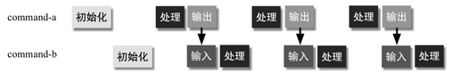
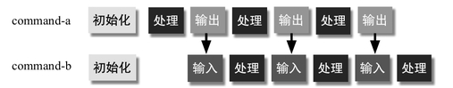
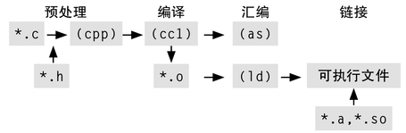
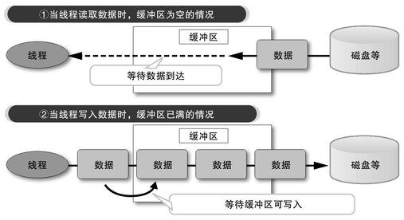
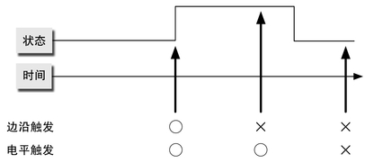
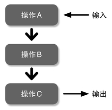
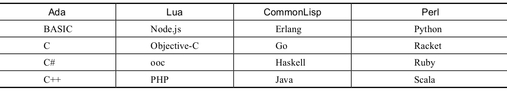
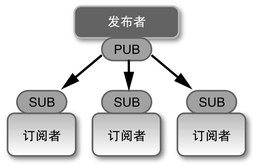
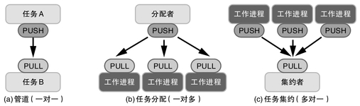
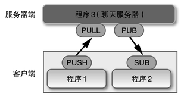

# 第六章：多核时代的编程

## 6.1　摩尔定律

关于摩尔定律，本书中已经提到了很多次。摩尔定律是由美国英特尔公司的戈登·摩尔（Gordon Moore）提出的，指的是“集成电路中的晶体管数量大约每两年翻一倍”。下面我们就摩尔定律进行一些更深入的思考。

实际上，在1965年的原始论文中写的是“每年翻一倍”，在10年后的1975年发表的论文中又改成了“每两年翻一倍”。在过去的40年中，CPU的性能大约是每一年半翻一倍，因此有很多人以为摩尔定律的内容本来是“每18个月翻一倍”。

其实，在几年前对此进行考证之前，我也是这么以为的。然而，似乎没有证据表明戈登·摩尔提出过“18个月”这个说法。但英特尔公司的David House曾经在发言中提到过“LSI（大规模集成电路）的性能每18个月翻一倍”，因此18个月一说应该是起源于他。

虽然摩尔定律也叫定律，但它并非像物理定律那样严格，而只是一种经验法则、技术趋势或者说是目标。然而，令人惊讶的是，从1965年起至今，这一定律一直成立，并对社会产生了巨大的影响。

### 呈几何级数增长

“两年变为原来的两倍”，就是说4年4倍、6年8倍、2n年2的n次方倍这样的增长速度。像这样“n年变为K的m次方倍”的增长称为几何级数增长。

对于我们来说，摩尔定律的结果已经司空见惯了，也许一下子很难体会到其惊人的程度。下面我们通过一个故事，来看一看这种增长的速度是何等令人震惊。

很久很久以前，在某个地方有一位围棋大师，他的围棋水平天下无双，于是领主说：“你想要什么我就可以赏给你什么。”大师说：“我的愿望很简单，只要按照棋盘的格子数，每天给我一定数量的米就可以了。第一天一粒米，第二天两粒米，每天都比前一天的粒数翻倍。”

“什么嘛，从一粒米开始吗？”领主笑道，“你可真是无欲无求啊。好，明天就开始吧。”围棋的棋盘有19×19个格子，也就是说领主要在361天中每天赏给大师相应的米。第一天给1粒，第二天是两粒，然后是4粒、8粒、16粒、32粒。一开始大家都觉得：“也就这么点米嘛。”但过了几天之后情况就发生了变化。两周还没到，赏赐的米粒一碗已经装不下了，要用更大的盆子才能装下，这时，有一位家臣发现情况不妙。

“主公，大事不好！”“怎么了？”“就是赏给大师的那些米，我算了一下，这个米的数量可不得了，最后一天，也就是第361天，要赏给他的米居然有2348542582773833227889480596789337027375682548908319870707290971532209025114608443463698998384768703031934976粒。这么多米，别说我们这座城，就是全世界的米都加起来也不够啊！”“天呐！”无奈，领主只能把大师叫来，请他换一个愿望。

看了上面这个故事，我想大家应该明白几何级数增长会达到一个多么惊人的数字了。而在半导体业界，这样的增长已经持续了40多年。大量技术人员不懈努力才将这样的奇迹变成现实，这是一项多么了不起的成就啊。

### 摩尔定律的内涵

半导体的制造使用的是一种类似印刷的技术。简单来说，是在被称为“晶圆”（wafer）的圆形单晶硅薄片上涂一层感光树脂（光刻胶），然后将电路的影像照射到晶圆上。其中被光照射到并感光的部分树脂会保留下来，其余的部分会露出硅层。接下来，对露出的硅的部分进行加工，就可以制作成晶体管等元件。摩尔定律的本质，即如何才能在晶圆上蚀刻出更细微的电路，是对技术人员的一项巨大的挑战。

技术人员可不是为了自我满足才不断开发这种细微加工工艺的。电路的制程缩小一半，就意味着同样的电路在硅晶圆上所占用的面积可以缩小到原来的1/4。也就是说，在电路设计不变的情况下，用相同面积的硅晶圆就可以制造出4倍数量的集成电路，材料成本也可以缩减到原来的1/4。

缩减制程的好处还不仅如此。构成CPU的MOS（Metal-Oxide Semiconductor，金属氧化物半导体）晶体管，当制程缩减到原来的1/2时，就可以实现2倍的开关速度和1/4的耗电量。这一性质是由IBM的Robert Dennard发现的，因此被命名为Dennard Scaling。

综上所述，如果制程缩减一半，就意味着可以用同样的材料，制造出4倍数量、2倍速度、1/4耗电量的集成电路，这些好处相当诱人，40多年来摩尔定律能够一直成立，其理由也正在于此。缩减制程所带来的好处如此之大，足以吸引企业投入巨额的研发经费，甚至出资建设新的半导体制造工厂也在所不惜。

### 摩尔定律的结果

可以说，最近的计算机进化和普及，基本上都是托了摩尔定律的福。半导体技术的发展将摩尔定律变为可能，也推动了计算机性能的提高、存储媒体等容量的增加，以及价格难以置信般的下降。

例如，现在一般的个人电脑价格都不超过10万日元（约合人民币8000元），但其处理性能已经超过了30年前的超级计算机。而且，当时的超级计算机光租金就要超过每月1亿日元（约合人民币800万元），从这一点上来说，变化可谓是天翻地覆的。

30年前（1980年左右）的个人电脑，我能想到的就是NEC（日本电气）的PC-8001（1979年发售），和现在的电脑对比一下，我们可以看到一些非常有趣的变化（表1）。

即使不考虑这30年间物价水平的变化，这一差距也可谓是压倒性的。而且，现在的笔记本电脑还配备了液晶显示屏、大容量硬盘和网络接口等设备，而30年前最低配置的PC-8001除了主机之外，甚至都没有配备显示屏和软驱，这一点也很值得关注。

C>表1　30年间个人计算机的变化

C>

### 摩尔定律所带来的可能性

不过，摩尔定律所指的只是集成电路中晶体管数量呈几何级数增长这一趋势，而计算机性能的提高、价格的下降，以及其他各种变化，都是晶体管数量增长所带来的结果。

让我们来思考一下，通过工艺的精细化而不断增加的晶体管，是如何实现上述这些结果的呢？最容易理解的应该就是价格了。单位面积中晶体管数量的增加，同时也就意味着晶体管的单价呈几何级数下降。当然，工艺的精细化必然需要技术革新的成本，但这种成本完全可以被量产效应所抵消。

工艺的精细化，意味着制造相同设计的集成电路所需的成本越来越低。即便算上后面所提到的为提升性能而消费的晶体管，其数量的增长也是绰绰有余的。也就是说，只要工艺的精细化能够得以不断地推进，成本方面就不会存在什么问题。不仅是CPU，电脑本身就是电子元件的集合。像这样由工艺改善带来的成本下降，就是上面所提到的30年来个人电脑在价格方面进化的原动力。

精细化所带来的好处并不仅仅是降低成本。由于前面提到的Dennard Scaling效应，晶体管的开关速度也得以实现飞跃性的提升。相应地，CPU的工作时钟频率也不断提高。30年前CPU的工作时钟频率还只有几Mhz，而现在却已经有几GHz了，实际提高了差不多1000倍。

由于构成CPU的晶体管数量大幅增加，通过充分利用这些晶体管来提高性能，也为CPU的高速化做出了贡献。现代的CPU中搭载了很多高速化方面的技术，例如将命令处理分割成多段并行执行的流水线处理（pipeline）；不直接执行机器语言，而是先转换为更加细化的内部指令的微指令编码（micro-operation de-coding）；先判断指令之间的依赖关系，对没有依赖关系的指令改变执行顺序进行乱序执行（out-of-order execution）；条件分支时不等待条件判断结果，而是先继续尝试执行投机执行（spec-ulative execution）等。

在现代CPU的内部，都配备了专用的高速缓存，通过高速缓存可以在访问内存时缩短等待时间。从CPU的运行速度来看，通过外部总线连接的主内存访问起来非常缓慢。仅仅是等待数据从内存传输过来的这段时间，CPU就可以执行数百条指令。

还好，对内存的访问存在局部性特点，也就是相同的数据具有被反复访问的倾向，因此只要将读取过的数据存放在位于CPU内部的快速存储器中，就可以避免反复访问内存所带来的巨大开销。这种方法就是高速缓存。缓存英文写作cache，原本是法语“隐藏”的意思，大概指的是将内存中的数据贮藏起来的意思吧。

不过，CPU内部配备的高速缓存容量是有限的，因此也有不少CPU配备了作为第二梯队的二级缓存。相比能够从CPU直接访问的高速、高价、低容量的一级缓存来说，二级缓存虽然速度较慢（但仍然比内存的访问速度高很多），但容量很大。还有一些CPU甚至配备了作为第三梯队的三级缓存。如果没有高速缓存的话，每次访问内存的时候，CPU都必须等待能够执行数百条指令的漫长时间。

最近的电脑中已经逐渐普及的多核和超线程（HyperThreading）等技术，都是利用晶体管数量来提高运算性能的尝试。

### 为了提高性能

接下来，我们就来具体看一看，那些增加的晶体管到底是如何被用来提高CPU性能的。

CPU在运行软件的时候，看起来似乎是逐一执行指令的，但其实构成CPU的硬件（电路）是能够同时执行多个操作的。将指令执行的操作进行分割，通过流水作业的方式缩短每一个单独步骤的处理时间，从而提升指令整体的执行速度，这种流水线处理就是一种提高性能的基本技术（图1）。

C>

图1　CPU的流水线处理典型的处理步骤包括：①取出指令（fetch）；②指令解码（decode）；③取出运算数据（data fetch）；④运算；⑤输出运算结果（write-back）等。

我们可以看出，将操作划分得越细，每一级的处理时间也会相应缩短，从而提升指令执行的吞吐量。出于这样的考虑，现代的CPU中流水线都被进一步细分，例如在Pentium4中被细分为31级（英特尔最新的Core架构是采用14级的设计）。

不过，流水线处理也并非十全十美。当流水作业顺利执行的时候是没什么问题的，一旦流水线上发生一个问题，就会接连引发一连串的问题。要想让流水线处理顺利进行，需要让各步骤都以相同的步伐并肩前进，而这一条件并非总能得到满足。

我们来看一个CPU加法指令的例子。x86的加法指令形是：

{lang="text"}
	ADD a b

这条指令的意思是将a和b相加，并将结果保存在a中。a和b可以是寄存器，也可以是内存地址，但对于CPU来说，访问寄存器和访问内存所需要的时间是天壤之别的。如果需要对内存进行访问，则在执行取出数据这一步的时间内，整个流水线就需要等待几百个时钟周期，这样一来流水线化对指令执行速度带来的那一点提升也就被抵消了。

像这样流水线发生停顿的问题被称为气泡（bubble /pipeline stall）。产生气泡的原因有很多种，需要针对不同的原因采取不同的对策。

上述这样由于内存访问速度缓慢导致的流水线停顿问题，被称为“数据冒险”（data hazard），针对这种问题的对策，就是我们刚刚提到过的“高速缓存”。高速缓存，实际上是消耗一定数量的晶体管用作CPU内部高速存储空间，从而提升速度的一种技术。

然而，高速缓存也不是万能的。即使晶体管数量大幅增长，其数量也不是无限的，因此高速缓存在容量上是有限制的。而且，缓存的基本工作方式是“将读取过一次的数据保存下来，使下次无需重新读取”，因此对于从未读取过的数据，依然还是要花费几百个时钟周期去访问位于CPU外部的内存才行。

还有其他一些原因会产生气泡，例如由于CPU内部电路等不足导致的资源冒险（resource hazard）；由于条件分支导致的分支冒险（branch hazard）等。资源冒险可以通过增设内部电路来进行一定程度的缓解。

这里需要讲解一下分支冒险。在CPU内部遇到条件分支指令时，需要根据之前命令的执行结果，来判断接下来要执行的指令的位置。不过，指令的执行结果要等到该命令的WB（回写）步骤完成之后才能知晓，因此流水线的流向就会变得不明确（图2）。

C>

C>图2　分支冒险

在图2中，首先执行第1条指令，与之并行执行第2条指令的取出操作（到第4个周期）。然而，第1条指令执行完毕之前，无法执行第2条指令的分支（第5个周期），这算是一种资源冒险吧。第1条指令的执行完全结束之后，才可以轮到第2条指令，而第2条指令的回写操作完成之后，才能够确定第3条指令位于哪个位置，也就是说，这时能够执行第3条指令的取出操作。

分支冒险可没那么容易解决。分支预测是其中的一种方案。分支预测是利用分支指令跳转目标上的偏向性，事先对跳转的目标进行猜测，并执行相应的取出指令操作。

图3是分支预测的执行示意图。到第2个指令为止的部分，和图2是相同的，但为了避免产生气泡，这里对分支后的指令进行预测并开始取出指令的操作。当预测正确时，整个执行过程需要9个周期，和无分支的情况相比只增加了2个。当预测错误时，流水线会被清空并从头开始。只要猜中就赚到了，没猜中也只是和不进行预测的结果一样而已，因此整体的平均执行速度便得到了提升。

C>

C>图3　分支预测

最近的CPU已经超越了分支预测，发展出更进一步的投机执行技术。所谓投机执行，就是对条件分支后的跳转目标进行预测后，不仅仅是执行取出命令的操作，还会进一步执行实际的运算操作。当然，当条件分支的预测错误时，需要取消刚才的执行，但当预测正确时，对性能的提升就可以比仅进行分支预测来得更加高效。

流水线是一种在垂直方向上对指令处理进行重叠来提升性能的技术，相对地，在水平方向上将指令进行重叠的技术称为超标量（superscalar）。也就是说，在没有相互依赖关系的前提下，多条指令可以同时执行。

例如，同时执行两条指令的超标量执行情况如图4所示。从理论上说，最好的情况下，执行6条指令只需要7个周期，这真的是了不起的加速效果。在图3的例子中是同时执行两条指令，但只要增加执行单元，就可以将理论极限提高到3倍甚至4倍。实际上，在最新的CPU中，可同时执行的指令数量大约为5条左右。

C>

C>图4　超标量执行

不过，事情总是没有这么简单。采用超标量架构的CPU，实际能够同时执行的指令数量要远远低于理想的值，这是因为数据间的依赖关系妨碍了指令的同时执行。例如：

{lang="text"}
	a = b + c
	d = e + f
	g = h + i

像上述这样的运算，各行运算之间没有相互依赖关系，最极端的情况下，即便打乱这些运算的顺序，结果也不会发生任何变化。像这样的情况，就能够发挥出超标量的最大性能。然而，如果是下面这样的话：

{lang="text"}
	a = b + c
	d = a + e
	g = d + h

第2行的运算依赖第1行的结果，第3行的运算依赖第2行的结果。这就意味着第1行的运算得出结果之前，无法执行第2行的运算；第2行的运算得出结果之前，也无法执行第3行的运算，也就是说，无法实现同时执行。

于是，为了增加能够同时执行的指令数量，可以使用“乱序执行”技术。这个问题的本质在于，一个指令和用于计算它所依赖的结果的指令距离太近。正是由于相互依赖的指令距离太近，才导致CPU没有时间完成相应的准备工作。

那么，我们可以在不改变计算结果的范围内，改变指令的执行顺序，这就是乱序执行。乱序执行的英文out of order原本多指“故障”的意思，但这里“order”指的是顺序，也就是命令执行顺序与排列顺序不同的意思。

例如：

{lang="text"}
	a = b + c
	d = a + e (依赖第1行)
	g = d + h (依赖第2行)
	j = k + l
	m = n + o

这样的运算，如果将顺序改为：

{lang="text"}
	a = b + c
	j = k + l
	d = a + e (依赖第1行)
	m = n + o
	g = d + h (依赖第3行)

就可以填满空闲的执行单元，顺利的话，就能够稀释指令之间的相互依赖关系，从而提高执行效率。

为了充分利用流水线带来的好处，出现了一种叫做RISC的CPU架构。RISC是Reduced Instruction Set Computer（精简指令集）的缩写，它具备以下特征：

* 精简且高度对称的指令集。
* 指令长度完全相同（也有例外）。
* 和传统CPU相比寄存器数量更多。
* 运算的操作数只能为寄存器，内存中的数据需要显式地加载到寄存器中。

这样的特征所要达到的目的如下：

* 通过减少指令种类使电路设计简单化（高速化）。
* 通过统一指令的粒度使流水线更加容易维持。
* 根据依赖关系对指令的重新排序可通过编译器的优化来实现。

大约20年之前，RISC架构是非常流行的，其中比较有名的有MIPS和SPARC等。现在，RISC虽然没有被非常广泛的应用，但像智能手机中使用的ARM处理器就属于RISC架构，此外，PlayStation 3等设备中采用的CELL芯片也是RISC架构的。

不过，RISC的指令集与传统CPU（与RISC相对的叫做CISC：Complex Instruction Set Computer，复杂指令集）的指令集是完全不同的，它们之间完全不具备兼容性，这也成为了一个问题。过去的软件资产都无法充分利用，这不得不说是一个很大的障碍。

于是，最近的x86系CPU中，使用微指令转换技术，在保持传统CISC指令的同时，试图获得一些RISC的优势。这种技术就是在外部依然使用传统x86指令集的同时，在内部将x86指令转换为粒度更小的RISC型指令集来执行。一条x86指令会被转换成多条微指令。通过这种方式，在保持兼容x86指令集的同时，根据软件的实际情况，可以获得除依赖关系控制之外的RISC优势。但即便如此，要填充所有超标量的执行单元，还是十分困难的。

那么，为什么执行单元无法被有效填充呢？原因在于数据之间存在相互依赖关系。既然如此，那可以将没有依赖关系的多个执行同时进行吧？这也就是所谓的超线程（Hyper Threading）技术。超线程是英特尔公司的一个专有名词，这一技术的一般名称应该叫做SMT（Simultaneous Multi-Threading，同时多线程），不过为了简便起见，这里统一使用超线程一词。

所谓超线程，就是通过同时处理多个取出并执行指令的控制流程，从而将没有相互依赖关系的运算同时送入运算器中，通过这一手段，可以提高超标量的利用效率。实际上，为了同时处理多个控制流程（线程），还需要增加相应的寄存器等资源。

超线程是对空闲运算器的一种有效利用，但并不是说可以按线程数量成比例地提高性能。根据英特尔公司发布的数据，超线程最多可提升30%左右的性能。不过，为了实现这30%的性能提升，晶体管数量仅仅增加了5%。用5%的晶体管增加换取30%的性能提升，应该说是一笔划算的交易。

除了上述这些以外，还有其他一些提高性能的方法。例如在一块芯片中封装多个核心的多核（multi-core）技术。最近的操作系统中，多进程早已司空见惯，对多核的运用空间也愈发广阔。多核分为两种形式，即包含多个相同种类核心的同构多核（ho-mogeneous multi-core），以及包含多个不同种类核心的异构多核（heterogeneous multi-core）。在异构多核中，除了通常的CPU以外，还可以包含GPU（Graphic Processing Unit，图像处理单元）和视频编码核心等。此外，包含数十个甚至数百个核心的芯片也正在研究，这被称为超多核（many-core）。

### 摩尔定律的极限

在过去40年里一直不断改变世界的摩尔定律，在今后是否能够继续有效下去，从目前的形势上看并不乐观。出于几个理由，芯片集成度的提高似乎已经接近了极限。

第一个极限就是导线宽度。随着半导体制造技术的进步，到2010年时，最小的制程已经达到32nm（纳米，1纳米为1米的10亿分之一）。刚才已经讲过，集成电路是采用一种类似印刷的技术来制造的，即用光照射模板，按照模板上的图案感光并在半导体上形成电路。问题是，电路已经变得过于精密，甚至比感光光源的波长还要小。目前采用的感光光源是紫外激光，而紫外激光的波长为96.5nm。

在森林里，阳光透过茂密的树叶在地面上投下的影子会变得模糊，无法分辨出一枚枚单独的树叶。同样，当图案比光的波长还小时，也会发生模糊而无法清晰感光的情况。为了能够印制出比光的波长更细小的电路，人们采用了各种各样的方法，例如在透镜和晶圆之间填充纯水来缩短光的波长等，但这个极限迟早会到来。下一步恐怕会使用波长更短的远紫外线或X射线。但波长太短的话，透镜也就无法使用了，处理起来十分困难。或许可以用反射镜来替代透镜，但曝光机构会变得非常庞大，成本也会上升。

其次，即便这样真的能够形成更加细微的电路，还会发生另理而进入量子物理范畴的现象，其中一个例子就是“隧穿效应”。关于隧穿效应的详细知识在这里就省略了（因为我自己也不太明白），简单来说，即便是电流本该无法通过的绝缘体，在微观尺度上也会有少量电子能够穿透并产生微弱的电流。这样的电流被称为渗漏电流，现代CPU中有一半以上的电力都消耗在了渗漏电流上。

精密电路中还会产生发热问题。电流在电路中流过就会产生热量，而随着电路的精密化，其热密度（单位面积所产生的热量）也随之上升。现代CPU的热密度已经和电烤炉差不多了，如果不用风扇等进行冷却，恐怕真的可以用来煎蛋了。上面提到的渗漏电流也会转化为热量，因此它也是提升热密度的因素之一。

假设电路的精密化还保持和现在一样的速度，恐怕不久的将来就会看到这样的情形——按下开关的一瞬间整个电路就蒸发掉了（如果没有适当的冷却措施的话）。

最后，也是最大的一个难题，就是需求的饱和。最近的电脑CPU性能已经显得有些驻足不前。CPU指标中最为人知的应该就是主频了。尽管每个CPU单位频率的性能有所差异，但过去一直快速增长的CPU主频，从几年前开始就在2GHz水平上止步不前，即便是高端CPU也是如此。而过去在Pentium 4时代还能够见到的4GHz级别主频的产品，今天已经销声匿迹了。

这是因为，像收发邮件、浏览网页、撰写文稿这些一般大众级别的应用所需要的电脑性能，用低端CPU就完全可以满足，主频竞争的降温与这一现状不无关系。

进一步说，过去人们一直习惯于认为CPU的性能是由主频决定的。而现在，在多核等技术的影响下，主频已经不是决定性能的唯一因素了。这也成为主频竞争的必然性日趋下降的一个原因。实际上，以高主频著称的Pentium 4，其单位频率性能却不怎么高，可以说是被主频竞争所扭曲的一代CPU吧。

上面介绍的这些对摩尔定律所构成的障碍，依靠各种技术革新来克服它们应该说也并非不可能，只是这样做伴随着一定的成本。从技术革新的角度来看，如果制造出昂贵的CPU也能卖得出去，这样的环境才是理想的。当然，总有一些领域，如3D图形、视频编码、物理计算等，即便再强大的CPU也不够用。但是这样的领域毕竟有限。每年不断高涨的技术革新成本到底该如何筹措，还是应该放弃技术革新从竞争中退出？近年来受到全球经济形势低迷的影响，半导体制造商们也面临着这一艰难的抉择。

### 超越极限

正如之前讲过的，摩尔定律已经接近极限，这是不争的事实。退一万步说，即使集成电路的精密化真的能够按现有的速度一直演进下去，总有一天一个晶体管会变得比一个原子还小。

不过，距离这一终极极限尚且还有一定的余地。现在我们所面临的课题，解决起来的确很有难度，但并没有到达无法克服的地步。

首先，关于导线宽度的问题，运用远紫外线和X射线的工艺已经处于研发阶段。由于这些波长极短的光源难以掌控，因此装置会变得更大，成本也会变得更高。但反过来说，我们已经知道这样的做法是行得通的，剩下的事情只要花钱就能够解决了。

比较难以解决的是渗漏电流及其所伴随的发热问题。随着半导体工艺技术的改善，对于如何降低渗漏电流，也提出了很多种方案。例如通过在硅晶体中形成二氧化硅绝缘膜来降低渗漏电流的SOI（Silicon On Insulator）等技术。此外，采用硅以外的材料来制造集成电路的技术也正在研究之中，但距离实用化还比较遥远。

从现阶段来看，要从根本上解决渗漏电流的问题是很困难的，但是像通过切断空闲核心和电路的供电来抑制耗电量（也就抑制了发热），以及关闭空闲核心并提升剩余核心工作主频（Hy-per Boost）等技术，目前都已经实用化了。

### 不再有免费的午餐

看了上面的介绍，想必大家已经对摩尔定律，以及随之不断增加的晶体管能够造就何等快速的CPU有了一个大致的了解。现代的CPU中，通过大量晶体管来实现高速化的技术随处可见。

然而与此同时，我们印象中的CPU执行模型，与实际CPU内部的处理也已经大相径庭。由条件分支导致的流水线气泡，以及为了克服内存延迟所使用的高速缓存等，从8086时代的印象来看都是难以想象的。

而且，什么也不用考虑，随着时间的推移CPU自然会变得越来越快，这样的趋势也快要接近极限了。长期以来，软件开发者一直受到硬件进步的恩惠，即便不进行任何优化，随着计算机的更新换代，同样的价格所能够买到的性能也越来越高。不过，现在即便换了新的计算机，有时也并不能带来直接的性能提升。要想提升性能，则必须要积极运用多核以及CPU的新特性。

最近，GPGPU（General Purpose GPU，即将GPU用于图形处理之外的通用编程）受到了越来越多的关注，由于GPU与传统CPU的计算模型有着本质的区别，因此需要采用专门的编程技术。

即便什么都不做，CPU也会变得越来越快的时代结束了，今后为了活用新的硬件，软件开发者必须要付出更多的努力——这样的情况，我将其称为“免费午餐的终结”。

在未来的软件开发中，如果不能了解CPU的新趋势，就无法提高性能。新的计算设备必然需要新的计算模型，而这样的时代已经到来。

## 6.2　UNIX管道

诞生于20世纪60年代后半的UNIX，与之前的操作系统相比，具有一些独到的特点，其中之一就是文件的结构。在UNIX之前，大多数操作系统中的文件指的是结构化文件。如果熟悉COBOL的话解释起来会容易一些，所谓结构化文件就是拥有结构的记录的罗列（图1）。

但UNIX的设计方针是重视简洁，因此在UNIX中抛弃了对文件本身赋予结构的做法，而是将文件定义为单纯的字节流。对于这些字节流应当如何解释，则交给每个应用程序来负责。文件的内容是文本还是二进制，也并没有任何区别。

例如，图1中所示的平面文件（flat file），是采用每行一条记录、记录的成员之间用逗号进行分隔的CSV（Comma Sepa-rated Values）格式来表现数据的。这并不是说UNIX对CSV这种文件格式有特别的规定，而只是相应的应用程序能够对平面文件中存放的CSV数据进行解释而已。

C>

C>图1　结构化文件与平面文件

UNIX的另一个独到之处就是Shell。Shell是UNIX用来和用户进行交互的界面，同时也是能够将命令批处理化的一种语言。

在UNIX之前的操作系统中，也有类似的命令管理语言，如JCL（Job Control Language）。但和JCL相比，Shell作为编程语言的功能更加丰富，可以对多个命令进行灵活地组合。如果要重复执行同样的操作，只要将操作过程记录到文件中，就能够很容易地作为程序来执行。像这样由“执行记录”生成的程序，被称为脚本（script），这也是之后脚本语言（script language）这一名称的辞源。

在UNIX中至今依然存在script这个命令，这个命令的功能是将用户在Shell中的输入内容记录到文件中，根据所记录的内容可以编写出脚本程序。script一词原本是“剧本”的意思，不过命令行输入是一种即兴的记录，也许叫做improvisation（即兴表演）更加合适。

最后一点就是串流管道（stream pipeline）。UNIX进程都具有标准输入和标准输出（还有标准错误输出）等默认的输入输出目标，而Shell在启动命令时可以对这些输入输出目标进行连接和替换。通过这样的方式，就可以将某个命令的输出作为另一个命令的输入，并将输出进一步作为另一个命令的输入，也就是实现了命令的“串联”。

在现代的我们看来，这三个特征都已经是司空见惯了的，但可以想象，在UNIX诞生之初，这些特征可是相当创新的。

### 管道编程

下面我们来看一看运用了串流管道的实际程序。图2是经常被用作MapReduce例题的用于统计文件中单词个数的程序。

通过这个程序来读取Ruby的README文件，会输出图3这样的结果。

{lang="shell"}
	tr -c '[:alnum:]' '¥n' | grep -v '^[0-9]*$' | sort | uniq -c | sort -r

C>图2　单词计数程序

Shell中，用“|”连接的命令，其标准输出和标准输入会被连接起来形成一个管道。这个程序是由以下5条命令组成的管道。

1. tr -c '[:alnum:]' '\n'
2. grep -v '^[0-9]*$'
3. sort
4. uniq -c
5. sort -r

下面我们来具体讲解一下每个命令的功能。

“tr”是translate的缩写，其功能是将输入的数据进行字符替换。tr会将第一个参数所指定的字符集合（这里的[:alnum:]表示字母及数字的意思）用第二个参数所指定的字符进行替换。“-c（complement）”选项的意思是反转匹配，整体来看这条命令的功能就是“将除字母和数字以外的字符替换成换行符”。

grep命令用来搜索与模板相匹配的行。在这里，模板是通过正则表达式来指定的：

{lang="text"}
	^[0-9]*$

这里，“^”表示匹配行首，“$”表示匹配行尾，“[0-9]*”表示匹配“0个或多个数字组成的字符串”。结果，这一模板所匹配的是“只有数字的行或者是空行”。

-v（revert）选项表示反转匹配，也就是显示不匹配的行。因此，这条grep命令的执行结果是“删除空行或者只有数字的行”。

之前的tr命令已经将字母和数字之外的字符全部替换成了换行符，也就是说将符号、空格等全部转换成了只有一个换行符的行（即空行）。对空行计数是没有意义的，因此需要忽略这些空行。此外，只有数字的行也不能算是单词，因此也需要忽略。

接下来的sort是对行进行重新排序的命令。到这条命令之前，数据流已经被转换成每行一个单词的排列形式，通过sort命令可以对原文中出现的单词按照字母顺序进行排序。这一排序操作看似没什么用，但接下来我们需要用uniq命令去掉重复的行，因此必须事先对输入的数据流进行排序。

{lang="text"}
	33 ruby
	23 the
	19 to     
	16 prefix     
	16 DESTDIR     
	13 and     
	13 Ruby     
	11 lib     
	11 is     
	11 TEENY     
	11 MINOR     
	11 MAJOR      
	7 of      
	6 you      
	6 org      
	6 lang      
	6 in      
	6 be      
	5 not
	（中略）      
	1 Author      
	1 Aug      
	1 Advanced

C>图3　单词计数结果（节选）

uniq是unique的缩写，该命令可以从已排序的文件中去掉重复的行。-c（count）选项表示在去掉重复行的同时显示重复的行数。在这里我们输入的文件是每行一个单词的形式，因此统计出已排序的单词序列中重复的行数，也就相当于是统计出了单词的数量。uniq命令才是单词计数的本质部分。

最后我们用sort -r命令对输出的信息进行整形。uniq命令执行完毕之后，就完成了“统计单词数量”这一任务，但从人类的角度来看，将单词按出现的数量降序排列才是最自然的，因此我们再执行一次sort命令。

我们希望在查看统计结果时将出现数量最多的单词（可以认为是比较重要的单词）放在前面，因此这次我们对sort命令加上了-r（reverse）选项，这个选项代表降序排列的意思。这个命令有一个副作用，就是出现数量相同的单词，会被按照字母逆序排列，这一点就请大家多多包涵吧。

将单词按出现数量降序排列的同时，还要将出现数相同的单词按字母顺序排列，实现起来是出乎意料地麻烦。这里就当是给各位读者留个思考题吧。其实用Ruby和Awk就可以比较容易地解决这个问题了。

像上面这样，将完成一个个简单任务的命令组合起来形成管道，就可以完成各种各样的工作，这就是UNIX范儿的管道编程。

### 多核时代的管道

在UNIX诞生的20世纪60年代末，多核CPU还不存在，因此管道原本的设计也并非以运用多核为前提。然而，不知是偶然还是必然，管道对于多核的运用却是非常有效的。

下面我们来看看在多核环境中，管道的执行是何等高效。

首先，我们来思考一下非常原始的单任务操作系统，例如MS-DOS。说是“原始”，但其实MS-DOS相比UNIX来说算是非常年轻的，在这里我们先忽略这一点吧。在MS-DOS中，同时只能有一个进程在工作，因此管道是通过临时文件来实现的。例如，当执行下列管道命令时：

{lang="shell"}
	command-a | command-b

MS-DOS（准确地说应该是相当于Shell的command.com）会生成一个临时文件，并将“command-a”的输出结果写入文件中。command-a的执行结束之后，再以该临时文件作为输入源来执行“command-b”。由于MS-DOS是一个单任务操作系统，每次只能进行一项处理，当然也就无法对多核进行运用（图4）。

C>

C>图4　单任务操作系统的管道

接下来我们来思考一下单核环境下的多任务操作系统。在这样的环境下，管道的命令是并行执行的。但由于只有一个核心，因此无法做到完全同时进行。和刚才一样，执行下列命令：

{lang="shell"}
	command-a | command-b

这次command-a与command-b是同时启动的。

然后，进程会在不断相互切换中各自执行，command-b会进入等待输入的状态。当command-b为读取数据发出系统调用时，如果暂时没有立即可供读取的数据，则操作系统会在数据准备好之前暂停command-b的进程，并使其休眠。

另一方面，command-a继续执行，其结果会输出到某个地方。这样一来command-b就有了可供读取的数据，command-b的进程就会被唤醒并恢复执行。

像这样，数据输出以接力棒的形式进行运作，多个进程交替工作，就是单核多任务环境中的执行方式（图5）。

C>

C>图5　多任务操作系统的管道（单核）

和单任务相比，多任务环境下的优势在于没有了无谓的文件输入输出操作，从而削减了相应的开销。

而且，由于多个进程是依次执行的，先得出的结果会立即通过管道传递，因此获取结果也会比较快一些。

不过，在多任务环境下，进程的切换也需要一定的开销，从总体来看，执行时间也未必会缩短。

接下来终于要讲到多核环境下的管道了。简单起见，在这里我们假设将command-a和command-b分别分配给两个不同的核心，在这样的情况下，管道执行如图6所示。

C>

C>图6　多任务操作系统的管道（多核）

我们可以看出，和图5相比，同时执行的部分增多了。非常粗略地数了一下，图4中需要11步完成的处理，这里只需要8步就完成了。不过我们投入了两个核心，理想状态下应该比单核缩短一半，但这样的理想状态是很难实现的。

假设操作系统足够聪明的前提下，只要增加管道的级数，使能够重叠的部分也相应增加，即便不特意去管多个核心的配置，只要自然编写程序形成管道，操作系统就会自动利用多个核心来提高处理能力。之所以说串流管道是非常适合多核的一种编程模型，原因也正是在于此。

### xargs——另一种运用核心的方式

大家知道xargs这个命令吗？xargs是用于将标准输入转换成命令行参数的命令。

例如，要在当前目录下搜索所有文件名中以“~”结尾的文件，需要执行find命令：

{lang="shell"}
	# find . -name '*~' 

这样就会将符合条件的文件名在标准输出中列出。

那么，如果我要将这些文件全部删除的话又该怎么做呢？这时就该轮到xargs命令出场了。

{lang="shell"}
	# find . -name '*~'|xargs rm 

这样一来，传递到xargs标准输入的文件名列表就作为命令行参数传递给了rm命令，于是就删除了符合条件的所有文件。

还有一个很少有人会实际碰到的问题，那就是命令行参数的数量是有上限的，如果传递的参数过多，命令执行就会失败。xargs也考虑了这一点，当参数过多时会分成几条命令分别执行。

上面所讲的内容与多核没什么关系，不过xargs提供了一个用于多核的命令行参数“-P”。

如图7所示，是用于将当前目录下未压缩的（即扩展名不是.gz的）文件全部进行压缩的管道命令。

{lang="shell"}
	# find . \! -name *.gz -type f -print0 | xargs -null -P 4 -r gzip -9

C>图7　文件压缩管道命令

首先是find命令，它的含义如下：

* “.”表示当前目录下
* “\! -name *.gz”表示文件名不以.gz结尾
* “-type f”表示一般文件（而不是目录等特殊文件）
* “-print0”表示将符合上述条件的文件名打印到标准输出。为了应对包含空格的文件名，采用null作为分隔符。

这样我们就得到了“当前目录下未压缩的文件名列表”。得到该列表之后，xargs命令被执行。xargs命令中的“-P”选项，表示同时启动指定数量的进程，这里我们设定为同时执行4个进程。“-r”选项表示当输入为空时不启动命令，即当不存在符合条件的文件时就表示不用进行压缩，因此我们在这里使用了“-r”选项。

为了应付空格，find命令使用了“-print0”选项，相应地，必须同时使用“-null”选项。通过这样的操作，就实现了将要压缩的对象文件名作为参数传递给“gzip -9”命令来执行。

gzip命令的“-9”选项表示使用较高的压缩率（会花费更多的时间）。

我们知道，文件的压缩比单纯的输入输出要更加耗时，而且，多个文件的压缩操作之间没有相互依赖的关系，这些操作是相互独立进行的。对于这样的操作，如果能够分配到多个进程来同时进行，应该说是最适合多核环境的工作方式。

在多核环境中，是否对xargs命令使用“-P”选项，直接影响了处理所需要的时间。由于gzip命令的输入输出等操作也需要一定的处理时间，因此-P设定的进程数应该略大于实际的核心数。我用手上的双核电脑进行了测试，用两个核心设定4个进程来执行时，可以获得最高的性能。

不过，在我所做的测试中，当文件数量较少时，即便使用了-P选项，也只能启动一个进程，无法充分利用多核。在这种情况下，对xargs命令使用-n选项来设定gzip一次性处理的文件数量，也许是个好主意。

例如，如果使用“-n 10”选项，就可以对每10个文件启动一个gzip进程。在我所做的测试中，启动4个进程进行并行压缩时，处理速度可以提高大约40%。理想状态下，两个核心应该可以得到100%的性能提升，因此40%的成绩比我预想的要低。当然，这也说明在实际的处理中，有很大一部分输入输出的开销是无法通过增加核心数量来弥补的。

### 注意瓶颈

在这里需要注意的是，瓶颈到底发生在哪里。

多核环境是将任务分配给多个CPU来提高单位时间处理能力的一种手段。也就是说，只有当CPU能力成为处理瓶颈时，这一手段才能有效改善性能。

然而，一般的多核计算机上，尽管搭载了多个CPU，但其他设备，如内存、磁盘、网络设备等是共享的。当处理的瓶颈存在于CPU之外的这些地方时，即便投入多个核心，也丝毫无法改善性能。

在这种情况下，我们需要的不仅是多个CPU，而是由多台“计算机”组成的分布式计算环境。分布式计算也是一项相当重要的技术，我们在这里不再过多赘述。

### 阿姆达尔定律

阿姆达尔定律是一个估算通过多核并行能够获得多少性能提升的经验法则，是由吉恩·阿姆达尔（Gene Amdahl，1922～）提出的，它的内容是：

（通过并行计算所获得的）系统性能提升效果，会随着无法并行的部分而产生饱和。

正如在刚才xargs的示例中所遇到的，即便是多核计算机，一般也只有一个输入输出控制器，而这个部分无法获得并行计算所带来的效果，很容易成为瓶颈。

而且，当数据之间存在相互依赖关系时，在所依赖的数据准备好之前，即便有空闲的核心也无法开始工作，这也会成为瓶颈。

综上所述，大多数的处理都不具备“只要增加核心就能够提高速度”这一良好的性质，这一点与在CPU内部实现流水线的艰辛似乎存在一定的相似性。

根据阿姆达尔定律，并行化之后的速度提升比例可以通过图8的公式来估算。假设N为无穷大，速度的提升最多也只能达到：

{lang="text"}
	1 / (1 - P)

例如，即便在P为90%这一非常理想的情况下，无论如何提高并行程度，整体上最多能够获得的性能提升也无法超过基准的10倍。这是因为，“(1 - P)”所代表的无法并行化的部分成为了瓶颈，使得并行化效果存在极限。

C>

C>图8　并行化后速度提升比例的公式

### 多核编译

像我们这些工程师在用电脑时，最消耗CPU的工作恐怕就是编译了。当然，编译也伴随一定的输入输出操作，但预处理、语法解析、优化、代码生成等操作对于CPU的开销是相当大的。

要编译一个文件，首先需要将C语言源文件（*.c）进行预处理（cpp）。cpp会进行头文件（*.h）加载（#include）、宏定义（#define）、宏展开等操作。

cpp的运行结果被送至编译器主体（ccl）。ccl会进行语句、语法解析和代码优化，并输出汇编文件（*.s）。随后，汇编器会将汇编文件转换为对象文件（*.o），也有些编译器可以不通过汇编器直接输出对象文件。

当每个C语言源文件都完成编译，并生成相应的对象文件之后，就可以启动连接器（ld）来生成最终的可执行文件了。连接器会将对象文件与各种库文件（静态链接库*.a和动态链接库*.so）进行连接（某些情况下还会进行一些优化），并输出最终的可执行文件（图9）。

C>

C> 图9　C语言编译流程

UNIX的“make”工具中提供了一个正好可以用于多核的选项——“-j（jobs）”，通过这个选项可以设定同时执行的进程数量。例如：

{lang="shell"}
	# make -j4

就表示用4个线程进行并行编译。从过去的经验来看，-j的设置应该略大于实际的核心数量为佳。

### ccache

我们先放下多核的话题，说点别的。有一个叫做ccache的工具，可以有效提高编译的速度。ccache是通过将编译结果进行缓存，来减少再次编译的工作量，从而提高编译速度的。

使用方法很简单，编译时在编译器名称前面加上ccache即可。例如：

{lang="shell"}
	# CC='ccache gcc' make -j4 

这样就可以让再次编译时所需的时间大幅缩短。每次都指定的话比较麻烦，也可以一开始就写到Makefile中。

当源代码或者其所依赖的头文件等发生修改时，make会重新执行编译。不过，源文件中也有很多行是和实际变更的部分无关的，而ccache会将（以函数为单位的）编译结果保存在主目录下的“.ccache”目录中，然后，在实际执行编译之前，与过去的编译结果进行比较，如果源代码的相应部分没有发生修改，则直接使用过去的编译结果。

在CPU中，缓存是高速化的一个重要手段，而在改善编译速度的场景中，也可以应用缓存技术。像这样，类似的手段出现在各种不同的场景中，的确是很有意思的事情。

### distcc

还有其他一些改善编译速度的方法，例如distcc就是一种利用多台计算机来改善编译速度的工具。

和ccache一样，只要在编译器名称前面加上distcc就可以改善编译性能了。不过在此之前，需要先配置好用哪些计算机来执行编译操作。在下列配置文件中：

{lang="shell"}
	# ~/.distcc/hosts 

填写用于执行编译的主机名（多个主机名之间用逗号分隔）。

当然，并不是随便填哪台主机都可以的。基本上，用于执行编译的主机应该是启动了distccd服务的主机，或者是可以通过ssh来登录的主机才行。启动distccd服务的主机直接填写主机名，可在ssh登录的主机前面加上一个“@”。当登录的用户名和本机不同时，需要在@前面写上用户名。

通过ssh来执行会提高安全性（distccd没有认证机制），但由于加密等带来的开销，编译性能会下降25%左右，因此用户需要在性能、安全性和易用性之间做出选择。

准备妥当之后，执行：

{lang="shell"}
	# CC='distcc gcc' make -j4 

就可以实现分布式编译了。

distcc的伟大之处在于，虽然是分布式编译，但无需拥有所有的头文件和库文件等完整的环境，只要（在同一个CPU下）安装了编译器，并能够运行ssh的主机，就可以很容易地实现分布式编译。之所以能够实现这一点，秘密在于预处理器和连接器是在本地执行的，而发送给远程主机的是已经完成预处理的文件。

编译性能测试

那么，通过使用上述这些手段，到底能够对编译性能带来多大的改善呢？我们来实际测试一下。

表1显示了运用各种手段后的测试结果，其中编译的对象是最新版的Ruby解释器。用于执行编译的是我那台有些古老的爱机——ThinkPad X61 Core2 duo 2.2GHz（双核）。distcc分布式编译使用的是一台Quad-Core AMD Opteron 2.4GHz（四核）的计算机。

C>表1　编译性能测试

|编译条件|编译时间（秒）|
|仅gcc -j|118.464|
|仅gcc -j|210.611|
|仅gcc -j|410.823|
|仅gcc -j|811.006|
|ccache -j|120.874|
|ccache -j1（第2次）|0.454|
|distcc -j2|11.649|
|distcc -j4|7.138|
|distcc -j8|7.548|

使用未经过任何优化的gcc进行编译时，整个编译过程需要约18.5秒。使用make的-j选项启动多个进程时，由于充分利用了两个核心，使得速度提高了40%以上。

ccache首次执行时比通常情况还要慢一点，但由于编译结果被缓存起来，在删除对象文件之后，用完全相同的条件再次编译时，由于完全不需要执行实际的编译操作，只需要取出缓存的内容就可以完成处理，因此编译速度快得惊人。

distcc的测试中只用了一台主机，在make -j2的情况下，由于ssh的开销较大，因此和本地执行相比性能改善不大，但如果设置更多的进程数量，执行时间就可以大大缩短。

### 小结

阿姆达尔定律指出，并行性是存在极限的，因此只靠多核无法解决所有的问题。但是大家应该能够看出，只要配合适当的编程技巧，还是能够比较容易地获得很好的效果。可以说，多核在将来还是颇有前途的。

## 6.3　非阻塞I/O

在需要处理大量连接的服务器上，如果使用线程的话，内存负荷和线程切换的开销都会变得非常巨大。因此，监听“有输入进来”等事件并进行应对处理，采用单线程来实现会更加高效。像这样通过“事件及应对处理”的方式来工作的软件架构，被称为事件驱动模型（event driven model）。

这种模型虽然可以提高效率，但也有缺点。在采用单线程来进行处理的情况下，当事件处理过程中由于某些原因需要进行等待时，程序整体就会停止运行。这也就意味着即便产生了新的事件，也无法进行应对了。

像这样处理发生停滞的情况被称为阻塞。阻塞多半会在等待输入输出的时候发生。对于事件驱动型程序来说，阻塞是应当极力避免的。

### 何为非阻塞I/O

由于大部分输入输出操作都免不了会遇到阻塞，因此在输入输出时需要尤其注意。输入输出操作速度并不快，因此需要进行缓冲。当数据到达缓冲区时，读取操作只需要从缓冲区中将数据复制出来就可以了。

在缓冲机制中，有两种情况会产生等待。一种是当缓冲区为空时，需要等待数据到达缓冲区（读取时）；另一种是在缓冲区已满时，需要等待缓冲区腾出空间（写入时）（图1）。这两种“等待”就相当于程序停止工作的“阻塞”状态。

尤其是在输入（读取）时，如果在数据到达前试图执行读取操作，就会一直等待数据的到达，这样肯定会发生阻塞。

相比之下，输出时由于磁盘写入、网络传输等因素，也有可能会发生阻塞，但发生的概率并不高。而且即便发生了阻塞，等待时间也相对较短，因此不必过于在意。

要实现非阻塞的读取操作，有下列几种方法。

* 使用read(2)的方法
* 使用read(2)+select的方法
* 使用read(2)+O_NONBLOCK标志的方法
* 使用aio_read的方法
* 使用信号驱动I/O的方法

这些方法各有各的优缺点，我们来逐一讲解一下。

C>

C>图1　输入输出中发生阻塞的原因

### 使用read(2)的方法

首先，我们先来确定示例程序的结构。在这里，我们只写出了程序中实际负责读取处理的回调部分。

我们将回调函数命名为callback，它的参数用于读取的文件描述符（int fd）和注册回调函数时指定的指针（void *data）（图2）。关于输出，我们再设置一个output函数。

{lang="c"}
	int
	callback(int fd, void *data)
	{
	  ....
	  /* 返回值成功为1 */
	  /* 到达EOF为0 */
	  /* 失败为-1 */
	}
	
	void
	output(int fd, const char *p, intlen)
	{
	  ....
	}

C>图2　回调函数与输出函数

在实际的程序中，需要在事件循环内使用选择可读写文件描述符的“select系统调用”和“epoll”等，对文件描述符进行监视，并对数据到达的文件描述符调用相应的回调函数。

我们先来看看只使用read系统调用的实现方法。对了，所谓read(2)，是UNIX中广泛使用的一种记法，代表“手册显示命令man的第2节中的read”的意思。由于第2节是系统调用，因此可以认为read(2)相当于“read系统调用”的缩写。

只使用read(2)构建的回调函数如图3所示。

{lang="c"}
	void
	callback(int fd, void *data)
	{
	  char buf[BUFSIZ];
	  int n;
	
	  n = read(fd, buf, BUFSIZ);
	  if (n < 0) return -1;  /* 失败 */
	  if (n == 0) return 0;  /* EOF */
	  output(fd, buf, n);    /* 写入 */
	  return 1;              /* 成功 */
	}

C>图3　用read(2)实现的输入操作（ver.1）

程序非常简单。当这个回调函数被调用时，显然输入数据已经到达了，因此只要调用read系统调用，将积累在输入缓冲区中的数据复制到buf中即可。当输入数据到达时，read系统调用不会发生阻塞。

read系统调用的功能是：①失败时返回负数；②到达EOF时返回0；③读取成功时返回读取的数据长度。只要明白了这些，就很容易理解图2中程序的行为了吧。小菜一碟。

不过，这样简单的实现版本中必然隐藏着问题，你发现了吗？这个回调函数正确工作的前提是，输入数据的长度要小于BUF-SIZ（C语言标准IO库中定义的一个常量，值貌似是8192）。

但是，在通信中所使用的数据长度一般都不是固定的，某些情况下需要读取的数据长度可能会超过BUFSIZ。于是，能够支持读取长度超过BUFSIZ数据的版本如图4所示。

{lang="ruby"}
	void
	callback(int fd, void *data)
	{
	  char buf[BUFSIZ];
	  int n;
	
	  for (;;) {
	    n = read(fd, buf, BUFSIZ);
	    if (n < 0) return -1;  /* 失败 */
	    if (n == 0) return 0;  /* EOF */
	    output(fd, buf, n);    /* 写入 */
	    if (n < BUFSIZ) break; /* 读取完毕，退出 */
	  }
	
	  return 1;                /* 成功 */
	}

C>图4　用read(2)实现的输入操作（ver.2）

在版本2中，当读取到的数据长度小于BUFSIZ时，也就是当输入缓冲区中的数据已经全部读取出来的时候，程序结束。当读取到的数据长度等于BUFSIZ时，则表示缓冲区中还可能有残留的数据，因而可通过反复循环，直到读取完毕为止。

问题都解决了吗？还没有，事情可没那么简单。当输入的数据长度正好等于BUFSIZ时，这个程序会发生阻塞。我们说过，避免阻塞对于回调函数来说是非常重要的，因此这个程序还无法实际使用，我们还需要进行一些改进。

### 边沿触发与电平触发

好了，接下来我要宣布一件重要的事。我们刚才说图3的程序只能支持读取长度小于BUFSIZ的数据，但其实只要将读取的数据直接输出，它还是可以正常工作的，而且不会发生阻塞。不过，要实现这一点，负责事件监视的部分需要满足一定的条件。

在事件监视中，对事件的检测方法有两种，即边沿触发（edgetrigger）和电平触发（level trigger）。这两个词原本是用在机械控制领域中的，边沿触发是指只在状态变化的瞬间发出通知，而电平触发是指在状态发生变化的整个过程中都持续发出通知（图5）。

C>

C>图5　边沿触发与电平触发

select系统调用属于电平触发，epoll默认也是电平触发，但epoll也可以通过显式设置来实现边沿触发。

具体来说，是在epoll_event结构体的events字段通过EPOLLET标志来进行设置的。

要让图3的程序在不阻塞的状态下工作，事件监视就必须采用电平触发的方式。也就是说，在调用回调函数执行输入操作之后，如果读取缓冲区中还有残留的数据，在电平触发的方式下，就会再次调用回调函数来进行读取操作。

那么，采用电平触发就足够了吗？边沿触发的存在还有什么意义呢？由于边沿触发只在数据到达的瞬间产生事件，因此总体来看事件发生的次数会比较少，这也就意味着回调函数的启动次数也会比较少，可以提高效率。

### 使用read(2) + select的方法

刚才已经讲过，图3版本的程序，会将输入缓冲区中积累的数据全部读取出来，而当输入缓冲区为空时，调用read系统调用就会发生阻塞。为了避免这个问题，需要在调用read之前检查输入缓冲区是否为空。

下面，我们来创建一个checking_read函数。它先调用read系统调用，然后通过select系统调用检查输入缓冲区中是否有数据（图6）。为了判断是否有剩余数据，checking_read比read增加了一个参数。调用checking_read来代替read，如果参数cont的值为真，就表示输入缓冲区中还有剩余的数据。

用这种方法，在边沿触发的方式下也可以正常工作。边沿触发的好处就是能够减少事件发生的次数，但相对地，select系统调用的调用次数却增加了。此外，在每次调用read系统调用时，还要问一下“还有剩下的数据吗”，总让人感觉怪怪的。

{lang="c"}
	#include <sys/time.h>
	#include <sys/types.h>
	
	int
	checking_read(int fd, char *buf, int len, int *cont)
	{
	  int n;
	  *cont = 0;               /* 初始化 */
	  n = read(fd, buf, len);  /* 调用read(2) */
	  if (n > 0) {             /* 读取成功 */
	    fd_set fds;
	    struct timeval tv;
	    int c;
	 
	    FD_ZERO(&fds);     /* 准备调用select(2) */
	    FD_SET(fd, &fds);
	    tv.tv_sec = 0;         /* 不会阻塞 */
	    tv.tv_usec = 0;
	    c = select(fd+1, &fds, NULL, NULL, &tv);
	    if (c == 1) {       /* 返回值为1=缓冲区不为空 */
	      *cont = 1;           /* 设置继续标志 */
	    }
	  }
	  return n;
	}
	
	void
	callback(int fd, void *data)
	{
	  char buf[BUFSIZ];
	  int n, cont;
	
	  for (;;) {
	      n = checking_read(fd, buf, BUFSIZ, &cont);
	      if (n < 0) return -1;  /* 失败 */
	      if (n == 0) return 0;  /* EOF */
	      output(fd, buf, n);    /* 写入 */
	      if (!cont) continue;   /* 读取完毕，退出 */
	  }
	  return 1;                /* 成功 */
	}

C>图6　用read(2)实现的输入操作（ver.3）

### 使用read+O_NONBLOCK标志

毕竟read系统调用可以直接接触输入缓冲区，那么理所当然地，在读取数据之后它应该知道缓冲区中是否还有剩余的内容。那么，能不能实现“调用read，当会发生阻塞时通知我一下”这样的功能呢？

当然可以。只要在文件描述符中设置一个O_NONBLOCK标志，当输入输出中要发生阻塞时，系统调用就会产生一个“继续执行的话会发生阻塞”的错误消息提示，这个功能在UNIX系操作系统中是具备的。使用O_NONBLOCK的版本如图7所示。

#include <fcntl.h>
#include <errno.h>

/* (a) 初始化程序的某个地方 */
inf fl;

fl = fcntl(fd, F_GETFL);
fcntl(fd, F_SETFL, fl|O_NONBLOCK);
/* 到此为止 */
void
callback(int fd, void *data)
{
  char buf[BUFSIZ];
  int n;

  for (;;) {
     n = read(fd, buf, BUFSIZ);
     if (n < 0) {
       if (errno == EAGAIN) { /* EAGAIN=缓冲区为空 */
         return 1;            /* 读取操作结束 */
       }
       return -1;             /* 失败 */
     }
     if (n == 0) return 0;    /* EOF */
     output(fd, buf, n);      /* 写入 */
  }
}

C>图7　用read(2)实现的输入操作（ver.4）

怎么样？由于这次我们能够从本来拥有信息的read直接收到通知，整体上看比图6的版本要简洁了许多。

这个功能仅在对文件描述符设置了O_NONBLOCK标志时才会有效，因此在对文件描述符进行初始化操作时，不要忘记使用图7(a)中的代码对标志进行设置。

这种方法效率高、代码简洁，可以说非常优秀，但有一点需要注意，那就是大多数输入输出程序在编写时都没有考虑到文件描述符设置了O_NONBLOCK标志的情况。

当设置了O_NONBLOCK标志的文件描述符有可能发生阻塞时，会返回一个错误，而不会发生实质上的阻塞。一般的输入输出程序都没有预想到这种行为，因此发生这样的错误就会被认为是读取失败，从而引发输入输出操作的整体失败。

使用O_NONBLOCK标志时，一定要注意文件描述符的使用。O_NONBLOCK标志会继承给子进程，因此在使用fork的时候要尤其注意。以前曾经遇到过这样的bug：①对标准输入设置了O_NONBLOCK；②用system启动命令；③命令不支持O_NONBLOCK，导致诡异的错误。那时，由于忘记了子进程会继承O_NONBLOCK标志这件事，结果花了大量的时间才找到错误的原因。

### Ruby的非阻塞I/O

刚才我们对C语言中的非阻塞I/O进行了介绍，下面我们来简单介绍一下Ruby的非阻塞I/O。

Ruby从1.8.7版本开始提供这里介绍过的两个实现非阻塞I/O的方法，即read_partial和read_nonblock。read_partial方法可以将当前输入缓冲区中的数据全部读取出来。

read_partial可以指定读取数据的最大长度，其使用方法是：

{lang="ruby"}
	str = io.read_partial(1024)

read_partial基本上不会发生阻塞，但若输入缓冲区为空且没有读取到EOF时会发生阻塞。也就是说，仅在一开始原本就没有数据到达的情况下会发生阻塞。

换句话说，只要是通过事件所触发的回调中，使用read_partial是肯定不会发生阻塞的，因此read_partial在实现上相当于read+select的组合。

将图6的程序改用Ruby进行的实现如图8所示。不过，和图6的程序不同的是，当数据大于指定的最大长度时不会循环读取。在读取的数据长度等于最大长度时，如果循环调用read_partial就有可能会发生阻塞。这真是个难题。

{lang="ruby"}
	def callback(io, data)
	  input = io.read_partial(4096)
	  output(io, input)
	end

C>图8　使用read_partial的示例

相对地，read_nonblock则相当于read+O_NONBLOCK的组合。read_nonblock会对io设置O_NONBLOCK并调用read系统调用。read_nonblock在可能要发生阻塞时，会返回IO::WaitReadable模块所包含的异常。

read_nonblock的参数和read_partial是相同的。我们将图7的程序用read_nonblock改写成Ruby程序（图9）。和C语言的版本相比，Ruby版显得更简洁，而且read_nonblock会自动设置O_NONBLOCK标志，因此不需要进行特别的初始化操作。

{lang="ruby"}
	def callback(io, data)
	  loop do
	    begin
	      input = io.read_nonblock(4096)
	      output(io, input)
	    rescue IO::WaitReadable
	      # 缓冲区为空了，结束
	      return
	    end
	  end
	end

C>图9　使用read_nonblock的例子

### 使用aio_read的方法

POSIX提供了用于异步I/O的“aio_XXXX”函数集（表1）。例如，aio_read用于以异步方式实现和read系统调用相同的功能。这里的aio就是异步I/O（Asynchronous I/O）的缩写。

C>表1　异步I/O函数

|名称|功能|
|aio_read|异步read|
|aio_write|异步write|
|aio_fsync|异步fsync|
|aio_error|获取错误状态|
|aio_return|获取返回值|
|aio_cancel|请求取消|
|aio_suspend|请求等待|

aio函数集的功能，是将通常情况下会发生阻塞的系统调用（read、write、fsync）在后台进行执行。这些函数只负责发出执行系统调用的请求，因此肯定不会发生阻塞。

运用aio_read的最简单的示例程序如图10所示，它的功能非常简单： 

* 打开文件
* 用aio_read发出读取请求
* 用aio_suspend等待执行结束
* 或者用aio_error检查执行结束
* 用aio_return获取返回值

下面我们来看看程序的具体内容。

{lang="c"}
	1   /* 异步I/O所需头文件 */
	2   #include <aio.h>
	3
	4   /* 其他头文件 */
	5   #include <unistd.h>
	6   #include <string.h>
	7   #include <stdio.h>
	8   #include <errno.h>
	9
	10  int
	11  main()
	12  {
	13      struct aiocb cb;
	14      const struct aiocb *cblist[1];
	15      char buf[BUFSIZ];
	16      int fd, n;
	17
	18      /* 准备文件描述符 */
	19      fd = open("/tmp/a.c", O_RDONLY);
	20
	21      /* 初始化控制块结构体 */
	22      memset(&cb, 0, sizeof(struct aiocb)); /* 清空 */
	23      cb.aio_fildes = fd;                  /* 设置fd */
	24      cb.aio_buf = buf;                    /* 设置buf */
	25      cb.aio_nbytes = BUFSIZ;              /* 设置buf长度 */
	26
	27      n = aio_read(&cb);                     /* 请求 */
	28      if (n < 0) perror("aio_read");     /* 请求失败检查 */
	29
	30  #if 1
	31      /* 使用aio_suspend检查请求完成 */
	32      cblist[0] = &cb;
	33      n = aio_suspend(cblist, 1, NULL);
	34  #else 1
	35      /* 使用aio_error也能检查执行完成情况 */
	36      /* 未完成时返回EINPROGRESS */
	37      while (aio_error(&cb) == EINPROGRESS)
	38          printf("retry\n");
	39  #endif
	40
	41      /* 执行完成，取出系统调用的返回值 */
	42      n = aio_return(&cb);
	43      if (n < 0) perror("aio_return");
	44
	45      /* 读取的数据保存在aio_buf中 */
	46      printf("%d %d ---\n%.*s", n, cb.aio_nbytes, cb.aio_nbytes, cb.aio_buf);
	47      return 0;
	48  }

C>图10　异步I/O示例

第19行将文件open并准备文件描述符。不过，这只是一个例子，并没有什么意义，因为实际的异步I/O往往是以套接字为对象的。根据我查到的资料来看，像HP-UX等系统中，aio_read甚至是只支持套接字的。

从第22行开始对作为aio_read等的参数使用的控制块（aiocb）结构体进行初始化操作。read系统调用有3个参数：文件描述符、读取缓冲区、缓冲区长度，但aio_read则是将上述这些参数分别通过aiocb结构体的aio_fildes、aio_buf、aio_nbytes这3个成员来进行设置。aiocb结构体中还有其他一些成员，保险起见我们用memset将它们都初始化为0（第22行）。

随后，我们使用aiocb结构体，通过aio_read函数预约执行read系统调用（第27行）。aio_read只是提交一个请求，而不会等待读取过程的结束。对实际读取到的数据所做的处理，是在读取结束之后才进行的。

在这里我们使用aio_suspend执行挂起，直到所提交的任意一个请求执行完毕位置（第33行）。不过话说回来，我们也就提交了一个请求而已。

对请求执行完毕的检查也可以使用aio_error来实现。使用提交请求的aiocb结构体来调用aio_error函数，如果请求未完成则返回EINPROGRESS，成功完成则返回0，发生其他错误则返回相应的errno值。在这里，有一段对预处理器标明不执行的代码（34～39行），这段代码使用aio_error用循环来检查请求是否完成。这是一个忙循环（busy loop），会造成无谓的CPU消耗，因此在实际的代码中是不应该使用的。

读取请求完成之后，就该对读取到的数据进行处理了（42～46行）。read系统调用的返回值可以通过aio_return函数来获取。此外，读取到的数据会被保存到aiocb结构体的aio_buf成员所指向的数组中。

图10的程序中是使用aio_suspend和aio_error来检查请求是否完成的，其实异步I/O也提供了在读取完成时调用回调函数的功能。在回调函数的调用上，有信号和线程两种方式，下面（为了简单起见）我们来介绍使用线程进行回调的方式（图11）。

图11的程序和图10的程序基本上是相同的，不同点在于，回调函数的指定（48～50行）、回调函数（10～31行）以及叫处理转交给回调函数并停止线程的select（第56行）。

{lang="c"}
	1   /* 异步I/O所需头文件 */
	2   #include <aio.h>
	3
	4   /* 其他头文件 */
	5   #include <unistd.h>
	6   #include <string.h>
	7   #include <stdio.h>
	8   #include <errno.h>
	9
	10  static void
	11  read_done(sigval_t sigval)
	12  {
	13    struct aiocb *cb;
	14    int n;
	15
	16    cb = (struct aiocb*)sigval.sival_ptr;
	17
	18    /* 检查请求的错误状态 */
	19    if (aio_error(cb) == 0) {
	20      /* 获取已完成的系统调用的返回值 */
	21      n = aio_return(cb);
	22      if (n < 0) perror("aio_return");
	23
	24      /* 读取到的数据存放在aio_buf中 */
	25      printf("%d %d ---\n%.*s", n, cb->aio_nbytes, cb->aio_nbytes, cb->aio_buf);
	26
	27      /* 示例到此结束 */
	28      exit(0);
	29    }
	30    return;
	31  }
	32
	33  int
	34  main()
	35  {
	36      struct aiocb cb;
	37      char buf[BUFSIZ];
	38      int fd, n;
	39
	40      /* 准备文件描述符 */
	41      fd = open("/tmp/a.c", O_RDONLY);
	42
	43      /* 初始化控制块结构体 */
	44      memset(&cb, 0, sizeof(struct aiocb)); /* 清空 */
	45      cb.aio_fildes = fd;                   /* 设置fd */
	46      cb.aio_buf = buf;                     /* 设置buf */
	47      cb.aio_nbytes = BUFSIZ;               /* 设置buf长度 */
	48      cb.aio_sigevent.sigev_notify = SIGEV_THREAD;
	49      cb.aio_sigevent.sigev_notify_function = read_done;
	50      cb.aio_sigevent.sigev_value.sival_ptr = &cb;
	51
	52      n = aio_read(&cb);                       /* 请求 */
	53      if (n < 0) perror("aio_read");      /* 请求失败检查 */
	54
	55      /* 停止线程，处理转交给回调函数 */
	56      select(0, NULL, NULL, NULL, NULL);
	57      return 0;
	58  }

C>图11　异步I/O示例（回调）

{lang="c"}
	/* 异步I/O所需头文件 */
	#include <aio.h>
	/* 其他头文件 */
	#include <stdlib.h>
	#include <stdio.h>
	#include <string.h>
	#include <sys/socket.h>
	#include <netinet/in.h>
	
	static void
	read_done(sigval_t sigval)
	{
	  struct aiocb *cb;
	  int n;
	
	  cb = (struct aiocb*)sigval.sival_ptr;
	
	  if (aio_error(cb) == 0) {
	    /* 获取完成的系统调用的返回值 */
	    n = aio_return(cb);
	    if (n == 0) {               /* EOF */
	      printf("client %d gone\n", cb->aio_fildes);
	      aio_cancel(cb->aio_fildes, cb); /* 取消提交的请求 */
	      close(cb->aio_fildes); /* 关闭fd */
	      free(cb);                 /* 释放cb结构体 */
	      return;
	    }
	    printf("client %d (%d)\n", cb->aio_fildes, n);
	    /* 直接写回 */
	    /* 读取到的数据存放在aio_buf中 */
	    /* 严格来说write也可能阻塞，但这里我们先忽略这一点 */
	    write(cb->aio_fildes, (void*)cb->aio_buf, n);
	    aio_read(cb);
	  }
	  else {                        /* 错误 */
	    perror("aio_return");
	    return;
	  }
	  return;
	}
	
	static void
	register_read(int fd)
	{
	  struct aiocb *cb;
	  char *buf;
	
	  printf("client %d registered\n", fd);
	  cb = malloc(sizeof(struct aiocb));
	  buf = malloc(BUFSIZ);
	
	  /* 初始化控制块结构体 */
	  memset(cb, 0, sizeof(struct aiocb)); /* 清空 */
	  cb->aio_fildes = fd;                 /* 设置fd */
	  cb->aio_buf = buf;                   /* 设置buf */
	  cb->aio_nbytes = BUFSIZ;             /* 设置buf长度 */
	  cb->aio_sigevent.sigev_notify = SIGEV_THREAD;
	  cb->aio_sigevent.sigev_notify_function = read_done;
	  cb->aio_sigevent.sigev_value.sival_ptr = cb;
	  /* 提交请求 */
	  aio_read(cb);
	}
	
	int
	main(){
	  struct sockaddr_in addr;
	  int s = socket(PF_INET, SOCK_STREAM, 0);
	
	  addr.sin_family = AF_INET;
	  addr.sin_addr.s_addr = INADDR_ANY;
	  addr.sin_port = htons(9989);
	  if (bind(s, (struct sockaddr*)&addr, sizeof(addr)) < 0) {
	    perror("bind");
	    exit(1);
	  }
	  listen(s, 5);
	
	  for (;;) {
	    /* 接受来自客户端套接字的连接 */
	    int c = accept(s, NULL, 0);
	    if (c < 0) continue;
	
	    /* 开始监听客户端套接字 */
	    register_read(c);
	  }
	}

C>图12　使用aio_read的echo服务器（节选）

由于这里我们只需要对回调函数的调用进行一次等待，因此在初始化完毕后用select进行等待，在回调函数中则使用exit。实际的事件驱动服务器程序中，主程序应该是“接受客户端连接并注册回调函数”这样一个循环。此外，在回调函数的最后也不应该用exit，而是通过aio_read再次提交read请求，用于再次读取数据。

如果用SIGEV_THREAD设置回调函数并调用aio_read，从系统内部来看，实际上是用多个线程来实现异步I/O。也就是说，回调函数是在独立于主线程的另一个单独的线程中执行的。因此，一旦使用了SIGEV_THREAD，在回调函数中就不能调用非线程安全的函数。

只要是会修改全局状态的函数，都是非线程安全的。POSIX标准库函数中也有很多是非线程安全的。如果在回调函数中直接或间接地调用了这些函数，就有可能引发意想不到的问题。

SIGEV_THREAD是用线程来实现回调的，但并不是所有的输入处理都会使用独立的线程，因此不必担心线程数量会出现爆发性地增长。

最后，为了让大家对如何用异步I/O来编写事件驱动型程序有一个直观的印象，在图12中展示了一个使用了aio_read等手段实现的echo服务器的代码节选。通过上面的讲解，大家是否对不使用libev等手段的情况下，如何实现事件驱动编程有了一些了解呢？

Linux中也提供了io_getevents等其他的异步I/O函数，这些函数的性能应该说更好一些。不过，它们都是Linux专用的，而且其事件响应只能支持通常文件，使用起来制约比较大，因此本书中的介绍，还是以POSIX中定义的，在各种平台上都能够使用的aio_read为主。

### 6.4　node.js

1990年，我大学毕业后进入软件开发公司工作，到现在已经有20年了，不由得感叹日月如梭。在这20年间，我从事软件开发工作的感受，就是无论是软件开发还是其他工作，最重要的就是提高效率。工作就像一座大山一样压在你面前，不解决掉它你就没饭吃。然而，自己所拥有的能力和时间都是有限的，要想在规定期限内解决所有的问题非常困难。

话说回来，在这20年的工作生涯中，我几乎没有开发过供客户直接使用的软件，这作为程序员似乎挺奇葩的。不过，我依然是一名程序员。从软件开发中，程序员能够学到很多丰富人生的东西。我从软件开发中学会了如何提高效率，作为应用，总结出了下面几个方法：

* 减负
* 拖延
* 委派

看起来这好像都是些浑水摸鱼的歪门邪道，其实这些方法对于提高工作效率是非常有用的。

### 减负

在计算机的历史上，提高处理速度的最有效手段，就是换一台新的电脑。计算机的性能不断提升，而且价格还越来越便宜，仅靠更新硬件就能够获得成倍的性能提升，这并不稀奇。

不过很遗憾，摩尔定律并不适用于人类，人类的能力不可能每两年就翻一倍，从工作的角度来看，上面的办法是行不通的。然而，如果你原地踏步的话，早晚会被更年轻、工资更便宜的程序员取代，效率先不说，至少项目的成本降低了，不过对于你来说这可不是什么值得高兴的事。

说点正经的，在软件开发中，如果不更换硬件，还可以用以下方法来改善软件的运行速度：

* 采用更好的算法
* 减少无谓的开销
* 用空间来换时间

如果将这些方法拿到人类的工作中来，那么“采用更好的算法”就相当于思考更高效的工作方式；“减少无谓的开销”则相当于减少低级重复劳动，用计算机来实现自动化。

“用空间来换时间”可能不是很容易理解。计算机即便进行重复劳动也不会有任何怨言，但还是需要人类来进行管理。如果能够将计算过一次的结果保存在某个地方，就可以缩短计算时间。

这样一来，所需要的内存空间增加了，但计算时间则可以得到缩短。在人类的工作中，应该是相当于将复杂的步骤和判断实现并总结成文档，从而提高效率的方法吧。

然而，在有限的条件下，提高工作效率的最好方法就是减负。我们所遇到的大部分工作都可以分为三种，即非得完成不可的、能完成更好但并不是必需的，以及干脆不做为好的。有趣的是，这三种工作之间的区别并非像外人所想象的那样简单。有一些工作虽然看起来绝对是必需的，但仔细想想的话就会发现也未必。

人类工作的定义比起计算机来说要更加模棱两可，像这样伴随不确定性，由惯性思维所产生的不必要不紧急的工作，如果能够砍掉的话，就能够大幅度提高工作效率。

### 拖延

减少不必要不紧急的工作，就能够更快地完成必要的工作，提高效率，关于这一点恐怕大家没有什么异议。不过，到底哪项工作是必要的，而哪项工作又不是必要的，要区分它们可比想象中困难得多。要找出并剔除不必要的工作，还真没那么容易。

其实，要做出明确的区分，还是有诀窍的，那就是利用人类心理上的弱点。人们普遍都有只看眼前而忽略大局的毛病，因此，当项目期限逼近时，就会产生“只要能赶上工期宁愿砸锅卖铁”这样的念头。

即便如此，估计也解决不了问题，还不如将计就计，干脆拖到不能再拖为止，这样一来，工期肯定赶不上了，只好看看哪些工作是真正必需的，剩下的那些就砍掉吧。换作平时，要想砍掉一些工作，总会有一些抵触的理由，如“这个说不定以后要用到”、“之前也一直这么做的”之类的，但在工期大限的压力面前，这些理由就完全撑不住了。这就是拖延的魔力。

不过，这个方法的副作用还是很危险的。万一估算错了时间，连必要的工作也完成不了，那可就惨了。所以说这只是个半开玩笑（但另一半可是认真的）的拖延用法，但除此之外，还有其他一些利用拖延的方法。

例如，每个任务都各自需要一定的时间才能完成，有些任务只要5分钟就能完成，而有些则需要几个月。如果能够实现列出每项任务的优先级和所需的时间，就可以利用会议之间的空档等碎片时间，来完成一些较小的工作。

这种思路，和CPU中的乱序执行如出一辙。进一步说，对于一项任务，还可以按照“非常紧急必须马上完成的工作”、“只要不忘记，什么时候完成都可以的工作”等细分成多个子任务。

这样，按照紧急程度从高到低来完成任务的话，就可以进一步提高自己的工作效率。在这里，和“乱序执行”一样，需要注意任务之间的相互依赖关系。当相互依赖关系很强时，即使改变这些任务的顺序，也无法提高效率，这一点无论在现实的工作中还是CPU中都是相通的。

### 委派

大多数人都无法同时完成多个任务，因此可以看成是只有单一核心的硬件。即便用拖延的手段提高了工作效率，但由于同时只能处理一项任务，而每天24小时这个时间是固定不变的，因此一个人能完成的工作总量是存在极限的。

这种时候，“委派”就成了一个有效的手段。“委派”这个词给人的印象可能不太好，说白了，就是当以自己的能力无法处理某项任务时，转而借用他人的力量来完成的意思。如果说协作、协调、团队合作的话，大概比委派给人的印象要好一些吧。说起来，这和用多核代替单核来提升处理能力的方法如出一辙。

不过，和多核一样，这种委派的做法也会遇到一些困难。多核的困难大概有下面几种：

* 任务分割
* 通信开销
* 可靠性

这些问题，无论是编程还是现实工作中都是共通的。

如何进行妥善的任务分割是一个难题。如果将处理集中在某一个核心（或者人员）上，效率就会降低，然而要想事先对处理所需要的时间做出完全的预测也是很困难的。尤其是某项任务和其他任务有相互依赖关系的情况下，可能无论如何分割都无法提高工作效率。

我们可以把任务分为两种：存在后续处理，在任务完成时需要获得通知的“同步任务”；执行开始后不必关心其完成情况的“异步任务”。同步任务也就意味着存在依赖关系，委派的效果也就不明显。因此，如何将工作分割成异步任务就成了提高效率的关键。

在有多名成员参与的项目中，通信开销（沟通开销）也不可小觑。在人类世界中，由于“想要传达而没能传达”、“产生了误会”等原因导致的通信开销，比编程世界中要更为显著。我认为导致软件开发项目失败的最大原因，正是由于没有对这种沟通开销引起足够的重视。

最后一个问题就是“可靠性”。固然，一个人工作的话，可能会因为生病而导致工作无法进行，这也是一种风险，但随着参与项目的人数增加，成员之中有人发生问题的概率也随之上升。这就好比只有一台电脑时，往往不太担心它会出故障，但在管理数据中心里上千台的服务器时，就必须要对每天都有几台机器会出故障的情况做好准备。

当项目规模增大时，万一有人中途无法工作，就需要考虑如何修复这一问题。当然，分布式编程也是一样的道理。

### 非阻塞编程

在编程世界中，减负、拖延和委派是非常重要的，特别是拖延和委派恐怕还不为大家所熟悉，但今后应该会愈发成为一种重要的编程技巧。下面我们先来介绍一下在编程中最大限度利用单核的拖延方法，然后再来介绍一下运用多核的委派方法。

如果对程序运行时间进行详细分析就可以看出，大多数程序在运行时，其中一大半的时间CPU都在无所事事。实际上，程序的一大部分运行时间都消耗在了等待输入数据等环节上，也就是说“等待”消耗了大量的CPU时间。

这样的等待被称为阻塞（blocking），而非阻塞编程的目的正是试图将阻塞控制在最低限度。下面我们来介绍一下作为非阻塞编程框架而备受瞩目的“node.js”。在这里，我们使用JavaScript来进行讲解。

### node.js框架

node.js是一种用于JavaScript的事件驱动框架。提到JavaScript，大家都知道它是一种嵌入在浏览器中、工作在客户端环境下的编程语言，而node.js却是在服务器端工作的。

默认嵌入到各种浏览器中的客户端语言，恐怕只有JavaScript这一种了，但在服务器端编程中，语言的选择则更为自由，那么为什么还要使用JavaScript呢？那是因为在服务器端使用JavaScript有它特有的好处。

首先是性能。随着Google Chrome中v8引擎的出现，各大浏览器在JavaScript引擎性能提升方面的竞争愈演愈烈。可以说，JavaScript是目前动态语言中处理性能最高的一种，而node.js也搭载了以高性能著称的Google Chrome v8引擎。

其次，JavaScript的标准功能很少，这也是一个好处。和其他一些独立语言，如Ruby和Python等不同，JavaScript原本就是作为浏览器嵌入式语言诞生的，甚至都没有提供标准的文件I/O等功能。

然而，在事件驱动框架上编程时，通常输入输出等可能产生的“等待”是非常麻烦的，后面我们会详细讲解这一点。node.js所搭载的JavaScript引擎本身就没有提供可能会产生阻塞的功能，因此不小心造成阻塞的风险就会相应减小。当然，像死循环、异常占用CPU等导致的“等待”还是无法避免的。

### 事件驱动编程

下面我们来介绍一下，在node.js这样的事件驱动框架中，应该如何编程。在传统的过程型编程中，各项操作是按照预先设定好的顺序来执行的（图1）。这与人类完成工作的一般方式相同，因此很容易理解。

C>

C>图1　过程型编程

相对地，在事件驱动框架所提供的事件驱动编程中，不存在事先设定好的工作顺序，而是对来自外部的“事件”作出响应，并调用与该事件相对应的“回调函数”。这里所说的事件，包括“来自外部的输入”、“到达事先设定的时间”、“发生异常情况”等情况。在事件循环框架中，主循环程序一般是用一个循环来等待事件的发生，当检测到事件发生时，找到并启动与该事件相对应的处理程序（回调函数）。当回调函数运行完毕后，再次返回到循环中，等待下一个事件（图2）。

C>

C>图2　事件驱动编程

我们可以认为，过程型编程类似于每个单独的员工完成工作的方式，而事件驱动编程则类似于公司整体完成工作的方式。当发生客户下订单的事件时，销售部门（事件循环）会在接到订单后将工作转交给各业务部门（回调函数）来完成，这和事件驱动编程的模型有异曲同工之妙。

### 事件循环的利弊

要实现和事件循环相同的功能，除了用回调函数之外，还可以采用启动线程的方式。不过，回调只是一种普通的函数调用，相比之下，线程启动所需要的开销要大得多。而且，每个线程都需要占用一定的栈空间（Linux中默认为每个线程8MB左右）。

当然，我们可以使用线程池技术，事先准备好一些线程分配给回调函数来使用，但即便如此，在资源消耗方面还是单线程方式更具有优势。此外，使用单线程方式，还不必像多线程那样进行排他处理，由此引发的问题也会相对较少。

另一方面，单线程方式也有它的缺点。虽然单线程在轻量化方面具备优势，但也同时意味着无法利用多核。此外，如果回调函数不小心产生了阻塞，就会导致事件处理的整体停滞，但在多线程/线程池方式中就不存在这样的问题。

### node.js编程

无论是Debian GNU/Linux还是我所使用的sid（开发版）中，都提供了node.js软件包，安装方法如下：

{lang="shell"}
	# apt-get install nodejs 

如果你所使用的发行版中没有提供软件包，就需要用源代码来安装。和其他大多数开源软件一样，node.js的编译安装也是按configure、make、make install的标准步骤来进行的。

安装完毕后就可以使用node命令了，这是node.js的主体。不带任何参数启动node命令，就会进入下面这样的交互模式。

{lang="shell"}
	% node 
	> console.log("hello world")
	> hello world

console.log是用于在交互模式下进行输出的函数。在非交互模式下则应该使用标准输出，因此可以认为，在正式环境下是不会使用它的。不过，如果要确认node.js是否工作正常，这个函数是非常方便的。在这里我们基本上是在交互模式下进行讲解的，因此会经常使用到console.log函数。

好，下面我们来引发一个事件试试看。要设置一个定时发生的事件及其相应的回调函数，可以使用setTimeout()函数。

{lang"shell"}
	> setTimeout(function(){
	> ... console.log("hello");
	> ... }, 2000)

调用setTimeout()的作用是，在经过第二个参数指定的时间（单位为毫秒）之后引发一个事件，并在该事件发生时调用第一个参数所指定的回调函数。Timeout事件是一个仅发生一次的事件。

{lang="javascript"}
	function () {
	   console.log("hello");
	}

这个部分是一个匿名函数，和Ruby中的lambda功能差不多。这里的重点是，调用setTimeout()函数之后，该函数马上就执行完毕并退出了。

setTimeout()的作用仅仅是预约一个事件的发生，并设置一个回调函数，并没有必要进行任何等待。这与Ruby中的sleep方法是不同的，node.js会持续对事件进行监视，基本上不会发生阻塞。

node.js的对话模式，表面上看似乎是在一直等待标准输入，但实际上只是对标准输入传来数据这一事件进行响应，并设置一个回调函数，将输入的字符串作为JavaScript程序进行编译并执行。因此，在交互模式下输入JavaScript代码，就会被立即编译和执行，执行完毕后，会再度返回node.js事件循环，事件处理和对回调函数的调用，都是在事件循环中完成的。

setTimeout()会产生一个仅发生一次的事件。如果要产生以一定间隔重复发生的事件，可以使用“setInterval()”函数来设置相应的回调函数。

{lang="shell"}
	> var iv = setInterval(function(){
	...   console.log("hello");
	... }, 2000)
	hello 
	hello

通过setInterval()函数，我们设置了一个每2000毫秒发生一次的事件，并在发生事件时调用指定的回调函数。不过，每隔两秒就显示一条hello实在是太烦人了，我们还是把这个定期事件给取消掉吧。

为此我们需要使用clearInterval()函数。将setInterval()的返回值作为参数调用clearInterval()就可以解除指定的定期事件。

{lang="shell"}
	> clearInterval(iv);

### node.js网络编程

网络服务器才是发挥node.js本领的最好舞台。我们先来实现一个最简单的服务器，即将从套接字接收的数据原原本本返回的“回声服务器”。用node.js实现的回声服务器如图3所示。

{lang="javascript"}
	var net = require("net");
	net.createServer(function(sock){
	  sock.on("data", function(data) {
	    sock.write(data);
	  });
	}).listen(8000);

C>图3　用node.js实现的回声服务器

作为对照，我们不用事件驱动框架，而是用Ruby实现另一个版本的回声服务器，如图4所示。

{lang="ruby"}
	require "socket"
	
	svr = TCPServer.open(8000)
	socks = [svr]
	
	loop do
	  result = select(socks);
	  next if result == nil
	  for s in result[0]
	    if s == svr
	      ns = s.accept
	      socks.push(ns)
	    else
	      if s.eof?
	        s.close socks.delete(s)
	      elsif str = s.readpartial(1024)
	        s.write(str)
	      end
	    end
	  end
	end

C>图4　用Ruby实现的回声服务器

我们来连接一下试试看。在node.js中，要启动回声服务器，需要将图3中的程序保存到文件中，如echo.js，然后执行：

{lang="shell"}
	% node echo.js

就可以启动程序了。Ruby版则可以将图4的程序保存为echo.rb，并执行：

{lang="shell"}
	% ruby echo.rb

客户端我们就偷个懒，直接用netcat了。无论是使用node.js版还是Ruby版，都可以通过下列命令来连接：

{lang="shell"}
	% netcat localhost 8000 

连接后，只要用键盘输入字符，就会得到一行和输入的字符相同的输出结果。要结束telnet会话，可以使用“Ctrl+C”组合键。

将图3程序和图4程序对比一下，会发现很多不同点。首先，图4的Ruby程序实际上是自行实现了相当于事件循环的部分。套接字的监听、注册、删除等管理工作也是自行完成的，这导致代码的规模变得相对较大。

node.js版则比Ruby版要简洁许多。虽说采用node.js需要熟悉回调风格，但作为服务器的实现来说，显然还是事件驱动框架更加高效。

下面我们来详细看看node.js版和Ruby版之间的区别。

首先，node.js版中，开头使用require函数引用了net库，net库提供了套接字通信相关的功能。接下来调用的net.create-Server函数，用于创建一个TCP/IP服务器套接字，并在该套接字上接受来自客户端的连接请求。在createServer的参数中所指定的函数，会被作为回调函数进行调用，当回调函数被调用时，会将客户端连接的套接字（sock）作为参数传递给它。sock的on方法用于设置sock相关事件的回调函数。

当来自客户端的数据到达时会发生data事件，收到的数据会被传递给回调函数。这里我们要实现的是一个回声服务器，因此只需要将收到的数据原本返回即可。listen方法用于在服务器套接字上监听指定的端口号。

随后，程序到达末尾，进入事件循环。需要注意的是，node.js程序中，程序主体仅负责对事件和回调函数进行设置和初始化，实际的处理是在事件循环内完成的。

相对地，Ruby版则需要自行管理事件循环和套接字，因此程序结构相对复杂一些。大体上是这样的：

（1）通过TCPSever.open打开服务器套接字。

（2）通过select等待事件。

（3）如果是对服务器套接字产生的事件，则通过accept打开客户端连接套接字。

（4）除此之外的事件，如遇到eof?（连接结束）则关闭客户端套接字。

（5）读取数据，并将数据原原本本回写至客户端。

在node.js中，上述（2）、（3）、（4）的部分已经嵌入在框架中，不需要以显式代码来编写，而且，程序员也不必关心资源管理等细节。正是由于这些特性，使得在回声服务器的实现上，node.js的代码能够做到非常简洁。

### node.js回调风格

像图3这样将多个回调函数叠加起来的编程风格，恐怕还是要习惯一下才能上手。

下面我们通过实现一个简单的HTTP服务器，来仔细探讨一下回调风格。图5是运用node.js库实现的一个超简单的HTTP服务器。无论收到任何请求，它都只返回hello world这个纯文本字符串。

我们来实际访问一下试试看。

{lang="shell"}
	% curl http://localhost:8000/
	hello world

很简单吧。

我们来思考一下回调风格。图6所示的，是一个读取当前目录下的index.html文件并返回其内容的HTTP服务器。in-dex.html的读取是用fs库的readFile函数来完成的。

这个函数会在文件读取完毕后调用回调函数，也就是说即便是简单的文件输入输出也采用了回调风格。传递给回调函数的参数包括是否发生错误的信息，以及读取到的字符串。

node.js的fs库中，也提供了用于同步读取操作的read-FileSync函数，但在node.js中，还是推荐采用无阻塞风险的回调风格。

像这样，随着接受请求、读取文件等操作的叠加，回调函数的嵌套也会越来越深，这是回调风格所面临的一个课题。当然，我们也有方法来应对，不过关于这个问题，我们还是将来有机会再讲吧。

{lang="javascript"}
	var http = require('http');
	http.createServer(function(req, res) {
	    res.writeHead(200, {'Content-Type':'text/plain'});
	    res.write("hello world\n");
	    res.end();
	}).listen(8000);

C>图5　用node.js编写的HTTP服务器（1）

{lang="javascript"}
	var http = require("http");
	var fs = require("fs");
	
	http.createServer(function(req, res) {
	    fs.readFile("index.html", function(err, content) {
	        if (err) {
	          res.writeHead(404, {"Content-Type":"text/plain"});
	          res.write("index.html: no such file\n");
	        }
	        else {
	          res.writeHead(200, {"Content-Type":"text/html; charset=utf-8"});
	          res.write(content);
	        }
	        res.end();
	    });
	}).listen(8000);

C>图6　用node.js编写的HTTP服务器（2）

### node.js的优越性

通过刚才的介绍，大家是不是能够感觉到，用node.js可以很容易地实现一个互联网服务器呢？即使必须要习惯node.js的回调风格，这样的特性也是非常诱人的。

不过，用node.js来实现服务器的优越性并非只有“容易”这一点而已。首先，在事件检测上，node.js并没有采用随连接数的增长速度逐渐变慢的select系统调用这一传统方式，而是采用了与连接数无关，能够维持一定性能的epoll（Linux）和kqueue（FreeBSD）等方式。因此，在连接数上限值方面可以比较令人放心。但是，对于每个进程来说，文件描述符的数量在操作系统中是存在上限的，要缓解这一上限可能还需要一些额外的设置。

其次，node.js的http库采用了HTTP1.1的keep-alive方式，来自同一客户端的连接是可以重复使用的。TCP套接字的连接操作需要一定的开销，而通过对连接的重复使用，当反复访问同一台服务器时，就可以获得较高的性能。

再有，通过运用事件驱动模型，可以减少每个连接所消耗的资源。综合上述这些优势可以看出，同一客户端对同一服务器进行频繁连接，且连接数非常大的场景，例如网络聊天程序的实现，使用node.js是最合适的。

我们对图3的回声服务器进行些许改造，就实现了一个简单的聊天服务器（图7）。这里所做的改造，只是将回声服务器返回输入的字符串的部分，改成了将字符串发送给当前连接的所有客户端。另外，我们还为连接中断时发生的end事件设置了一个回调函数，用于将客户端从连接列表中删除。

{lang="javascript"}
	var net = require("net");
	var clients = [];
	
	net.createServer(function(sock){
	  clients.push(sock);
	  sock.on("data", function(data) {
	    for (var i=0; i<clients.length; i++) {
	      clients[i].write(data);
	    }
	  });
	
	  sock.on("end", function() {
	    var i = clients.indexOf(sock);
	    clients.splice(i, 1);
	  });
	}).listen(8000);

C>图7　用node.js编写的网络聊天程序

通过这样简单的修改，当多个客户端连接到服务器时，从其中任意客户端上输入的信息就可以在所有客户端上显示出来。当然，作为简易聊天程序来说，它还无法显示出某条消息是由谁发送的，因此还不是很实用。但如果能够从连接的套接字获取相关信息的话，修改起来也应该不难。

此外，我们在这里直接使用了TCP连接，但只要运用keep-alive和Ajax（Asynchronous JavaScript and XML）技术，要用HTTP实现实时聊天（也就是所谓的COMET）也并非难事。能够轻松开发出可负担如此大量连接的互联网服务器，正是node.js这一事件驱动框架的优势所在。

### EventMachine与Rev

当然，面向Ruby的事件驱动框架也是存在的，其中最具代表性的当属EventMachine和Rev。EventMachine是面向Ruby的事件驱动框架中的元老，实际上，在node.js的官方介绍中，也用了“像EventMachine”这样的说法。之所以在这里没有介绍它们，是因为相比这些框架所提供的“为每个事件启动相应的对象方法”的方式来说，node.js这样注册回调函数的方式更加容易讲解。

## 6.5　ZeroMQ

大家还记得6.4节中学到的那些提高工作效率的关键词吗？就是拖延和委派。所谓拖延，就是将工作分解成细小的任务，将无法马上着手的工作拖到后面再做，从而减少等待和无用的时间，提高整体的工作效率。在6.4节中，我们通过node.js这一彻底杜绝等待的非阻塞框架，对拖延策略进行了具体的实践。

然而，无论如何削减无谓的等待，在单位时间内，每个人所能完成的工作量，或者每个CPU所能处理的工作量，都是存在极限的。因此，我们需要另一个策略，即委派。也就是说，将工作交给多个人，或者多个CPU来共同分担，从而提升整体的处理效率。

接下来我们来具体学习一下委派策略。在编程中，委派就意味着充分运用多个CPU来进行分布式处理。

### 多CPU的必要性

对多CPU系统的需求主要出于两个原因：一个是CPU在摩尔定律影响下的发展趋势；另一个是对绝对性能的需求。

关于前者，在摩尔定律的影响下，一直以来CPU性能的提升都是通过晶体管数量的增加来实现的，但随着渗漏电流等问题所形成的障碍，这种传统的性能提升方式很快就会达到极限。于是，在一块芯片上搭载多个CPU核心的“多核”技术便应运而生。

最近的电脑中，多个程序同时工作的多任务方式已经成为主流，因此如果CPU拥有多个核心能够进行并行处理，那么必然会带来直接的性能提升。美国英特尔公司推出的Core i7 CPU搭载了4个物理核心，通过超线程技术，对外能够体现8个核心，面向普通电脑的CPU能做到这样的地步，已经着实令人惊叹了。

既然普通电脑都已经配备多核CPU了，那么积极运用这一技术来提高工作效率也是理所当然的事。然而，和过去CPU本身的性能提升不同，要想在多核环境下提升处理性能，软件方面也必须要支持多核才行。

在产生对多核系统需求的两个原因中，前者属于环境问题，即“存在多核CPU，因此想要对其进行活用”这样的态度；而后者，即对绝对处理性能的需求，可以说是一种刚性需求了。有个词叫做“信息爆炸”，也就是说，我们每天所要接触的数据量正在不断增加。各种设备通过连接到电脑和网络，在不断获取新的信息，而原本孤立存在的数据，也将通过互联网开始相互流通。

在这一变化的影响下，我们每天所要接触到的数据量正在飞速增长。既然单个CPU的性能提升已经遇到了瓶颈，那么通过捆绑多个CPU来提升性能可以说是一个必然的趋势。

无论如何，可以说，要提升处理性能，充分运用多CPU是毫无悬念的，为此，必须要开发出能够活用多CPU的软件。

### 阿姆达尔定律

不过，首先大家必须要记住一点，从某种意义上说也是理所当然的，那就是即便为活用多CPU开发了相应的软件，也不可能无限地提升工作效率。

阿姆达尔定律说的就是这件事。前面我们已经讲过，阿姆达尔定律是由吉恩·阿姆达尔（Gene Amdahl）提出的，其内容是：“（通过并行计算所获得的）系统性能提升效果，会随着无法并行的部分而产生饱和”。

能够活用多CPU的处理，基本上可以分解为下列步骤：

（1）数据分割、分配

（2）对已分配的数据进行并行处理

（3）将已处理的数据进行集约

其中，能够并行处理的部分基本上只有（2），而数据的分割和集约无论有多少个CPU，也无法最大限度地运用它们的性能。

### 多CPU的运用方法

运用多CPU的手段，大体上可以分成线程方式和进程方式两种。

除此之外，也有一些支持分布式编程的框架，但从内部原理来看，还是采用了线程、进程两种方式中的一种。

线程和进程都是多CPU的有效运用手段，但各自拥有不同的性质，也拥有各自的优点和缺点，应该根据应用程序的性质进行选择。

线程是在一个进程中工作的控制流程，其最大的特点是，工作在同一个进程内的多个线程之间，其内存空间是共享的。这一特点可以说是喜忧参半，却决定了线程的性格。

共享内存空间，就意味着在线程间操作数据时不需要进行复制。尤其是在线程间需要操作的数据非常多的情况下，像这样无需复制就能够传递数据，在处理性能方面是非常有利的。

然而，在获得上述好处的同时，也会带来一定的隐患。共享内存空间，也意味着某个线程中操作的数据结构，可能被其他线程修改。由于各线程是独立工作的，因此可能会导致一些特殊时机才出现的、非常难以发现的bug。

虽然大多数情况下不会出问题，然而在非常偶然的情况下，两个线程同时访问同一数据结构，就会导致程序崩溃，而且这样的bug是很难重现的。一想到可能要去寻找这样的bug，就会不由得感到眼前发黑。

此外，线程是在一个进程中工作的控制流程，反过来说，所有的处理都必须在同一个进程中完成，这也就意味着，如果要只采用线程方式来运用多CPU，就必须在一台电脑上完成所有的处理。

然而，即便是在多核已经司空见惯的现在，一台电脑上能够使用的核心数量最多也就是4核，算上超线程也就是8核。服务器的话可能会配备更多的核心。但无论如何，现在还无法达到数百甚至数千核心的规模。如果要实现更高的并行度，仅靠线程还是会遇到极限的。

相对地，多进程方式同样是喜忧参半的，其特点正好和线程方式相反，即无法共享内存空间，但处理不会被局限在一台计算机上完成。

无法共享内存空间，就意味着在操作数据时需要进行复制操作，对性能有不利影响。但是，在并发编程中，数据共享一向是引发问题的罪魁祸首，因此从牺牲性能换取安全性的角度来说，也可以算是一个优点。

此外，刚才也提到过，在一台计算机所搭载的CPU数量不多的情况下，使用进程方式能够通过多台计算机构成的系统运用更多的CPU进行并行处理，这是一个很大的优点。不过，在这样的场景中，选择何种手段实现进程间的数据交换就显得非常重要。

尽管个人喜好可能并不可靠，但相比线程方式来说，我更加倾向于使用进程方式。

理由有两个。首先，要安全使用线程相当困难。相比共享内存带来的性能提升来说，由于状态的共享会导致一些偶发性bug，因此风险大于好处。

其次，对性能提升带来的贡献，会受到该计算机中搭载的CPU核心数量上限的制约，因此其可扩展性相对较低。换句话说，可能搞得很辛苦，却得不到太多的好处，性价比不高。

当然，在某些情况下，线程方式比进程方式更合适，并不是说线程方式就该从世界上消失了。不过，我认为线程方式只应该用在有限的情况中，而且是用在一般用户看不见的地方，而不应该在应用程序架构模型的尺度上使用。当然，我知道一定有人不同意我的看法。

### 进程间通信

由于线程是共享内存空间的，因此不会发生所谓的通信。但反过来说，则存在如何防止多个进程同时访问数据的排他控制问题。

相对地，由于进程之间不共享数据，因此需要显式地进行通信。进程间通信的手段有很多种，其中具有代表性的有下列几种。 

* 管道
* SysV IPC
* TCP套接字
* UDP套接字
* UNIX套接字

下面我们来分别简单介绍一下。

### 管道

所谓管道，就是能够从一侧输出，然后从另一侧读取的文件描述符对。Shell中的管道等也是通过这一方式实现的。

文件描述符在每个进程中是独立存在的，但创建子进程时会继承父进程中所有的文件描述符，因此它可以用于在具有父子、兄弟关系的进程之间进行通信。

例如，在具有父子关系的进程之间进行管道通信时，可以按下列步骤操作。在这里为了简单起见，我们只由子进程向父进程进行通信。

{lang="text"}
	①首先，使用pipe系统调用，创建一对文件描述符。下面我们将读取一方的文件描述符称为“r”，将写入一侧的文件描述符称为“w”。
	②通过fork系统调用创建子进程。
	③在父进程一方将描述符w关闭。
	④在子进程一方将描述符r关闭。
	⑤在子进程一方将要发送给父进程的数据写入描述符w。
	⑥在父进程一方从描述符r中读取数据。

为了实现进程间的双向通信，需要按与上述相同的步骤创建两组管道。虽然比较麻烦，但难度不大。

和Shell一样，要在两个子进程之间进行通信，只要创建管道并分配给各子进程，各子进程之间就可以直接通信了。为了将进程与进程联系起来，每次都需要执行上述步骤，一旦自己亲自尝试过一次之后，就会明白Shell有多么强大了。

管道通信只能用于具有父子、兄弟关系、可共享文件描述符的进程之间，因此只能实现同一台电脑上的进程间通信。实际上，如果使用后面要介绍的UNIX套接字，就可以在不具有父子关系的进程之间传递文件描述符，但只能用在同一台电脑上的这一限制依然存在。

### SysV IPC

UNIX的System V（Five）版本引入了一组称为SysV IPC的进程间通信API，其中IPC就是Inter Process Communica-tion（进程间通信）的缩写。

SysV IPC包括下列3种通信方式。

* 消息队列
* 信号量
* 共享内存

消息队列是一种用于进程间数据通信的手段。管道只是一种流机制，每次写入数据的长度等信息是无法保存的，相对地，消息队列则可以保存写入消息的长度。

信号量（semaphore）是一种带有互斥计数器的标志（flag）。这个词原本是荷兰语“旗语”的意思，在信号量中可以设定对某种“资源”同时访问数量的上限。

共享内存是一块在进程间共享的内存空间。通过将共享内存空间分配到自身进程内存空间中（attach）的方式来访问。由于对共享内存的访问并没有进行排他控制，因此无法避免一些偶发性问题，必须使用信号量等手段进行保护。

不过，说实话，我自己从来没用过SysV IPC。原因有很多，最重要的一个原因是资源泄漏。由于SysV IPC的通信路径能够跨进程访问，因此在使用时需要向操作系统申请分配才能进行通信，通信完全结束之后还必须显式销毁，如果忘记销毁的话，就会在操作系统内存中留下垃圾。相比之下，管道之类的方式，在其所属进程结束的同时会自动销毁，因此比SysV IPC要更加易用。

其次，学习使用新的API要花一些精力，但结果也只能用在一台电脑上的进程间通信中，真是让人没什么动力去用呢。

最后一个原因，就是在20多年前我开始学习UNIX编程的时候，并非所有的操作系统都提供了这一功能。当时，擅长商用领域的AT&T系System V UNIX和加州大学伯克利分校开发的BSD UNIX正处于对峙时期。那个时候，我主要用的是BSD系UNIX，而这个系统就不支持SysV IPC。现在大多数UNIX系操作系统，包括Linux，都支持SysV IPC了，但过去则并非如此，也许正是这种历史原因造成我一直都没有去接触它。

后来，System V与BSD之间的对峙，随着双方开始吸收对方的功能而逐步淡化，再往后，严格来说，不属于System V和BSD两大阵营的Linux成为了UNIX系操作系统的最大势力，而曾经的对峙也成为了历史，这个结局恐怕在当时是谁都无法想象的吧。

说到底，用都没用过的东西要给大家介绍实在是难上加难。关于SysV IPC的用法，大家可以在Linux中参考一下：

{lang="shell"}
	# man svipc 

其他操作系统中，也可以从创建消息队列的msgget系统调用的man页面中找到相关信息。

### 套接字

System V所提供的进程间通信手段是SysV IPC，相对地，BSD则提供了套接字的方式。和其他进程间通信方式相比，套接字有一些优点。

* 通信对象不仅限于同一台计算机，或者说套接字本身主要就是为计算机间的通信而设计的。
* （和SysV IPC不同）套接字也是一种文件描述符，可进行一般的输入输出。尤其是可以使用select系统调用，在通常I/O的同时进行“等待”，这一点非常方便。
* 套接字在进程结束后会由操作系统自动释放，因此无需担心资源泄漏的问题。
* 套接字（由于其优秀的设计）从很早开始就被吸收进Sys-tem V等系统了，因此在可移植性方面的顾虑较少。

现代网络几乎完全依赖于套接字。各位所使用的几乎所有服务的通信都是基于套接字实现的，这样说应该没有什么大问题。

套接字分为很多种，其中具有代表性的包括：

* TCP套接字
* UDP套接字
* UNIX套接字

TCP（Transmission Control Protocol，传输控制协议）套接字和UDP（User Datagram Protocol，用户数据报协议）套接字都是建立在IP（Internet Protocol，网际协议）协议之上的上层网络通信套接字。这两种套接字都可用于以网络为媒介的计算机间通信，但它们在性质上有一些区别。

TCP套接字是一种基于连接的、具备可靠性的数据流通信套接字。所谓基于连接，是指通信的双方是固定的；而所谓具备可靠性，是指能够侦测数据发送成功或是发送失败（出错）的状态。

所谓数据流通信，是指发送的数据是作为字节流来处理的，和通常的输入输出一样，不会保存写入的数据长度信息。

看了上面的内容，大家可能觉得这些都是理所当然的嘛。我们和UDP套接字对比一下，就能够理解其中的区别了。

UDP套接字和TCP套接字相反，是一种能够无需连接进行通信、但不具备可靠性的数据报通信套接字。所谓能够无需连接进行通信，是指无需固定连接到指定对象，可以直接发送数据；不具备可靠性，是指可能会出现中途由于网络状况等因素导致发送数据丢失的情况。

在数据报通信中，发送的数据在原则上是能够保存其长度的。但是，在数据过长等情况下，发送的数据可能会被分割。

先不说无连接通信这一点，UDP的其他一些性质可能会让大家感到非常难用。这是因为UDP几乎是原原本本直接使用了作为其基础的IP协议。相反，TCP为了维持可靠性，在IP协议之上构建了各种机制。UDP的特点是结构简单，对系统产生的负荷也较小。

因此，在语音通信（如IP电话等）中一般会使用UDP，因为通信性能比数据传输的可靠性要更加重要，也就是说，相比通话中包含少许杂音来说，还是保证较小的通话延迟要更加重要。

TCP套接字和UDP套接字都是通过IP地址和端口号来进行工作的。例如，http协议中的“http://www.rubyist.net:80/”就表示与www.rubyist.net（2012年3月27日当时的IP地址为221.186.184.67）所代表的计算机的80号端口建立连接。

### UNIX套接字

同样是套接字，UNIX套接字和TCP、UDP套接字相比，可以算是一个异类。基于IP的套接字一般是通过主机名和端口号来识别通信对象的，而UNIX套接字则是在UNIX文件系统上创建一个特殊文件，并用该文件的路径进行识别。由于这种方式使用的是文件系统，因此大家可以看出，UNIX套接字只能用于同一台计算机上的进程间通信。

UNIX套接字并不是基于IP的套接字，它可用于向同一台计算机上其他进程提供服务的某种服务程序。例如有一种叫做canna的汉字转换服务，就是通过UNIX套接字来接受客户端连接的。

### ZeroMQ

在进程间通信手段中，套接字算是非常好用的，但即便如此，在考虑对工作进行“委派”时，其易用性还并不理想。套接字本来是为网络服务器的实现而设计的，但作为构建分布式应用程序的手段来说，却显得有些过于原始了。

ZeroMQ就是为了解决这一问题而诞生的，它是一种为分布式应用程序开发提供进程间通信功能的库。

ZeroMQ的特点在于灵活的通信手段和丰富的连接模型，并且它可以在Linux、Mac OS X、Windows等多种操作系统上工作，也支持由多种语言进行访问。ZeroMQ所支持的语言列表如表1所示。

C>表1　ZeroMQ支持的语言一览

C>

ZeroMQ提供了下列底层通信手段。无论使用哪种手段，都可以通过统一的API进行访问，这一点可以说是ZeroMQ的魅力。

* tcp
* ipc
* inproc
* multicast

tcp就是TCP套接字，它使用主机名和端口号进行连接。根据TCP套接字的性质，从其他计算机也可以进行连接，但由于ZeroMQ不存在身份认证这样的安全机制，因此建议大家不要在互联网上公布ZeroMQ的端口号。

ipc用于在同一台计算机上进行进程间通信，使用文件路径来进行连接。实际通信中使用何种方式与实现有关，在UNIX系操作系统上采用的是UNIX套接字，在Windows上也许是用一般套接字来通信的吧。

inproc用于同一进程中的线程间通信。由于线程之间是共享内存空间的，因此这种通信方式是无需复制的。使用inproc通信，可以在活用线程的同时，避免麻烦的数据共享，不仅通信效率高，编写的程序也比较易读。

multicast是一种采用UDP实现的多播通信。为了实现一对多的通信，如果使用一对一的TCP方式，则需要对多个对象的TCP连接反复进行通信，但如果使用原本就用于多播通信的multicast，就可以避免无谓的重复操作。

不过，UDP通信，尤其是多播传输，在一些路由器上是被禁止的，因此这种方式并不能所向披靡，这的确是个难点。

### ZeroMQ的连接模型

ZeroMQ为分布式应用程序的构建提供了丰富多彩的连接模型，主要有以下这些。

* REQ/REP
* PUB/SUB
* PUSH/PULL
* PAIR

REQ/REP是REQUEST/REPLY的缩写，表示向服务器发出请求（request），服务器向客户端返回应答（reply）这样的连接模型（图1）。

C>

C>图1　REQ/REP模型

作为网络连接来说，这种方式是非常常见的。例如HTTP等协议，就遵循REQ/REP模型。通过网络进行函数调用的RPC（Remote Procedure Call，远程过程调用）也属于这一类。REQ/REP是一种双向通信。

PUB/SUB是PUBLISH/SUBSCRIBE的缩写，即服务器发布（publish）信息时，在该服务器上注册（subscribe，订阅）过的客户端都会收到该信息（图2）。这种模型在需要向大量客户端一起发送通知，以及数据分发部署等场合非常方便。PUB/SUB是一种单向通信。

C>

C>图2　PUB/SUB模型

PUSH/PULL是向队列中添加和取出信息的一种模型。PUSH/PULL模型的应用范围很广，如果只有一个数据添加方和一个数据获取方的话，可以用类似UNIX管道的方式来使用（图3a），如果是由一台服务器PUSH信息，而由多台客户端来PULL的话，则可以用类似任务队列的方式来使用（图3b）。

在图3b的场景中，处于等待状态的任务中只有一个能够取得数据。相对地，PUB/SUB模型中则是所有等待的进程都能够取得数据。

反过来说，如果有多个进程来PUSH，则能够用来对结果进行集约（图3c）。和PUB/SUB一样，PUSH/PULL也是一种单向通信。

C>

C>图3　PUSH/PULL模型

PAIR是一种一对一的双向通信。说实话，在我所了解的范围内，还不清楚这种模型应该如何使用。

### ZeroMQ的安装

首先安装ZeroMQ库的主体。在Debian中提供的软件包叫做libzmq-dev，安装方法如下：

{lang="shell"}
	$ apt-get install libzmq-dev

如果在你所使用的平台上没有提供二进制软件包，也可以从http://www.zeromq.org/下载源代码进行编译安装。截止到2012年3月27日，其最新版本为2.1。

ZeroMQ的标准API是以C语言方式提供的，但C语言实在太繁琐了，因此这里的示例程序我们用Ruby来编写。Ruby的ZeroMQ库叫做zmq，可以通过RubyGems进行安装。在安装ZeroMQ基础库之后，运行

{lang="shell"}
	$ gem install zmq

即可安装ZeroMQ的Ruby库。

### ZeroMQ示例程序

首先，我们来看看最简单的REQ/REP方式。图4是用Ruby编写的REQ/REP服务器。在这里我们只接受来自本地端口的请求，如果将127.0.0.1的部分替换成“*”就可以接受来自任何主机的请求了。客户端程序如图5所示。

{lang="ruby"}
	require 'zmq'
	
	context = ZMQ::Context.new
	socket = context.socket(ZMQ::REP)
	socket.bind("tcp://127.0.0.1:5000")
	
	loop do
	  msg = socket.recv
	  print "Got ", msg, "\n"
	  socket.send(msg)
	end
	
	C>图4　ZeroMQ REQ/REP服务器
	
	require 'zmq'
	
	context = ZMQ::Context.new
	socket = context.socket(ZMQ::REQ)
	socket.connect("tcp://127.0.0.1:5000")
	
	for i in 1..10
	  msg = "msg %s" % i
	  socket.send(msg)
	  print "Sending ", msg, "\n"
	  msg_in = socket.recv
	  print "Received ", msg, "\n"
	end

C>图5　ZeroMQ REQ/REP客户端

这样我们就完成了一个万能echo服务器及其相应的客户端。

ZeroMQ可以发送和接收任何二进制数据，如果我们发送JSON和MessagePack字符串的话，就可以轻松实现一种RPC的功能。要进行通信，可以按顺序启动图4和图5的程序。有意思的是，一般的套接字程序中，必须先启动服务器，但ZeroMQ程序中，先启动客户端也是可以的。

ZeroMQ是按需连接的，因此当连接对象尚未初始化时，客户端会进入待机状态。启动顺序自由这一点非常方便，尤其是PUB/SUB和PUSH/PULL模型的连接中，如果所有的服务器和客户端只能按照一定顺序来启动，那制约就太大了，而ZeroMQ则可以将我们从这样的制约中解放出来。

此外，ZeroMQ还可以同时连接多个服务器。如果在图5程序的第5行，即connect那一行之后，再添加一行相同的语句（例如只改变端口号），就可以对两个服务器交替发送请求。通过这样的方式，可以很容易实现负载的分配。

下面我们再来看看用PUSH/PULL、PUB/SUB模型实现的一个简单的聊天程序。这个示例由3个程序构成。程序1（图6）是聊天发言用的程序。通过将命令行中输入的字符PUSH给服务器来“发言”。程序2（图7）是显示发言用的程序。通过SUB-SCRIBE的方式来获取服务器PUBLISH的发言信息，并显示在屏幕上。实际的聊天系统中，客户端应该是由程序1和程序2结合而成的。

{lang="ruby"}
	require 'zmq'
	
	context = ZMQ::Context.new
	socket = context.socket(ZMQ::PUSH)
	socket.connect("tcp://127.0.0.1:7900")
	
	socket.send(ARGV[0])
	
	C>图6　聊天发言程序
	
	require 'zmq'
	
	context = ZMQ::Context.new
	socket = context.socket(ZMQ::SUB)
	socket.connect("tcp://127.0.0.1:7901")
	# 显示执行SUBSCRIBE操作并对消息进行取舍选择
	# 空字符串表示全部获取的意思
	socket.setsockopt(ZMQ::SUBSCRIBE, "")
	
	loop do
	  puts socket.recv
	end

C>图7　聊天显示程序

程序3（图8）是聊天服务器，它通过PULL来接收发言数据，并将其原原本本PUBLISH出去，凡是SUBCRIBE到该服务器的客户端，都可以收到发言内容（图9）。无论有多少个客户端连接到服务器，ZeroMQ都会自动进行管理，因此程序的实现就会比较简洁。

{lang="ruby"}
	require 'zmq'

	context = ZMQ::Context.new
	receiver = context.socket(ZMQ::PULL)
	receiver.bind("tcp://127.0.0.1:7900")
	clients = context.socket(ZMQ::PUB)
	clients.bind("tcp://127.0.0.1:7901")
	
	loop do
	  msg = receiver.recv
	  printf "Got %s¥n", msg
	  clients.send(msg)
	end

C>图8　聊天服务器程序

C>

C>图9　聊天程序的工作方式

### 小结

ZeroMQ是一个用简单的API实现进程间通信的库。和直接使用套接字相比，它在一对多、多对多通信的实现上比较容易。在对多CPU的运用中，横跨多台计算机的多进程间通信是不可或缺的，因此在需要考虑可扩展性的软件开发项目中，像Ze-roMQ这样的进程间通信库，今后应该会变得越来越重要。

**“多核时代的编程”后记**

有一句话在这本书中说过很多次，各位读者可能也已经听腻了，不过在这里我还是想再说一次：现在是多核时代。

所谓多核，原本是指在一块芯片上封装多个CPU核心的意思。截至2012年4月，一般能够买到的电脑基本上都搭载了Intel Core i5等多核CPU芯片，这一事实也是这个时代的写照。

本书中所说的多核，并不单指多核CPU的使用，大多数情况下指的是“运行一个软件系统可以利用多个CPU核心”这个意思。在这样的场景中，并不局限于一块芯片。由多块芯片，甚至是多台计算机组成的环境，也可以看作是多核。按照这样的理解，云计算环境可以说是一种典型的多核环境吧。

多核环境中编程的共同点在于，在传统的编程风格中，程序是顺序执行的，因此只能用到单独一个核心。而要充分发挥多核的优势，就必须通过某些方法，积极运用多个CPU的处理能力。

本书中介绍了一些活用多个CPU的方法，包括UNIX进程的活用、通过异步I/O实现并行化、消息队列等，这些都是非常有前途的技术。然而，UNIX进程（在基本的使用方法中）只能用在一台计算机中；而异步I/O虽然能提高效率，但其本身无法运用多核；消息队列目前也没有强大到能够支持数百、数千节点规模系统的构建。

从超级计算机的现状进行推测，在不远的将来，云计算环境中的“多核系统”就能够达到数万节点、数十万核心的规模。要构建这样的系统，用现在的技术是可以实现的，但并非易事。

因此，在这一方面，今后还需要更大的进步。